```{r echo=FALSE}

library(tidyverse)
library(fontawesome)

```

## Agenda {.bloques}

-   Preguntas generadoras
-   Visualización de datos
-   Técnicas para describir:
    -   Variables categóricas
    -   Variables cuantitativas
    -   Visualizaciones recomendadas
-   Consejos para la presentación de datos
    -   Gráficos tendenciosos o erróneos
    -   Cuadros y gráficos estadísticos

## Preguntas generadoras {.bloques}

-   ¿Cuándo usar cada tipo de técnicas para describir variables?
-   ¿Cuándo usar las medidas de posición, dispersión y forma?
-   ¿Por qué es importante estudiar la dispersión de los datos?
-   ¿Por qué es importante estudiar la forma de los datos?
-   ¿Cómo escoger el gráfico adecuado para el tipo de datos que tengo?

## ¡Recuerde! {.bloques}

::::: columns
::: {.column width="55%"}
-   Las variables se pueden clasificar por tipo: *Cuantitativa* y *Cualitativa*, así como por niveles de medición: *Nominal*, *Ordinal*, *Intervalo* y *Razón.*

-   Éstas determinan cómo se deben recoger y analizar los datos. Es decir, rigen los cálculos que se deben llevar a cabo.

-   La validez de las conclusiones depende de la fiabilidad de la recolección de datos y de las técnicas de análisis empleadas.
:::

::: {.column .img-fit width="45%"}

:::
:::::

# Visualización de datos

## Visualización {.bloques}

:::: columns
::: {.column width="100%" style="text-align: center; font-size: 1.5em;"}
La visualización es una [actividad humana fundamental]{.hi}. Una buena visualización mostrará cosas que no se esperaban o hará surgir nuevas preguntas acerca de los datos. También puede dar pistas acerca de si se están haciendo las preguntas equivocadas o si se necesita recolectar datos diferentes.

> “[Un simple gráfico ha brindado más información a la mente del analista de datos que cualquier otro dispositivo]{.hi}”. - *John Tukey*
:::
::::

# Medidas para [una]{.hi} variable [cualitativa]{.hi}

## Ejemplo {.bloques}

::::: columns
::: {.column width="50%"}
-   Un usuario en [Reddit (enlace)](https://www.reddit.com/r/Ticos/comments/yz1ujt/mejor_fresco_leche/){target="_blank"} pregunta a la comunidad:
    -   ¿Cuál es el mejor sabor de fresco leche? Con lo que obtiene estos resultados:

```{r echo=FALSE}

sabor <- data.frame(Sabor = c("Chocolate", "Vainilla", "Fresa"), 
                    Votos = c(103, 92, 72))

sabor %>% 
  knitr::kable(format = "html") %>%
  kableExtra::kable_styling()

```
:::

::: {.column width="50%"}
-   Discuta con la persona docente y sus compañeros y compañeras:
    -   ¿Qué nivel de medición fue usado?
    -   ¿Cuál es la muestra? Descríbala
    -   ¿Cuál es la población?
    -   ¿Qué tipo de muestreo fue usado?
    -   ¿Este tipo de recolección de datos introduce algún [sesgo]{.hi}?
:::
:::::

## Ejemplo {.bloques}

:::: columns
::: {.column width="100%"}
-   Las variables categóricas, de nivel nominal, solo pueden ser agrupadas y contadas (esto se conoce como [tabla de frecuencia]{.hi}). Además, se pueden obtener proporciones.

```{r echo=FALSE}

sabor %>%
  dplyr::mutate(Proporción = round(Votos/267, 3)) %>% 
  knitr::kable(format = "html") %>%
  kableExtra::kable_styling()

```
:::
::::

## Ejemplo - Visualización {.bloques}

::::: columns
::: {.column width="50%"}
Las variables categóricas se pueden representar de muchas formas. Dos de ellas son:

```{r echo=FALSE}

plotly::plot_ly(sabor,
                labels = ~Sabor,
                values = ~Votos,
                type = "pie",
                height = 500,
                width = 850) %>% 
  plotly::layout(paper_bgcolor = "#F1F5F5",
                 plot_bgcolor  = "#F1F5F5",
                 font = list(size = 30),
                 xaxis = list(titlefont = list(size = 22),
                              tickfont = list(size = 18)),
                 yaxis = list(titlefont = list(size = 22),
                              tickfont = list(size = 18)))

```
:::

::: {.column width="50%"}
¿Cuál de las dos formas es más apropiada?

```{r echo=FALSE}

sabor_ord <- sabor[order(-sabor$Votos), ]
sabor_ord$Sabor <- factor(sabor_ord$Sabor,
                          levels = sabor_ord$Sabor)

plotly::plot_ly(sabor_ord,
                x = ~Sabor,
                y = ~Votos,
                type = "bar", 
                height = 600,
                width = 850) %>% 
  plotly::layout(paper_bgcolor = "#F1F5F5",
                 plot_bgcolor  = "#F1F5F5",
                 font = list(size = 30),
                 xaxis = list(
                   title = list(text = "Sabor", font = list(size = 30)),
                   tickfont = list(size = 25)),
                 yaxis = list(title = list(text = "Votos", 
                                           font = list(size = 30)),
                              tickfont = list(size = 25)))

```
:::
:::::

## ¡Importante! {.bloques}

-   Estos conocimientos se van a ir construyendo poco a poco.
-   Para [muestras]{.hi} y [poblaciones]{.hi} se usan notaciones diferentes.
-   Preste atención a lo largo de este y otros cursos, sobre todo de esta área de conocimiento, a las diferentes notaciones. Por ejemplo, la proporción muestral se denota con $\hat{p}$ mientras que la poblacional con $p$. De la misma forma el promedio muestral es $\bar{x}$ y el poblacional es $\mu$.
-   En este sentido, [recuerde]{.hi} que hay una diferencia entre estimador y parámetro.

## Otro ejemplo {.bloques}

-   El Instituto Costarricense de Turismo (ICT) realiza encuestas para determinar los perfiles de los turistas que ingresan por distintas vías al país.
    -   [Enlace a Encuestas ICT](https://www.ict.go.cr/es/estadisticas/encuestas.html){target="_blank"}
-   Para las personas que ingresan vía aeropuerto se obtiene, entre otros, la variable: [Motivo del viaje]{.underline}.
    -   Discuta: ¿Por qué para un profesional de la ingeniería industrial estudiar esta variable puede ser importante?

## Otro ejemplo {.bloques}

::::: columns
::: {.column width="50%"}
-   El ICT informa que la encuesta se realiza durante todo el año y de forma [aleatoria]{.hi}. Consiguiendo la respuesta de 5 094 personas.
    -   ¿Cuál es la población?
    -   ¿Existe un sesgo evidente en la recolección de los datos?

{width="250"}
:::

::: {.column width="50%" style="font-size: 0.86em;"}
```{r}

motivo_visita <- data.frame(Motivo = c("Vacaciones",
                                       "Visita a familiares",
                                       "Religión/peregrinaciones",
                                       "Educación",
                                       "Salud",
                                       "Compras",
                                       "Incentivo",
                                       "Otros motivos personales",
                                       "Reuniones de negocios",
                                       "Conferencias y congresos",
                                       "Actividades deportivas/culturales"),
                            Porcentaje = c(65.10, 9.60, 6.40, 5.90, 0.60, 
                                           0.30, 0.04, 1.00,  8.07, 1.07, 2.00))

motivo_visita %>% 
  knitr::kable(format = "html") %>%
  kableExtra::kable_styling()

```
:::
:::::

## Ejemplo - Visualización {.bloques}

::::: columns
::: {.column width="50%"}
### ¿Qué opina de este gráfico?

```{r}

plotly::plot_ly(motivo_visita,
                labels = ~Motivo,
                values = ~Porcentaje,
                type = "pie",
                height = 500,
                width = 850) %>% 
  plotly::layout(paper_bgcolor = "#F1F5F5",
                 plot_bgcolor  = "#F1F5F5",
                 font = list(size = 22),
                 xaxis = list(titlefont = list(size = 22),
                              tickfont = list(size = 18)),
                 yaxis = list(titlefont = list(size = 22),
                              tickfont = list(size = 18)))

```
:::

::: {.column width="50%"}
### ¿Resulta más claro este?

```{r}

plotly::plot_ly(motivo_visita,
                x = ~Motivo,
                y = ~Porcentaje,
                type = "bar", 
                height = 600,
                width = 850) %>% 
  plotly::layout(paper_bgcolor = "#F1F5F5",
                 plot_bgcolor  = "#F1F5F5",
                 font = list(size = 25),
                 xaxis = list(
                   title = list(text = "Motivo", font = list(size = 25)),
                   tickfont = list(size = 20),
                   tickangle = 30),
                 yaxis = list(title = list(text = "Porcentaje", 
                                           font = list(size = 25)),
                              tickfont = list(size = 20)))

```
:::
:::::

## Ejemplo - Visualización {.bloques}

::::: columns
::: {.column width="50%"}
### ¿Esta es mejor opción?

```{r}

motivo_ord <- motivo_visita[order(-motivo_visita$Porcentaje), ]
motivo_ord$Motivo <- factor(motivo_visita$Motivo,
                          levels = motivo_visita$Motivo)

plotly::plot_ly(motivo_ord,
                x = ~Motivo,
                y = ~Porcentaje,
                type = "bar", 
                height = 600,
                width = 850) %>% 
  plotly::layout(paper_bgcolor = "#F1F5F5",
                 plot_bgcolor  = "#F1F5F5",
                 font = list(size = 25),
                 xaxis = list(
                   title = list(text = "Motivo", font = list(size = 25)),
                   tickfont = list(size = 20), 
                   tickangle = -30),
                 yaxis = list(title = list(text = "Porcentaje", 
                                           font = list(size = 25)),
                 tickfont = list(size = 20)))

```
:::

::: {.column width="50%"}
El ejercicio de visualización de datos es, en el fondo, un acto profundamente humano; pues toma algo "abstracto" como números, distribuciones, incertidumbres, entre otros, y los transmite en algo con significado. En la comunicación visual la simplicidad es importante.

> [La perfección se alcanza, no cuando no hay nada más que añadir, sino cuando no hay nada más que quitar]{.hi} - *Antoine de Saint-Exupery*
:::
:::::

# Medidas para [dos]{.hi} variables [cualitativas]{.hi}

## Tablas de contingencia {.bloques}

-   Son también conocidas como "tabla de doble entrada".

-   Se usan para mostrar la [relación]{.hi} que existe entre dos variables categóricas.

    -   Las tablas de contingencia, además de para describir datos, tienen muchas aplicaciones en [estadística inferencial]{.hi}.

-   Las categorías de una de las variables son las filas y las de la otra variable son las columnas. Los cruces son el conteo de los casos en los que ocurren ambas variables simultáneamente.

## Ejemplo {.bloques}

::::: columns
::: {.column width="50%" style="font-size: 0.9em;"}
-   Mediante una [encuesta]{.hi} se obtiene información respecto a la siguiente pregunta:
    -   ¿Hay un verdadero amor para cada persona?
-   Las respuestas obtenidas se organizan en una tabla de contingencia. Lo que facilita su representación.

```{r}

amor <- data.frame(Respuesta = c("A favor", "En contra", "No lo sé", "Total"),
                   Hombre = c(372, 807, 34, 1213),
                   Mujer = c(363, 1005, 44, 1412),
                   Total = c(735, 1812, 78, 2625))


amor %>% 
  knitr::kable(format = "html") %>%
  kableExtra::kable_styling()

```
:::

::: {.column width="50%" style="font-size: 0.8em;"}
### Práctica

-   ¿Qué proporción de mujeres está de acuerdo?
    -   $\frac{363}{1412}=0.26$
-   ¿Qué proporción de las personas que están de acuerdo son mujeres?
    -   $\frac{363}{735}=0.49$
-   ¿Qué proporción de los hombres está de acuerdo?
    -   $\frac{372}{1213}=0.31$
-   ¿Es más probable que las mujeres o los hombres crean en el amor verdadero?
    -   Hombres
-   ¿Qué proporción de las personas encuestadas son mujeres?
    -   $\frac{1412}{2625}=0.54$
:::
:::::

## ¿Cómo visualizar dos categorías? {.bloques}

::::: columns
::: {.column width="50%"}
### Gráficos de barras

```{r}

amor_plot <- amor %>%
  dplyr::filter(Respuesta != "Total") %>%
  tidyr::pivot_longer(cols = c(Hombre, Mujer),
               names_to = "Género",
               values_to = "Cantidad") %>% 
  dplyr::select(-Total) %>% 
  dplyr::mutate(Respuesta = as.factor(Respuesta),
                Género = as.factor(Género))

g1 <- ggplot(amor_plot, aes(x = Respuesta, y = Cantidad, fill = Género)) +
  geom_col(position = "dodge") +
  scale_fill_brewer(palette = "Set1") +
  labs(title = "",
       x = "Respuesta",
       y = "Cantidad") +
  theme_bw()

plotly::ggplotly(g1, height = 600, width = 850) %>% 
  plotly::layout(paper_bgcolor = "#F1F5F5",
                 plot_bgcolor  = "#F1F5F5",
                 font = list(size = 25),
                 xaxis = list(
                   title = list(font = list(size = 25)),
                   tickfont = list(size = 20)),
                 yaxis = list(title = list(font = list(size = 25)),
                 tickfont = list(size = 20)),
                 legend = list(title = list(font = list(size = 25)),
                               font = list(size = 20),
                               bgcolor = "#F1F5F5"))

```
:::

::: {.column width="50%"}
### Gráficos de barras apiladas

```{r}

g2 <- ggplot(amor_plot, aes(x = Respuesta, y = Cantidad, fill = Género)) +
  geom_bar(stat = "identity", position = "fill") +
  scale_fill_brewer(palette = "Set1") +
  labs(title = "",
       x = "Respuesta",
       y = "Cantidad") +
  theme_bw()

plotly::ggplotly(g2, height = 600, width = 850) %>% 
  plotly::layout(paper_bgcolor = "#F1F5F5",
                 plot_bgcolor  = "#F1F5F5",
                 font = list(size = 25),
                 xaxis = list(
                   title = list(font = list(size = 25)),
                   tickfont = list(size = 20)),
                 yaxis = list(title = list(font = list(size = 25)),
                 tickfont = list(size = 20)),
                 legend = list(title = list(font = list(size = 25)),
                               font = list(size = 20),
                               bgcolor = "#F1F5F5"))

```
:::
:::::

# Medidas para [una o más]{.hi} variables [cuantitativas]{.hi}

## ¿Cómo se describe una variable cuantitativa? {.bloques}

-   Hay tres formas de hacerlo:
    -   Medidas de ubicación, posición o tendencia central
    -   Medidas de dispersión
    -   Medidas de forma
-   `r fontawesome::fa("circle-exclamation")` **Advertencia**: Estas medidas también pueden usar para dos o más variables cuantitativas, categorizadas por variables cualitativas.
    -   Por ejemplo: salario promedio por género.

## Medidas de posición {.bloques style="font-size: 1.5em;"}

-   Están diseñadas para brindar a la persona analista algunos [valores cuantitativos]{.hi} de la ubicación central (u otros) de los datos en una población o en una muestra.

## 1. Media o promedio {.bloques}

::::: columns
::: {.column width="50%"}
-   Sirve como medida para expresar el centro de una distribución.
-   A modo de analogía, la media se puede interpretar como un “centro de gravedad”.
-   Esta es la [principal desventaja]{.hi} de la media: [se ve MUY afectada por la presencia de valores extremos]{.hi}.
    -   No es una práctica ética eliminar valores extremos sin justificarlo y reportarlo.

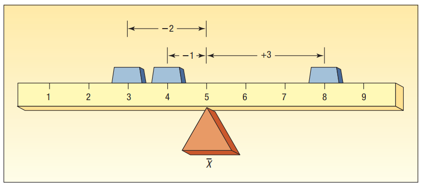{width="400"}
:::

::: {.column width="50%" style="font-size: 0.92em;"}
### Por ejemplo

-   En una muestra, la media de 5 números *aproximadamente* similares: 4, 3, 5, 4 y 6 es $\bar{x}=4.4$.
    -   Esto sería como una regla `r fontawesome::fa("ruler-horizontal")`, "*uniforme*" en toda la superficie, por lo que el centro de gravedad está en el "*centro*".
-   La media de 5 números con uno sumamente distinto (valor extremo): 2, 3, 5, 4 y 25 es $\bar{x}=8.8$.
    -   Esto sería como un martillo `r fontawesome::fa("hammer")`, cargado en un extremo.
    -   También puede darse el caso de que haya valores extremos en ambas direcciones, comportándose como una mancuerna `r fontawesome::fa("dumbbell")`.
        -   Por ejemplo: 2, 9, 12, 8, 11, 35 tiene como media $\bar{x}=12.83$
:::
:::::

## 1. Media o promedio - Fórmulas {.bloques}

::::: columns
::: {.column width="50%"}
### Poblacional

$$
\mu=\frac{\sum_{i=1}^N x_i}{N}
$$

-   Siendo $\mu$ el promedio, $x_i$ los valores individuales y $N$ la cantidad de datos en la población.

-   En este sentido $\mu$ es un parámetro y $\bar{x}$ es un estimador.
:::

::: {.column width="50%"}
### Muestral

-   Note el cambio en la notación (los símbolos). La notación es muy importante para esta área de conocimiento.

$$
\bar{x}=\frac{\sum_{i=1}^n x_i}{n}
$$

-   Siendo $\bar{x}$ el promedio, $x_i$ los valores individuales y $n$ la cantidad de datos en la muestra.
:::
:::::

## Media geométrica y armónica {.bloques}

::::: columns
::: {.column width="50%"}
### 1.2 Geométrica (G)

-   Es un tipo de media que se calcula como la raíz n-esima del producto de un conjunto de números estrictamente positivos
-   Se suele usar para calcular medias sobre porcentajes. Es menos sensible a datos extremos.

$$\bar{x}_G=(x_1 \cdot x_2 \cdots x_n)^\frac{1}{n}$$
:::

::: {.column width="50%"}
### 1.3 Armónica (H)

-   Es un tipo de media que es igual al número de elementos de un grupo de cifras entre la suma de los inversos de cada una de esas cifras.
-   Se suele usar con velocidades, tiempos, entre otros. También es menos sensible a datos extremos y solo funciona en números positivos.

$$
\bar{x}_H=\frac{n}{\frac{1}{x_1} + \frac{1}{x_2} + \cdots +\frac{1}{x_n}}
$$
:::
:::::

## 1.4 Media ponderada {.bloques}

::::: columns
::: column
-   Constituye un caso especial de la media, se presenta cuando hay varias observaciones con el mismo valor.
-   Suponga que en Hangar se venden 3 tipos de café: pequeño, mediano y grande. En un momento particular se venden 3 pequeños, 2 medianos y 3 grandes. ¿Cuál es el promedio de las ventas?
    -   Note que es igual a como se calcula el promedio ponderado de matrícula
:::

::: column
### Muestral

-   $$\bar{x}=\frac{\sum_{i=1}^n w_i\cdot x_i}{\sum_{i=1}^n w_i}$$

### Poblacional

-   $$\bar{x}=\frac{\sum_{i=1}^N w_i\cdot x_i}{\sum_{i=1}^N w_i}$$
:::
:::::

## Media ponderada - Ejemplo {.bloques}

:::: columns
::: {.column width="100%"}
-   Resolviendo las ecuaciones:

```{r}

cafe <- data.frame(Presentación = c("Pequeño", "Mediano", "Grande"), 
                   Ventas = c(3, 2, 3),
                   Precio = c(500, 700, 900)) %>% 
  dplyr::mutate(`Promedio de ventas` = Ventas*Precio) %>% 
  janitor::adorn_totals()

cafe %>% 
  knitr::kable(format = "html") %>%
  kableExtra::kable_styling()

```

-   Se obtiene un promedio ponderado de $\bar{x}_w=\frac{5600}{8}=700$ colones.
:::
::::

## 1.5 Media recortada {.bloques}

-   Como se ha enfatizado, la [media es bastante sensible]{.hi} a un solo valor extremo.
-   La media recortada se calcula “quitando” cierto porcentaje de los valores mayores y menores del conjunto de datos.
    -   Se eliminan $k$ valores de ambos extremos, no solo de uno.
    -   $\bar{x}_{\text{rec}} = \frac{1}{n - 2k} \sum_{i = k+1}^{n-k} x_{(i)}$
-   Por ejemplo, una media recortada al 10 % se calcula eliminando tanto el 10 % de los valores menores como el 10 % de los valores mayores. Y se calcula el promedio de los valores “sobrevivientes”.
    -   Si se tienen 7 datos y se elige un recorte de 10 %, $k=7\cdot 0.1=0.7=0$ la media recortada sería igual a la media, pues no se eliminarían datos, si se elige 20 %, $k=7\cdot 0.2=1.4=1$ se eliminaría 1 dato en cada extremo (el menor y el mayor).

## 2. Mediana {.bloques style="font-size: 1.2em;"}

-   Sirve también como medida para expresar el centro de una distribución. [No se ve afectada significativamente por valores extremos]{.hi}.
-   Cuando el conjunto de datos contiene uno o dos valores muy grandes o muy pequeños la media [NO RESULTA REPRESENTATIVA]{.hi}.
    -   Es en estos casos en los que la [mediana]{.hi} es usada para describir el centro de los datos.

## Ejemplo {.bloques}

::::: columns
::: {.column .img-fit width="60%"}

:::

::: {.column width="40%"}
¿Alguna vez se preguntó por el salario en su carrera?

La gran mayoría de estudios responden al salario promedio. Inclusive, muchos de ustedes durante las ferias vocacionales realizan esta pregunta.

[¿Eso está bien?]{.hi} La respuesta es ¡no! los salarios casi siempre tienen valores extremos.
:::
:::::

## El problema del promedio vs la mediana {.bloques}

::::: columns
::: {.column width="60%" style="font-size: 1.1em;"}
-   Por esto es importante, en algunos conjuntos de datos, estimar la mediana en lugar de la media.
    -   OJO: esto no es una "receta", cada contexto se analiza en consecuencia.
-   Entonces, [¿El salario promedio es adecuado?]{.hi}
:::

::: {.column .img-fit width="40%"}

:::
:::::

## 2. Mediana - Fórmulas {.bloques}

::::: columns
::: {.column width="50%"}
### Poblacional

Es literalmente el valor medio de un conjunto de [datos ordenados]{.hi} de menor a mayor.

$$
\widetilde{X} = \begin{cases} x_{\frac{N+1}{2}} & \text{si N es impar} \\ \frac{1}{2} \cdot (x_{\frac{N}{2}}+x_{\frac{N}{2}+1}) & \text{si N es par} \end{cases}
$$

-   Siendo $\tilde{x}$ la mediana.

-   En este sentido $\widetilde{X}$ es un parámetro y $\tilde{x}$ es un estimador.
:::

::: {.column width="50%"}
### Muestral

$$
\tilde{x} = \begin{cases} x_{\frac{n+1}{2}} & \text{si n es impar} \\ \frac{1}{2} \cdot (x_{\frac{n}{2}}+x_{\frac{n}{2}+1}) & \text{si n es par} \end{cases}
$$
:::
:::::

## Ejemplo {.bloques}

::::: columns
::: {.column width="65%"}
Por ejemplo, en estos valores ordenados:

```{r}

valores <- data.frame(valores = c(29, 31, 35, 39, 39, 40, 43, 44, 44, 52),
                      Posición = 1:10)

valores %>% 
  t() %>% 
  knitr::kable(format = "html") %>%
  kableExtra::kable_styling()

```

La mediana es:

$$\tilde{x}=\frac{1}{2} \cdot (x_{\frac{10}{2}}+x_{\frac{10}{2}+1}) \\ \tilde{x} =\frac{1}{2}\cdot (39 + 40) \\ \tilde{x} =39.5$$
:::

::: {.column .img-fit width="35%"}

:::
:::::

## 3. Moda {.bloques}

-   Es el valor del conjunto de datos que aparece con mayor frecuencia. Al igual que con la mediana y a diferencia de la media, los valores extremos no afectan a la moda.

-   La moda [solo se usa con propósitos descriptivos]{.hi} (es decir, no para hacer inferencias), ya que varía más entre muestras que la media o la mediana.

-   En simple, es el valor que más repite en una distribución de datos. Como tal no tiene fórmula, pues se trata de un simple conteo.
  * > Es posible que haya conjuntos de datos sin moda o con varias modas.

## 4. Cuantiles {.bloques}

-   Dividen el conjunto de datos en partes iguales. El procedimiento manual siempre inicia con ordenar los datos de menor a mayor (*en este sentido se sigue la misma lógica de cálculo que en la mediana, pues esta es un caso de los cuantiles*). Y tomar decisiones si la cantidad de datos es par o impar.
    -   **Percentil** (P): divide a los datos en 100 partes iguales
    -   **Quintil**: divide a los datos en 5 partes iguales
    -   **Cuartil** (Q): divide a los datos en 4 partes iguales
    -   **Mediana**: divide a los datos en 2 partes iguales El $P_50$ es igual al $Q_2$ que es igual a la mediana ($\tilde{x}$).

## ¿Cómo se interpretan? {.bloques}

::::: columns
::: {.column width="60%" style="font-size: 1.2em;"}
-   Por ejemplo, para el siguiente conjunto de datos el $Q_1$ es 35
    -   29, 31, 35, 39, 40, 43, 44, 44, 52
        -   En Excel usamos `QUARTILE.INC` en lugar de `QUARTILE.EXC`, si se usa `QUARTILE.EXC` el resultado sería 33 y no 35. La función `QUARTILE.EXC` excluye valores extremos del conjunto de datos.
-   [Interpretación]{.hi}:
    -   El 25 % de los datos se encuentran por debajo de 35.
-   Calcule e interprete otros cuantiles.
:::

::: {.column width="40%"}
### Algunas equivalencias

-   $P_{25}=Q_1$
-   $P_{50}=Q_2=\tilde{x}$
-   $P_{75}=Q_3$
-   $P_{20}=Quintil_1$
-   $P_{40}=Quintil_2$
-   $P_{60}=Quintil_3$
-   $P_{80}=Quintil_4$
:::
:::::

## Medidas de dispersión o variabilidad {.bloques style="font-size: 1.1em;"}

-   La variabilidad de una muestra desempeña un papel importante en el análisis de datos. La [variabilidad de procesos y productos es un hecho real en los sistemas científicos y de ingeniería]{.hi}: el control o la reducción de la variabilidad de un proceso a menudo es una fuente de mayores dificultades.

-   Las medidas de tendencia central o posición [siempre]{.hi} deben acompañarse de medidas de [variabilidad]{.hi}.

## Rangos {.bloques}

::::: columns
::: {.column width="50%"}
### 1. Rango

-   Son las medidas de variabilidad más simples.

-   El defecto o desventaja de los rangos es que depende únicamente de dos valores, y por ende es [sensible]{.hi} a si estos son extremos en comparación al resto del conjunto de datos.

-   Se refiere a la diferencia entre el valor máximo y el mínimo.

$$
R=Máx-Min
$$
:::

::: {.column width="50%"}
### 2. Rango Intercuartil (RIC o *IQR*)

-   Esta reduce el riesgo de la anterior, pues es una medida de dispersión del 50 % central de los datos.

$$
IQR = Q_3-Q_1 \\ IQR = P_{75}-P_{25}
$$
:::
:::::

## 3. Varianza y desviación estándar {.bloques}

-   Es una medida que indica la [desviación]{.hi} que tienen los datos alrededor de la **media** (mucha atención a la fórmula).
    -   Una varianza (desviación) "alta" indica que los datos se encuentran muy dispersos, por el contrario una baja indicaría que los datos se encuentran poco dispersos alrededor de la media.
-   Lo correcto es siempre analizar las medidas de posición, acompañadas de medidas de variabilidad.
    -   ¿Por qué? Discuta con la persona docente y otras personas estudiantes.
-   Se suele usar la desviación estándar en lugar de la varianza, porque la segunda tiene una interpretación "más complicada".

## 3. Varianza y desviación estándar {.bloques}

::::: columns
::: {.column width="50%"}
### Poblacional

-   Varianza

$$
\sigma^2=\frac{\sum_{i=1}^{N}(x_i-\mu)^2}{N}
$$

-   Desviación estándar

$$
\sigma=\sqrt{\frac{\sum_{i=1}^{N}(x_i-\mu)^2}{N}}
$$
:::

::: {.column width="50%"}

### Muestral

-   Varianza

$$
s^2=\frac{\sum_{i=1}^{N}(x_i-\bar{x})^2}{n-1}
$$

-   Desviación estándar

$$
s=\sqrt{\frac{\sum_{i=1}^{N}(x_i-\bar{x})^2}{n-1}}
$$
:::
:::::

## ¿Por qué n-1? {.bloques}

-   Se llama la corrección de Bessel

-   Justificación por intuición:

    -   Básicamente 𝑛−1 provee una estimación insesgada del estimador de la varianza poblacional. El $n-1$ implica que un grado de libertad se pierde (en realidad se usa) para estimar la media muestral $\bar{x}$.

-   Los grados de libertad (tema que se detalla en otras sesiones) son las piezas de información que se utilizan para calcular un estimador, en este caso 1 grado de libertad se usó para calcular la media ($\bar{x}$), por lo que solo quedarían $n-1$ para la varianza.

-   La justificación por demostración está disponible en este [sitio web](https://stevenggoni.github.io/interactivos/demostracion_n-1.html){target="_blank"} como material **complementario** y **opcional**.

## 4. Coeficiente de variación (CV) {.bloques}

::::: columns
::: {.column width="50%"}
-   Es una medida de dispersión relativa de un determinado conjunto de datos.
    -   ¿Relativo a quién? A la [media]{.hi}.
    -   Observemos la fórmula.
:::

::: {.column width="50%"}
### Poblacional

$$
CV = \frac{\sigma}{\mu}
$$

### Muestral

$$
\widehat{CV} = \frac{s}{\bar{x}}
$$
:::
:::::

## 4. Coeficiente de variación (CV) {.bloques}

-   ¿Cuándo deberíamos usar el CV y no la desviación estándar o la varianza?
-   Note de la fórmula que el CV es [adimensional]{.hi}, eso nos permite comparar la variabilidad de variables con [diferentes unidades]{.hi}.
-   Su interpretación se puede expresar como porcentaje.
-   Por ejemplo:
    -   ¿Qué es más variable, el peso o la edad de una persona?
-   No se recomienda usarlo cuando la media está cercana a cero. 

## Resumen {.bloques}

-   En términos generales [es siempre conveniente presentar las medidas de posición acompañadas de medidas de dispersión]{.hi}.
-   Pues complementan la información dada por las medidas de tendencia central (posición). \* Hace posible la comparación entre diferentes grupos.
    -   Sirven como control para evitar conclusiones erróneas en la comparación de datos.
-   ¿Cuál medida de dispersión es la más adecuada para las respectivas medidas de posición?
-   Para la [media]{.hi} se suele usar la [desviación estándar]{.hi}, mientras que para la [mediana]{.hi} se sugiere usar alguna de las medidas de rango, preferiblemente el [IQR]{.hi}.

## Medidas de forma {.bloques style="font-size: 1.2em;"}

-   Describen la forma de una distribución de datos. Permiten identificar si una distribución es simétrica o asimétrica, o qué tan agrupados están los datos.

-   Son, probablemente, las medidas que típicamente se interpretan mal.

## 1. Asimetría {.bloques}

::::: columns
::: {.column width="50%"}
-   Mide el grado de deformación horizontal en un conjunto de datos.

-   Hay muchos coeficientes de asimetría, todos se interpretan igual, pero se calculan de formas diversas.

-   Para efectos de este curso vamos a usar el coeficiente de asimetría que se encuentra disponible en Excel.
:::

::: {.column width="50%"}
-   $Sk= \frac{n}{(n-1)(n-2)}\left[\sum_{i=1}^{n}\left(\frac{x_i-\bar{x}}{s}\right)^3\right]$
    -   $Sk<0$: asimetría negativa
    -   $Sk=0$: distribución simétrica
    -   $Sk>0$: asimetría positiva

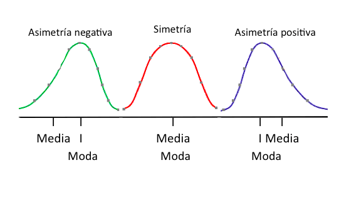{width="350"}
:::
:::::

## 1. Asimetría {.bloques}

-   Si la distribución de los datos es simétrica, la media, la mediana y la moda son coincidentes (iguales o muy similares).

-   Esta medida es importante ya que dos conjuntos de datos pueden tener la misma media y desviación estándar pero un diferente grado de asimetría.

-   Es común que en libros de texto en **español** y otras personas docentes utilicen el término [sesgo]{.hi} como sinónimo de asimetría. De la clase anterior, sabemos que esto no es así.

    -   **Sesgo**: Cuando el método de recopilación de datos hace que los datos de la muestra reflejen incorrectamente la población.

## 1. Asimetría {.bloques}

:::::: columns
::: {.column width="40%"}
-   Una distribución puede ser asimétrica y no presentar ningún tipo de sesgo. O viceversa.
-   Los términos [NO SON intercambiables]{.hi}. Use la terminología correcta.

### ¿De dónde proviene esto?

-   Básicamente, de un “error de traducción”. Para sesgo el término en inglés es bias, mientras que para asimetría es skewness.
:::

::: {.column .img-fit width="30%"}
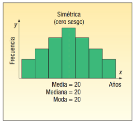
:::

::: {.column .img-fit width="30%"}
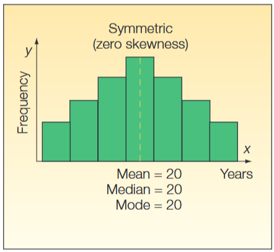
:::
::::::

## 2. Curtosis {.bloques}

-   Se define técnicamente como el cuarto momento estandarizado esperado de una variable aleatoria

-   Mide la concentración relativa de los valores en el centro de la distribución al compararlos con las colas y se basa en las diferencias respecto a la media elevadas a la cuarta potencia.

-   La interpretación de la curtosis es en términos de la extremidad de las colas; es decir, mide la propensión de una distribución a producir valores atípicos (*outliers*), y no la "puntiagudez" (*peakedness*) o forma del pico central.

-   A veces se confunde con cuán escarpada, achatada, etc, se encuentra una distribución de datos.

## 2. Curtosis {.bloques}

::::: columns
::: {.column width="60%"}
-   Usamos la misma fórmula que MS Excel:

    -   Esta fórmula mide el [exceso de curtosis]{.underline}, es decir, que tan distinta es de una distribución normal (tema que se aborda más adelante en el curso).

-   $ku=\left[ \left(\frac{n(n+1)}{(n-1)(n-2)(n-3)}\sum_{i=1}^{n} \left(\frac{x_i-\bar{x}}{s}\right)^4 \right) \right] - \frac{3(n-1)}{(n-2)(n-3)}$

    -   $ku<0$ platicúrtica:
        -   Donde la curtosis es menor que la de la distribución normal
    -   $ku=0$ mesocúrtica:
        -   Donde la curtosis es igual a la de la distribución normal
    -   $ku>0$ leptocúrtica:
        -   Donde la curtosis es mayor que la de la distribución normal
:::

::: {.column .img-fit width="30%"}

:::
:::::

## Presentación y visualización de datos {.bloques}

-   Recordemos que entre las funciones de la estadística descriptiva se encuentra el resumir datos.
-   El objetivo fundamental de agrupar los datos es que el análisis de los mismos pueda ser más sencillo, de manera que se pueda hacer una primera aproximación a los resultados de forma rápida.
-   La agrupación sirve para poder elaborar, a partir de la información recopilada, herramientas visuales como un histograma, un gráfico de barras o un gráfico circular.

## Presentación y visualización de datos {.bloques}

::::: columns
::: {.column width="50%"}
### Datos agrupados

-   Son aquellos que luego de ser recopilados se dividen y agrupan por categorías o intervalos.
-   ¿Cómo se agrupan los datos? Para una sola variable se pueden usar tablas de frecuencia.
:::

::: {.column width="50%" style="font-size: 0.83em;"}
### Tablas de frecuencia

No existe una “regla” establecida para construir tablas de frecuencia. Pero debe asegurarse que los intervalos establecidos cubran todo el conjunto de datos.

1.  Determinar la cantidad de datos ($n$)
2.  Escoger la regla de agrupación
3.  Obtener la medida de variabilidad asociada a la regla de agrupación ($R$, $IQR$, $s$)
4.  Definir la cantidad de clases empleando la regla de agrupación.
:::
:::::

## Tablas de frecuencia {.bloques}

::::: columns
::: {.column width="50%" style="font-size: 0.83em;"}
### Reglas de agrupación

-   Sturges ($n<200$)

$$
k=1+log_2(n)
$$

-   Scott ($n>200$)

$$
A_S=h=\frac{7\cdot s}{2\cdot \sqrt[3]{n}
}
$$

-   Freedman-Diaconis

$$
A_{FD}=h=\frac{2\cdot IQR}{\sqrt[3]{n}}
$$
:::

::: {.column width="50%"}
Si se definió $k$, calcule $h$, por el contrario, si definió $h$, calcule $k$.

$$
k= \frac{Rango}{h} \\k=\frac{max-min}{h}
$$
:::
:::::

## Convencionalismo de redondeo para $k$ {.bloques}

-   $k$ es la cantidad de clases y como tal es siempre un número entero positivo.
-   Si el entero del resultado previo al redondeo es "*par*" se redondea a la alta y si el entero es "*impar*" se redondea a la baja, resultando siempre un número impar de clases.
    -   6.26 redondea a 7.0
    -   7.02 redondea a 7.0
-   Las comillas en “regla” son importantes, pues esta no es inamovible. Es un convencionalismo.

## Ejemplo {.bloques}

::::: columns
::: {.column width="50%"}
Tomemos el siguiente conjunto de datos, que por conveniencia ya viene ordenado.

Usemos la regla de Sturges y calculemos $k$

$$
k=1+log_2(12)=4.58=5
$$ Entonces:

$$
h=\frac{77.2-73.8}{5}=0.68
$$
:::

::: {.column width="50%" style="font-size: 0.8em;"}
```{r}

histograma <- data.frame(Datos = c(73.8, 74.2, 75.1, 75.3, 75.5, 
                                   75.7, 76.5, 76.9, 77.1, 77.2, 77.2, 77.2))

histograma %>% 
  knitr::kable(format = "html") %>%
  kableExtra::kable_styling()

```
:::
:::::

## ¿Cómo se construye una tabla de frecuencias? {.bloques}

:::: columns
::: {.column width="100%"}
| Clases | LI | LS | $f_a$ | $f_r$ | $F_a$ | $F_r$ |
|-----------|-----------|-----------|-----------|-----------|-----------|-----------|
| 1 | $[Min$ | $LI_1 + h[$ | Conteo | $\frac{f_{a1}}{n}$ | $f_{a1}$ | $\frac{F_{a1}}{n}$ |
| 2 | $[LS_1$ | $LI_2 + h[$ | … | $\frac{f_{a2}}{n}$ | $f_{a1}+f_{a2}$ | … |
| 3 | $[LS_2$ | $LI_3 + h[$ | … | … | … | … |
| 4 | \[…\] | …\[ | … | … | … | … |
| 5 | \[…\] | $Max]$ | … | … | $f_{a1}+f_{a2}+…+f_{a5}=n$ | $\frac{F_{a5}}{n}=1$ |
:::
::::

## Ejemplo {.bloques}

:::: columns
::: {.column width="100%"}
```{r}

histograma %>%
  dplyr::mutate(Clase = cut(Datos, 
                            breaks = seq(min(Datos), max(Datos) + 1e-8, by=0.68), 
                            include.lowest = TRUE)) %>%
  dplyr::count(Clase) %>%
  dplyr::mutate(fr = n / sum(n),
                Fa = cumsum(n),
                Fr = cumsum(fr)) %>% 
  dplyr::mutate(across(3:5, ~round(.x, 3))) %>% 
  knitr::kable(format = "html") %>%
  kableExtra::kable_styling()
  

```
:::
::::

## Histogramas {.bloques}

::::: columns
::: {.column width="70%"}
Los histogramas ayudan a dar una estimación de [dónde se concentran los valores, cuáles son los extremos y si hay vacíos o valores inusuales]{.hi}.

También son útiles para dar una visión aproximada de la distribución de probabilidad.

Cada barra en un histograma representa la frecuencia tabulada en cada intervalo/bin. El área total del histograma es igual al número de datos, cuando se grafica en frecuencia absoluta.
:::

::: {.column .img-fit width="30%"}
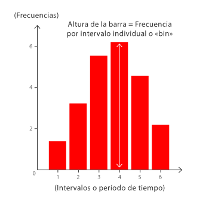
:::
:::::

## Ejemplo - Histograma {.bloques}

:::: columns
::: {.column width="50%"}
```{r}

gh <- histograma %>% 
  ggplot(aes(Datos)) +
  geom_histogram(bins = 5, color = "#C18A00", fill = "#263247") +
  labs(x = "Intervalos",
       y = "Frecuencia") +
  theme_bw()

plotly::ggplotly(gh, height = 600, width = 850) %>% 
  plotly::layout(paper_bgcolor = "#F1F5F5",
                 plot_bgcolor  = "#F1F5F5",
                 font = list(size = 25),
                 xaxis = list(
                   title = list(font = list(size = 25)),
                   tickfont = list(size = 20)),
                 yaxis = list(title = list(font = list(size = 25)),
                              tickfont = list(size = 20)),
                 legend = list(title = list(font = list(size = 25)),
                               font = list(size = 20),
                               bgcolor = "#F1F5F5"))

```
:::

::: {.column width="50%"}

-   Un histograma es una forma de representación visual donde con una sola mirada la persona analista puede darse una idea de:
    -   La ubicación de la media, mediana y moda
    -   La curtosis y asimetría
    -   La variabilidad de los datos

:::

::::

## Gráfico de cajas y bigotes {.bloques}

-   También conocido como boxplot.
-   Es una manera conveniente de mostrar visualmente grupos de datos numéricos a través de sus cuartiles.
-   Normalmente utilizado en estadísticas descriptivas, los gráficos de cajas y bigotes son una excelente forma de examinar rápidamente uno o más conjuntos de datos gráficamente.
-   En ocasiones al boxplot se le agrega un punto (u otro símbolo) representando la media o promedio.

## Valores atípicos {.bloques}

:::: columns
::: {.column width="100%"}
-   Son valores dentro del conjunto de datos que difieren de forma “considerable” de los otros valores.
-   [Importante]{.hi}: los datos atípicos se estudian, pero NO se eliminan sin justificación válida.
-   Los gráficos de cajas y bigotes son una herramienta visual para la detección de datos “atípicos”.

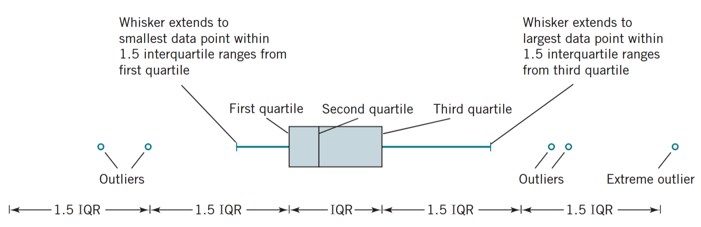{fig-align="center" width="800"}
:::
::::

## Gráficos de cajas y bigotes {.bloques}

::::: columns
::: {.column .img-fit width="30%"}
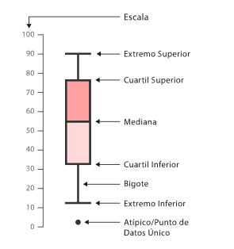
:::

::: {.column width="70%"}
-   Extremo superior
    -   Es el valor extremo superior más pequeño que se encuentre dentro de:
        -   $LS=Q_3+1.5\cdot IQR$
-   Extremo inferior
    -   Es el valor extremo inferior más pequeño que se encuentre dentro de:
        -   $LI=Q_1-1.5\cdot IQR$
-   Cualquier valor fuera de LI y LS es considerado “atípico” y debe estudiarse
:::
:::::

## Ejemplo - Box plot {.bloques}

::::: columns
::: {.column width="50%"}
```{r}

plotly::plot_ly(data = histograma,
                y = ~Datos,
                type = "box",
                boxpoints = "outliers",  # muestra outliers
                marker = list(color = "#C18A00"),
                line = list(color = "#C18A00"),
                fillcolor = "#263247",
                height = 600,
                width  = 850) %>%
  plotly::layout(paper_bgcolor = "#F1F5F5",
                 plot_bgcolor  = "#F1F5F5",
                 font = list(size = 25),
                 yaxis = list(
                   title = "Valores",
                   tickfont = list(size = 20)),
                 xaxis = list(showticklabels = FALSE))

```
:::

::: {.column width="50%"}
### Importante

-   Las comillas en “atípico” son importantes, pues no implica que el dato no pertenezca al conjunto de datos.
-   El dato obtenido puede ser completamente natural, pero debe estudiarse de forma individual al diferir sustancialmente de sus pares.
-   De nuevo, un dato atípico [no debe eliminarse ni tratarse sin una justificación de peso]{.hi}.
:::
:::::

# Medidas para dos variables cuantitativas y cualitativas {.bloques}

## Una variable cuantitativa y otra cuantitativa {.bloques}

-   Suponga que usted como analista desea estudiar el rendimiento (%) de algunas máquinas CNC.

-   Tiene dos variables

    -   Rendimiento: Cuantitativa
    -   Máquinas: Cualitativa

-   Usted puede hacer grupos y analizar el promedio del rendimiento por máquina. De igual manera puede usar otros estadísticos.

-   También puede realizar los gráficos estudiados pero por categorías.

## Dos variables cuantitativas {.bloques}

-   Por ejemplo, usted desea estudiar el efecto que tienen los años de experiencia sobre el salario percibido por las personas.
-   Tiene dos variables cuantitativas:
    -   Años de experiencia
    -   Salario percibido
-   Todas las técnicas estadísticas estudiadas hasta ahora pueden usarse. Incluyendo visualizaciones.

## Dos variables cuantitativas {.bloques}

-   Se introduce una nueva forma de visualización, donde usted puede visualizar y correspondientemente estudiar la relación que existe entre dos variables.

-   Este gráfico posiblemente ya lo conoce de cursos de ciencias básicas como química y física, donde se muestra en un eje ($x$) una variable y en el otro ($y$), de tal modo que se puede apreciar como se relacionan entre sí.

## Dos variables cuantitativas {.bloques}

::::: columns
::: {.column .img-fit width="50%"}
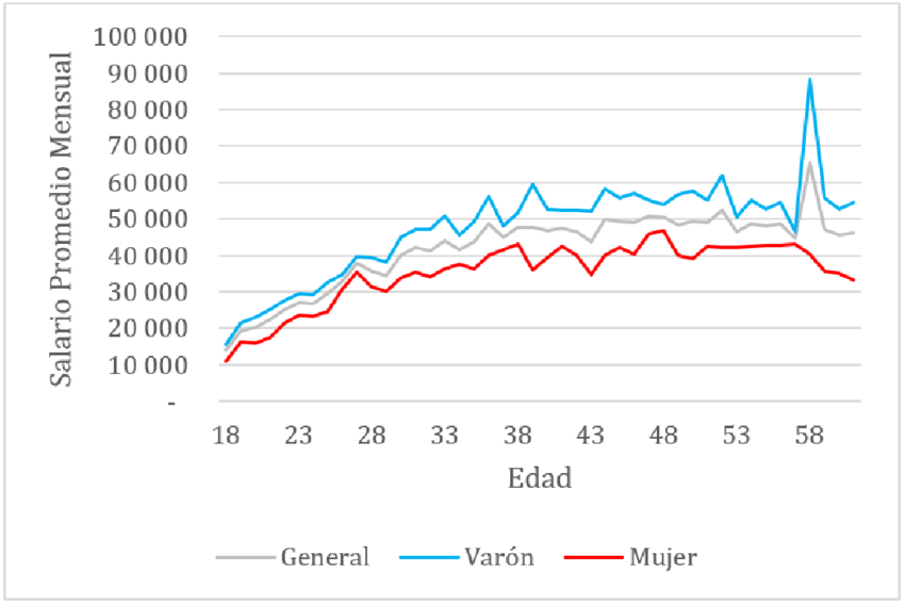
:::

::: {.column width="50%"}
En el gráfico de la izquierda puede encontrar la relación que existe entre el salario promedio mensual y la edad de las personas, clasificadas por género y en general.
:::
:::::

## Comunicación tendenciosa o errónea {.bloques}

-   Parte del comportamiento ético necesario en el quehacer estadístico es comunicar los resultados de forma debida

##  {.limpio}

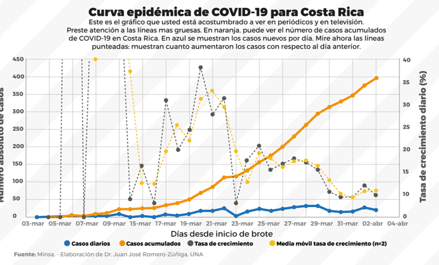{fig-align="center" width="100%"}

##  {.limpio}

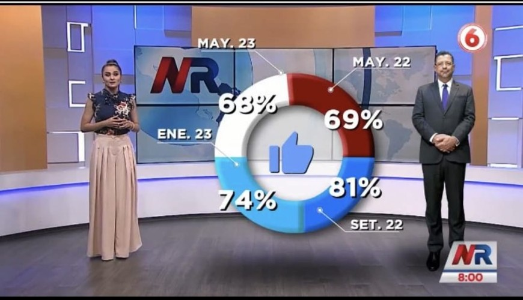{fig-align="center" width="100%"}

##  {.limpio}

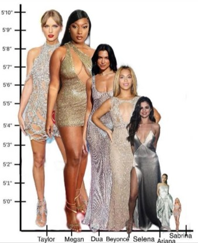{fig-align="center" width="100%"}

##  {.limpio}

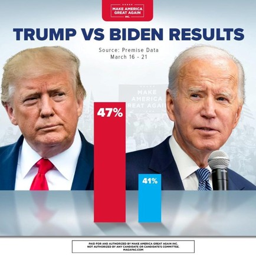{fig-align="center" width="100%"}

## ¿Cómo escoger el gráfico adecuado? {.bloques}

* Para escoger el gráfico adecuado puede apoyarse en este [enlace](https://www.data-to-viz.com/#explore){target="_blank"}.
* ¿Qué hacer y no hacer a la hora de confeccionar un gráfico? Siga este [enlace](https://www.data-to-viz.com/caveats.html){target="_blank"}.
* ¿Quiere más ideas para seleccionar un gráfico? Use este [enlace](https://datavizcatalogue.com/ES/){target="_blank"}.


## Bibliografía {.bloques}

:::: columns
::: {.column width="100%" style="font-size: 0.8em;"}

-   Walpole, R.; Myers, R.; Myers, S. y Ye, K. Probabilidad y estadística para ingeniería y ciencias (9na Edición).
    -   Capítulo 1
-   Lind, D.; Marchal, W. y Watchen, S. Estadística aplicada a los Negocios y la Economía (15va Edición).
    -   Capítulo 2, 3 y 4
-   Devore, J. Probabilidad y Estadística para Ingeniería y Ciencias (7ma Edición).
    -   Capítulo 2
-   Levine, D.; Krehbiel, T.; Berenson, M. Estadística para administración (4ta Edición).
    -   Capítulo 2 y 3
-   Lock, R.; Lock, P.; Morgan, K.; Lock, E. & Lock, D. Statistics: Unlocking the Power of Data (3rd Edition)
    -   Capítulo 2
-   Westfall P. H. (2014). Kurtosis as Peakedness, 1905 - 2014. R.I.P. The American statistician, 68(3), 191–195. <https://doi.org/10.1080/00031305.2014.917055>

:::
::::

## Descripción de datos <br> II-1120 Estadística para Ingeniería Industrial I {.center}

### Gracias por su atención <br> Steven García Goñi<br>[steven.garciagoni\@ucr.ac.cr](mailto:steven.garciagoni@ucr.ac.cr) {.subtitle}

### Dudas o correcciones requeridas pueden solicitarse al correo