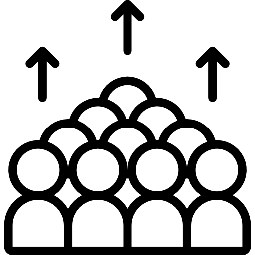
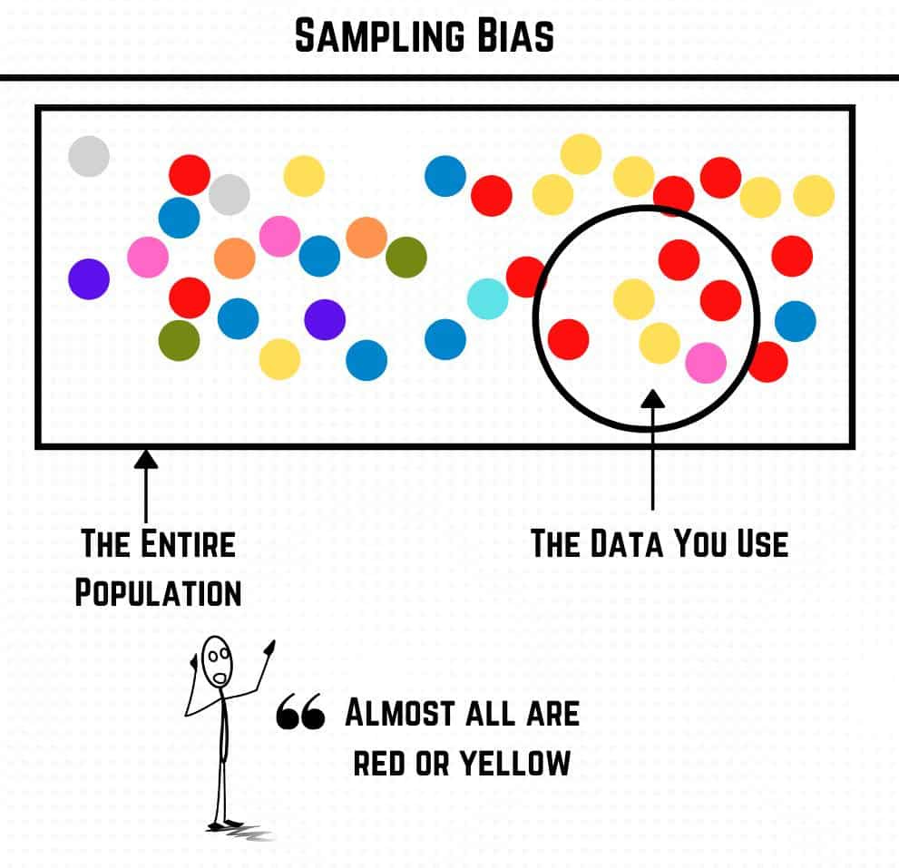
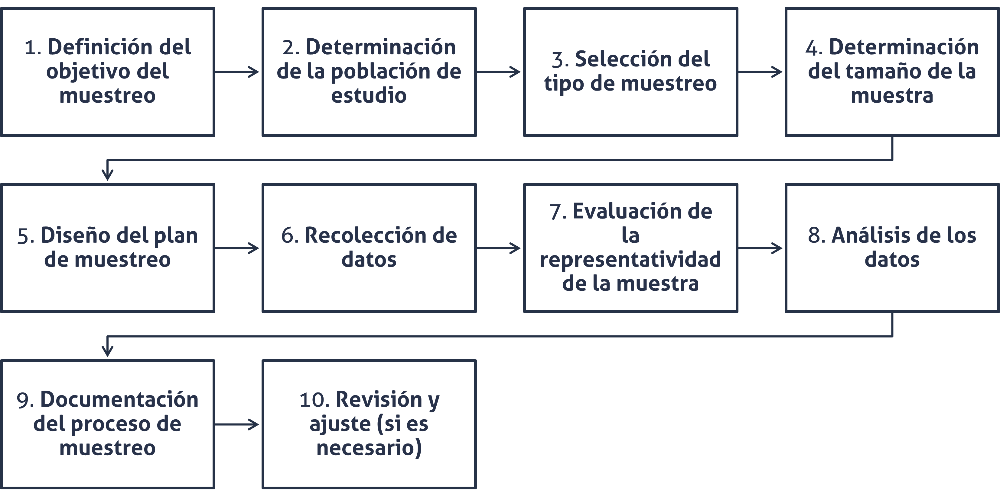
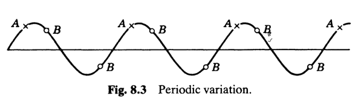

## Agenda {.bloques}

-   Preguntas generadoras
-   Repaso
-   Fundamentos de muestreo
-   Etapas de un muestreo
-   Muestreo probabilístico
-   Muestreo no probabilístico

## Preguntas generadoras {.bloques}

-   ¿Por qué es necesario muestrear?
-   ¿Qué es el sesgo estadístico y cómo evitarlo?
-   ¿Cuáles métodos de selección de muestra existen y cuándo se usan?
-   ¿Qué es el error de muestreo y qué consecuencias prácticas tiene?
-   ¿Qué diferencia hay entre un buen diseño muestral y una muestra grande?
    -   ¿Más grande es igual a mejor?

## ¿De dónde obtengo datos? {.bloques}

-   Recuerde que:
    -   Los datos pueden provenir de fuentes secundarias:
        -   Cuando son proporcionados por un externo, por ejemplo el INEC.
    -   Los datos pueden provenir de fuentes primarias:
        -   Cuando usted debe recoger los datos (observación, experimento, encuesta o una combinación de estas).
-   La premisa de esta sesión es:
    -   [¿Cuántos datos necesito?]{.hi} y [¿Cómo debo recogerlos?]{.hi}
- >Lo relacionado con el tamaño de muestra se aborda con detalle en cursos posteriores. 

# Fundamentos de muestreo {.bloques}

## Contexto {.bloques}

:::: columns
::: {.column width="100%" style="text-align: center; font-size: 1.4em;"}
Estas lecciones tienen como propósito desarrollar métodos de muestreo que proporcionen con [el menor costo posible, estimaciones con la suficiente exactitud]{.hi} para los propósitos que se diseñen.

{fig-align="center" width="261"}
:::
::::

## Muestreo {.bloques}

::::: columns
::: {.column width="65%"}
-   El procedimiento mediante el cual obtenemos una o más muestras recibe el nombre de muestreo.

-   Para *Montgomery*, es:

    > [El objetivo de la inferencia estadística es extraer conclusiones o tomar decisiones acerca de una población con base en una muestra seleccionada de dicha población]{.hi}.

-   Existen, al menos, dos tipos de muestreo:

    -   Probabilístico
    -   No probabilístico
:::

::: {.column .img-fit width="35%"}

:::
:::::

## Importante {.bloques}

::::: columns
::: {.column width="55%"}
-   La validez de las conclusiones que se extraen o de las decisiones que se toman dependen de la forma en la que se [recolectan]{.hi} y [analizan]{.hi} los datos.

-   La estadística es una **herramienta poderosa**, pero su verdadero valor se obtiene cuando se aplica de **manera adecuada y se interpreta dentro de un** [contexto específico]{.hi}.

-   El nivel de medición y el tipo de variable rigen los cálculos que se llevan a cabo con el fin de resumir y presentar los datos. Es decir, que [no todos los tipos de datos se analizan igual]{.hi}.
:::

::: {.column .img-fit width="45%"}
{fig-align="center" width="500"}
:::
:::::

## Ventajas del muestreo frente al censo {.bloques}

::::: columns
::: {.column width="50%"}
-   **Costo reducido**
    -   En poblaciones muy grandes se pueden obtener resultados lo suficientemente exactos cuando se analizan muestras que representan solo una pequeña fracción de la población.
-   **Mayor rapidez**
    -   Los datos pueden ser recolectados y resumidos más rápidamente con una muestra que con una enumeración completa (la población). Lo cual es vital cuando se necesita la información con urgencia.
:::

::: {.column width="50%"}
-   **Más posibilidades**
    -   En casos donde el censo es impracticable habría dos alternativas: muestreo o no tomar los datos. Es por eso que el muestreo da más posibilidades para la obtención de información.
-   **Mayor exactitud**
    -   Suena contraintuitivo, pero debido a que el volumen de trabajo es reducido, se puede emplear personal más capacitado y someterlo a más entrenamiento, así como mejores instrumentos o más costosos, lo que puede producir resultados más exactos que en el censo.
    
:::
:::::

## ¿Cuándo muestrear? {.bloques}

:::::: columns
::: {.column width="33%"}
{width="150"}

Cuando la población sea infinita: o tan grande que el censo exceda de las posibilidades del investigador.
:::

::: {.column width="33%"}
Cuando la población sea suficientemente uniforme: para que cualquier muestra dé una buena representación de esta y carezca de sentido examinar la población completa.

{width="150"}
:::

::: {.column width="33%"}
{width="150"}

Cuando el proceso de medida o investigación de las características de cada elemento sea destructivo.
:::
::::::

## Sesgos {.bloques}

-   Cuando el método de recopilación de datos hace que los datos de la muestra reflejen incorrectamente la población. En términos simples y numéricos, es la diferencia que existe entre un estimador ($\bar{x}$) y un parámetro ($\mu$).
    -   $|\bar{x}-\mu|$
-   En este sentido, hay muchos tipos o causas de sesgos:
    -   **No respuesta**: personas que deciden no participar en un estudio, por ejemplo, la evaluación docente en la UCR.
    -   **Confusión**: cuando se cree que A causa B, existiendo una variable C confusora que causa a A y B simultáneamente. Visualmente: A ← C → B
    -   **Colisionador**: similar al de confusión. El colisionador es una variable que es causada por A y B. Visualmente: A → C ← B.

## Ejemplo de sesgo {.bloques}

::::: columns
::: {.column width="55%" style="font-size: 1em;"}
-   El sesgo del superviviente es uno muy famoso.

    -   Quizá algún día haya visto esta imagen.

-   Es una falacia lógica que consiste en centrarse en aquellos que han logrado sobrevivir a un proceso, ignorando a aquellos que no lo lograron.

-   Por ejemplo:

    -   [Todos los emprendedores exitosos abandonaron la universidad, así que dejar la carrera aumenta tus probabilidades de éxito]{.hi}
    
:::

::: {.column .img-fit width="45%"}
{target="_blank"}](img/Survivorship-bias.svg)
:::
:::::

## Sesgos {.bloques}

::::: columns
::: {.column width="30%"}

-   Este tema es una introducción al concepto, que será abordado oportunamente en el desarrollo de las lecciones.

:::

::: {.column .img-fit width="70%"}

:::

::::::

# Etapas   Para desarrollar un plan de muestreo

## Etapas {.bloques}

:::: columns
::: {.column .img-fit width="100%"}
{fig-align="center"}
:::
::::

## 1. Definición del objetivo del muestreo {.bloques}

::::: columns
::: {.column width="50%"}
-   El primer paso es definir claramente qué se desea lograr con el muestreo.
    -   Esto implica identificar el problema de investigación o la pregunta que se desea responder, las hipótesis que se probarán y el uso que se dará a los resultados obtenidos.

{width="250"}
:::

::: {.column width="50%"}
### [Consideraciones importantes]{.hi}

-   Determinar las variables clave que se estudiarán (por ejemplo, edad, ingresos, preferencias, dimensiones críticas de una pieza mecánica, peso, porcentaje de condimentación, percepción de calidad, entre otros).
-   Especificar si el objetivo es descriptivo (describir características de una población), analítico (encontrar relaciones o diferencias) o predictivo (predecir tendencias o comportamientos futuros).
:::
:::::

## 2. Determinación de la población de estudio {.bloques}

::::: columns
::: {.column width="50%"}
-   Definir claramente quiénes son los elementos que componen la población objetivo, es decir, el grupo completo de individuos o unidades que se desea estudiar.

{width="250"}
:::

::: {.column width="50%"}
### [Consideraciones importantes]{.hi}

-   Especificar criterios de inclusión y exclusión que definan claramente quién pertenece a la población de estudio.
    -   Por ejemplo, edad, ubicación geográfica, comportamiento de compra, etc.
-   Definir la "unidad de análisis," que podría ser una persona, una empresa, un producto, etc.
:::
:::::

## 3. Selección del tipo de muestreo {.bloques}

::::: columns
::: {.column width="50%"}
-   Decidir qué **método de muestreo** es el más adecuado para obtener una muestra [representativa]{.hi}.

{width="250"}
:::

::: {.column width="50%"}
### [Consideraciones importantes]{.hi}

-   Algunas técnicas de muestreo son más económicas que otras, así como algunas son más precisas.
-   Lo que se busca es un adecuado balance entre ambas.
:::
:::::

# Pausa {.bloques}

## ¿Qué es representatividad? {.bloques}

* Tomado y modificado del material de [@picanumeros](https://www.instagram.com/picanumeros/){target="_blank"}
* Es la capacidad de una muestra para reflejar fielmente las características de una población. 
  * Por lo general, muchas personas profesionales, suelen asumir esta relación: A mayor tamaño de muestra, más representatividad. Pero este concepto va mucho más allá.
  
    * "al repetir el proceso de muestreo, las muestras tenderían a tener características similares a las de la población, y en consecuencias se podría hacer inferencia eficiente" (Longford, 2008).
    * "una muestra es representativa respecto a una variable si su distribución en la muestra es igual a su distribución relativa en la población" (Bethlehem, 2009).
    * "una muestra es representativa si se puede usar para 'reconstruir'cómo es la población - y si podemos dar una medida precisa de cómo de buena es esa reconstrucción" (Lohr, 2022).
    
## ¿Qué es representatividad? {.bloques}

:::::: {.columns}

::: {.column}

* Más importante que el concepto de representativad, se coloca el de [aleatoriedad]{.hi} y el de [muestra probabilística]{.hi}, que van a ser estudiados en este curso. 

* El mensaje aquí es que la representatividad va más allá de solo obtener un tamaño de muestra "grande". 

:::

::: {.column .img-fit}

{target="_blank"}](img/representatividad.jpg)

:::

::::::

# Retomemos {.bloques}

## 4. Determinación del tamaño de la muestra {.bloques}

::::: columns
::: {.column width="50%"}
-   Calcular el número de elementos necesarios en la muestra para obtener resultados estadísticamente significativos.
    -   Las fórmulas para calcular el tamaño de muestra dependen del contexto en el que se requieren, no existe una fórmula única de aplicación universal, pues depende del contexto. 
    -   Formas de obtener tamaños de muestra serán abordadas en cursos específicos. No obstante se presentan algunas consideraciones relevantes. 
:::

::: {.column width="50%"}
### [Consideraciones importantes]{.hi}

-   Para obtener el tamaño de muestra, al menos necesita:
    -   El nivel de confianza ($1-\alpha$) se selecciona según el contexto
    -   El margen de error ($e$) debe ser aceptable en función del contexto
    -   La variabilidad ($s$) es intrínseca a los datos, tome en cuenta que entre más variable sea, más datos requerirá.
    -   El tamaño de la población ($N$) es intrínseco a la población, también puede desconocerse.
:::
:::::

## 5. Diseño del plan de muestreo {.bloques}

::::: columns
::: {.column width="50%"}
-   Elaborar un plan detallado que describa cómo se seleccionarán los elementos de la población.

{width="250"}
:::

::: {.column width="50%"}
### [Consideraciones importantes]{.hi}

-   Especificar el método de muestreo seleccionado y los procedimientos exactos que se seguirán.
-   Definir herramientas y recursos necesarios, como listas de población, software de selección, encuestas, instrumentos de medición, entre otros.
-   Incluir instrucciones específicas para los recolectores de datos para evitar sesgos de selección.
:::
:::::

## 6. Recolección de datos {.bloques}

::::: columns
::: {.column width="50%"}
-   Implementar el plan de muestreo y recolectar los datos de los elementos seleccionados

{width="250"}
:::

::: {.column width="50%"}
### [Consideraciones importantes]{.hi}

-   Seguir los protocolos establecidos para asegurar la consistencia y precisión de los datos. Durante la recolección de datos no se improvisa.
-   Utilizar herramientas tecnológicas, como aplicaciones móviles o encuestas en línea, para facilitar la recolección de datos.
-   Monitorear continuamente el proceso de recolección para identificar y corregir cualquier desviación del plan.
:::
:::::

## 7. Evaluación de la representatividad {.bloques}

::::: columns
::: {.column width="50%"}
-   Verificar si la muestra obtenida es representativa de la población de estudio.

{width="250"}
:::

::: {.column width="50%"}
### [Consideraciones importantes]{.hi}

-   Comparar las características clave de la muestra con las de la población para detectar posibles sesgos.
-   Utilizar estadísticas descriptivas y gráficas para evaluar la representatividad.
-   Ajustar mediante [ponderación]{.underline} si se detectan desviaciones significativas
:::
:::::

## 8. Análisis de los datos {.bloques}

::::: columns
::: {.column width="50%"}
-   Realizar el análisis estadístico de los datos recolectados para extraer conclusiones válidas.
-   La validez depende de qué tan bien se cumplieron los pasos anteriores. Además, los datos se deben analizar en consecuencia del tipo de variable y el nivel de medición.

{width="250"}
:::

::: {.column width="50%"}
### [Consideraciones importantes]{.hi}

-   Utilizar técnicas estadísticas apropiadas en función del tipo de datos y de las hipótesis a probar.
-   Considerar la aplicación de técnicas de ponderación e imputación para corregir sesgos o datos faltantes.
-   Presentar los resultados de manera clara y comprensible (y ética), utilizando cuadros, gráficos y resúmenes estadísticos.
:::
:::::

## 9. Documentación del proceso de muestreo {.bloques}

::::: columns
::: {.column width="50%"}
-   Registrar todos los detalles del proceso de muestreo para asegurar la transparencia y la replicabilidad.
-   Recuerde que la estadística es un ejercicio ético y moral.

{width="250"}
:::

::: {.column width="50%" style="font-size: 0.95em;"}
### [Consideraciones importantes]{.hi}

-   Documentar el método de selección de la muestra, el tamaño de la muestra, y cualquier ajuste realizado.
-   Guardar registros de todos los datos recolectados, herramientas utilizadas, y problemas encontrados durante el proceso.
    -   Un ejemplo real: una persona operaria al encontrar una pieza mala, no la registraba, sino que la corregía y anotaba el nuevo valor. Esto impedía a las personas ingenieras detectar un problema en producción.
-   Preparar informes que describan el proceso y los resultados del muestreo.
:::
:::::

## 10. Revisión y ajuste (Si es necesario) {.bloques}

::::: columns
::: {.column width="50%"}
-   Revisar el plan de muestreo y los resultados para identificar problemas o áreas de mejora.
-   El ejercicio de la ingeniería industrial es una búsqueda constante de la excelencia; de la mejora continua.

{width="250"}
:::

::: {.column width="50%"}
### [Consideraciones importantes]{.hi}

-   Revisar los resultados para detectar inconsistencias o problemas que sugieran un sesgo de muestreo.
-   Realizar ajustes en el plan de muestreo si se identifican problemas, como aumentar el tamaño de la muestra o cambiar el método de muestreo.
-   Realizar un segundo muestreo si es necesario para mejorar la representatividad.
:::
:::::

## Consideraciones adicionales {.bloques}

::::: columns
::: {.column width="30%"}
-   Existe la [ponderación]{.hi} y la [imputación]{.hi}.
-   Ambos términos se mencionan, pero no se detallan, pues su complejidad es relativamente alta.
    -   Sobre todo en los métodos de imputación.
-   Lo importante es que comprenda estos conceptos. Pues los puede requerir en el desarrollo de cursos específicos.
:::

::: {.column width="70%" style="font-size: 0.84em;"}
### Ponderación

-   Es una técnica que ajusta la influencia de cada observación en la muestra para que los resultados sean más representativos de la población total. Se utiliza principalmente para corregir **sesgos de muestreo o de respuesta**.

### Imputación

-   Es una técnica utilizada para "*completar*" los datos faltantes en un conjunto de datos, reemplazando esos valores perdidos con estimaciones razonables.
    -   Estas estimaciones razonables pueden ser complejas, y no siempre se recomienda imputar, [menos por valores como medias o medianas]{.underline}. Toda imputación introduce un sesgo; lo correcto es reportar esta intervención de los datos.
-   Esto ayuda a mantener el tamaño de la muestra y a reducir el sesgo que puede surgir debido a datos incompletos
:::
:::::

## Ejemplos {.bloques}

::::: columns
::: {.column width="50%"}
### [Ponderación]{.hi}

Supongamos que se realiza una encuesta donde el 30% de los encuestados son jóvenes, pero en realidad, los jóvenes representan el 50% de la población. Se puede asignar un peso mayor a las respuestas de los jóvenes para que los resultados de la encuesta reflejen mejor la realidad demográfica.
:::

::: {.column width="60%"}
### [Imputación]{.hi}

En encuestas es normal encontrar que las personas no completan alguna información sensible, como el salario. Estos valores faltantes se pueden imputar a partir de las respuestas de otras personas, de respuestas a otras preguntas o una combinación entre ambas.

Por ejemplo, durante la década de los 2000 se podía imputar los valores del salario de las personas con base en el índice de tenencia de artículos. Era más probable que las personas encuestadas respondieran qué artículos tenían: televisor, teléfono, etc.
:::
:::::

# Muestreo probabilístico

## Definición {.bloques}

-   Cuando puede calcularse de antemano cuál es la probabilidad de obtener cada una de las muestras que sea posible seleccionar.
-   Es necesario que la selección pueda considerarse como una prueba o [experimento aleatorio]{.hi}.
-   La aleatoriedad no es un carácter que corresponda estrictamente hablando a una muestra dada, sino al proceso de muestreo usado para obtenerla.
-   Lo que busca el [muestreo probabilístico]{.hi} es asegurar la representatividad de la muestra extraída.

## Algunos tipos {.bloques}

::::: columns
::: {.column width="50%"}
### Abordados en el curso

-   Muestreo aleatorio simple (MAS)
    -   Con reemplazo
    -   Sin reemplazo
-   Muestreo estratificado
-   Muestreo por conglomerados
    -   Muestreo bietápico
-   Muestreo sistemático
:::

::: {.column width="50%"}
### Otros no abordados

-   Muestreo polietápico
-   Muestreo doble o bifásico
-   Muestreo múltiple o polifásico
-   Submuestras interpenetrantes
-   Muestreo repetido
-   Métodos mixtos
:::
:::::

## Muestreo aleatorio simple (MAS) {.bloques}

-   Es un método de recolección de 𝑛 unidades en un conjunto de $N$ de tal modo que cada una de las $\binom{N}{n} = \frac{N!}{n!(N-n)!}$ muestras distintas tenga la misma oportunidad de ser elegidas.
-   En la práctica, este se realiza unidad por unidad, de forma [aleatoria]{.hi}, garantizando la misma oportunidad para aquellas unidades que no hayan salido.

## Ejemplo 01 {.bloques}

-   Un proceso de fabricación genera 20 unidades cada hora. Se tiene que tomar una muestra de 4 unidades por hora.
-   ¿Cuántas son todas las posibles muestras aleatorias?
    -   $$\binom{N}{n}=4845$$
-   ¿Cuál es la probabilidad de cada muestra?
    -   $$\frac{1}{4845}=0.02\%$$

## Muestreo aleatorio simple (MAS) {.bloques}

-   El caso anteriormente descrito también se llama muestreo aleatorio simple sin reemplazo.
-   El muestreo con reemplazo es perfectamente factible.
-   Anteriormente la selección de una muestra se hacía con tablas de números aleatorios. Hoy en día esto se realiza con ayuda de programas de computadora.
    -   Cabe resaltar que la mayoría de estos programas producen números pseudoaleatorios.

## En síntesis {.bloques}

::::: columns
::: {.column width="50%"}
### MAS con reemplazo

Todas las muestras, todas las unidades de la población tienen la misma probabilidad de ser seleccionadas para formar parte de la muestra. Coincide con el muestreo de poblaciones infinitas, ya que al devolver a la población cada elemento extraído de la misma, la población es inagotable y el resultado de la extracción de cada elemento, independiente de los anteriores a él.
:::

::: {.column width="50%"}
### MAS sin reemplazo

Todas las unidades de la población tienen la misma probabilidad de ser extraídas, pero si la población es finita, la probabilidad de que salga un elemento dependerá de los que fueron separados anteriormente para formar parte de la muestra y dejaron, por tanto, de pertenecer a los seleccionables.
:::
:::::

## Muestreo aleatorio simple (MAS) {.bloques}

::::: columns
::: {.column width="50%"}
### Ventajas

-   Sencillo y de fácil comprensión.
-   Cálculo rápido de medias y de varianzas.
-   Existen paquetes informáticos para analizar los datos.
-   Ahorra recursos, obteniendo resultados parecidos que si se realizase un estudio de toda la población.
:::

::: {.column width="50%"}
### Desventajas

-   Requiere que se posea de antemano un listado de toda la población.
-   Si se trabaja con muestras pequeñas, es posible que no representen a la población adecuadamente.
:::
:::::

## Muestreo aleatorio estratificado {.bloques}

-   En este, la población de $N$ unidades se divide primero en $L$ subpoblaciones de $N_1$,$N_2$,$N_3$, $\cdots$, $N_L$ unidades respectivamente, donde $h=1,2,\ldots,L$ identifica cada estrato. 

-   Estas subpoblaciones no se traslapan y en su conjunto comprenden a toda la población:

  - $$N = N_1+N_2+N_3+ \cdots+ N_L = \sum_{h=1}^{L} N_h$$

## Muestreo aleatorio estratificado {.bloques}

-   Las subpoblaciones se denominan estratos. Para obtener todo el beneficio de la estratificación, los valores de los $N_h$ deben ser conocidos. 

-   Una vez determinados, se extrae una muestra de cada uno, de forma independiente.

    -   Si se toma una [muestra aleatoria simple]{.hi} de cada estrato, el procedimiento total será un muestreo aleatorio estratificado.

## Muestreo aleatorio estratificado {.bloques}

-   Esta es una técnica común, que se da por muchas razones, entre ellas:
    -   Cuando se puede dividir la población heterogénea en grupos o estratos que son internamente homogéneos.
    -   Algunos ejemplos son: por sexo, edad, nivel educativo, etc.
-   Si cada estrato es homogéneo, una estimación precisa de cualquier media de estrato se puede obtener a partir de una pequeña muestra en dicho estrato y posteriormente podrían combinarse estas estimaciones en una estimación precisa para toda la población.
    -   En simple: Siempre que esté bien aplicado, [produce resultados más precisos que haciendo un MAS]{.hi}.

## Asignación por ponderación {.bloques}

-   Una vez definido el estrato ($h$), se puede definir la ponderación del estrato ($W_h$), que está dada por:

    -   $$W_h = \frac{N_h}{N}$$

-   De tal forma que, una vez que se ha determinado el tamaño de muestra ($n$), la cantidad de muestras por estrato está dado por:

    -   $$n_h=n\cdot W_h$$

## Otras formas de asignación {.bloques}

-   La asignación también puede hacerse con base en criterios de costo.

-   Por ejemplo:

    -   En una empresa hay tres turnos de trabajo, diurno, vespertino y nocturno, obtener muestras en estos turnos de trabajo tiene un costo diferente ($c_h$), puesto que el salario de las personas trabajadoras es mayor conforme avanzan los turnos. Y puede tener variaciones diferentes ($s_h$).

-   Se puede utilizar un tipo de [asignación óptima]{.hi} que minimice el costo del muestreo, sin perder representatividad.

-   $$n_h = n\cdot \frac{W_h\cdot \frac{s_h}{\sqrt{c_h}}} {\sum_{h=1}^{L}W_h\cdot \frac{s_h}{\sqrt{c_h}}}$$

## Ejemplo 02 {.bloques}

-   Un distribuidor de comestibles al mayoreo en una gran ciudad debe saber si la demanda es lo bastante grande como para justificar la inclusión de un nuevo producto a sus existencias. Para tomar la decisión, planea añadir este producto a una muestra de los almacenes a los que abastece para estimar el promedio de las ventas mensuales.

-   Él únicamente suministra a cuatro grandes cadenas de la ciudad. Así que, por conveniencia administrativa, decide usar muestreo aleatorio estratificado tomando cada cadena como un estrato.

    -   Hay 24 almacenes en el estrato 1, 36 en el estrato 2 y 30 en los estratos 3 y 4.

## Ejemplo 02 {.bloques}

-   El distribuidor tiene suficiente tiempo y dinero para obtener datos sobre ventas mensuales con $n=20$ almacenes. Decide aplicar la asignación proporcional.

-   Calcule $W_h$ para cada estrato

    -   $$W_h=\frac{N_h}{N} = 0.20 | 0.30 | 0.25 | 0.25$$

-   Calcule el tamaño de muestra ($n_h$) para cada estrato, sabiendo ya el valor de $n$.

    -   $$n_h=n\cdot W_h = 4 | 6 | 5 | 5$$

## Ejemplo 03 {.bloques}

-   Suponga una situación ficticia en la que se va a realizar un muestreo estratificado en los tres turnos de trabajo de una empresa, cada turno puede tener una variabilidad distinta ($s_h$) y además ya se sabe que el costo de tener personal muestreando es diferente en cada turno ($c_h$).
-   Se sabe que la producción en cada turno de trabajo ($N_h$) es 1000, 2000 y 1500 unidades respectivamente y que el costo del segundo y tercer turno, respecto al primero es el doble y el triple respectivamente.

## Ejemplo 03 {.bloques}

::::::: columns
:::: {.column width="50%"}
-   Como intuye de la fórmula, se necesita tener información previa de la población, como por ejemplo una estimación de la varianza histórica. Tome como referencia los valores de la siguiente tabla.

::: center
| Estrato $h$ | $N_h$ | $s_h$ | $c_h$ |
|-------------|-------|-------|-------|
| 1           | 1000  | 10    | 1     |
| 2           | 2000  | 20    | 2     |
| 3           | 1500  | 15    | 3     |
:::
::::

:::: {.column width="50%"}
-   Se sabe que se requiere un tamaño de muestra ($n$) de 60 unidades.
-   Determine el tamaño de muestra por estrato usando asignación óptima:

::: center
| Estrato $h$ | $n_h$ |
|-------------|-------|
| 1           | 12    |
| 2           | 33    |
| 3           | 15    |
:::
::::
:::::::

## Muestreo aleatorio sistemático {.bloques}

::::: columns
::: {.column width="70%"}
-   Difiere del muestreo aleatorio simple.

-   Suponga $N$ unidades de la población que se numeran de 1 a $N$ en cierto orden, para elegir una muestra de $n$ unidades se toma una unidad al azar entre las $k$ primeras y luego se toman las subsecuentes en intervalos de $k$.

-   Por ejemplo, si $k=15$ y la primera unidad que se extrae, al azar, es la número 13, entonces las subsecuentes serán las 28, la 43, 58, etc.

    -   $$k = \frac{N}{n}$$

-   La selección de la primera unidad determina toda la muestra.
:::

::: {.column .img-fit width="30%"}

:::
:::::

## Muestreo aleatorio sistemático {.bloques}

-   Es más fácil sacar una muestra y a menudo, más fácil hacerlo sin cometer errores.
    -   Puede ahorrar mucho tiempo.
-   Estratifica la población en $n$ estratos, lo que lo hace, en ocasiones, técnicamente más preciso que el aleatorio simple.
-   Esto también se puede considerar como un conglomerado.
    -   Tema que se aborda adelante.
-   El éxito del muestreo sistemático con relación al muestreo aleatorio simple o aleatorio estratificado depende mucho de las propiedades de la población.
-   En algunas poblaciones, el muestreo sistemático es extremadamente preciso y en otras resulta menos preciso que el aleatorio simple.

## Muestreo aleatorio sistemático {.bloques}

-   Por lo que resulta difícil dar un consejo general sobre cuando el muestreo sistemático es adecuado. Sino que es necesario conocer algo sobre la estructura de la población para usarlo de manera efectiva.
    -   Si hay tendencia lineal (sospechada o insospechada) este muestreo es mejor que el aleatorio simple, pero menos efectivo que el aleatorio estratificado.
    -   Si no hay tendencia lineal (poblaciones en orden aleatorio) este muestreo es en promedio equivalente al aleatorio simple (MAS).

## Muestreo aleatorio sistemático {.bloques}

:::: {.columns}
::: {.column width="100%"}
-   Si hay una variación periódica (sinusoidal, por ejemplo) la efectividad de este muestreo dependerá del valor de k, donde A sería un valor desfavorable y B uno favorable.
    -   Aunque una curva perfecta como la del ejemplo no es plausible, esta si es una situación común, como por ejemplo, el comportamiento del flujo de personas o tráfico.

{fig-align="center" width="800"}
:::
::::

## Muestreo aleatorio sistemático {.bloques}

-   Si hay **poblaciones autocorrelacionadas**, es decir, que cuando los elementos estén cercanos entre sí (espacial o temporalmente) tienden a parecerse más entre ellos que los que están más alejados. Por ejemplo:
    -   Personas que viven en la misma zona geográfica tienen ingresos económicos similares.
    -   La cantidad de helados vendidos este año se relaciona más con la del año pasado que con la de hace 10 años.
-   En este caso, es mejor estratificar que hacer el MAS. No hay consenso sobre si el muestreo sistemático es superior al estratificado.

## Muestreo aleatorio sistemático {.bloques}

-   En general $N$ no es múltiplo entero de $k$, lo que produce que diferentes muestras sistemáticas de la misma población finita puedan tener tamaños de muestra diferentes.
-   Por ejemplo, con $N = 23$ y $k = 5$, las primeras muestras tienen $n=5$ y las últimas dos $n=4$. Esta perturbación se considera despreciable si $n \ge 50$.

## Ejemplo 04 {.bloques}

-   Se tiene la siguiente población correspondiente al peso (g) de los 60 productos fabricados en una empresa industrial. Se fabrican en el orden que se muestran.

-   Se necesita una muestra de tamaño 20, determínela mediante el muestreo aleatorio sistemático.

## Ejemplo 04 {.bloques}

::::: columns
:::: {.column width="100%" style="text-align: center; font-size: 0.65em;"}
::: center
| No. | Peso   | No. | Peso   | No. | Peso   | No. | Peso   |
|-----|--------|-----|--------|-----|--------|-----|--------|
| 1   | 251.25 | 16  | 287.10 | 31  | 306.00 | 46  | 322.00 |
| 2   | 312.50 | 17  | 290.00 | 32  | 234.25 | 47  | 204.00 |
| 3   | 504.90 | 18  | 362.50 | 33  | 420.00 | 48  | 225.50 |
| 4   | 318.60 | 19  | 306.90 | 34  | 241.25 | 49  | 312.00 |
| 5   | 321.25 | 20  | 338.50 | 35  | 292.75 | 50  | 218.25 |
| 6   | 301.90 | 21  | 305.00 | 36  | 289.00 | 51  | 322.00 |
| 7   | 320.25 | 22  | 272.00 | 37  | 331.00 | 52  | 278.00 |
| 8   | 281.75 | 23  | 260.00 | 38  | 300.00 | 53  | 317.80 |
| 9   | 298.60 | 24  | 437.40 | 39  | 310.00 | 54  | 361.00 |
| 10  | 297.60 | 25  | 407.00 | 40  | 289.00 | 55  | 261.25 |
| 11  | 354.60 | 26  | 304.00 | 41  | 304.00 | 56  | 400.00 |
| 12  | 370.00 | 27  | 309.00 | 42  | 332.00 | 57  | 410.25 |
| 13  | 325.00 | 28  | 288.00 | 43  | 369.00 | 58  | 450.50 |
| 14  | 234.25 | 29  | 422.00 | 44  | 297.00 | 59  | 480.00 |
| 15  | 208.75 | 30  | 312.25 | 45  | 361.00 | 60  | 490.00 |
:::
::::
:::::

## Muestreo por conglomerados {.bloques}

-   Se basa en que la unidad primaria de muestreo no es un individuo aislado, sino un grupo natural de individuos llamado conglomerado (escuelas, hospitales, ciudades, barrios, familias).
    -   Por ejemplo: Se quiere encuestar estudiantes en una ciudad, en lugar de conseguir la lista de todos los estudiantes (muy difícil) se seleccionan algunas escuelas (conglomerados) y se encuestan todos los estudiantes.
-   Primero se seleccionan aleatoriamente los conglomerados de toda la población.
-   Luego, se estudian:
    -   Todos los elementos dentro de esos conglomerados (una etapa)
    -   Una muestra dentro de cada conglomerado (dos o más etapas)

## Muestreo por conglomerados {.bloques}

::::: {.columns width="50%"}
::: column
### Una etapa

-   Se seleccionan aleatoriamente algunos conglomerados
-   Se incluyen todos los elementos de esos conglomerados en una muestra
-   Por ejemplo:
    -   *En una escuela, para el diseño de los pupitres, se seleccionan 10 aulas con MAS, y se mide la estatura de **todos** los estudiantes de esas aulas*.
:::

::: {.column width="50%"}
### Bietápico

-   Se seleccionan aleatoriamente algunos conglomerados (con MAS).
-   Dentro de cada conglomerado elegido, se selecciona una muestra, generalmente con MAS, de los elementos, no todos.
-   Por ejemplo:
    -   *En una escuela, para el diseño de los pupitres, se seleccionan 10 aulas, y se mide la estatura de 15 de los estudiantes de esas aulas, seleccionados aleatoriamente*.
:::
:::::

## Muestreo por conglomerados {.bloques}

-   [Una etapa]{.hi} suele usarse cuando el conglomerado no es muy grande, o no resulta costoso medir a todos los elementos.
-   [Dos etapas]{.hi} (o más) es más eficiente en costo y manejo de datos en conglomerados grandes.
-   A partir de tres etapas se conocen como muestreo [polietápico]{.hi}.

## Conglomerados vs Estratos {.bloques}

-   La diferencia clave entre estos dos muestreos está en cómo y por qué se forman los grupos y el efecto que se tiene sobre la precisión (variabilidad).

-   [Estratificado]{.hi}

    -   Los grupos se forman deliberadamente para que los elementos dentro de cada uno sean los más parecidos posible (homogéneos) y que sean diferentes entre estratos.
    -   Aumentan la precisión al reducir la varianza.

-   [Conglomerados]{.hi}

    -   Estas agrupaciones surgen de forma natural en la población, no son diseñadas o creadas para la investigación (barrios, escuelas, hospitales, etc)
    -   Con estos se reducen costos, aumenta la eficiencia logística, pero no necesariamente aumentan la precisión.

## Conglomerados vs Estratos {.bloques}

::::: columns
::: {.column width="60%"}

-   [Estratos]{.hi}:

    -   En un estudio de ingresos, se decide estratificar por nivel educativo, ya que son variables relacionadas.
    -   En este caso, se espera que intra-nivel educativo haya un comportamiento homogéneo.

-   [Conglomerados]{.hi}:

    -   En una encuesta de opinión, se decide entrevistar cada barrio que ha sido seleccionado aleatoriamente en un cantón particular del país.
    -   En este ejemplo, los subgrupos ya están formados naturalmente y no existe garantía de que sean homogéneos (diferentes niveles socioeconómicos, edades, etc).
:::

::: {.column .img-fit width="40%"}

:::
:::::

## Resumen - Muestreo probabilístico {.bloques}

::::: columns
:::: {.column width="100%" style="text-align: center; font-size: 0.8em;"}
::: center
| Método | Cómo se selecciona | Cuándo usarlo |
|-----------------|-----------------------------|---------------------------|
| Muestreo aleatorio simple (MAS) | Se seleccionan elementos al azar de toda la población, todos con igual probabilidad. | Cuando se dispone de un marco muestral completo y accesible, y no existen subgrupos que requieran tratamiento especial. |
| Muestreo estratificado | Se divide la población en estratos homogéneos según una variable relevante y se toma una muestra en cada estrato. | Cuando existen subgrupos importantes y se desea mejorar precisión o comparar resultados entre ellos. |
| Muestreo sistemático | Se ordena la población, se elige un punto de inicio aleatorio y se selecciona cada k-ésimo elemento. | Cuando se cuenta con una lista ordenada sin periodicidad relevante y se busca rapidez operativa. |
| Muestreo por conglomerados | Se seleccionan al azar grupos naturales (conglomerados) y se estudian todos o algunos elementos dentro de ellos. | Cuando la población está dispersa geográficamente o es más eficiente trabajar por grupos que por individuos. |
:::
::::
:::::

# Muestreo no probabilístico

## Introducción {.bloques}

:::::: {.columns}

::: {.column .img-fit width="30%"}

:::

::: {.column width="70%" style="font-size: 0.95em;"}

* En una muestra no probabilística, algunos miembros de la población, comparada con otros miembros, tienen una probabilidad mayor (pero desconocida) de ser seleccionados. 

* Hay 5 principales tipos de muestreo no probabilístico: conveniencia, intencional, cuota, bola de nieve y autoselección. 

* La principal característica del **muestreo probabilístico**, que está ausente en el **NO probabilístico**, es la existencia del marco muestral (lista de elementos en la población, por ejemplo). 

  * Este tipo de muestreo es muy útil en ausencia del marco muestral.

:::

::::::

## Introducción {.bloques}

* La elección del método, incluyendo el muestreo probabilístico, va a [depender del contexto]{.hi}: 
  * La naturaleza del problema
  * La disponibilidad de un buen marco muestral 
  * Recursos: tiempo, dinero
  * El nivel de precisión requerido en la muestra
  * Y los métodos de recolección de datos
* Como en todo, cada método tiene sus ventajas y desventajas.

## Ventajas y desventajas {.bloques}

* [Ventajas]{.hi}:
  * La posibilidad de apuntar a grupos particulares de la población. 
  * Es típicamente menos costoso.
* [Desventajas]{.hi}:
  * Las conclusiones a las que se arriban deben realizarse con extrema cautela, pues este muestreo no garantiza representatividad. 

## Muestreo no probabilístico {.bloques}

* A menudo son rechazados o criticados porque no tienen los **fundamentos estadísticos** de los [métodos probabilísticos]{.hi}. 
  * No obstante, los métodos probabilísticos no son infalibles y pueden tener una tasa de éxito típicamente muy pobre en algunos casos particulares. 
  * Por ejemplo, una entrevista que pregunte sobre temas sensibles (salario, sexualidad, opiniones religiosas).  O bien, que al azar se quiera muestrar la percepción de la calidad educativa de la población indígena en la UCR, tendría una tasa de éxito muy baja, pues esa población es relativamente escasa. 

## Muestreo no probabilístico {.bloques}

* En general se emplea cuando: 
  * La tasa de respuesta en muestreo probabilístico es muy pobre. 
  * El muestreo probabilístico es costoso, difícil de hacer
  * Se quiere apuntar a una población muy particular que sería difícil de ubicar de forma aleatoria. 
  * Entre otros.
* Es una [alternativa válida]{.hi}, pero nunca superior al [muestreo probabilístico]{.hi}.
  * Siempre que el probabilístico sea plausible, se preferirá sobre el no probabilístico. 

## 1. Muestreo por conveniencia {.bloques}

* Selecciona aquellos elementos que son convenientes para la investigación. 
* No hay un patrón definido para la adquisición de los elementos. 
  * Por ejemplo, al realizar una encuesta de preferencia de consumo, para un curso de la universidad, se le envía a compañeros y amigos para que la completen, pues se sabe que ayudarán a llenarla. 
  * La principal desventaja es que el sesgo introducido puede ser muy grande. Si sus amigos son un nivel socioeconómico particularmente alto, le puede hacer pensar que muchas personas van a estar dispuestas a comprar un nuevo producto por un precio irreal. 

## 2. Muestreo intencional {.bloques}

* Se esfuerza para dirigir el estudio a una gama de elementos que sean, en última instancia, representativos de al menos los extremos de las variables consideradas. 
  * Por ejemplo, en la misma encuesta anterior, se le envía solo a familiares y amigos que sean menos de 15 años y mayores de 45; intencionalmente. Pues ese es el rango etario que se desea estudiar. 

## 3. Muestreo por cuota {.bloques}

* Hay muchas características en común entre muestreo intencional y muestreo por cuota. La diferencia sustancial es que el primero suele hacerlo un solo investigador, mientras que el segundo, un grupo de ellos.
* El muestreo por cuota trata de replicar las proporciones en la población. 
  * Por ejemplo: cada inspector de calidad debe muestrear una cantidad determinada de defectos en cada línea de producción. 
  
## 4. Muestreo de bola de nieve {.bloques}

* Es particularmente útil cuando se buscan elementos o respuestas de una población con características inusuales (gustos/creencias/condiciones médicas). 
* Siempre empieza con la persona investigadora contactando 1 o 2 personas que cumplen con los criterios y estas a su vez lo ponen en contacto con más personas que cumplen también los criterios. 
  * Ejemplo: percepciones éticas en la comunidad migrante taiwanesa en Costa Rica. 
  * Otro ejemplo: percepción de la calidad de la comida gluten free en las sodas de la UCR.

## 5. Muestreo por autoselección {.bloques}

* Tiene una probabilidad de sesgo muy alta. 
* Es cuando las personas deciden por si mismas, participar de un estudio (pruebas de medicamentos, completar una encuesta, etc).
  * Por ejemplo, colocar un código QR en una pizarra informativa con un enlace a una encuesta. 

# Estimación del tamaño de muestra   Algunos consejos a tomar en cuenta

## Contexto {.bloques}

* Al planear un muestreo, siempre se alcanza una etapa donde hay que tomar una decisión respecto al tamaño de la muestra. Esta es una decisión importante. 

* Una muestra demasiado grande implica un despilfarro de recursos y una muy pequeña disminuye la calidad de los resultados. 

* Formas específicas para calcular el tamaño de muestra se van a tratar en cursos posteriores. 

## Bibliografía {.bloques}

:::: columns
::: {.column width="100%" style="font-size: 1.25em;"}
-   Cochran, William. Sampling Techniques (3rd Edition).
    -   *Capítulo 1, 2, 3, 5, 8, 9, 10.*
-   Galloway, A. (2005). Non-probability sampling. En K. Kempf-Leonard (Ed.), Encyclopedia of social measurement (pp. 859–864). Elsevier. [https://doi.org/10.1016/B0-12-369398-5/00382](https://doi.org/10.1016/B0-12-369398-5/00382-0)
:::
::::

## Fundamentos de muestreo y manejo de datos   II-1120 Estadística para Ingeniería Industrial I {.center}

### Gracias por su atención   Steven García Goñi [steven.garciagoni\@ucr.ac.cr](mailto:steven.garciagoni@ucr.ac.cr) {.subtitle}

### Dudas o correcciones requeridas pueden solicitarse al correo
