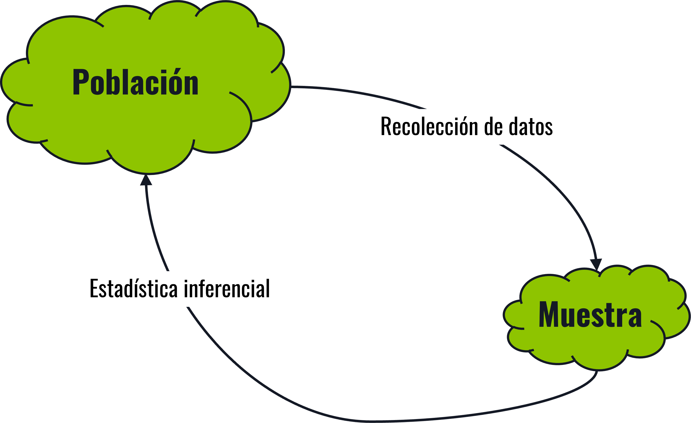
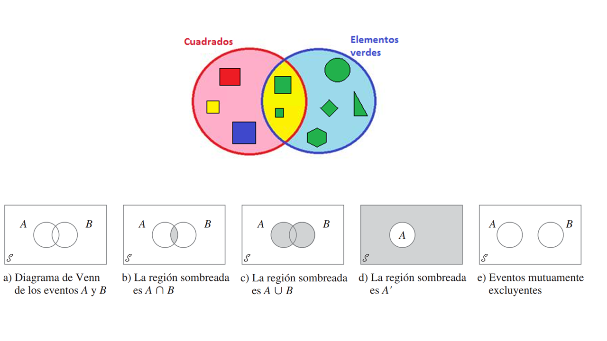
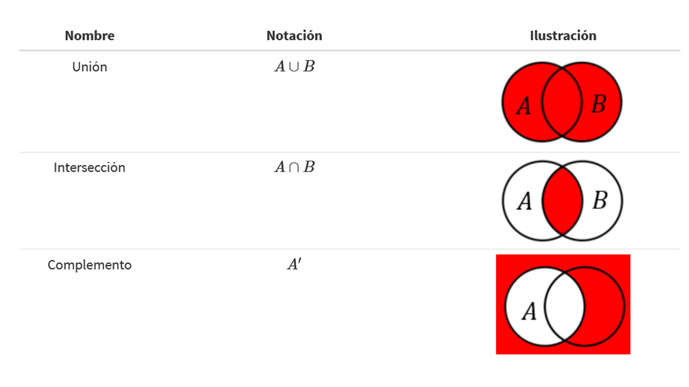
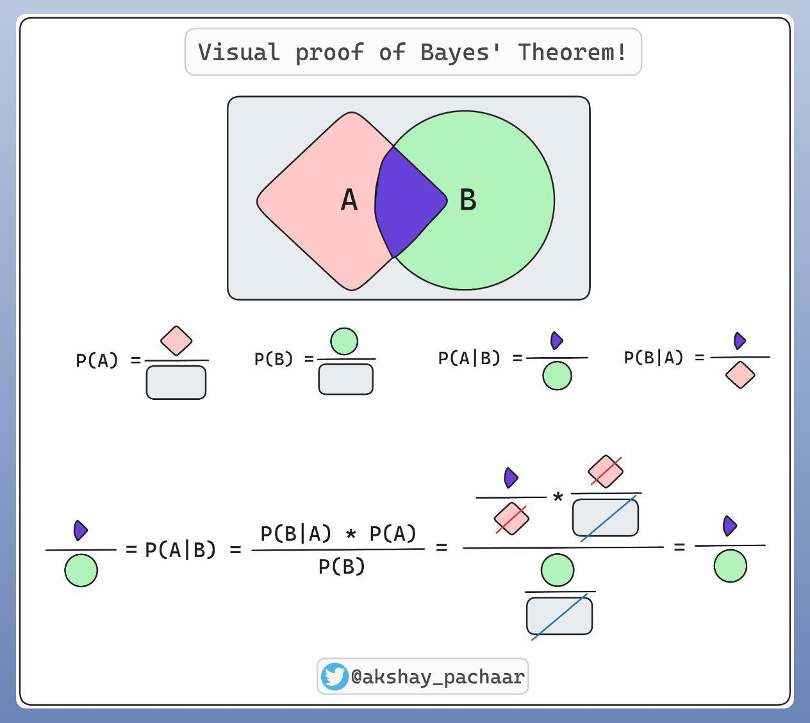

```{r}

library(tidyverse)
library(ggVennDiagram)

```


## Agenda {.bloques}

* Introducción
* Definición de probabilidad: Tipos de enfoques
* Estadística: Frecuentista vs Bayesiana
* Conceptos básicos de probabilidad
* Axiomas de probabilidad
* Cálculo de probabilidades: Algunas reglas
* Teorema de Bayes


## Preguntas generadoras {.bloques}

* ¿Qué es probabilidad?
* ¿Cuándo se utiliza la estadística inferencial y la estadística descriptiva?
* ¿Qué diferencias existen entre la estadística frecuentista y la estadística bayesiana?
* ¿Cuándo se utilizan las diferentes reglas de cálculo de probabilidades?
* ¿Cuál es la importancia del Teorema de Bayes?

## Introducción {.bloques}

* Hasta este punto hemos estudiado la estadística descriptiva. 
* A esta le concierne el resumen de los datos recogidos de eventos pasados (muestras o poblaciones). Ahora se presenta otra faceta de la estadística: el cálculo de la probabilidad de que algo ocurra en el futuro (o en una población a partir de una muestra). 
* Esto es lo que se conoce como [estadística inferencial]{.hi}.
* Se relaciona con las conclusiones asociadas con una población sobre la base de una muestra que se toma de ella. 

## ¿Por qué es necesaria?  {.bloques}

:::::: {.columns}

::: {.column width="45%"}

* Son pocas las ocasiones en las que se tiene [acceso a datos completos de la población]{.hi}, por lo que es necesario hacer inferencia de los **parámetros** a partir de información de las muestras. 
  * Recuerden la diferencia y relación entre Estimador y Parámetro.

:::

::: {.column .img-fit width="100%"}



:::

::::::

## ¿Por qué es necesaria?  {.bloques}

:::::: {.columns}

::: {.column width="40%"}

* Esto desde luego tiene relación con [la forma en la que se recolectan los datos]{.hi}; datos mal recolectados dan inferencias erróneas sobre los parámetros. 
* Aquí es también importante recordar o estudiar el concepto de sesgo estadístico, y los tipos que existen

:::

::: {.column width="30%"}

### Estimador $\hat{\theta}$

Estadístico que es función de la muestra usado para estimar un parámetro desconocido de la población


:::

::: {.column width="30%"}

### Parámetro $\theta$

Estadísticos que son función de una población, que indefectiblemente resumen una “gran” cantidad de datos en una o varias variables estadísticas


:::

::::::

## Sesgo {.bloques}

* Cuando el método de recopilación de datos hace que los datos de la muestra reflejen incorrectamente la población.
* En términos simples, es la diferencia que hay entre un estimador y un parámetro $\text{sesgo}=|\hat{\theta}-\theta|$

* **Nota**: lo ideal es que el sesgo sea cero, pero eso es [prácticamente imposible]{.hi}, entonces lo que se busca es **minimizarlo** y **controlarlo**, para que no cambie las conclusiones prácticas del estudio.

## Por ejemplo... {.bloques}

::::: columns
::: {.column width="60%" style="font-size: 1.1em;"}
* La estadística inferencial trata de [describir la realidad o población (la persona en el video) a partir de los datos recolectados de una muestra (la sombra que se forma)]{.hi}.

* Un [sesgo]{.hi} nos puede hacer pensar a partir de solo la sombra, que lo que estamos describiendo es una rana/sapo y no una persona..

:::

::: {.column .img-fit width="40%"}

:::
:::::

# ¿Qué es probabilidad? {.bloques}

## Posible vs Probable {.bloques}

* Para que un evento sea probable, primero debe ser posible. 
  * No puedo sacar un 7 en un dado con 6 caras.
* Pueden existir eventos posibles, pero que sean improbables. A veces conocido como improbabilidad extrema.
  * Ganar el premio mayor de la lotería
* Lo posible abarca tanto lo cotidiano (como lanzar un 4 en el dado) como lo rarísimo (ganar la lotería). 

## Probabilidad {.bloques}

* Es un valor numérico que representa la oportunidad o posibilidad de que un evento en particular ocurra, tal como el aumento en el precio de un producto, de que el día sea lluvioso, se produzca una unidad defectuosa, entre otros. 

* En todos los casos es un valor entre cero y uno, ambos inclusive.

* Existen al menos tres enfoques para asignar probabilidades: 
  * Clásica a priori
  * Clásica empírica
  * Subjetiva


## Probabilidad {.bloques}

* [Clásica a priori]{.hi}: 
* La probabilidad de éxito se basa en el conocimiento previo que hay del proceso implicado.
  * Por ejemplo, ¿cuál es la probabilidad de “Escudo” en una moneda?
  * ¿Necesitó tirar la moneda varias veces para saber ese resultado? ¿Cómo lo supo?

* $P(x)=\frac{x}{T}$ siendo $T$ el número de resultados posibles. 

## Probabilidad {.bloques}

* [Clásica empírica]{.hi}: 

* Se basan en datos observados, no en un conocimiento previo del proceso. 
* Se fundamenta en la ley de los grandes números.
* También se conoce como probabilidad frecuentista. 
* $P(x)=\frac{\text{Número de veces que el evento x ocurre}}{\text{Número total de observaciones}}$

* Se basa en [observación]{.hi} y [experimentación]{.hi}.


## Probabilidad {.bloques}

* [Subjetiva]{.hi}: 

* Es asignado, como su nombre lo indica, de forma subjetiva por un individuo, con base en cualquier información que encuentre disponible. 

* *Nota*: es la base, hasta cierto punto, de la estadística bayesiana. 

* Refleja el [grado de creencia]{.hi} que alguien le asigna a un evento.

## Enfoque frecuentista vs Bayesiano {.bloques}

* La estadística frecuentista se basa en la frecuencia relativa de los eventos, utilizando probabilidades objetivas, sin incorporar información previa. 
* En contraste, la estadística bayesiana incorpora creencias o información previa y [las actualiza con datos observados, utilizando probabilidades subjetivas]{.hi}.

* >Este curso, y en general esta área de conocimiento, está centrado en la [estadística frecuentista]{.hi}, pero es importante que conozca la existencia e importancia de la bayesiana.

# Conceptos básicos {.bloques}

## Experimento {.bloques}

* Es un proceso cuyo resultado está sujeto a la incertidumbre. 
* Es un procedimiento que produce datos para comparar resultados y verificar hipótesis. 
  * Lanzar una moneda
  * Tirar un dado
* En general, un requisito para ser un experimento es variar las entradas para observar las salidas. 
  * El final del curso II-1123 y todo II-1125 se basan en la experimentación. En esos cursos se expande el concepto de experimento.

## Espacio muestral {.bloques}

* Es el conjunto de todos los posibles resultados de un experimento (Se puede denotar por $S$).
  * Cara o cruz
  * As de corazones, 3 de diamantes, etc. (las 52 cartas).
* Mini ejercicio: 
  * ¿Cuál es el espacio muestral de un experimento que consiste en lanzar dos monedas?

## Evento {.bloques}

* Conjunto de uno o más resultados de un experimento.
* Es la recopilación o subconjunto de resultados contenidos en el espacio muestral, puede ser simple (único resultado) o compuesto (más de un resultado).
  * **Simple**: sale cara al lanzar una moneda (solo un resultado)
  * **Compuesto**: si se lanzan dos monedas simultáneamente se puede obtener: \{cara-cruz\}, \{cruz-cara\}, \{cara-cara\}, \{cruz-cruz\}. 
    * [Un]{.hi} evento compuesto es [uno]{.hi} de estos resultados.
    
## Axiomas de probabilidad {.bloques}

:::::: {.columns}

::: {.column width="40%"}

* Es importante conocer los axiomas, pues sirven para garantizar la [coherencia]{.hi} al establecer reglas claras, evitar contradicciones o inconsistencias en el cálculo de probabilidades.

:::

::: {.column width="60%"}

* La probabilidad de cualquier suceso o evento $E$ es no negativa.
* La probabilidad del espacio muestral es 1 $\rightarrow P(S)=1$.
* La probabilidad de un conjunto vacío y de eventos mutuamente excluyentes, es cero $\rightarrow P(\emptyset)=0$
* Si un evento $A$ está contenido en otro $B$, la probabilidad de $A$ será menor o igual a la de $B$. Es decir si $A \subseteq B \rightarrow P(A) \le P(B)$.


:::

::::::

# Cálculo de probabilidades {.bloques}

## Teoría de conjuntos{.bloques}

* [Unión]{.hi}: de dos eventos A y B denotados por 𝐴∪𝐵 y leídos “A o B”, es el evento que consiste de todos los resultados que están en A o en B.

* [Intersección]{.hi}: de dos eventos A y B, denotada por 𝐴∩𝐵 y leída como “A y B”, es el evento que consiste en todos los resultados que están tanto en A como en B.

* [Complemento]{.hi}: de un evento A, denotado por 𝐴′, es el conjunto de todos los eventos del espacio muestral S que no están contenidos en A.

## Diagrama de Venn {.bloques}

:::::: {.columns}

::: {.column .img-fit width="100%"}



:::

::::::

## Operaciones {.bloques}

:::::: {.columns}

::: {.column .img-fit width="100%"}



:::

::::::

## Ejercicio 01 {.bloques}

* Sea un conjunto $A=\{0, 1, 2, 3, 4\}$, uno $B=\{3, 4, 5, 6\}$ y uno $C=\{1, 3, 5\}$.

* Dibuje un diagrama de Venn.

* Obtenga: 

  * $A \cup B$
  * $A\cap B$
  * $A'$
  * $(A\cup B)'$
  
* Se le recomienda como ejercicio [individual]{.hi} se plante y resuelva otros ejercicios. 

## Ejercicio 01 {.bloques}

:::::: {.columns}

::: {.column .img-fit width="100%"}

```{r, out.width="100%", bg="#F1F5F5"}

A <- 0:4
B <- 3:6
C <- as.integer(c(1, 3, 5))

ggVennDiagram::ggVennDiagram(list(A=A, B=B, C=C)) +
  scale_fill_gradient(low = "#F4A261", high = "#2A9D8F") +
  theme_void() +
  theme(legend.position = "none", 
        panel.background  = element_rect(fill = "#F1F5F5", colour = NA),
        plot.background   = element_rect(fill = "#F1F5F5", colour = NA),
        legend.background = element_rect(fill = "#F1F5F5", colour = NA))


```

:::

::: {.column width="45%"}

### Respuestas

* $A \cup B = \{0, 1, 2, 3, 4, 5, 6\}$
* $A\cap B = \{3, 4\}$
* $A' = \{5, 6\}$
* $(A\cup B)'=\{\emptyset\}$

:::

::::::

# Datos para ejercicios {.bloques}

## Nota importante {.bloques}

* Vamos a desarrollar los temas correspondientes con [datos reales]{.hi}. Los ejercicios de libro nos ayudan a entender, y por tanto puede ser importante que practique y estudie con ellos, pero en la práctica usted debe buscar/recoger el dato y tratar con conjuntos de datos con errores o inconsistencias. 

## Contexto {.bloques}

* Se cuenta con la información de 2403 personas que poseen o no, diabetes no controlada. 
* Bajo varios criterios técnicos de personas expertas se tiene evidencia de que un ancho de la cintura elevado, la hipertensión y poca fuerza de agarre en la mano son causas de diabetes no controlada. 
  * Es decir, no haremos estadística "porque si", la haremos bajo estos contextos. 
* La información también se encuentra desagregada por sexo. 

## Contexto {.bloques}

* Para el desarrollo de estos ejemplos se toma una [submuestra o subconjunto]{.hi} de la base de datos, con el fin de hacerla manejable en clase.
  * La submuestra, de 16 observaciones, se obtiene mediante muestreo estratificado y MAS. Se forman dos estratos: los que tienen y los que no diabetes no controlada, se extraen 2 observaciones para los que si y 14 para los que no. 
* Se le hace entrega de la base de datos completa, en este [enlace](https://stevenggoni.github.io/clases/data/II-1123_04_Diabetes No Controlada.xlsx), para que practique y repita ejercicios con más volumen de datos.
  * Se le recomienda hacerlo, pues las bases de datos de las pruebas es similar en extensión a la que se le entrega.
  * Puede usar esta misma base de datos para realizar ejercicios de estadística descriptiva y muestreo. 

## Submuestra {.bloques}

:::::: {.columns}

::: {.column style="font-size: 0.61em;"}

```{r}

diabetes <- openxlsx::read.xlsx("data/II-1123_04_Diabetes No Controlada.xlsx")

```

```{r}

set.seed(123)

submuestra1 <- diabetes %>% 
  dplyr::filter(Diabetes.no.controlada == 1) %>% 
  dplyr::slice_sample(n = 2)

submuestra2 <- diabetes %>% 
  dplyr::filter(Diabetes.no.controlada == 0) %>% 
  dplyr::slice_sample(n = 14)

submuestra <- submuestra1 %>% 
  rbind(submuestra2) %>% 
  dplyr::slice_sample(n = 16)

submuestra %>% 
  knitr::kable(format = "html", escape = FALSE) %>%
  kableExtra::kable_styling() 

```


:::

::::::

## Probabilidad simple (Marginal) {.bloques}

:::::: {.columns}

::: {.column width="80%"}

* Se refiere a la probabilidad de ocurrencia de un evento simple.
  * Por ejemplo: $P(A)$

### Ejercicio

* ¿Cuál es la probabilidad de ser hipertenso?

* En la submuestra

```{r}

den <- nrow(submuestra)

num <- length(submuestra$Hipertensión[submuestra$Hipertensión==1])

ej1 <- num/den

```


* $P(H = 1) = \frac{`r num`}{`r den`} = `r ej1`$


* En la muestra

```{r}

den <- nrow(diabetes)

num <- length(diabetes$Hipertensión[diabetes$Hipertensión==1])

ej1 <- num/den

```

* $P(H = 1) = \frac{`r num`}{`r den`} = `r ej1`$

:::

::: {.column style="font-size: 0.61em;"}

```{r}

submuestra %>% 
  dplyr::select(Hipertensión) %>% 
  dplyr::mutate(Hipertensión = ifelse(Hipertensión == 1,
                                      kableExtra::cell_spec(
                                        Hipertensión, 
                                        background = "#AFB5BC",
                                        extra_css = "display:block; width:100%;"),
                                      Hipertensión)) %>% 
  knitr::kable(format = "html", escape = FALSE) %>%
  kableExtra::kable_styling() 

```


:::

::::::

## Probabilidad conjunta {.bloques}

:::::: {.columns}

::: {.column}

* Se refiere a la probabilidad de ocurrencia que involucra dos o más eventos de forma simultánea (al mismo tiempo pues).
  * Por ejemplo, la probabilidad de ser hombre y fumador.
* **Ejercicio**:
  * ¿Cuál es la probabilidad de encontrar una persona mujer e hipertensa? En la submuestra:
  
```{r}

den <- nrow(submuestra)

num <- submuestra %>% 
  dplyr::filter(Sexo == "M" & Hipertensión == 1) %>% 
  nrow()

ej2 <- num/den

```


  * $P(S=M \cap H=sí) = \frac{`r num`}{`r den`} = `r ej2`$

  * En la muestra

```{r}

den <- nrow(diabetes)

num <- diabetes %>% 
  dplyr::filter(Sexo == "M" & Hipertensión == 1) %>% 
  nrow()

ej2 <- num/den

```

  * $P(S=M \cap H=sí) = \frac{`r num`}{`r den`} = `r ej2`$

:::


::: {.column style="font-size: 0.61em;"}

```{r}

submuestra %>% 
  dplyr::select(Sexo, Hipertensión) %>% 
  dplyr::mutate(Sexo = ifelse(Sexo == "M",
                              kableExtra::cell_spec(
                                Sexo, 
                                background = "#AFB5BC",
                                extra_css = "display:block; width:100%;"),
                              Sexo), 
                Hipertensión = ifelse(Hipertensión == 1,
                                      kableExtra::cell_spec(
                                        Hipertensión, 
                                        background = "#AFB5BC",
                                        extra_css = "display:block; width:100%;"),
                                      Hipertensión)) %>% 
  knitr::kable(format = "html", escape = FALSE) %>%
  kableExtra::kable_styling() 

```

:::

::::::

## Probabilidad conjunta {.bloques}

:::::: {.columns}

::: {.column width="50%"}

* Hay 25% de probabilidad, en la submuestra, de que la persona seleccionada al azar sea una mujer hipertensa.

* Note que la información anterior se puede resumir en tablas de contingencia.

* Esto puede ayudarle a resolver el ejercicio.


:::

::: {.column width="50%"}

### En la submuestra

```{r}

submuestra %>% 
  dplyr::select(Sexo, Hipertensión) %>% 
  dplyr::count(Sexo, Hipertensión) %>% 
  tidyr::pivot_wider(names_from = Hipertensión,
                     names_prefix = "Hip=",
                     values_from = n,
                     values_fill = 0) %>% 
  knitr::kable(format = "html", escape = FALSE) %>%
  kableExtra::kable_styling() 

```

### En la muestra

```{r}

diabetes %>% 
  dplyr::select(Sexo, Hipertensión) %>% 
  dplyr::count(Sexo, Hipertensión) %>% 
  tidyr::pivot_wider(names_from = Hipertensión,
                     names_prefix = "Hip=",
                     values_from = n,
                     values_fill = 0) %>% 
  knitr::kable(format = "html", escape = FALSE) %>%
  kableExtra::kable_styling() 

```

:::

::::::

# Reglas para el cálculo de probabilidades {.bloques}

## Ley de la suma {.bloques}

* Esta ley nos permite encontrar la probabilidad de evento “A o B”. Para [dos eventos]{.hi} esta regla se define como: 
* $P(A\cup B)=P(A)+P(B)-P(A\cap B)$
* Si A y B son mutuamente excluyentes, entonces $P(A\cap B)=0$.
* Tome en cuenta que esta ley tiene diferentes fórmulas en función de la cantidad de eventos (A, B, C, D, …)


## Ley de la suma {.bloques}

* Esta ley nos permite encontrar la probabilidad de que ocurra “A o B o C”. Para [tres eventos]{.hi} esta regla se define como:

* $P(A\cup B\cup C)=P(A)+P(B)+P(C)\\-P(A\cap B)-P(A\cap C)-P(B\cap C)\\+P(A\cap B\cap C)$

* Observe que primero se suman las probabilidades individuales, luego se restan las intersecciones dobles y finalmente se suma la intersección triple.

* Este patrón se conoce como el principio de inclusión-exclusión.

## Ley de la suma {.bloques}

* Para [más de tres eventos]{.hi}, la ley sigue un patrón alternado de sumas y restas conocido como principio de inclusión-exclusión:

* $P\left(\bigcup_{i=1}^{n} A_i\right)=\sum_{i=1}^{n}P(A_i) \\ -\sum_{i<j}P(A_i\cap A_j) \\ +\sum_{i<j<k}P(A_i\cap A_j\cap A_k)-\\;\cdots;\\+(-1)^{n+1}P(A_1\cap A_2\cap\cdots\cap A_n)$

* [El signo alterna]{.ul}: se suman probabilidades individuales, se restan intersecciones dobles, se suman triples, se restan cuádruples, y así sucesivamente.

## Ley de la suma - Ejercicio {.bloques}

:::::: {.columns}

::: {.column width="70%"}

Calcule la probabilidad de aleatoriamente, se obtenga un hombre o una persona hipertensa. Nótese de la redacción que se solicita $P(A \text{ o } B) = P(A\cup B)$

* En la submuestra

```{r}

p_A  <- mean(submuestra$Sexo == "H")
p_B  <- mean(submuestra$Hipertensión == 1)
p_AB <- mean(submuestra$Sexo == "H" & submuestra$Hipertensión == 1)

p_union <- p_A + p_B - p_AB

```


$P(A\cup B) = P(A) + P(B) - P(A\cap B) \\= `r p_A` + `r p_B` - `r p_AB` = `r p_union`$

* En la muestra

```{r}

p_A  <- mean(diabetes$Sexo == "H")
p_B  <- mean(diabetes$Hipertensión == 1)
p_AB <- mean(diabetes$Sexo == "H" & diabetes$Hipertensión == 1)

p_union <- p_A + p_B - p_AB

```


$P(A\cup B) = P(A) + P(B) - P(A\cap B) \\= `r p_A` + `r p_B` - `r p_AB` \\= `r p_union`$

:::

::: {.column style="font-size: 0.61em;"}

```{r}

submuestra %>% 
  dplyr::select(Sexo, Hipertensión) %>% 
  dplyr::mutate(Sexo = ifelse(Sexo == "H",
                              kableExtra::cell_spec(
                                Sexo, 
                                background = "#AFB5BC",
                                extra_css = "display:block; width:100%;"),
                              Sexo), 
                Hipertensión = ifelse(Hipertensión == 1,
                                      kableExtra::cell_spec(
                                        Hipertensión, 
                                        background = "#AFB5BC",
                                        extra_css = "display:block; width:100%;"),
                                      Hipertensión)) %>% 
  knitr::kable(format = "html", escape = FALSE) %>%
  kableExtra::kable_styling() 

```


:::

::::::

## Ley de la multiplicación {.bloques}

* Considera la ocurrencia de dos o más eventos de forma simultánea (A y B). 
* $P(A\cap B) = P(A)\cdot P(B|A)$ (Regla general)
* Si son independientes, entonces $P(B|A)=P(B)$ y por tanto $P(A\cap B) = P(A)\cdot P(B)$.
  * $P(B|A)$ se lee: la probabilidad de B dado A y es una probabilidad condicional. 

## Probabilidad condicional {.bloques}

* Antes de continuar con la ley de la multiplicación, se explica este concepto.
* Es la probabilidad de que ocurra un evento, dado que ya se sabe que otro ha ocurrido. 
* $P(A|B) = \frac{P(A\cap B)}{P(B)}$, en el denominador siempre va el que condiciona (A [dado B]{.hi})
  * Por ejemplo:
* En una clase el 30 % son hombres $P(A)$ y el 10 % son hombres y fumadores $P(A\cap B)$. Entonces la probabilidad de ser fumador (B) dado que es hombre (A). 
* $P(B|A) = \frac{P(A\cap B)}{P(A)} = \frac{0.10}{0.30} = 0.333$

## Probabilidad condicional {.bloques}

* Note como cambia el enfoque de la pregunta: 
  * ¿Cuál es la probabilidad de que, dado que se ha encontrado una persona con diabetes no controlada, esta sea hipertensa?. 
  * Esta redacción sugiere que hay una relación entre las variables, que solo puede venir dada de un contexto particular, en este caso, la teoría indica que las personas diabéticas con hipertensión, son más propensas a que tengan esta no controlada.


## Probabilidad condicional vs conjunta {.bloques}

* Es normal confundirlas, pero son diferentes
* La conjunta dice:
  * >¿Qué tan probable es que alguien elegido al azar sea hombre y fumador al mismo tiempo?
* La condicional:
  * >Dado que ya se sabe que es hombre, ¿Qué tan probable es que sea fumador? 

## ¿Qué es independencia? {.bloques}

* Si un evento ocurre, no tiene ningún efecto sobre la probabilidad que otro acontezca. 
* Por ejemplo, si yo lanzo dos monedas, ¿el valor de la primera afecta el valor de la segunda?
* En términos matemáticos, cuando $P(B|A)=P(B)$

## Ley de la multiplicación - Ejercicio {.bloques}

:::::: {.columns}

::: {.column}

* Calcule la probabilidad de que sea hipertenso (A) y tenga diabetes no controlada (B) (note la redacción). Es decir: 
$P(A)\cdot P(B|A)$

* En la submuestra

```{r}

p_A  <- mean(submuestra$Hipertensión == 1)
p_BA  <- mean(submuestra$Hipertensión == 1 & 
                submuestra$Diabetes.no.controlada == 1)/p_A

p_inter <- p_A * p_BA

```

$P(A)\cdot P(B|A) \\= `r p_A` \cdot `r p_BA` = `r p_inter`$

* En la muestra

```{r}

p_A  <- mean(diabetes$Hipertensión == 1)
p_BA  <- mean(diabetes$Hipertensión == 1 & 
                diabetes$Diabetes.no.controlada == 1)/p_A

p_inter <- p_A * p_BA

```

$P(A)\cdot P(B|A) \\= `r p_A` \cdot `r p_BA` = `r p_inter`$

:::

::: {.column style="font-size: 0.61em;"}

```{r}

submuestra %>% 
  dplyr::select(Hipertensión, Diabetes.no.controlada) %>% 
  dplyr::mutate(Diabetes.no.controlada = ifelse(Diabetes.no.controlada == 1,
                              kableExtra::cell_spec(
                                Diabetes.no.controlada, 
                                background = "#AFB5BC",
                                extra_css = "display:block; width:100%;"),
                              Diabetes.no.controlada), 
                Hipertensión = ifelse(Hipertensión == 1,
                                      kableExtra::cell_spec(
                                        Hipertensión, 
                                        background = "#AFB5BC",
                                        extra_css = "display:block; width:100%;"),
                                      Hipertensión)) %>% 
  knitr::kable(format = "html", escape = FALSE) %>%
  kableExtra::kable_styling() 

```

:::

::::::

## Diagrama de árbol {.bloques}

:::::: {.columns}

::: {.column width="40%"}

* Un diagrama de árbol puede ser una forma más intuitiva de resolver estos ejercicios, pues le obliga a pensar en secuencias y en condicionalidad. 

* Note que la suma de los nodos terminales debe ser igual 1.0; además la suma en cada nodo debe ser también 1.0.


:::

::: {.column .img-fit width="100%"}

```{r}
#| out-width: "1200px"
#| out-height: "700px"

DiagrammeR:::grViz("
digraph {rankdir = LR
  
        node [shape = circle]
      
        Inicio -> Hsí [label = 'P(H=Sí) = 8/16 = 0.5']
        Inicio -> Hno [label = 'P(H=No) = 8/16 = 0.5']
      
        Hsí -> 0.0625 [label = 'P(D = sí|H = sí) = 1/8 = 0.125']
        Hsí -> 0.4375 [label = 'P(D = no|H = sí) = 7/8 = 0.875']
      
        Hno -> 0.06250 [label = 'P(D = sí|H = no) = 1/8 = 0.125']
        Hno -> 0.43750 [label = 'P(D = no|H = no) = 7/8 = 0.875']}")

```


:::

::::::

## Diagrama de árbol {.bloques}

* Resuelva, como ejercicio individual y asincrónico, con la muestra completa.
* La respuesta al ejercicio específico que se plantea debe ser la misma que la del slide trasanterior. 

## Ley de la multiplicación {.bloques}

:::::: {.columns}

::: {.column}

* Estos ejercicios también pueden resolverse con tablas de contingencia. 

* En la submuestra: $P(A)\cdot P(B|A) = \frac{1}{16} = 0.0625$

* En la submuestra: $P(A)\cdot P(B|A) = \frac{177}{2403} = 0.0736579$

:::

::: {.column}

### En la submuestra

```{r}

submuestra %>% 
  dplyr::select(Hipertensión, Diabetes.no.controlada) %>% 
  dplyr::count(Hipertensión, Diabetes.no.controlada) %>% 
  tidyr::pivot_wider(names_from = Diabetes.no.controlada,
                     names_prefix = "DNC=",
                     values_from = n,
                     values_fill = 0) %>% 
  knitr::kable(format = "html", escape = FALSE) %>%
  kableExtra::kable_styling() 

```

### En la muestra

```{r}

diabetes %>% 
  dplyr::select(Hipertensión, Diabetes.no.controlada) %>% 
  dplyr::count(Hipertensión, Diabetes.no.controlada) %>% 
  tidyr::pivot_wider(names_from = Diabetes.no.controlada,
                     names_prefix = "DNC=",
                     values_from = n,
                     values_fill = 0) %>% 
  knitr::kable(format = "html", escape = FALSE) %>%
  kableExtra::kable_styling() 

```

:::

::::::

## Ley de la multiplicación vs Probabilidad conjunta {.bloques}

* Son muy similares, pero no son lo mismo: 
  * La probabilidad conjunta es la probabilidad de que dos eventos ocurran simultáneamente. 
  * La ley de la multiplicación permite calcular la probabilidad conjunta usando tanto probabilidades marginales, como condicionales. 
  * >Cuidado: no confunda probabilidad conjunta con probabilidad condicional. Se escriben de forma similar, son conceptos distintos.

## Otro ejemplo {.bloques}

* En un lote de 75 tornillos, hay 25 con los hilos de rosca dañados. 
* Juan saca un tornillo y se lo lleva (no lo devuelve) y luego María saca otro. 
  * ¿Cuál es la probabilidad de que ambos estén con los hilos de rosca dañados?

* $P(J \cap M)= P(J) \cdot P(M|J) = \frac{25}{75} \cdot \frac{24}{74}=0.1081$

# Teorema de Bayes {.bloques}

## Teorema de Bayes {.bloques}

* El teorema de Bayes se usa cuando se quieren invertir y reponderar probabilidades condicionales. Es decir, conocer la probabilidad de un evento A dado que ocurrió B, usando la información sobre B dado A.
* Es decir, dado que tiene diabetes no controlada, ¿cuál es la probabilidad de que sea hipertensa?

* La ley de la multiplicación sirve para calcular la probabilidad conjunta de que ocurran dos eventos.
* El teorema de Bayes sirve para actualizar la probabilidad de un evento con base en nueva información
  * Esta regla se usa cuando ya ocurrió un evento y queremos actualizar la probabilidad de una “causa”. 

## Ejemplo {.bloques}
:::::: {.columns}

::: {.column}

### Probabilidad conjunta

* En una fábrica de tornillos, el 80 % de los producidos son de buena calidad, si un tornillo es de buena calidad, tiene una probabilidad del 90 % de ser aprobado en la inspección final. 
La probabilidad de que un tornillo sea de buena calidad y pase la inspección final es de  $0.8\cdot 0.9=0.72$

:::

::: {.column}

### Teorema de Bayes

* Si el tornillo ya pasó por la inspección final ([ya ocurrió el evento]{.hi}), ¿cuál es la probabilidad de este sea de buena calidad?
  * Más adelante ahondamos en la fórmula, de momento se quiere dejar en claro la diferencia entre probabilidad conjunta y teorema de Bayes

$$
P(Buena|Pasó) = \frac{0.9\cdot 0.8}{0.9\cdot 0.8 + 0.5\cdot 0.2}
$$

$$
P(Buena|Pasó) = 0.878
$$

:::

::::::

## ¿Cuándo usar el teorema de Bayes? {.bloques}

:::::: {.columns}

::: {.column width="50%"}

* Cuando haya información subjetiva o externa al conjunto de datos que sirva para actualizar las probabilidades en el conjunto de datos. 
* [De forma más general]{.hi}: Cuando se observa un resultado y se quiere estimar qué hipótesis lo generó.
* Por ejemplo:
  * Como información externa o subjetiva se sabe que la probabilidad de tener diabetes no controlada es de 10 %. 
  * Entonces, si una persona es diagnosticada con diabetes no controlada, ¿Cuál es la probabilidad de que si tenga la enfermedad?

:::

::: {.column width="50%"}
* El teorema de Bayes, como se observa en la fórmula, integra los conceptos de la Ley de la suma (el denominador) y la Ley de la multiplicación (el numerador). 

$$
P(A|B)= \frac{P(A\cap B)}{P(B)} = \frac{P(B|A)\cdot P(A)}{\sum_{i=1}^{k}P(B|A_i)P(A_i)}
$$
* Donde: 
  * $P(A)$: es también conocida como probabilidad a priori
  * $P(A|B)$: recibe el nombre de probabilidad a posteriori

:::

::::::

## Teorema de Bayes {.bloques}

:::::: {.columns}

::: {.column width="40%"}

Esta es una explicación gráfica del Teorema de Bayes por [Akshay Pachaar](https://www.linkedin.com/posts/akshay-pachaar_bayes-theorem-clearly-explained-activity-7372630950733733889-h3z-/){target="_blank"}

:::

::: {.column .img-fit width="30%"}



:::

::::::

## Siguiendo el ejemplo de diabetes... {.bloques}

* Suponga que se selecciona una persona al azar y se le realiza una prueba con la que se determina que tiene diabetes no controlada. 
* Calculemos la probabilidad de que una persona sea hipertensa dado que tiene diabetes no controlada $P(H=sí|D=sí)$.
* Utilice un diagrama de árbol. 

## Diagrama de árbol {.bloques}

:::::: {.columns}

::: {.column width="50%"}

* Siga las ramas donde el resultado sea $P(D=sí)$. En el numerador va la rama de interés (tener diabetes no controlada dado que se es hipertenso.) mientras que en el denominador va la probabilidad total de tener diabetes no controlada, tenga hipertensión o no. En este ejercicio particular es [casualidad]{.hi} que las dos ramas tengan el mismo valor. 

* $P(H=sí|D=sí) = \frac{P(H=sí \cap D =sí)}{P(D=sí)}$

* $P(H=sí|D=sí) = \frac{0.0625}{0.0625 + 0.0625} = 0.5$

:::

::: {.column .img-fit width="100%"}

```{r}
#| out-width: "900px"
#| out-height: "680px"

DiagrammeR:::grViz("
digraph {rankdir = LR
  
        node [shape = circle]
      
        Inicio -> Hsí [label = 'P(H=Sí) = 8/16 = 0.5']
        Inicio -> Hno [label = 'P(H=No) = 8/16 = 0.5']
      
        Hsí -> 0.0625 [label = 'P(D = sí|H = sí) = 1/8 = 0.125']
        Hsí -> 0.4375 [label = 'P(D = no|H = sí) = 7/8 = 0.875']
      
        Hno -> 0.06250 [label = 'P(D = sí|H = no) = 1/8 = 0.125']
        Hno -> 0.43750 [label = 'P(D = no|H = no) = 7/8 = 0.875']}")

```


:::

::::::

## Note esto... {.bloques}

:::::: {.columns}

::: {.column}

* En este caso, da lo mismo que resolverlo con probabilidad condicional.
* $P(H=sí|D=sí)$: Probabilidad de que sea hipertenso, dado que tiene diabetes no controlada

$$
P(H=sí|D=sí) = \frac{1}{2}=0.5
$$

:::

::: {.column}

```{r}

submuestra %>% 
  dplyr::select(Hipertensión, Diabetes.no.controlada) %>% 
  dplyr::count(Hipertensión, Diabetes.no.controlada) %>% 
  tidyr::pivot_wider(names_from = Diabetes.no.controlada,
                     names_prefix = "DNC=",
                     values_from = n,
                     values_fill = 0) %>% 
  knitr::kable(format = "html", escape = FALSE) %>%
  kableExtra::kable_styling() 


```

* Es por esto que, en presencia de todo el conjunto de datos Bayes se reduce algebraicamente a probabilidad condicional clásica. Por lo que quizá sea más sencillo obtenerlo de esta manera que con Teorema de Bayes. 

* El Teorema de Bayes resulta especialmente útil cuando solo se conocen probabilidades marginales y condicionales parciales.

:::

::::::

## Como por ejemplo {.bloques}

* Solo 1 de 1000 (0.001) adultos padece una enfermedad rara ($A_{sí}$) para la cual se ha creado una prueba de diagnóstico ($B$). 

* Un resultado positivo se presentará en el 99 % de las veces cuando se tenga la enfermedad $(B_+|A_{sí})$  y solo se presentará positivo el 2% cuando no se tenga la enfermedad $(B_+|A_{no})$.

* Se selecciona y somete al azar a un individuo y el resultado es positivo ([ya ocurrió el evento]{.hi}). ¿Cuál es la probabilidad de que tenga la enfermedad? $P(A_{sí}|B_+)$.

* Construya el diagrama de árbol y encuentre la probabilidad, ¿Compare la $P(A_{sí})$ contra la obtenida anteriormente $P(A_{sí}|B_+)$.

## Solución {.bloques}

* Se omite intencionalmente la secuencia de pasos para que la persona estudiante trate de resolverlo por su propia cuenta.
* $P(A_{sí}|B_+)=0.047$
* $P(A_{sí}) = 0.001$ (ya venía dada por el enunciado)
* Dado que el resultado de la prueba es positivo, la probabilidad de padecer la enfermedad incrementa en 47 veces. Aunque en términos absolutos sigue siendo baja ($4.7\%$).

## Actividad extracurricular {.bloques}

* Realice los ejercicios con la base de datos completa, en esta presentación se muestran algunos de los resultados. 

* Utilice lo ya aprendido en muestreo y obtenga otras submuestras bajos los diferentes métodos estudiados y repita los ejercicios. 
  * Observe, tanto en sus submuestras como en la que se presentó en esta clase, la diferencia que hay entre los estimadores y los parámetros. Discuta con la persona docente y otros estudiantes.

## Bibliografía {.bloques}

:::: columns
::: {.column width="100%" style="font-size: 1.2em;"}

* Walpole, R.; Myers, R.; Myers, S. y Ye, K. Probabilidad y estadística para ingeniería y ciencias (9na Edición).
  * Capítulo 1
* Lind, D.; Marchal, W. y Watchen, S. Estadística aplicada a los Negocios y la Economía (15va Edición).
  * Capítulo 5
* Devore, J. Probabilidad y Estadística para Ingeniería y Ciencias (7ma Edición).
  * Capítulo 2
* Levine, D.; Krehbiel, T.; Berenson, M. Estadística para administración (4ta Edición).
  * Capítulo 4

:::
::::

## Probabilidad básica <br> II-1120 Estadística para Ingeniería Industrial I {.center}

### Gracias por su atención <br> Steven García Goñi<br>[steven.garciagoni\@ucr.ac.cr](mailto:steven.garciagoni@ucr.ac.cr) {.subtitle}

### Dudas o correcciones requeridas pueden solicitarse al correo
