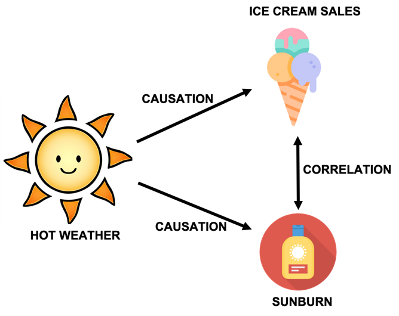
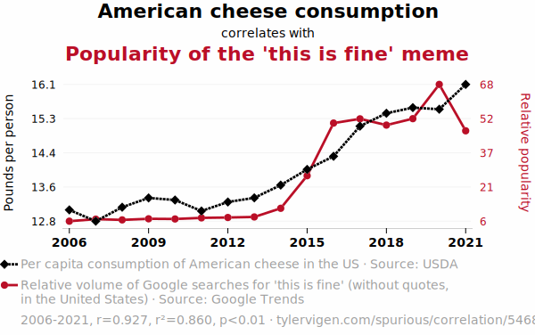
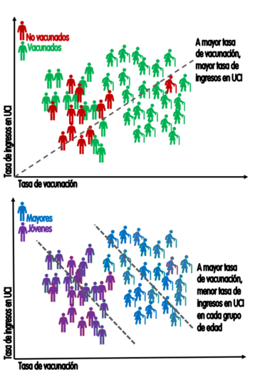
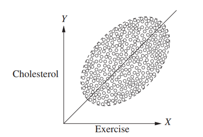
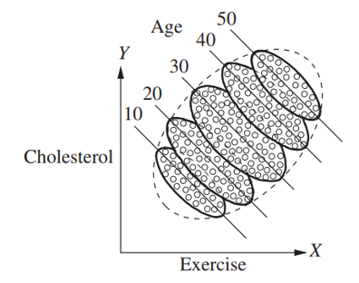

```{r}

library(tidyverse)

```

## Agenda {.bloques}

* Preguntas generadoras
* Introducción
* Causalidad
* Correlación
* Algunas medidas de asociación entre dos variables

## Preguntas generadoras {.bloques}

* ¿Qué es causalidad?
* ¿Qué es correlación?
* ¿Cómo se relaciona y se diferencia la correlación de la causalidad?
* ¿Qué es covarianza?
* ¿Cuáles medidas de asociación entre dos variables existen? 

## Introducción {.bloques}

* Al inicio del curso hablamos de por qué se debe estudiar estadística.
* [¿Lo recuerdan?]{.hi}
* En esa misma clase introdujimos un término que no volvimos a usar: causalidad
* Repasemos…

## Recordemos ... {.bloques}

-   La estadística es una **herramienta poderosa**, pero su verdadero valor se obtiene cuando se aplica de **manera adecuada y se interpreta dentro de un** [contexto específico]{.hi}.
-   Sin contexto, los datos y los análisis estadísticos carecen de significado y utilidad práctica.
       
    > [It’s easy to lie with statistics, but it’s hard to tell the truth without them]{.hi} - *Andrejs Dunkels*

## Teoría, hipótesis y contexto {.bloques}

-   Para Babbie (2000), una teoría es una explicación sistemática de los hechos y leyes observadas que se relacionan con un aspecto específico de la vida.

-   Organizan las observaciones y les asignan un sentido. A menudo, las expectativas comprenden la idea de [causalidad]{.hi} (Dado un evento A -\> Ocurre un evento B).

    > [Las teorías no deben confundirse con una opinión]{.hi}

## Ejemplos {.bloques}

::::: columns
::: {.column width="50%"}
### General

{fig-align="center" width="100"}

-   Mediante una encuesta, se obtiene que el 90 % de las personas con baja educación son prejuiciosas y que el 30 % de las que tienen mayor educación también lo son. Es decir, que el 70 % no tiene prejuicios.
-   La hipótesis sería que “algo” en la educación es la [causa]{.hi} de que la persona sea prejuiciosa o no. La determinación de ese “algo” es la teoría asociada al contexto.
:::

::: {.column width="50%"}
### Específico

{fig-align="center" width="100"}

-   En una fábrica de ensamble de relojes, se hipotetiza que dividir una tarea compleja en partes más pequeñas y asignar cada parte a una persona o equipo especializado aumenta la productividad.
-   Hay teorías que sostienen esta afirmación y que pueden estudiarse/comprobarse con el uso de la estadística, mediante un experimento u observación, por ejemplo.
:::
:::::

# ¿Por qué estudiar causalidad? {.bloques}

## Causalidad {.bloques}

* La causalidad se estudia porque debemos darle sentido a los datos para guiar las acciones y políticas y aprender de los éxitos y los fracasos. 
* Por ejemplo
  * El efecto de fumar -> Sobre el cáncer de pulmón
  * El efecto de la educación -> Sobre los salarios
  * El efecto de las emisiones de carbono -> Sobre el clima

## Causalidad {.bloques}

* De forma más ambiciosa, con estadística se busca entender  cómo y por qué las causas influyen en los efectos. 
* Por ejemplo, las creencias respecto al dengue de que los mosquitos solo pican de día o que el frío mata al mosquito pueden conducir a decisiones erróneas sobre los efectos. 

## Causalidad {.bloques}

:::::: {.columns}

::: {.column}

* El nombre "malaria" proviene del italiano "mal aria", que significa "mal aire". Esta denominación se debe a la antigua creencia de que la enfermedad era transmitida por el aire viciado de los pantanos.
* Saber que la causa son los mosquitos y no el aire es el motivo por el cual se usan mosquiteros y no mascarillas al visitar este tipo de zonas. 

:::

::: {.column .img-fit}


:::

::::::

## Recordatorio {.bloques}

* En este curso, hemos trabajado múltiples veces con la idea de causalidad. 

* Por ejemplo, en estadística descriptiva establecíamos relaciones como: 
  * Si una máquina es más vieja, tendrá más fallos (causa -> efecto)
* En probabilidad:
  * El teorema de Bayes puede interpretarse dentro de algunos modelos causales. $P(A|B)$ es la probabilidad de A (efecto) dado B (causa). Nota: Bayes no implica necesariamente causalidad, solo se pretende ilustrar un ejemplo. 

* Como pueden ver, es tema conocido, en esta clase se formaliza el concepto.

# Causalidad {.bloques}

## Formalmente {.bloques}

* La causalidad se refiere a una relación de causa y efecto entre dos variables, donde un cambio en una variable (la causa) provoca un cambio en otra (el efecto).

* Para que exista causalidad: 
  * Debe existir consistencia, es decir, siempre se repite
  * No hay variables confusoras (espurias) que puedan intervenir.
  * Debe observarse asociación entre las variables.
  * Toda causa precede al efecto (causa -> efecto)
  * Coherencia

## Confusores {.bloques}

* Una [variable confusora]{.hi} (o confounding variable) es una **tercera variable** que distorsiona la relación entre dos variables que se están estudiando. 

* Puede hacer parecer que hay una relación causal entre ellas cuando en realidad esa relación es **espuria o exagerada**.

# Correlación {.bloques}

## Correlación {.bloques}

* En ciencia e ingeniería a menudo las personas recolectan datos para determinar la relación que existe entre dos variables.

* [Correlación]{.hi}: Indica que dos variables están relacionadas (se mueven juntas), pero no implica necesariamente que una cause a la otra.

* [Causalidad]{.hi}: Implica una dirección clara del efecto. Si A causa B, entonces al intervenir en A, esperaríamos un cambio en B.

## Correlación vs Causalidad {.bloques}

:::::: {.columns}

::: {.column width="40%"}

* Se pueden presentar relaciones espurias entre variables.

* **Relación espuria**: relación matemática de dos acontecimientos que NO tienen conexión lógica, aunque puede implicar que la tienen debido a un tercer factor no considerado aún. 


:::

::: {.column .img-fit width="60%"}


:::

::::::

## Sesgo {.bloques}

:::::: {.columns}

::: {.column .img-fit}



:::

::::::

## Sesgo {.bloques}

* Construya un diagrama equivalente para esta situación: La habilidad lectora de un infante está correlacionada con la talla del zapato. ¿Cuál es la variable confusora?

## ¿Recuerda el concepto de sesgo? {.bloques}

:::::: {.columns}

::: {.column}

* Los ejemplos anteriores se conocen como [sesgo de confusión]{.hi}.
  * Donde un cambio producido en una variable (clima caliente) afecta, por separado, a otras dos variables (venta de helados y quemarse la piel), causando la [falsa]{.hi} sensación de que un cambio en la venta de helados causa un cambio en las quemaduras solares (o viceversa)
  
::: 

::: {.column}

### Existen muchos tipos de sesgo

* De confusión
* Del colisionador
* De selección
* De medición
* De información
* De supervivencia 
* Etc 

:::

::::::

## Por ejemplo {.bloques}

:::::: {.columns}

::: {.column}

* El sesgo del superviviente es uno muy famoso. Quizá algún día haya visto esta imagen. 

* Es una falacia lógica que consiste en centrarse en aquellos que han logrado sobrevivir a un proceso, ignorando a aquellos que no lo lograron.

* En esa imagen, las partes dañadas de los aviones que regresan de la batalla muestran los lugares en los que pueden sufrir daños y aun así volver a casa; los que son alcanzados en los lugares no señalados no sobreviven. Centrarse en reforzar las partes dañadas de los aviones supervivientes es un sesgo de supervivencia. 


:::

::: {.column .img-fit width="45%"}

](img/Survivorship-bias.svg.png)

:::

::::::


## Otro ejemplo {.bloques}

:::::: {.columns}

::: {.column .img-fit width="46%"}



:::

::: {.column width="60%"}

* Tomado de [@picanumeros](https://www.instagram.com/picanumeros/?hl=es){target="_blank"}

* En 2020 se llevó a cabo un estudio para medir la evolución de la salud mental de la población estadounidense durante la pandemia de COVID-19. 
* Dicho estudio se basaba en una encuesta longitudinal con cuatro oleadas (en abril, mayo, junio y septiembre de ese año). 

* Sin embargo, un análisis de los datos en bruto nos daría un resultado sorprendente: que la salud mental mejoró durante el transcurso del estudio, a pesar de seguir en lo más duro de la pandemia.


:::

::::::

## ¿Por qué volvemos a hablar de sesgo?  {.bloques}

:::::: {.columns}

::: {.column width="30%"}

* Porque en estadística bivariada, asociar dos variables sin suficiente fundamento teórico nos puede llevar a conclusiones erradas. 
* Observe el siguiente ejemplo:

{fig-align="center" width="400"}

:::

::: {.column .img-fit}




:::

::::::

## Otros problemas {.bloques}

* Además del sesgo, hay que cuidar la forma en la que analizan los datos
  * Agregados o desagregados, pues esta forma de organización puede introducir variables confusoras. 
* Esto puede llevar a la paradoja de Simpson	
  * La asociación que se sostiene en una población puede ser inversa a la que se obtiene en cada subgrupo de la población. 

## Paradoja de Simpson {.bloques}

:::::: {.columns}

::: {.column width="60%"}

* La paradoja de Simpson sucede cuando al analizar los datos desagregados por grupos resulta que las conclusiones estadísticas obtenidas entre las variables son [opuestas]{.hi}. 

* En esta falacia estadística cayeron muchas personas en la época de pandemia por COVID – 19. Sobre todo por parte de negacionistas. 
  * Independientemente de si estamos o no de acuerdo, observemos el comportamiento de la paradoja a la derecha.
  
* Hay que tener cuidado con los análisis estadísticos cuando hay en juego variables ocultas.


:::


::: {.column .img-fit}



:::

::::::

## Paradoja de Simpson {.bloques}

:::::: {.columns}

::: {.column .img-fit width="60%"}

{target={"_blank"}](img/paradoja_simpson.jpg)

:::

::: {.column .img-fit width="40%"}

Tomado de [@picanumeros](https://www.tiktok.com/@picanumeros){target="_blank"}



:::

::::::


## Paradoja de Simpson {.bloques}

:::::: {.columns}

::: {.column .img-fit width="60%"}

* Las conclusiones a las que se puede llegar son diferentes.



:::

::: {.column .img-fit}



:::

::::::

# Medidas de asociación entre dos variables {.bloques}

## Repaso {.bloques}

:::::: {.columns}

::: {.column}

* Los datos se clasifican por niveles de medición. El nivel de medición y el tipo de variable [determinan los cálculos que se llevan a cabo]{.hi} con el fin de resumir y presentar los datos. 

* Es decir, que no todos los tipos de datos se analizan igual.


:::

::: {.column}

### Niveles de medición

* Nominal
* Ordinal
* Intervalo
* Razón

:::

::::::

## Repaso {.bloques}

:::::: {.columns}

::: {.column}

* En visualización de datos, estudiamos el gráfico de dispersión, ese en el que puede observar la relación entre dos variables al graficar una variable en el eje X y otra en el eje Y.

* Al realizar este tipo de análisis conviene en primer lugar [graficar los datos]{.hi}. 

* Por ejemplo, en el gráfico de la derecha puede encontrar la relación que existe entre el salario promedio mensual y la edad de las personas, clasificadas por género y en general.

:::

::: {.column .img-fit}


:::

::::::

## Idea central {.bloques} 

:::::: {.columns}

::: {.column style="font-size: 1.5em;"}

> [Toda causalidad implica asociación, pero no toda asociación implica causalidad.]{.hi}

:::

::::::

# Dos variables continuas {.bloques}

## Covarianza {.bloques}

:::::: {.columns}

::: {.column}

* La [covarianza]{.hi} mide cómo [varían conjuntamente]{.hi} dos variables cuantitativas. Indica si al aumentar una, la otra tiende a aumentar o disminuir.

* Como la covarianza NO está normalizada, se dificulta su interpretación, por eso se prefiere la [correlación]{.hi}. 

* No obstante, esta tiene múltiples aplicaciones y técnicas como el AFE (que se estudia en psicometría) prefieren el uso de la matriz varianza-covarianza sobre las correlaciones. 

:::

::: {.column}

### Poblacional

$$
Cov(X, Y) = E[(X-\mu_X)(Y-\mu_Y)]
$$

### Muestral

$$
S_{XY} = \frac{1}{n-1} \sum_{i=1}^{n}(x_i-\bar{x})(y_i-\bar{y})
$$

:::

::::::

## Interpretación {.bloques}


* $Cov(X,Y) > 0$: tienden a aumentar o disminuir juntos linealmente ($X$ y $Y$)
* $Cov(X,Y) < 0$: si una aumenta, la otra disminuye, linealmente ($X$ y $Y$)
* $Cov(X,Y) = 0$: no hay relación lineal aparente ($X$ y $Y$)

* Recuerde que, como no está normalizada, no es sencillo decir si la relación es fuerte o débil. 

## Ejemplo 01 {.bloques}

:::::: {.columns}

::: {.column width="70%"}

* Resuelva. Utilice los espacios en blanco para completar el ejercicio o como guía. A la derecha las respuestas.

```{r}

ej01 <- data.frame(i = 1:4, 
                   "\\(x_i\\)" = c(2, 4, 6, 8), 
                   "\\(y_i\\)" = c(4, 2, 4, 6), 
                   "\\(x-\\bar{x}\\)" = c(NA, NA, NA, NA), 
                   "\\(y-\\bar{y}\\)" = c(NA, NA, NA, NA),
                   "\\((x-\\bar{x}) \\cdot (y-\\bar{y}\\))" = c(NA, NA, NA, NA),
                   check.names = FALSE)

options(knitr.kable.NA = "")

ej01 %>% 
  knitr::kable(format = "html", 
               escape = FALSE) %>%
  kableExtra::kable_styling()

```

* Además, interprete los resultados obtenidos. 

:::

::: {.column}

Los promedios son:

$$
\bar{x} = 5 \\ \bar{y} = 4
$$

Y por tanto la covarianza es: 

$$
S_{XY} = \frac{0 + 2 + 0 + 6}{4-1} = 2.67
$$

:::

::::::

## Correlación de Pearson ($r$) {.bloques}

:::::: {.columns}

::: {.column}

* El coeficiente de correlación de Pearson, denotado como $r$, es una medida estadística que cuantifica [la fuerza y dirección de la relación lineal]{.hi} entre dos variables **cuantitativas**.

$$r = \frac{Cov(X, Y)}{S_X \cdot S_Y}$$

:::

::: {.column}

Su valor está siempre entre $-1$ y $1$

* $r = 1$: correlación lineal **positiva perfecta**
* $r = -1$: correlación lineal **negativa perfecta**
* $r = 0$: no hay relación lineal
  * Esto no implica ausencia de relación
  
Para aplicar la correlación de Pearson se asume un comportamiento [normal]{.hi} entre ambas variables. Es importante no perder de vista este requisito, aún cuando en este curso no se aborda formalmente la distribución normal.


:::

::::::

## Ejemplo 02 {.bloques}

* Calcule e [interprete]{.hi} la correlación de Pearson a partir de los resultados del Ejemplo 01.

* $Cov(X, Y) = 2.67$

* $S_X=2.58$

* $S_Y = 1.63$

* $r = \frac{2.67}{2.58\cdot 1.63}=0.63$

## Correlación de Spearman ($\rho$) {.bloques}

:::::: {.columns}

::: {.column}

* Es un prueba de índole no paramétrica que NO asume la normalidad.
  * Es una prueba menos sensible que Pearson.
  * Si se cumplen las condiciones para usar Pearson y se usa Spearman estaríamos incurriendo en un error. 

* Permite el cálculo tanto con variables [continuas]{.hi} como [discretas]{.hi}.


:::

::: {.column}

$$
\rho = 1 - \frac{6 \sum D^2}{N(N^2-1)}
$$

* Se deben numerar los datos según su orden de menor a mayor para la primera ($i$) y segunda columna ($t$).

* La diferencia al cuadrado de los órdenes es $D^2$.


:::

::::::

## Correlación de Spearman ($\rho$) {.bloques}

* La interpretación es la misma que para Pearson, con la diferencia de que Spearman no evalúa la relación lineal, sino la relación [monótona]{.hi} entre dos variables **continuas o discretas**.

* En una relación monótona, las variables tienden a cambiar al mismo tiempo, pero no necesariamente a un ritmo constante.


## Ejemplo 03 {.bloques}

:::::: {.columns}

::: {.column width="40%"}

* Calcule el coeficiente de correlación de Spearman entre el Coeficiente intelectual (CI), que se va a denotar por $i$ y las horas de TV a la semana ($t$).

* Como parte de un ejercicio académico calcule también el coeficiente de correlación de Pearson, aunque no sea lo correcto.
  * Compare ambos resultados


:::

::: {.column width="20%"}

```{r}

ej03 <- data.frame(i = c(106, 86, 100, 100, 99, 
                         103, 97, 113, 113, 110),
                   t = c(7, 0, 28, 50, 28, 
                         28, 20, 12, 7, 17))

ej03 %>% 
  knitr::kable(format = "html", 
               escape = FALSE) %>%
  kableExtra::kable_styling(font_size = 38)

```

:::

::: {.column .img-fit width="40%"}

Observe el gráfico, ¿hay alguna relación lineal? 

```{r}

plot(ej03, 
     pch = 19,
     cex = 1.8,
     cex.lab = 2,
     cex.axis = 2)

```


:::

::::::

## Ejemplo 03 {.bloques}

:::::: {.columns}

::: {.column width="70%"}

```{r}

ej03 <- data.frame("\\(i\\)" = c(106, 86, 100, 100, 99, 
                         103, 97, 113, 113, 110),
                   "\\(t\\)" = c(7, 0, 28, 50, 28, 
                         28, 20, 12, 7, 17),
                   "\\(Orden_i\\)" = c(7, 1, 4.5, 4.5, 
                                       3, 6, 2, 9.5, 9.5, 8),
                   "\\(Orden_t\\)" = c(2.5, 1, 8, 10, 8, 8, 6,
                                       4, 2.5, 5), 
                   "\\(D^2\\)" = rep(NA, 10), 
                   check.names = FALSE)

ej03 %>% 
  knitr::kable(format = "html", 
               escape = FALSE) %>%
  kableExtra::kable_styling(font_size = 38)

```


:::

::: {.column width="70%"}

### Spearman ($\rho$)

$$
\rho = 1 - \frac{6\cdot 196}{10(10^2-1)} = -0.188
$$

### Pearson

$$
r = -0.071
$$

:::

::::::

## Correlación de Kendall ($\tau$) {.bloques}

:::::: {.columns}

::: {.column}

* Es una alternativa a Spearman, que se dice que es más robusto, pues es menos sensible a valores atípicos y se comporta mejor con muestras pequeñas. 

* Tanto Kendall como Spearman se pueden usar sin mayor inconveniente con datos continuos, pero siendo consciente que esos datos continuos se transforman a rangos. 

:::

::: {.column}

$$
\tau = \frac{n_c -n_d}{\frac{1}{2} \cdot n \cdot(n-1)}
$$

Siendo $n_c$ el número de pares concordantes y $n_d$ el número de pares discordantes. Desde luego $n$ es el número total de observaciones. 

:::

::::::

## Ejemplo 04 {.bloques}

* Se realiza el mismo ejercicio que en el ejemplo 03, pero se resuelve con $\tau$ de Kendall. 

* Por su complejidad de cálculo, se recomienda realizar la correlación de Kendall con software estadístico.
  * Si $n = 5$ se harían 10 comparaciones, si $n = 10$ son 45 comparaciones y si $n = 20$ son 190 comparaciones.

* En el caso particular de `R` puede usar este código `cor(x, y, method = "kendall")`.

* $$\tau = -0.167$$


# Una variable continua y una dicotómica {.bloques}

## Punto - Biserial ($r_p b$) {.bloques}

:::::: {.columns}

::: {.column}

* Se recomienda cuando la variable dicotómica (1 y 0) es natural:
  * Hombre  / Mujer
  * Vivo / Muerto
* No obstante también puede usarse cuando la variable dicotómica es generada artificialmente (pero NO se recomienda):
  * Reprobado / Aprobado (A partir de un corte como 67.5)
  * Baja / Alta productividad (A partir de un estándar como 90 %)

* Es similar a la correlación de Pearson, pero se adapta a este tipo específico de variables. 

:::

::: {.column}

$$
r_pb= \frac{\bar{X_1}-\bar{X_0}}{S_X} \cdot \sqrt{\frac{n_1 \cdot n_0}{n \cdot (n-1)}}
$$
  
* $X_0$ y $X_1$ es la media de $X$ para el grupo 0 y 1 respectivamente. $S_X$ desviación estándar de $X$. $n_1$ y $n_0$ es el tamaño para grupo y $n = n_0 + n_1$.

>Esta correlación también se conoce como [índice de discriminación]{.hi}, que es un concepto muy usado en encuestas. 

:::

::::::

## Ejemplo 05 {.bloques}

:::::: {.columns}

::: {.column width="30%"}

El tiempo de secado al que se expone una unión de dos dispositivos médicos se cree está relacionado con la producción de piezas buenas (0) y malas (1).

Se toman los datos que se muestran a la derecha. Calcule e interprete.


:::

::: {.column width="20%"}

```{r}

ej05 <- data.frame(Tiempo = c(2, 3, 16, 17, 5, 6, 17, 7,
                              15, 8, 9, 10, 11, 12, 13),
                   Pieza = c(0, 1, 0, 1, 1, 1, 0, 
                             1, 1, 0, 1, 1, 0, 0, 0))

ej05 %>% 
  knitr::kable(format = "html", 
               escape = FALSE) %>%
  kableExtra::kable_styling(font_size = 25)  

```


:::

::: {.column width="50%"}

```{r}

data.frame(Medida = c("\\(X_1\\)", "\\(X_0\\)", "\\(S_X\\)",
                      "\\(n_1\\)", "\\(n_0\\)", "\\(n\\)"), 
           Valor = c(9, 11.29, 4.93, 8, 7, 15)) %>% 
  knitr::kable(format = "html", 
               escape = FALSE) %>%
  kableExtra::kable_styling(font_size = 26)  

```


$$
r_pb=\frac{9-11.29}{4.93}\sqrt{\frac{8\cdot 7}{15 \cdot (15-1)}}=-0.239
$$

* A mayor tiempo de secado, menor tendencia a obtener piezas defectuosas, aunque la relación es débil.

:::

::::::

## Correlación biserial ($r_b$) {.bloques}

:::::: {.columns}

::: {.column}

* Esta se recomienda cuando se tiene una variable continua y una dicotómica artificial. 
  * Es decir, la dicotomía surge una variable continua dividida (aprobar o no, un curso).

:::

::: {.column}

$$
r_b = \frac{\bar{X_1} - \bar{X_0}}{s_x} \cdot \frac{p \cdot q}{y}
$$

Donde $y$ es un factor de corrección calculado como:

$$
y=\frac{1}{\sqrt{2\pi}}e^{-z^2/2}
$$

con $z$ asociado al punto de corte $q$ entre ambas categorías. La estimación de $z$ se aborda en otros cursos.

:::

::::::

## Ejemplo 06 {.bloques}

:::::: {.columns}

::: {.column width="45%"}

Suponga la variable `Pieza` del Ejemplo 05 es construida de forma artificial. Si no soporta una presión de 500 psi, es defectuosa. Resuelva el Ejemplo 05 con la correlación biserial. 

Utilice esta calculadora para obtener el valor de $z$.

::: {.calc-z-container}
**Calculadora de $z$**

Ingrese $q$:
<input id="qInput" type="number" step="0.001" value="0.70">
<button onclick="calcZ()">Calcular</button>

::: {.z-result}
\\(z = \\) [----]{#zOutput}
:::

:::

<script>
function inverseNormal(p) {
  let a1=-39.6968302866538, a2=220.946098424521, a3=-275.928510446969;
  let a4=138.357751867269, a5=-30.6647980661472, a6=2.50662827745924;
  let b1=-54.4760987982241, b2=161.585836858041, b3=-155.698979859887;
  let b4=66.8013118877197, b5=-13.2806815528857;
  let c1=-0.00778489400243029, c2=-0.322396458041136;
  let c3=-2.40075827716184, c4=-2.54973253934373;
  let c5=4.37466414146497, c6=2.93816398269878;
  let d1=0.00778469570904146, d2=0.32246712907004;
  let d3=2.445134137143, d4=3.75440866190742;

  let plow = 0.02425;
  let phigh = 1 - plow;
  let q, r;

  if (p < plow) {
    q = Math.sqrt(-2*Math.log(p));
    return (((((c1*q+c2)*q+c3)*q+c4)*q+c5)*q+c6) /
           ((((d1*q+d2)*q+d3)*q+d4)*q+1);
  } else if (p > phigh) {
    q = Math.sqrt(-2*Math.log(1-p));
    return -(((((c1*q+c2)*q+c3)*q+c4)*q+c5)*q+c6) /
            ((((d1*q+d2)*q+d3)*q+d4)*q+1);
  } else {
    q = p - 0.5;
    r = q*q;
    return (((((a1*r+a2)*r+a3)*r+a4)*r+a5)*r+a6)*q /
           (((((b1*r+b2)*r+b3)*r+b4)*r+b5)*r+1);
  }
}

function calcZ() {
  let q = parseFloat(document.getElementById("qInput").value);
  if (isNaN(q) || q <= 0 || q >= 1) {
    document.getElementById("zOutput").innerText = "Error";
    return;
  }
  let z = inverseNormal(q);
  document.getElementById("zOutput").innerText = z.toFixed(4);
}
</script>


:::

::: {.column width="25%"}

Complete los valores faltantes.

```{r}

data.frame(Medida = c("\\(X_1\\)", "\\(X_0\\)", "\\(S_X\\)",
                      "\\(p\\)", "\\(q\\)", "\\(z\\)", "\\(y\\)"), 
           Valor = c(9, 11.29, 4.93, 0.533, 0.467, NA, NA)) %>% 
  knitr::kable(format = "html", 
               escape = FALSE) %>%
  kableExtra::kable_styling()  

```

:::

::: {.column width="30%"}

El resultado es: 

$$
r_b = -0.291
$$

La interpretación es equivalente a la punto-biserial. 
:::


::::::

# Dos variables dicotómicas {.bloques}


## Coeficiente  Phi ($\Phi$) {.bloques}

:::::: {.columns}

::: {.column}

Es una medida estadística para determinar la relación que existe entre dos variables dicotómicas naturales. Se basa en tablas de contingencia.

$$
\phi = \frac{a\cdot d - b \cdot c}{\sqrt{(a+b)\cdot(c+d)\cdot(a+c)\cdot(b+d)}}
$$

```{r}

tabla <- matrix(c("a", "b",
                  "c", "d"),
                nrow = 2,
                byrow = TRUE)

colnames(tabla) <- c("Y=1", "Y=0")
rownames(tabla) <- c("X=1", "X=0")

tabla %>% 
    knitr::kable(format = "html", 
               escape = FALSE) %>%
  kableExtra::kable_styling() 

```


:::

::::::

## Ejemplo 07 {.bloques}

:::::: {.columns}

::: {.column width="40%"}

En el proceso de envasado y etiquetado de una planta de producción de ungüentos y cremas se cree que si la etiqueta está “torcida” (1) aumenta el chance de que el marcado de la fecha de vencimiento resulte ilegible (1).


::: 


::: {.column width="60%"}


```{r}

tabla <- matrix(c("a=4", "b=1",
                  "c=1", "d=4"),
                nrow = 2,
                byrow = TRUE)

colnames(tabla) <- c("Ilegible=1", "Legible=0")
rownames(tabla) <- c("Torcida=1", "Recta=0")

tabla %>% 
  knitr::kable(format = "html", 
               escape = FALSE) %>%
  kableExtra::kable_styling() 

```


$$
\phi = \frac{4\cdot 4 - 1 \cdot 1}{\sqrt{(4+1)\cdot(1+4)\cdot(4+1)\cdot(1+4)}} \\ \phi = 0.6
$$

:::

::::::

## Correlación tetracórica ($\rho_t$) {.bloques}

* Se utiliza cuando hay dos variables dicotómicas artificiales
* Dado que son artificiales, se asume que devienen de variables latentes continuas.
  * En la siguiente lección se definirá [variable latente]{.hi}.
* No se recomienda estimarla manualmente, sino su estimación con software. 


# Dos variables ordinales {.bloques}

## Correlación policórica ($\rho_p$) {.bloques}

* Se usa en presencia de dos variables ordinales, bajo el supuesto de continuidad latente. 
* Es muy común cuando se requiere estudiar si las personas responden similar a dos preguntas en una encuesta: 
  * Califique del 1 al 5 que tan de acuerdo está con estas afirmaciones: 
    * Me siento motivado en mi trabajo actual
    * ¿Con qué frecuencia siente que su trabajo es valorado por sus superiores?

## Correlación policórica ($\rho_p$) {.bloques}

* La tetracórica es un caso especial de esta correlación, y por ende, en esta tampoco se recomienda su cálculo a mano.
* Para ambos casos se le provee de [código en R](https://stevenggoni.github.io/tutoriales_R/Estadistica_bivariada.html){target="_blank"} para solventar estos ejercicios de ser necesario. 

* Además, cuenta con **otros** ejemplos en [Excel](https://stevenggoni.github.io/clases/data/II-1120_07_Medidas de asociación.xlsx) para todas las correlaciones a excepción de estas. 


## La importancia de la visualización {.bloques}

:::::: {.columns}

::: {.column width="40%"}

* Existe un conjunto de datos famoso, conocido como el [Datasaurus](https://cran.r-project.org/web/packages/datasauRus/vignettes/Datasaurus.html){target="_blank"}, donde una serie de pares de puntos representando algunas formas (círculos, elipses y cruces, entre otros). 

* Todos ellos muestran patrones diferentes pero las principales características numéricas son las mismas.

:::

::: {.column .img-fit width="60%"}

{target=_blank"}](img/datasaurio.webp)

:::

:::::: 

## Resumen {.bloques}

:::::: {.columns}

::: {.column}

```{r}

tabla_cor <- data.frame(
  `Nombre de la correlación` = c("Pearson",
                                 "Spearman",
                                 "Point-Biserial",
                                 "Biserial",
                                 "Phi (ϕ)",
                                 "Tetracórica",
                                 "Policórica"),
  `Tipo de variables involucradas` = c("Continua + Continua",
                                       "Ordinal + Ordinal o Continua no normal",
                                       "Continua + Dicotómica natural",
                                       "Continua + Dicotómica artificial",
                                       "Dicotómica + Dicotómica naturales",
                                       "Dicotómica + Dicotómica artificiales",
                                       "Ordinal + Ordinal"),
  Supuestos = c("Linealidad, normalidad, métrica",
                "Basada en rangos (no paramétrica)",
                "La dicotómica representa una categoría real",
                "Se asume variable continua subyacente, distribución normal",
                "Ambas categorías reales (no transformadas)",
                "Ambas variables reflejan continuas latentes normales",
                "Ambas reflejan variables continuas latentes, categorías ordenadas"), 
  check.names = FALSE)

tabla_cor %>%
  knitr::kable(format = "html",
        escape = FALSE,
        align = "c") %>%
  kableExtra::kable_styling(full_width = TRUE, 
                            font_size = 33.9)

```

:::

::::::

## Bibliografía {.bloques}

:::: columns
::: {.column width="100%" style="font-size: 1.2em;"}

* Las fuentes consultadas para esta sesión son muy variadas y profundizan en exceso en temas que no competen enteramente a este curso. Razón por la cual se omite voluntariamente. 

* Fuentes específicas fueron señaladas a los largo de la presentación. 

:::
::::

## Estadística básica <br> II-1120 Estadística para Ingeniería Industrial I {.center}

### Gracias por su atención <br> Steven García Goñi<br>[steven.garciagoni\@ucr.ac.cr](mailto:steven.garciagoni@ucr.ac.cr) {.subtitle}

### Dudas o correcciones requeridas pueden solicitarse al correo
