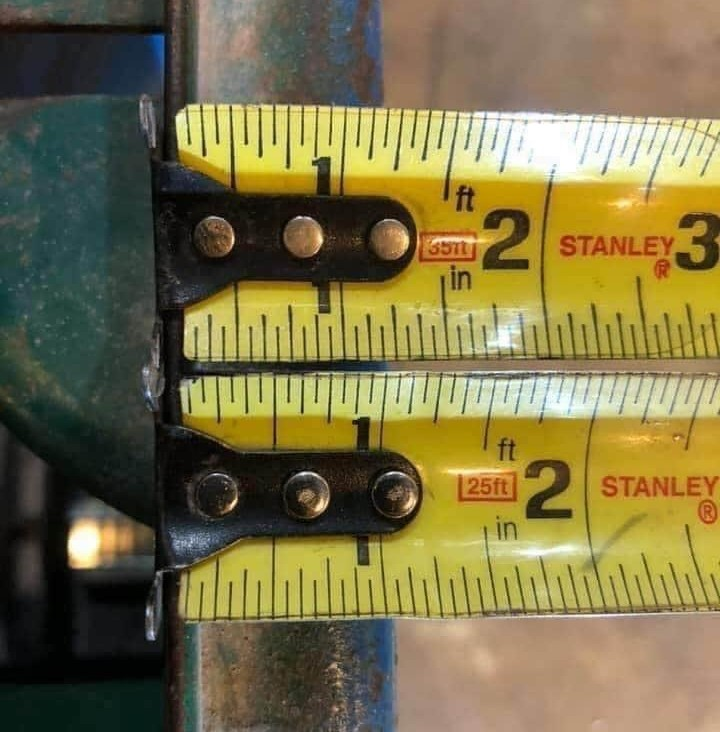
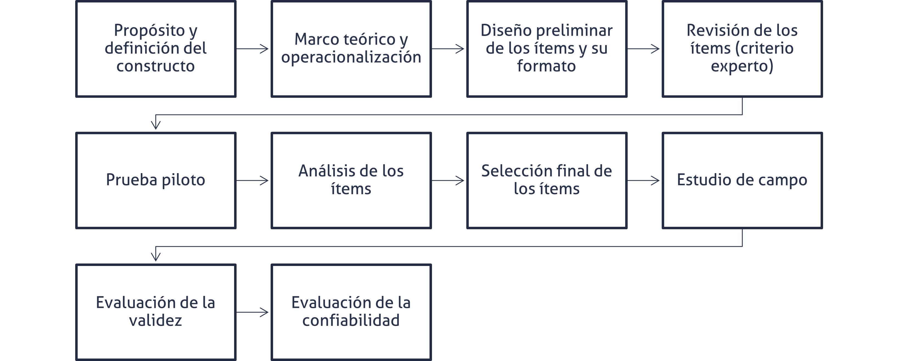
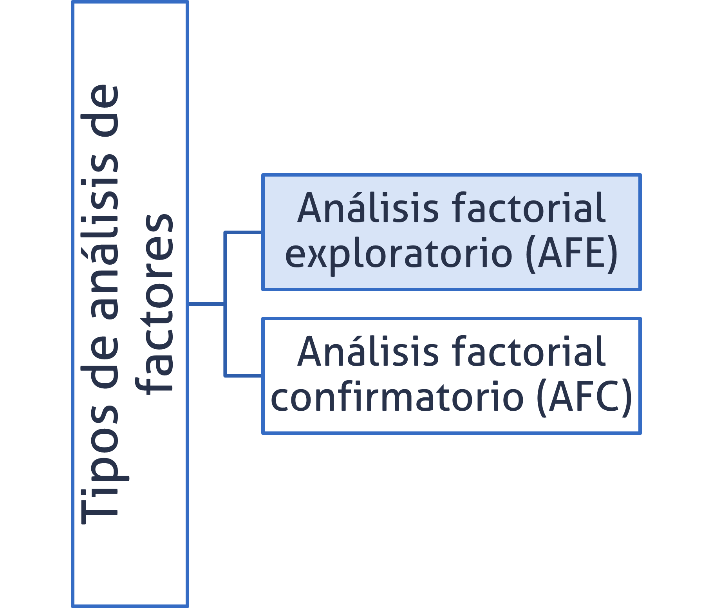
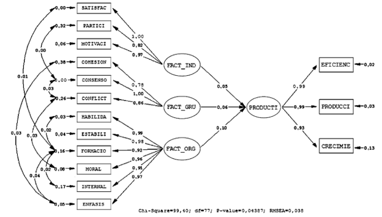

```{r}

library(tidyverse)

```

## Agenda {.bloques}

* Preguntas generadoras
* Introducción
  * Concepto de test
  * Concepto de constructo
* Diseño de instrumentos
  * Validez y fiabilidad
* Análisis Factorial Exploratorio (AFE)
* Mención a otras técnicas avanzadas

## Preguntas generadoras {.bloques}

* ¿Todas las variables se pueden medir directamente? 
  * ¿Cómo mediría la satisfacción?
* ¿Qué es un test? 
* ¿Cómo se debe construir y validar un test? 
* ¿Qué es un constructo?
* ¿Qué es fiabilidad?
* ¿Para qué sirve el análisis factorial exploratorio?

# Introducción y motivación {.bloques}

## ¿Para qué estudiar psicometría? {.bloques}

* No todas las mediciones que se realizan son de variables que se pueden medir directamente (observación o experimento).

* Más bien, son [constructos]{.hi} o [variables latentes]{.hi} que se generan a partir de variables que sí se pueden medir de forma más directa. 

* Por ejemplo, preguntar de forma directa a una persona: 
  * ¿Cuál es su grado de [satisfacción]{.hi} respecto al servicio que acaba de recibir? 

* Esto puede resultar en una medición imprecisa, pues la pregunta es relativamente *abstracta*. 
  * ¿Qué es satisfacción? ¿Cómo lo entiende cada persona? ¿Qué es lo que yo, como persona interesada en la recolección del dato, quiero que entiendan por satisfacción?

## Premisa {.bloques}

* Durante todo este curso se ha trabajado bajo esta premisa: 

* Los datos se clasifican por niveles de medición y tipo de variable. Estos rigen los cálculos que se llevan a cabo con el fin de resumir y presentar los datos. 

  * Es decir, que [no todos los tipos de datos se analizan igual]{.hi}. 

* Esta parte del curso no es la excepción, pues nos dedicaremos a estudiar técnicas para medir variables abstractas o latentes, aquellas que no se pueden medir directamente con instrumentos físicos convencionales: regla, balanza, etc. 
* Más bien, se deben formular preguntas para aproximar constructos como la satisfacción, el sabor percibido de un producto o la calidad percibida.

## Psicometría {.bloques}

* La psicometría es una disciplina que se enfoca en la medición de aspectos psicológicos y de constructos latentes en general, pero sus herramientas y métodos pueden aplicarse a diversas áreas, incluyendo la ingeniería industrial y la mecánica.

## Dinámica 01 {.bloques}

* Materiales:
  * Los requeridos para hacer un dibujo: lápiz, papel, tablet, etc

* Actividad:
  
  * Imagínese una grieta en una pared. 

  * Ahora dibújela, ¡No la muestre!, una vez se le indique compárela con la de sus compañeros.
  
  * ¿Cómo son las grietas de los demás respecto a la suya?
  
## Dinámica 01 {.bloques}

* Las grietas son diferentes ¿no?
  * El proceso psicológico involucrado está relacionado con la *imaginación* y la *memoria*.
  * Cada persona tiene un recuerdo de una grieta que es diferente al de otra persona, por eso, cada uno de ustedes respondió de manera diferente.

* Reflexión
  * ¿Qué creen que hace falta para que las grietas no difieran tanto?

## Dinámica 02 {.bloques}

* Responda y socialice
  * Con sus propias palabras ¿Qué es satisfacción?
    * No busque en Google, no use IA, responda por su cuenta. 


* En un servicio de alimentación, 
  * ¿Qué toma en cuenta para evaluar su satisfacción? 

* Tres o cuatro personas, ¿pueden compartir sus respuestas? ¿Son similares? 

## Psicometría {.bloques}

* Construyamos una analogía: 

* ¿Consideraría prudente medir una característica dimensional con una tolerancia de $\pm 0.005 \text{ mm}$ con una regla escolar? ¿Puedo tomar decisiones válidas para la mejora con estos datos?

* ¿Pesarían un compuesto activo de algún medicamento, que, si contiene menos cantidad, podría no curar a la persona y, si contiene más, podría perjudicarla, con la misma balanza con la que se pesan las frutas y verduras en la feria del agricultor?

* Entonces, ¿es correcto medir la satisfacción del cliente respecto a un nuevo producto con un instrumento no validado (o incorrecto)? 
  * No, ¿verdad?


## Psicometría {.bloques}

:::::: {.columns}

::: {.column}

* Medir constructos con instrumentos no validados (o desconociendo la idea del constructo) es similar a medir una variable dimensional con los instrumentos mostrados a la derecha, donde cada cinta métrica marca un valor distinto.

* Recuerde que en muestreo aprendió que la representatividad no solo está dada por un tamaño de muestra adecuado, sino también por la precisión y exactitud con la que se captura el dato. 

:::

::: {.column .img-fit width="45%"}



:::

::::::

## Ejemplo {.bloques}

* Supongamos que se quiere medir la **satisfacción laboral** de los empleados. Para ello, se utiliza un cuestionario psicométrico validado científicamente, como el [Job Satisfaction Survey (JSS)]{.hi}, que está diseñado específicamente para medir este constructo.

* Este instrumento proporcionará datos confiables y válidos, lo que permitirá identificar áreas de mejora en el ambiente laboral y tomar decisiones basadas en evidencia.

* Si en lugar de usar un cuestionario validado, se decide medir la satisfacción laboral con una pregunta abierta como: ["¿Te gusta tu trabajo?"]{.hi}, los resultados serán subjetivos y difíciles de cuantificar. Además, no se podrá comparar respuestas de manera consistente ni generalizar los resultados.

## Psicometría {.bloques}

* Usar herramientas incorrectas en psicometría puede llevar a conclusiones equivocadas, similar a cómo usar una regla para medir dimensiones del orden de micras puede resultar en piezas defectuosas.

  * No solo usar el instrumento incorrecto, en ocasiones se utiliza el adecuado pero de forma inapropiada. 

* La psicometría, al igual que la metrología en ingeniería, requiere de instrumentos específicos, validados y confiables para medir constructos complejos (ej.: satisfacción, motivación, calidad percibida).

## ¿Qué puedo medir con psicometría? {.bloques}

:::::: {.columns}

::: {.column}

1. Satisfacción del cliente
2. Fidelidad del cliente
3. Profesionalismo
4. Percepción de la calidad
5. Clima organizacional 
6. Estrés laboral
7. Innovación y creatividad


:::


::: {.column}

8. Percepción ante un nuevo producto diseñado
9. Ergonomía cognitiva/carga mental
10. Percepción de liderazgo
11. Seguridad y bienestar laboral
12. Sostenibilidad y comportamiento del consumidor
13. Conciencia ambiental de los colaboradores
14. Resistencia al cambio


:::

::::::

# Concepto de test {.bloques}

## ¿Qué es un test? {.bloques}

* Es un medio que permite generar puntuaciones en una escala numérica para representar una variable o constructo.

* Un test es un [instrumento evaluativo]{.hi} o procedimiento en el que se obtiene una muestra de la conducta de los examinados en un dominio especificado y posteriormente es evaluada y puntuada usando un procedimiento estandarizado.

* Es también llamado instrumento de medición. Los puntajes generados por un instrumento pueden estar en cualquiera de los niveles de medición: nominal, ordinal, intervalo, razón.

* A modo de analogía:
  * En metrología se puede ilustrar este concepto con una cinta métrica y una balanza, que se usan para aproximar los “constructos” de longitud y masa. 
    * Note que lo que se construye aquí es una analogía, longitud y masa NO son constructos.

## Ejemplos de test {.bloques}

:::::: {.columns}

::: {.column}

* Un test puede ser: 

  * Una prueba (examen, quiz, entre otros)
  * Pruebas estandarizadas, como la Prueba de Aptitud Académica (PAA) de ingreso a la UCR
  * Una encuesta
  * Test de manchas de tinta de [Rorschach](https://es.wikipedia.org/wiki/Test_de_Rorschach){target="_blank"}

:::

::: {.column .img-fit}


:::

::::::

## Test {.bloques}

* El test se [construye con una finalidad u objetivo de medida]{.bloques}, normalmente definido a través de un constructo.

* En general, el azar, en forma de error aleatorio, juega un papel importante en estas mediciones numéricas y por ende, el proceso de medición se convierte en un proceso inferencial.


# Concepto de constructo {.bloques}

## Constructo {.bloques}

* Es una conceptualización que requiere de un [marco teórico]{.hi} para ser definido y operacionalizado. 

* En general, las conceptualizaciones que estudian los investigadores científicos presentan la característica de que no existe un claro consenso a nivel social en cuanto a [cómo definirlos o  medirlos]{.hi}, sino que para lograrlo se debe contar con una teoría que los sustente.

* Los constructos [NO son directamente observables]{.hi} y su captura a nivel empírico requiere generalmente de rigurosos procedimientos. 

* Ejemplos: calidad de vida, inteligencia, educación, actitud hacia un tema, aptitud académica.

## Operacionalización de un constructo {.bloques}

* Significa traducir una idea abstracta como “ansiedad”, “satisfacción”, “carga mental”, etc., en una serie de acciones observables y medibles que nos permitan evaluarla empíricamente.

* Un constructo se operacionaliza a través de indicadores:
  * Edad -> Número de años cumplidos
  * Aptitud académica -> Puntaje en una prueba estandarizada

## Escalas {.bloques}

* Es una medida compuesta, pero solo relaciona variables de la misma naturaleza y, por lo general, se usa para medir constructos complejos como actitudes, valores, habilidades intelectuales y rasgos de personalidad. 

* En la escala está más claramente definido el constructo y trata de medir ese constructo teórico.

* En las escalas, generalmente, todos los ítems o reactivos tienen el mismo peso y están respondidos con el mismo tipo de categorías. 

  * Dicotómicas y politómicas
  * Ordinales tipo Likert de frecuencia, de grado de acuerdo

* Las escalas permiten asignar valores numéricos a las respuestas de las personas, lo que facilita su análisis estadístico y la comparación entre personas o grupos.

## Constructo {.bloques}

::: {.iframe-card}
<iframe data-src="diagramas/operacionalizacion.html" title="Operacionalización de un constructo"></iframe>
:::

## Ejemplo {.bloques}

:::::: {.columns}

::: {.column}

Los constructos son también conocidos como variables latentes. Este es un ejemplo de un TFG de la Escuela de Ingeniería Industrial de la Universidad de Costa Rica; en el que el constructo "Calidad de entrega" está siendo medido mediante cuatro ítems que componen una escala.

:::

::: {.column .iframe-card width="50%"}
<iframe data-src="diagramas/alpiste_TFG.html" title="Operacionalización de un constructo"></iframe>
:::

::::::

## Instrumentos de medición {.bloques}

* Es común encontrar diferencias en sus resultados al medir el mismo fenómeno en función de la metodología de medición, orden de las preguntas, forma en que se pregunta, metodología de muestreo, tamaño de muestra, entre otros.

* La correcta construcción de un test es un fenómeno multicausal (y que puede interactuar). Por ejemplo:

  * Se obtienen menos respuestas al preguntar directamente por el salario de una persona en lugar de opciones con rangos salariales.
  * Se obtienen más respuestas cuando las preguntas controvertidas (aborto, eutanasia, etc.) se hacen al final.
  * Puede haber diferencias en las respuestas si el cuestionario es autoadministrado, administrado vía telefónica o presencialmente.
  * Si el cuestionario es largo, se suelen obtener respuestas “aleatorias”.

## Algunos consejos {.bloques}

* [Evitar ítems dobles o compuestos]{.hi}
  * Es un error combinar dos variables en una misma pregunta
    * ¿Qué tan satisfecho está con el producto y el servicio?

* [Cuidar la carga cognitiva]{.hi}
  * Se deben hacer preguntas que sean directas y sencillas. 
    * Mal: “¿En qué medida considera que su experiencia profesional previa ha contribuido a desarrollar habilidades analíticas transferibles a contextos laborales diversos?”
    * Bien: ¿Qué tanto ha desarrollado sus habilidades analíticas en trabajos anteriores?

## Algunos consejos {.bloques}

* [Evocar el proceso psicológico correcto]{.hi}
  * ¿Qué proceso mental se quiere activar?
    * Memoria: “¿Con qué frecuencia en el último mes ha sentido...?”
    * Juicio: “¿Qué tan de acuerdo está con esta afirmación?”
    * Percepción actual: “¿Cómo calificaría su nivel de estrés hoy?”
    * Actitud: “¿Qué tan importante le parece...?”

* [Evitar sesgos por redacción emocional]{.hi}
  * Mal:“¿Qué tan frustrante fue el proceso de registro?”
  * Bien: “¿Qué tan fácil o difícil le resultó el proceso de registro?”
  
## Algunos consejos {.bloques}

* [Cuidar la deseabilidad social]{.hi}
  * Algunos temas pueden ser sensibles y hacer sentir a las personas juzgadas (religión, política, salud mental, admitir errores, etc)
    * Mal: “¿Cometió errores al utilizar el algoritmo?”
    * Bien: “¿Con qué frecuencia aparecen errores al implementar el algoritmo?”

* [Evitar escalas poco claras]{.hi}
  * Conviene utilizar escalas que tengan anclajes claros y bien definidos, por ejemplo, de 1 = nada satisfecho a 5 = muy satisfecho
  * Evite escalas demasiado amplias, por ejemplo de 1 al 10. Para las personas puede ser complicado discernir entre una calificación de 6 y 7, por ejemplo. 
    * En algunos contextos puede ser deseable usar escalas amplias. 

## Algunos consejos {.bloques}

* [Especificar el marco temporal]{.hi}
  * Evitar generalidades
    * Mal: ¿Con qué frecuencia ocurre un error?”
    * Bien: En el último mes, ¿cuántas veces ocurrió un error?”

* [Hacer pruebas piloto]{.hi}
  * Antes de lanzar una encuesta, pruebe las preguntas con otras personas y pida que expliquen cómo las entienden.

## Algunos consejos {.bloques}

* [Sesgo de Aquiescencia]{.hi}
  * A veces se redactan preguntas en negativo para evitar que el encuestado responda "todo 5" sin leer. Esto es muy común en encuestas de clima organizacional.

# Sobre los instrumentos {.bloques}

## Modo de aplicación del instrumento {.bloques}

:::::: {.columns}

::: {.column style="font-size: 0.9em;"}

| Modo | Características | Ejemplo |
| :--- | :--- | :--- |
| **Autoadministrado** | El participante responde por su cuenta (papel, computadora, online). | Encuesta online sobre clima laboral. |
| **Entrevista (presencial o remota)** | Un entrevistador lee las preguntas y registra las respuestas. | Estudio sobre toma de decisiones con preguntas abiertas. |
| **Observación** | El evaluador registra comportamientos o eventos. | Conteo de errores al operar una máquina. |
| **Mixto** | Combinación (ej., prueba + entrevista). | Test técnico con fase de reflexión posterior. |

:::

::::::

## ¿Cómo afecta? {.bloques}

:::::: {.columns}

::: {.column style="font-size: 0.9em;"}

| Efecto | ¿Qué lo causa? | Consecuencia |
| :--- | :--- | :--- |
| **Deseabilidad social** | Presencia de un entrevistador o entorno observado. | Las personas responden lo "socialmente correcto". |
| **Mayor honestidad** | En formato autoadministrado y anónimo. | Más confiabilidad en ítems sensibles (salud, errores, actitudes). |
| **Cognición compartida** | En entrevistas, el evaluador puede aclarar dudas. | Menos errores de interpretación, pero riesgo de sesgo del entrevistador. |
| **Fatiga** | En autoadministrados largos. | Disminuye la calidad de las respuestas hacia el final. |
| **Presión de tiempo o estrés** | En evaluaciones cronometradas o presenciales. | Afecta constructos relacionados con rendimiento o emoción. |

:::

::::::

## Construcción de instrumentos {.bloques}

:::::: {.columns}

::: {.column .img-fit width="100%"}



:::

::::::

## Instrumentos de medición {.bloques}

* Aunque el constructo es la meta del instrumento de medición, es también el iniciador de todo el proceso, que es la teoría del constructo al que establece la selección de las tareas (ítems o reactivos).

* Las dos propiedades fundamentales de una “buena“ medición son la [validez]{.hi} y la [confiabilidad]{.hi}.

## Validez {.bloques}

* Es un proceso continuo, nunca acaba. Trata del grado en que el uso que pretendemos hacer de las puntuaciones está justificado. Es pues un “proceso que nos proporciona información acerca del grado en que la evidencia y la teoría apoyan las  interpretaciones y usos de las puntuaciones en los tests”.

* Se centra en el uso y la interpretación que hagamos de las puntuaciones que se deriven de ese instrumento. Tratar de buscar cuales son esas evidencias o procesos que nos ayudan a decir que esas puntuaciones pueden ser usadas o ser interpretadas de cierta forma. 

## Evidencias de validez {.bloques}

:::::: {.columns}

::: {.column width="27%"}

### [Contenido]{.hi}

Responda a las inquietudes de ¿qué se quiere medir? ¿hay contenido irrelevante?

Por ejemplo, si en una pregunta que pretende medir conocimiento matemático, se presenta con mucho texto. Esto se conoce como Varianza irrelevante al constructo.


:::

::: {.column width="27%"}

### [Relaciones con otras variables]{.hi}

Son evidencias predictivas, por ejemplo, si a nivel teórico se espera que la motivación sea una variable que se asocia con el rendimiento laboral.


:::

::: {.column width="46%"} 

### [De constructo]{.hi}

Se intentan capturar a través de: 

**Procesos de respuesta**: cuando las personas expresan los procesos utilizados para llegar a la respuesta, lo que permite identificar si la intención de la pregunta o si la redacción está bien elaborada

**Estructura interna**: si un instrumento es de varias dimensiones, entonces la estructura debería reflejarse de esa forma. Como parte de la estructura interna se va a realizar AFE y AFC (o SEM según sea necesario).


:::

::::::

## Confiabilidad {.bloques}

* Es una **condición necesaria pero no suficiente para la validez**. Es decir, si el instrumento exhibe un grado aceptable de validez ello implica que también debe poseer un grado aceptable de confiablidad. 

* Sin embargo, lo opuesto no es cierto. Es decir, un instrumento que exhibe un alto nivel de confiabilidad no necesariamente es válido. Esto porque [puede estar midiendo con alta precisión y consistencia, pero sin garantía de que lo medido sea el constructo de interés]{.hi}.

* Entre los indicadores de confiabilidad que se usan con más frecuencia en psicometría está el **Alfa de Cronbach**.

## Confiabilidad {.bloques}

:::::: {.columns}

::: {.column width="55%"}

* Cuando se utiliza un instrumento para medir, ya sean variables físicas o psicométricas, la medida resultante [SIEMPRE]{.ul} está afectada por un error aleatorio. 

* Si medimos varias veces con el mismo instrumento a los mismos sujetos y obtenemos mucha variabilidad se estaría evidenciando una falta de fiabilidad en el instrumento. 

* A la derecha puede observar un sonómetro de los Laboratorios de Docencia de la Ingeniería Industrial sede RRF, el cual está dañado y por ello no da una medición estable.  

:::

::: {.column .img-fit width="45%"}



:::

::::::

## Confiabilidad {.bloques}

* Ahora bien, fiabilidad se define como la tendencia a la consistencia de un conjunto de medidas. 

* Desde luego, en psicometría el problema de la consistencia es más complejo que en la medición de variables físicas.


## Alfa de Cronbach {.bloques}

* Pronúnciese Kron-bak

* Mide la precisión de la prueba en términos del grado de consistencia interna del instrumento y apunta hacia el grado de estabilidad de los puntajes. 

* Estima qué proporción de la variabilidad observada en los puntajes corresponde a varianza verdadera, es decir, varianza debida a diferencias en el constructo que se desea medir. 

* Su valor máximo es 1 y cuanto más grande sea, mejor.

## Alfa de Cronbach {.bloques}

:::::: {.columns}

::: {.column}

$$\alpha = \frac{k}{k-1} \cdot \left( 1 - \frac{\sum \sigma_i^2}{\sigma_y^2} \right)$$

* Dónde: 

  * $k$ es el número de ítems
  
  * $\sum \sigma_i^2$  es la sumatoria de las varianzas individuales de los ítems
  
  * $\sigma_y^2$ es la varianza de la sumatotal de los puntales

  * Si un test es muy largo, el $\alpha$ tiende a subir artificialmente. Un test de 50 preguntas siempre parecerá más "confiable" que uno de 5, aunque sea de mala calidad.

:::

::: {.column}

### Valores de referencia

| Alfa de Cronbach ($\alpha$) | Consistencia interna |
| :--- | :--- |
| $\alpha \geq 0.9$ | Excelente |
| $0.9 > \alpha \geq 0.8$ | Buena |
| $0.8 > \alpha \geq 0.7$ | Aceptable |
| $0.7 > \alpha \geq 0.6$ | Cuestionable |
| $0.6 > \alpha \geq 0.5$ | Pobre |
| $\alpha < 0.5$ | Inaceptable |

:::

::::::

## Alfa de Cronbach {.bloques}

* Algunos software como Jamovi y R pueden utilizar otras fórmulas para el cálculo de $\alpha$. Por lo que podría obtener valores ligeramente diferentes.

* Se le provee un [Excel](https://stevenggoni.github.io/clases/data/II-1120_08_Alfa Cronbach.xlsx) con un ejemplo de cálculo.

* Importante: 
  * Para aplicar Alfa de Cronbach es un requisito que haya [unidimensionalidad]{.hi}. Alfa de Cronbach no prueba que el test mida una sola cosa, sino que asume que lo hace.
  
* Para probar la unidimensionalidad se va a aplicar el [Análisis Factorial Exploratorio (AFE)]{.hi}.
  
## ¿Qué no hacer? {.bloques}

* Un instrumento de medición puede incluir variables directamente observables como el sexo, la edad, curso lectivo, cantidad de créditos, puesto de trabajo, etc. 

* No se debe obtener una medida de fiabilidad de estas variables

* Cuando los ítems sean la operacionalización de un constructo
  * No se debe aplicar e interpretar los puntajes del instrumento de medición sin haber garantizado su validez y confiabilidad.
  
  * No se deben realizar interpretaciones sustantivas de cada ítem individualmente (de las preguntas indivuales, por ejemplo).

## ¿Qué si puedo hacer? {.bloques}

* Si algún ítem o reactivo no aporta a la escala, puedo eliminarlo para mejorar la confiabilidad de la misma. 
* Por ejemplo, hago 5 preguntas y obtengo un valor de 𝛼=0.81, pero si quito la pregunta 3, el valor subiría a 𝛼=0.85.
  * Esto sería un indicativo de que la pregunta 3 no debería formar parte de la escala y que conviene eliminarla (o replantearla). Siempre respaldado desde la teoría

# Análisis Factorial Exploratorio (AFE) {.bloques}

## Análisis de Factores {.bloques}

* Quizá se pregunte por qué vimos correlaciones antes de este tema
  * El análisis de factores es una técnica de estadística multivariada de reducción de datos, que pretende simplificar la información a partir de correlaciones. 

* ¿Por qué unas variables se relacionan más entre si y menos con otras? 

  * Pues porque existen otras variables (constructos) que los relacionan. 

* Con esta técnica se puede representar un conjunto de variables cuantitativas observadas por un número más pequeño de variables hipotéticas, llamadas dimensiones o factores o constructos. 

* Lo que vamos a intentar es buscar cuáles son los grupos de ítems (constructos) que se podrían generar a partir de los valores de esos ítems.
  * Preguntas y respuestas en el caso de una encuesta, por ejemplo.


## Análisis de factores {.bloques}

:::::: {.columns}

::: {.column .img-fit width = "40%"}



:::

::: {.column}

* La elección entre estas técnicas depende del desarrollo teórico del tema investigado y del conocimiento que se tiene de la temática.

* Dado que en este curso este tema es introductorio, nos vamos a centrar el AFE. 


:::

::::::

## AFE {.bloques}

:::::: {.columns}

::: {.column}

* Se emplea cuando no se tienen hipótesis sobre el número de dimensiones subyacentes que poseen los datos recolectados. 

* La técnica podría utilizarse para determinar el número mínimo de factores que puede explicar la covariación observada en las variables.

* La base del análisis factorial exploratorio es un sistema de ecuaciones que se tendría que resolver para poder determinar cuáles son los parámetros que hacen que un indicador o un ítem pertenezca a uno u otro grupo.

:::

::: {.column}

$$
\begin{aligned}
X_1 &= \lambda_{11}F_1 + \lambda_{12}F_2 + \dots + \lambda_{1m}F_m + \varepsilon_1 \\
X_2 &= \lambda_{21}F_1 + \lambda_{22}F_2 + \dots + \lambda_{2m}F_m + \varepsilon_2 \\
X_p &= \lambda_{p1}F_1 + \lambda_{p2}F_2 + \dots + \lambda_{pm}F_m + \varepsilon_p
\end{aligned}
$$

$$X = LF + \varepsilon$$

$\lambda$ se llama carga factorial.

Por la "dificultad" de las ecuaciones, en este curso se aborda este tema con el uso de software. 

:::

::::::

## Carga factorial {.bloques}

:::::: {.columns}

::: {.column}

* Es un coeficiente que representa la correlación entre una variable observada (ítem) y un factor latente (constructo subyacente no observado).

* Es un número que indica [cuánto contribuye]{.hi} una variable a un factor específico. Se interpreta como la fuerza y dirección de la relación entre el ítem y el factor.


:::

::: {.column}

| Carga factorial | Interpretación |
| :--- | :--- |
| $\geq 0.70$ | Muy fuerte |
| $0.50 - 0.69$ | Fuerte |
| $0.30 - 0.49$ | Moderada |
| $< 0.30$ | Débil o irrelevante |

:::

::::::

## Objetivo del AFE {.bloques}

* Agrupar los ítems en distintos grupos de manera que cada grupo refleje un factor y que a su vez ese factor sea el representante de un constructo teórico o variable latente teórica objetivo del instrumento.

* Cálculo de índices o variables compuestas que pueden usarse como parte de otras técnicas de análisis de datos. 

## Cálculo de índices {.bloques}

* Suponga que luego de realizar el análisis se obtienen los siguientes resultados para el constructo particular: 

  * Ítem 1: $\lambda_1 = 0.80$
  * Ítem 2: $\lambda_2 = 0.87$
  * Ítem 3: $\lambda_3 = 0.86$
  
* Para construir el índice, se multiplican las respuestas o valores a los ítemes, utilizando las cargas factoriales como pesos, de tal forma que: 

* $$Índice_i = \frac{(It_{1,i} \cdot 0.80) + (It_{2,i} \cdot 0.87) + (It_{3,i} \cdot 0.86)}{0.80 + 0.87 + 0.86}$$

## Cálculo de índices {.bloques}

:::::: {.columns}

::: {.column}

* De tal forma que se obtendría resultados como los que se muestran en la tabla a la derecha. 

* Con este índice se podrían responder inquietudes como: ¿el constructo [basado en el índice] es mayor en las mujeres que en los hombres? 

* Si el constructo fuera "Fatiga visual" se podría responder: ¿la fatiga visual es mayor cuando las videollamadas se realizan desde un celular?

:::

::: {.column}

| Encuestado | $It_1$ | $It_2$ | $It_3$ | Índice |
| :---: | :---: | :---: | :---: | :---: |
| **1** | 4 | 5 | 4 | 4.34 |
| **2** | 3 | 4 | 3 | 3.34 |
| **3** | 4 | 5 | 4 | 4.34 |
| **4** | 5 | 5 | 4 | 4.66 |
| **5** | 3 | 3 | 3 | 3.00 |
| ... | ... | ... | ... | ... |
| ... | ... | ... | ... | ... |

:::

::::::

## Kaiser-Meyer-Olkin (KMO) {.bloques}

:::::: {.columns}

::: {.column}

### Valores de referencia para KMO

| Valor KMO | Interpretación |
| :--- | :--- |
| $KMO \geq 0.9$ | Muy bueno |
| $0.9 > KMO \geq 0.8$ | Bueno |
| $0.8 > KMO \geq 0.7$ | Mediano |
| $0.7 > KMO \geq 0.6$ | Mediocre |
| $0.6 > KMO \geq 0.5$ | Bajo |
| $KMO < 0.5$ | Muy bajo |

:::

::: {.column}

* El índice de Kaiser-Meyer-Olkin (KMO) es una medida estadística que se utiliza en el análisis factorial para determinar la adecuación de los datos para este análisis.

* En resumen, es un índice que ayuda a determinar si los datos son adecuados para aplicar AFE. Se sugieren valores mayores a 0.8, pero se puede trabajar con valores mayores a 0.6


:::

::::::

## Aplicaciones avanzadas {.bloques}

:::::: {.columns}

::: {.column width="40%"}

* Además del AFE, existe en AFC (Confirmatorio en lugar de exploratorio).

* Por otro lado tenemos el SEM (Modelo de Ecuaciones Estructurales), por ejemplo, al unir muchos AFC podemos estimar las relaciones entre ellos. 
  * Este tipo de modelos no se abarcan en el curso, pero se ha detectado su mención en algunos cursos y su uso en TFG. 

:::

::: {.column .img-fit width="60%"}



:::

::::::

## Ejercicio integrador {.bloques}

:::::: {.columns}

::: {.column width="12%"}

* Se le hace entrega de un ejemplo en formato video, así como el [conjunto de datos](https://stevenggoni.github.io/clases/data/II-1120_08_Ejercicio integrador.xlsx) empleado.

:::

::: {.column .img-fit}



:::

::::::

## Bibliografía {.bloques}

:::: columns
::: {.column width="100%" style="font-size: 1.2em;"}

* Montero, E. (2008). Escalas o índices para la medición de constructos: El dilema del analista de datos. Avances en Medicición, 6, 15-24.
* Montero, E. (2013). Referentes conceptuales y metodológicos sobre la noción moderna de validez de instrumentos de medición: implicaciones para el caso de personas con necesidades educativas especiales. Actualidades en Psicología, 27, 114.
* Martínez, M., Hernández, M. & Hernández, M. (2006). Psicometría. Madrid. Alianza Editorial.
* Morales Vallejo, Pedro (2011). El Análisis Factorial en la construcción e interpretación de tests, escalas y cuestionarios.


:::
::::

## Elementos básicos de psicometría <br> II-1120 Estadística para Ingeniería Industrial I {.center}

### Gracias por su atención <br> Steven García Goñi<br>[steven.garciagoni\@ucr.ac.cr](mailto:steven.garciagoni@ucr.ac.cr) {.subtitle}

### Dudas o correcciones requeridas pueden solicitarse al correo