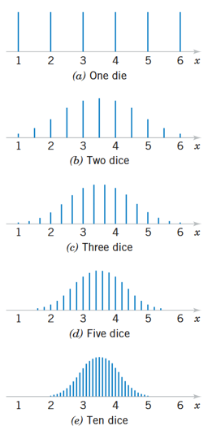

```{r}

library(tidyverse)

```

## Agenda {.bloques}

* Preguntas generadoras

* Introducción

* Distribuciones muestrales

* Ley de los grandes números

* Teorema del límite central (TLC)

* Resultados importantes

## Preguntas generadoras {.bloques}

* ¿Por qué es necesario muestrear?

* ¿Qué es el sesgo estadístico y cómo evitarlo?

* ¿Cuáles métodos de selección de muestra existen y cuándo se usan?

* ¿Qué es el error de muestreo y qué consecuencias prácticas tiene?

* ¿Qué es una distribución muestral?

* ¿Para qué es útil el TLC?

* ¿Qué ventajas y desventajas tiene el TLC?


## Introducción {.bloques}

* [¿Por qué muestrear?]{.hi}

* Los métodos estadísticos que son usados para tomar decisiones y arribar a conclusiones acerca de las [poblaciones]{.hi} son generalmente conocidos como [inferencia estadística]{.hi}. 

* En esta técnica se usa la información de una muestra para inferir dichas conclusiones. 

  * Esto desde luego implica que la calidad de la muestra impacta la calidad de las conclusiones.
  * Recuerde lo visto en [Fundamentos de muestreo y manejo de datos]{.hi}. 
  

## Introducción {.bloques}

::::: columns
::: {.column .img-fit}

{fig-align="center"}

:::
:::::

## Introducción {.bloques}

* La inferencia estadística se divide en dos grandes áreas: 
  
  * Estimación de parámetros
  
  * Pruebas de hipótesis. 

* Ambas nociones serán abordadas en otras lecciones, aunque la primera es una vieja conocida en esta área de conocimiento. Por ejemplo, el estimador: 

  * De la media $\mu$ es $\bar{X}$, 
  * De $\sigma$ es $S$
  * De $p$ es $\hat{P}$

## Introducción {.bloques}

* Los estadísticos como $\bar{X}$, $S$ y $\hat{P}$ (así como otros: $\hat{\Theta}$) son [variables aleatorias]{.hi}.

  * Como las que estudiamos previo, que dieron origen a las distribuciones de probabilidad.De ser necesario repase este concepto. 

* Estas son variables aleatorias porque dependen de la [muestreos]{.hi} que también son o deben ser [aleatorios]{.hi}. 


## Introducción {.bloques}

:::::: {.columns}

::: {.column style="text-align: center; font-size: 2em;"}

A la inferencia estadística le corresponde la toma de decisiones acerca de una población, basada en la información contenida en una [muestra aleatoria]{.hi} de esa población. 


:::

::::::

# Distribuciones muestrales {.bloques}

## Distribuciones muestrales {.bloques}

:::::: {.columns}

::: {.column}

* Supóngase que estamos interesados en la edad promedio (en años) de los estudiantes de este curso, pues ese dato es relevante para la toma de decisiones respecto a las actividades por planear.

* Los siguientes datos corresponden a la edad de las personas presentes en la primera sesión de laboratorio del curso en el I-S 2025 grupo 003 de RRF. 

  * A esto lo vamos a llamar la población. 

:::

::: {.column}

```{r}

edades <- data.frame(edad = c(19, 18, 18, 21, 20, 20, 22, 19, 
                              21, 19, 18, 21, 21, 20, 19, 19, 
                              20, 19, 19, 20, 18, 19, 19, 18, 19))

matrix(edades$edad, ncol = 5) |> 
  knitr::kable(format = "html", 
               escape = FALSE, 
               col.names = NULL) |> 
  kableExtra::kable_styling(full_width = FALSE,
                            bootstrap_options = c("bordered", "condensed"))

```


:::

::::::

## Distribuciones muestrales {.bloques}

:::::: {.columns}

::: {.column}

```{r}

hist <- edades |> 
  ggplot2::ggplot(aes(edad)) + 
  geom_histogram(bins = 5, 
                 fill = "#263247", 
                 color = "#C18A00") +
  labs(title = "", 
       y = "Frecuencia", 
       x = "Edades") + 
  theme_bw()

plotly::ggplotly(hist, width = 850, height = 500) %>% 
  plotly::layout(paper_bgcolor = "#F1F5F5",
                 plot_bgcolor  = "#F1F5F5",
                 font = list(size = 25),
                 xaxis = list(
                   title = list( font = list(size = 25)),
                   tickfont = list(size = 22)),
                 yaxis = list(title = list(font = list(size = 25)),
                              tickfont = list(size = 22)))

```

:::

::: {.column}

* Nótese cómo la población NO se parece a una distribución normal, por el contrario, se parece más a una lognormal.

* Tome en cuenta esto para el desarrollo del resto de la sección.

:::

::::::

## Distribuciones muestrales {.bloques}

* Cada valor numérico en los datos ([en este caso la edad]{.hi}) es el valor observado de una variable aleatoria.

* Al subconjunto de valores numéricos se le conoce como muestra aleatoria. 

  * Este es un supuesto [IMPORTANTE]{.hi}, puesto que si la muestra no es aleatoria los métodos estadísticos por estudiar pueden conducir a conclusiones erróneas. 

* El propósito de las muestras aleatorias es obtener información acerca de los parámetros desconocidos de la población. 

* La media de la población, por ejemplo, se puede estimar a partir de una muestra aleatoria. 

## Distribuciones muestrales {.bloques}

* Por tanto $\bar{X}$ es una función de los valores observados en la muestra aleatoria. 

* Entonces $\bar{X}$ es un valor que variaría de muestra a muestra, lo que lo convierte en una [variable aleatoria]{.hi} (como las que estudiamos antes).

* Esta variable aleatoria se llama estadístico
  * Un estadístico es una función de las observaciones en una muestra aleatoria. 

* Ya hemos trabajado con estadísticos antes, por ejemplo, en el tema de descripción de datos. 

* Entonces: 
  * [La distribución de probabilidad de un estadístico es llamado como distribución muestral]{.hi}. 

## Sigamos con el ejemplo de la edad {.bloques}

* Se van a extraer, aleatoriamente, 20 muestras de tamaño 4 y se van a calcular los estadísticos $\bar{X}$ y $S$.

* Cada uno de ellos, como variable aleatoria, va a seguir una distribución particular que vamos a averiguar paso a paso. 

## Simulador de muestreo aleatorio {.bloques}

::: iframe-card
<iframe 

src="diagramas/distribucion_muestral.html" frameborder="0">

</iframe>
:::

## Resumen {.bloques}

* Como acabamos de ver, tanto $\bar{X}$ como $S$ son variables aleatorias en función del muestreo. 

* Es decir, son distribuciones muestrales de la media y de la desviación respectivamente. 

* Las distribuciones muestrales suelen ser muy útiles para hacer inferencia estadística cuando: 

  * La población es demasiado grande, no es viable obtenerla toda. 

  * La distribución que siguen los datos originales, no es una distribución normal. 
    * Mucho de lo que vamos abordar depende del supuesto de normalidad de los datos. 

# Ley de los grandes números {.bloques}

## Ley de los grandes números {.bloques}

* La componen teoremas que describen el comportamiento de las medias de muestras de variables aleatorias. Asegura que en una sucesión de variables aleatorias independientes idénticamente distribuidas con varianza finita, al aumentar el número de ensayos, el promedio de estas converge a la esperanza (media teórica) de las variables involucradas.

* En otras palabras, este permite explicar también como a medida que aumenta el tamaño de la muestra, la media muestral $\bar{X}$ se aproxima a la media poblacional $\mu$.

* Se divide en dos:
  * Ley débil
    * En la que nos vamos a enfocar
    
  * Ley fuerte
  
## Ley débil {.bloques}

* Establece que se puede encontrar un tamaño de muestra $n$ que garantice con una probabilidad tan cercana a uno como se quiera, que el promedio que se obtendría en esa muestra no difiera del promedio poblacional en menos de una cantidad tan pequeña como se desee $\varepsilon$.

* $\lim_{n \to \infty} P\left(\vert{}\bar{X}_n - \mu\vert{} < \varepsilon\right) = 1$

* Usando la desigualdad de Chebyshev, podemos acotar esta probabilidad:

* $P\left(|\bar{X}_n - \mu| \ge \varepsilon\right) \le \frac{\sigma^2}{n \varepsilon^2}$

## Ejemplo {.bloques}

* Para una población con media desconocida y $\sigma=2$, determine el tamaño de muestra $n$ que garantice una probabilidad de al menos 0.95 de que la media muestral no se aleje de $\mu$ en más de 0.5 ($\varepsilon = 0.5$). 

* Aplicando la cota de Chebyshev:

  * $P\left(|\bar{X} - \mu| < 0.5\right) \ge 1 - \frac{\sigma^2}{n \varepsilon^2} \ge 0.95$

* Despejando $n$:

  * $n \ge \frac{\sigma^2}{(1 - 0.95) \cdot \varepsilon^2} = \frac{2^2}{0.05 \cdot 0.5^2} = 320$

## Ley fuerte {.bloques}

* La frecuencia relativa con que ocurre un hecho en pruebas independientes y en las mismas condiciones converge a la probabilidad del hecho observado con probabilidad 1. Su demostración excede el alcance del curso.

## Ley de los grandes números {.bloques}

* Consulte el siguiente [enlace](https://www.geogebra.org/m/edy5fexu ){target="_blank"}, propuesto por la profesora Inga. Valentina Campos Aguilar como medio de apoyo para comprender de mejor manera la ley de los grandes números. 

## Teorema del Límite Central (TLC) {.bloques}

* Es uno de los teoremas más útiles en el campo de la estadística. 

* La distribución normal se puede usar frecuentemente para aproximar las distribuciones de [otras variables aleatorias]{.hi}, como consecuencia del Teorema del Límite Central (TLC).

* El TLC dice, de [manera simplificada]{.hi}, que la distribución de las [medias muestrales]{.hi} (aleatorias e independientes) sigue una distribución normal, [siempre que el tamaño de las muestras sea lo suficientemente grande]{.ul}.

* [¿Qué es suficientemente grande?]{.hi} Muchos libros de texto enuncian que siempre que $n \ge 30$, no obstante, estudios relativamente “recientes” (de más de 15 años) dicen que $n$ depende de, entre otras cosas, de la [asimetría de la distribución]{.hi} que siguen los datos de la población. En resumen, a mayor asimetría, mayor tamaño de muestra es requerido.

* Consulte esta [infografía](https://stevenggoni.github.io/infografias/dogma_n_30.pdf){target="_blank"} para desmontar el mito del $n \ge 30$. 

## Teorema del Límite Central (TLC) {.bloques}

* El siguiente [enlace](https://rpubs.com/SGGoni){target="_blank"} contiene una serie de demostraciones computacionales que demuestran la dependencia del TLC de la asimetría. La línea rosada en los gráficos representa a partir de donde se considera que los datos siguen la distribución normal. 

* Note cómo a mayor asimetría, mayor tamaño de muestra se necesita para que se siga la distribución normal. 

* En resumen, tamaño de muestra pequeños ($n=4$ o $n=5$) funcionan bien en la mayoría de los casos, particularmente cuando la población es continua, unimodal y simétrica. 

* Tamaños de muestra grandes son requeridos en otras situaciones, dependiendo de la forma de la población.

## Teorema del Límite Central (TLC) {.bloques}

:::::: {.columns}

::: {.column width="60%"}

* Entonces, $n \ge 30$ es una recomendación si no se conoce la forma de la población, pues con este tamaño de muestra se cumpliría satisfactoriamente la aproximación a la normal en una gran mayoría de los casos. 

* Observe la siguiente [simulación](https://seeing-theory.brown.edu/probability-distributions/es.html#section3 
){target="_blank"}

* Cambie el tamaño muestral y note cómo la variabilidad de la distribución teórica varía, entre más grande, menos variabilidad

  * Nota: procure tener marcado el checkbox de “Distribución teórica”


:::

::: {.column .img-fit}



:::

::::::

## Teorema del Límite Central (TLC) {.bloques}

* En teoría, esa distribución muestral estará definida por la [misma media que la poblacional]{.hi} y con una desviación estándar igual al cociente entre la desviación estándar poblacional dividida por la raíz cuadrada del tamaño de muestra ($\sigma / \sqrt{n}$).

* Note de la fórmula que a mayor $n$, menor será la desviación de esta distribución normal

* $\bar{X} \sim N\left(\mu, \frac{\sigma}{\sqrt{n}}\right)$


## Teorema del Límite Central (TLC) {.bloques}

* Gracias al TLC, podemos acercarnos a conocer las características de la población, mediante la toma de muestras. 

* Por ejemplo, la estimación de la media es directa. 

* Para obtener la desviación se despeja la fórmula anterior.

* Finalmente

  * $Z = \frac{\bar{X}-\mu}{\frac{\sigma}{{\sqrt{n}}}}$
  
## Teorema del Límite Central (TLC) {.bloques}

* Formalmente:

* Si $X_1, X_2, \dots, X_n$ son variables aleatorias independientes e idénticamente distribuidas (i.i.d.) con media $\mu$ y varianza finita $\sigma^2$, entonces la distribución de la variable estandarizada $Z$ converge a una normal estándar $N(0,1)$ conforme $n \to \infty$:

* $Z = \frac{\bar{X} - \mu}{\sigma / \sqrt{n}} \xrightarrow{d} N(0,1)$

* Mientras más grande el valor de $n$, mejor es la aproximación.

* Repase esto con la simulación del muestreo de las edades. 

## Finalmente {.bloques}

* A partir de los datos de una muestra, se puede aproximar razonablemente el comportamiento de la población. 

* $\bar{X} \sim N\left(\mu, \frac{\sigma}{\sqrt{n}}\right)$

## Distribución muestral de la media ($\bar{X}$) {.bloques}

:::::: {.columns}

::: {.column style="font-size: 0.95em;"}

<div style="border: 1px solid #111; border-radius: 0px; overflow: hidden;">
<table style="width:100%; border-collapse: collapse; text-align: center; margin: 0;">
  <thead>
    <tr style="background-color: #f8f9fa;">
      <th style="padding: 12px; border-right: 1px solid #111; border-bottom: 2px solid #111; font-weight: bold; width: 30%;">Estadístico</th>
      <th style="padding: 12px; border-bottom: 2px solid #111; font-weight: bold;">Distribución muestral esperada</th>
    </tr>
  </thead>
  <tbody>
    <tr>
      <td style="padding: 24px; border-right: 1px solid #111; box-shadow: inset 0 -1px 0 #111; font-size: 1.4em;"><b>$\bar{X}$</b></td>
      <td style="padding: 24px; box-shadow: inset 0 -1px 0 #111;">
        <i style="color: #555;">Si la población es normal o la muestra suficientemente grande</i><br><br>
        <b style="font-size: 1.1em;">Distribución normal</b><br>
        $$\bar{X} \sim N\left(\mu, \frac{\sigma}{\sqrt{n}}\right)$$
      </td>
    </tr>
  </tbody>
</table>
</div>

:::

::::::

---

## Distribución muestral de la varianza ($S^2$) {.bloques}

:::::: {.columns}

::: {.column style="font-size: 0.85em;"}

<div style="border: 1px solid #111; border-radius: 0px; overflow: hidden;">
<table style="width:100%; border-collapse: collapse; text-align: center; margin: 0;">
  <thead>
    <tr style="background-color: #f8f9fa;">
      <th style="padding: 12px; border-right: 1px solid #111; border-bottom: 2px solid #111; font-weight: bold; width: 30%;">Estadístico</th>
      <th style="padding: 12px; border-bottom: 2px solid #111; font-weight: bold;">Distribución muestral esperada</th>
    </tr>
  </thead>
  <tbody>
    <tr>
      <td style="padding: 24px; border-right: 1px solid #111; box-shadow: inset 0 -1px 0 #111; font-size: 1.4em;"><b>$S^2$</b></td>
      <td style="padding: 20px; box-shadow: inset 0 -1px 0 #111;">
        <i style="color: #555;">Si la población es normal</i><br><br>
        <b>Si es una varianza</b><br>
        $$\frac{(n-1)S^2}{\sigma^2} \sim \chi^2_{n-1}$$<br>
        <b>Si son dos varianzas (bajo el supuesto de igualdad)</b><br>
        $$\frac{S_1^2 / \sigma_1^2}{S_2^2 / \sigma_2^2} \sim F_{(n_1-1, n_2-1)}$$
      </td>
    </tr>
  </tbody>
</table>
</div>


:::

::::::

---

## Distribución muestral de la proporción ($\hat{P}$) {.bloques}

:::::: {.columns}

::: {.column style="font-size: 0.95em;"}

<div style="border: 1px solid #111; border-radius: 0px; overflow: hidden;">
<table style="width:100%; border-collapse: collapse; text-align: center; margin: 0;">
  <thead>
    <tr style="background-color: #f8f9fa;">
      <th style="padding: 12px; border-right: 1px solid #111; border-bottom: 2px solid #111; font-weight: bold; width: 30%;">Estadístico</th>
      <th style="padding: 12px; border-bottom: 2px solid #111; font-weight: bold;">Distribución muestral esperada</th>
    </tr>
  </thead>
  <tbody>
    <tr>
      <td style="padding: 24px; border-right: 1px solid #111; box-shadow: inset 0 -1px 0 #111; font-size: 1.4em;"><b>$\hat{P}$</b></td>
      <td style="padding: 24px; box-shadow: inset 0 -1px 0 #111;">
        <i style="color: #555;">Siempre que $n \cdot p \ge 5$ y $n \cdot (1-p) \ge 5$</i><br><br>
        $$\hat{P} \sim N\left(p, \sqrt{\frac{p(1-p)}{n}}\right)$$
      </td>
    </tr>
  </tbody>
</table>
</div>

:::

::::::


## Bibliografía {.bloques}

:::: columns
::: {.column width="100%" style="font-size: 1.3em;"}

* Walpole, R.; Myers, R.; Myers, S. y Ye, K. Probabilidad y estadística para ingeniería y ciencias (9na Edición).
  * Capítulo 8

* Montgomery, D; Runger, G. Applied Statistics and Probability for Engineers (5th Edition)
  * **Capítulo 7.2**

:::
::::

## Distribuciones muestrales y TLC <br> II-1123 Estadística para Ingeniería Industrial II {.center}

### Gracias por su atención <br> Steven García Goñi<br>[steven.garciagoni\@ucr.ac.cr](mailto:steven.garciagoni@ucr.ac.cr) {.subtitle}

### Dudas o correcciones requeridas pueden solicitarse al correo
