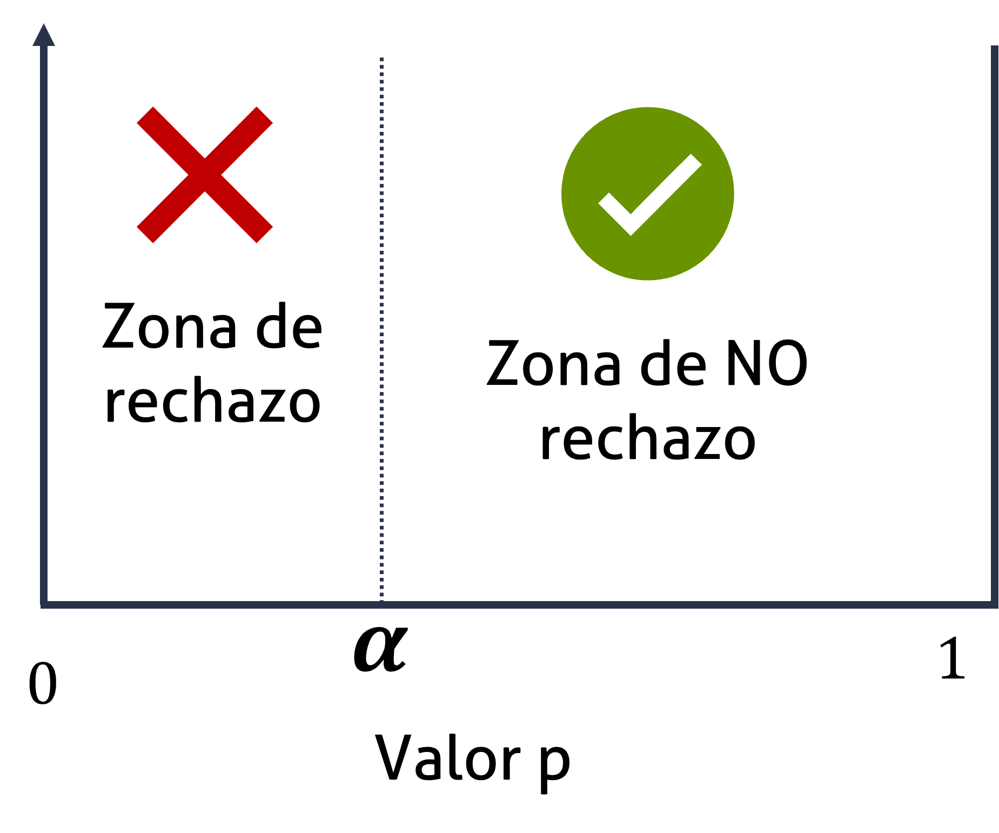
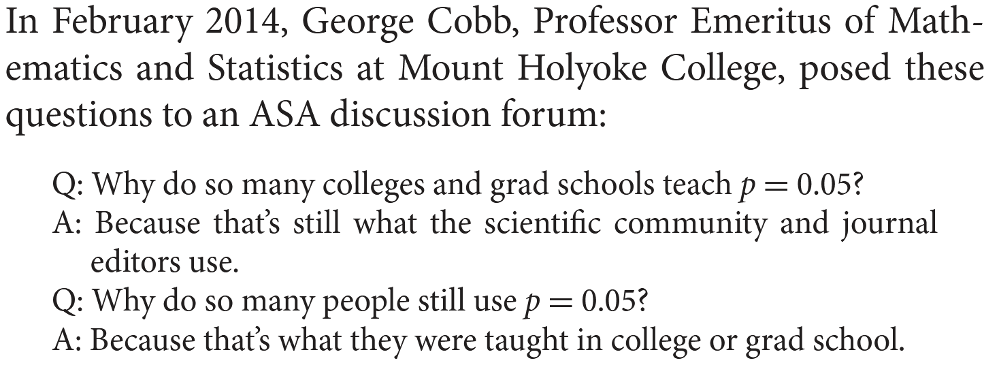
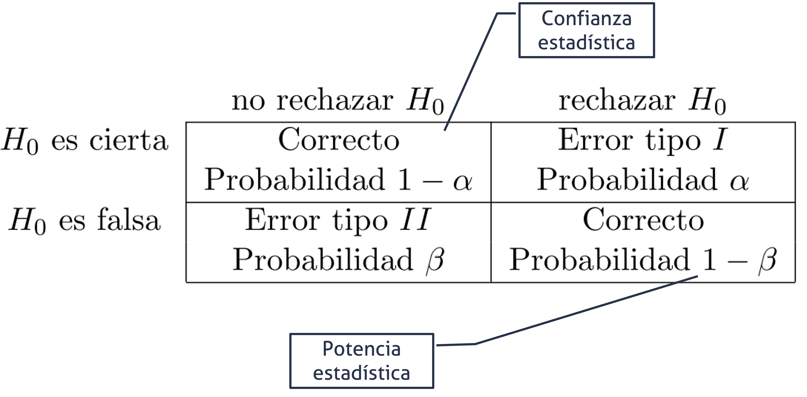
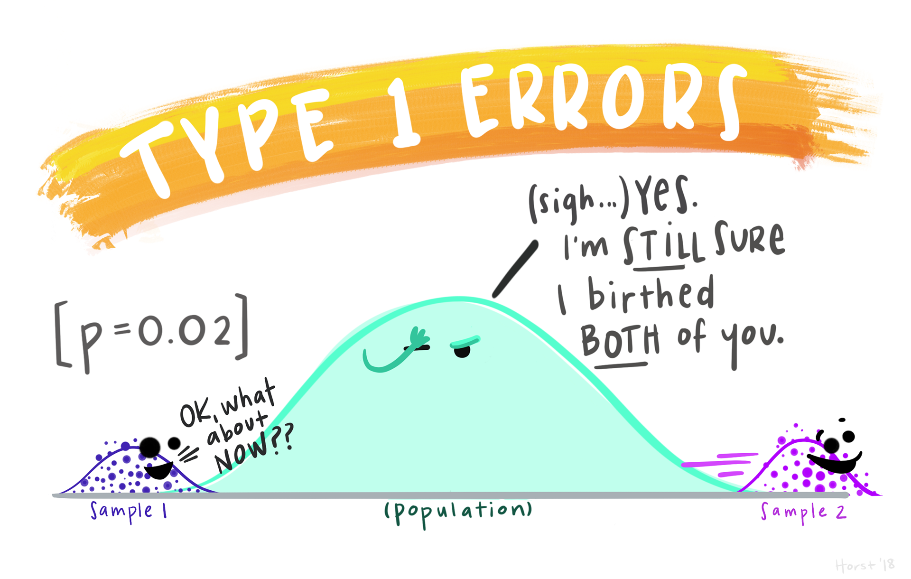
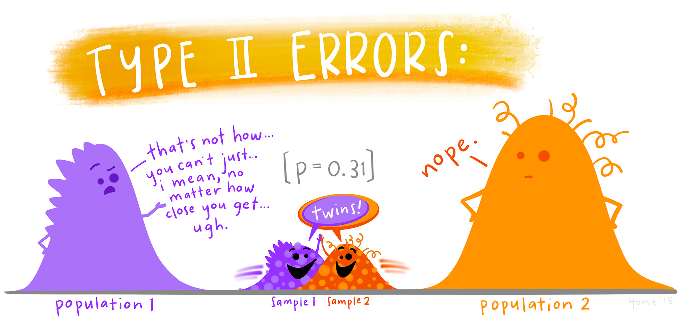
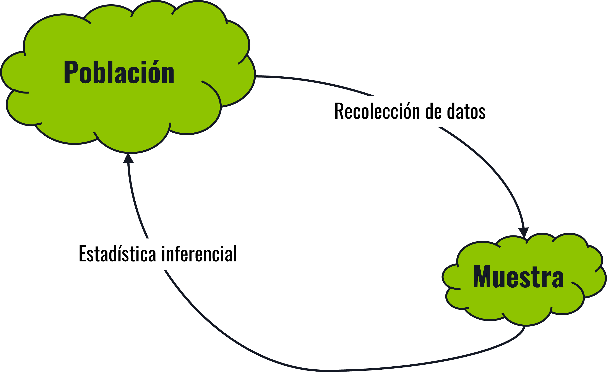
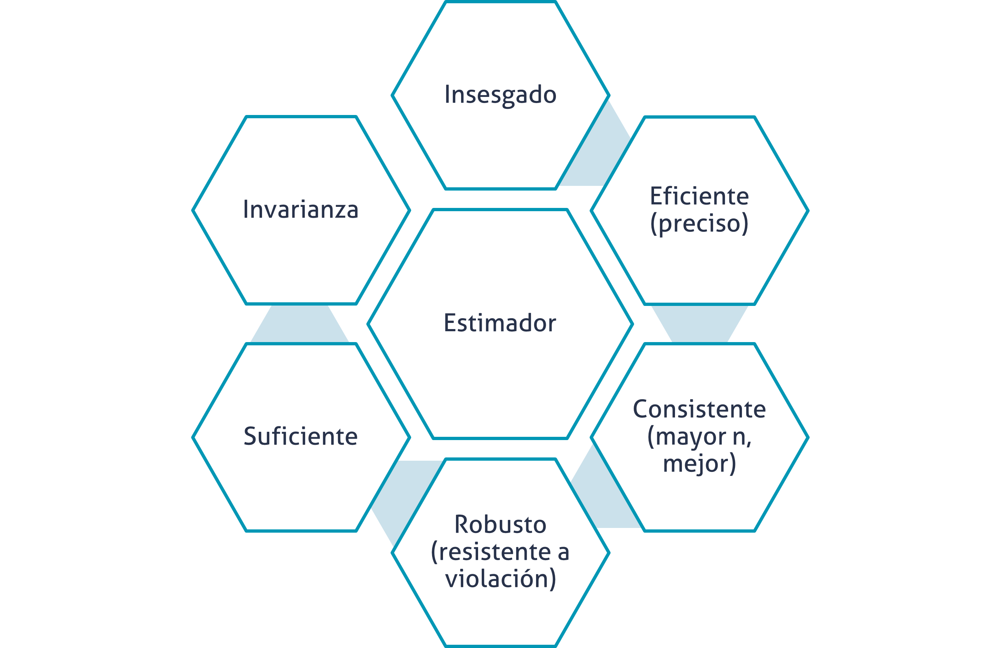
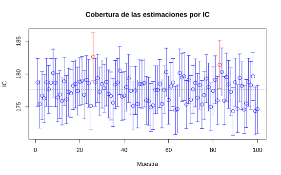

```{r}

library(tidyverse)

```

## Agenda {.bloques}

* Preguntas generadoras
* Conceptos iniciales
* Estimación puntual
* Tamaño de muestra
  * Para intervalos
  * Para pruebas de hipótesis
* Intervalos de confianza y pruebas de hipótesis
  * Una muestra
  * Dos muestras

## Preguntas generadoras {.bloques style="font-size: 0.95em;"}

* ¿Por qué no se deben analizar estimadores puntuales?
* ¿Cómo se selecciona un nivel de confianza?
* ¿Qué es un intervalo de confianza y cuáles parámetros le afectan?
* ¿Qué es error Tipo I, Tipo II, nivel de significancia y valores P?
* ¿Cómo se calculan los tamaños de muestra necesarios? ¿Qué es un efecto y qué es potencia?
* ¿Qué es una hipótesis?
* ¿Qué es una prueba de hipótesis?
* ¿Cómo se prueba una hipótesis?

## Conceptos iniciales {.center}

### Para conversar tod@s en el mismo idioma

## Idioma común {.bloques}

* Comencemos por la simbología: 

* $\alpha:$ También conocida como [nivel de significancia]{.hi}, está asociada con el error [tipo I]{.hi}.

* $1-\alpha:$ Es el [nivel de confianza]{.hi}, es el complemento del nivel de significancia. 

* $\beta:$ Es el error [tipo II]{.hi}.

* $1-\beta:$ Es el complemento del error tipo II y se conoce como la [potencia estadística]{.hi}.

## Idioma común {.bloques}

* [Contraste (prueba) de hipótesis]{.hi}: 

  * Es una pretensión o aseveración, que se asume como inicialmente cierta, sobre: el valor verdadero de un parámetro, los valores de varios parámetros o la forma de la distribución de probabilidad completa. 
  
* Está compuesta por: 

  * $H_o:$ Hipótesis nula, que se supone como incialmente cierta. 
  
  * $H_i:$ Hipótesis alternativa, que es **una** aseveración contraria. 

## Idioma común {.bloques}

* [Contraste (prueba) de hipótesis]{.hi}: 

* Si no se contradice [fuertemente]{.hi} la hipótesis nula, se continuará creyendo que esta es verdad. 

* Las dos conclusiones posibles derivadas de este análisis [siempre]{.hi .ul} son [rechazar]{.hi} o [no rechazar]{.hi}. 
  * Nunca, bajo ningún concepto es aceptar y esta no es una cuestión semántica es de la construcción de la prueba.
  
## Idioma común {.bloques}

:::::: {.columns}

::: {.column}

* [Valor P]{.hi}

* Es una probabilidad que mide la evidencia en contra de la hipótesis nula. Aunque parezca contraintuitivo, entre más bajo, más fuerte será la evidencia en contra. 
  
* Este valor se compara contra el nivel de significancia ($\alpha$).

:::

::: {.column .img-fit}



:::

::::::

## Idioma común {.bloques}

:::::: {.columns}

::: {.column width="20%"}

* [Valor P]{.hi}

  * De forma un poco más formal, un valor P es la probabilidad bajo un modelo estadístico especificado que un resumen estadístico de los datos sería igual o más extremo que su valor observado


:::

::: {.column .img-fit}



:::

::::::

## Idioma común {.bloques}

:::::: {.columns}

::: {.column width="50%"}

* [Valor P]{.hi}

* Usualmente el valor P  se interpreta mal, sobre todo por algunos malentendidos históricos.

* En este [enlace](https://stevenggoni.github.io/infografias/Comprendiendo%20el%20valor%20P.pdf){target="blank"} encontrará una infografía con cuidados e interpretaciones que debemos tener con el valor P, así como 6 principios fundamentales. Este materia [NO es opcional]{.hi}, por lo que se le solicita que recurra a su estudio de forma individual y autónoma. 


:::

::: {.column .img-fit}


:::

::::::

## Idioma común {.bloques}

:::::: {.columns}

::: {.column width="15%"}

* El valor P [no es el protagonista]{.hi}, es solo una medida estadística adicional, que se [interpreta en conjunto]{.hi} con las demás medidas.

* Ilustración de [Allison Horst](https://allisonhorst.com/){target="_blank"}

:::

::: {.column .img-fit}


:::

::::::

## Idioma común {.bloques}

:::::: {.columns}

::: {.column}

### Error Tipo I

Asociado con el nivel de significancia $\alpha$.

Es el error que se comete cuando el investigador rechaza la hipótesis nula cuando esta es verdadera en la población.

:::

::: {.column}

### Error Tipo II

Es el error que se comete cuando el investigador NO rechaza la hipótesis nula, cuando esta es falsa en la población.

:::

::::::

## Idioma común {.bloques}

:::::: {.columns}

::: {.column .img-fit}



:::

::::::

## Idioma común {.bloques}

:::::: {.columns}

::: {.column .img-fit}


:::

::::::

## Idioma común {.bloques}

:::::: {.columns}

::: {.column .img-fit}



:::

::::::

## Idioma común {.bloques}

:::::: {.columns}

::: {.column .img-fit}



:::

::::::

## Estimación puntual {.center}

## Introducción y repaso {.bloques}

* La inferencia estadística está siempre enfocada en obtener conclusiones acerca de uno o más parámetros de una población. 

* Una parte importante de este proceso es obtener [estimadores]{.hi} acerca de los [parámetros]{.hi}.

* El objetivo de la [estimación puntual]{.hi} es utilizar una muestra para calcular un número que representa en cierto sentido una buena [suposición]{.hi} del valor verdadero del parámetro.


## Estimación {.bloques}

:::::: {.columns}

::: {.column .img-fit}



:::

::::::

## Estimación puntual {.bloques}

* La estimación puntual se puede obtener mediante, al menos, dos métodos, **ninguno se abarca a detalle en este curso**, se menciona como parte de su formación, no para evaluación, pero el primero es el que hemos estado usando en este curso: 
  * Método de momentos
  * Método de máxima verosimilitud
  * Método de estimación bayesiana
  
## Estimación puntual {.bloques}

* En técnicas estadísticas más avanzadas, se suelen usar con mucha más frecuencia el método de máxima verosimilitud (ML), por ejemplo, para estimar regresiones, modelos lineales generalizados, etc. 

* Cuando hay “problemas” en la estimación por ML (como que una varianza de negativa, lo cual es imposible, pero puede pasar en modelos complejos) se puede usar la estimación bayesiana.  


## Estimación puntual {.bloques}

* Formalmente: 
  * Una estimación puntual de un parámetros $\theta$ de alguna población es un único valor numérico $\hat{\theta}$ de un estadístico $\hat{\Theta}$.
  * El estadístico $\hat{\Theta}$ es llamado estimador puntual. 

* Por ejemplo:

  * El valor de $\bar{x}$ del estadístico $\bar{X}$, que se calcula a partir de una muestra de tamaño $n$, es una estimación puntual del parámetro de la población $\mu$.

## Los estimadores deben... {.bloques}

:::::: {.columns}

::: {.column width="20%"}

Esto es para mención, el detalle necesita demostraciones matemáticas

:::

::: {.column .img-fit}



:::

::::::

## Estimadores insesgados {.bloques}

* Un estimador puntual $\hat{\Theta}$ es una estimación insesgada del parámetros $\theta$ si $E(\hat{\theta}) = \theta$.

* Recuerde que sesgo es la diferencia que hay entre $\theta$ y $\hat{\theta}$.

## Estimadores insesgados {.bloques}

* ¿Recuerda la corrección que se hace en el cálculo de la varianza muestra? También conocida como corrección de Bessel. 

* Para **estimar** la varianza de una población usamos: 

* $s^2 = \frac{\sum_{i=1}^{n}(x_i-\bar{x})^2}{n-1}$

* En lugar de: 

* $s^2 = \frac{\sum_{i=1}^{n}(x_i-\bar{x})^2}{n}$

* El primero es un estimador INSESGADO de la varianza poblacional. Mientras que el segundo NO LO ES. Esto se sabe por demostraciones con el método de momentos, por ejemplo. 

## Estimación por intervalos {.center}

## Estimación por intervalos {.bloques}

* Una estimación puntual, por el hecho de ser un solo número no proporciona información sobre la [precisión]{.hi} y [confiabilidad]{.hi} de la estimación. 

* Debido a las variabilidades del muestreo, virtualmente nunca se dará el caso de $\theta = \hat{\theta}$.

* Una alternativa para mitigar este riesgo es utilizar intervalos de confianza. 

* Un intervalo de confianza siempre se calcula seleccionando [primero]{.hi} un nivel de confianza.

* Por ejemplo, un intervalo de confianza al 95 % implica que 95 % de todas las muestras dará un intervalo que contiene a $\theta$.

## Estimación por intervalos {.bloques}

* Mientras mayor es el nivel de confianza, más fuerte es la creencia de que el valor del parámetro que se está estimando queda dentro del intervalo. 

* Si el nivel de confianza es alto y el intervalo resultante es bastante angosto, el conocimiento del valor del parámetro es bastante preciso.

* Un amplio intervalo de confianza transmite el mensaje de que existe gran cantidad de incertidumbre sobre el valor que se está estimando.

## Estimación por intervalos {.bloques}

:::::: {.columns}

::: {.column}

<iframe 
src="https://stevenggoni.github.io/interactivos/IC-embed.html?dist=normal"
width="100%" 
height="620" 
  style="border: 1px solid #33111422; border-radius: 8px; background-color: #F1F5F5; overflow: hidden;"
  frameborder="0"
  scrolling="no">
</iframe>

:::

::::::

## Estimación por intervalos {.bloques}

* Del TLC recordamos que: 

  * La variabilidad se expresa como $\frac{s}{\sqrt{n}}$, y a esto lo vamos a llamar Error Estándar, este es un estimador de la precisión. 
  
  * Además, $z = \frac{x-\mu}{\frac{\sigma}{\sqrt{n}}}$
  
## Estimación por intervalos {.bloques}

:::::: {.columns}

::: {.column}

$$ P \left( -z_{\frac{\alpha}{2}} < \frac{\bar{x} - \mu}{\frac{\sigma}{\sqrt{n}}} < z_{\frac{\alpha}{2}} \right) = 1 - \alpha $$

$$ \Rightarrow -z_{\frac{\alpha}{2}} \cdot \frac{\sigma}{\sqrt{n}} < \bar{x} - \mu < z_{\frac{\alpha}{2}} \cdot \frac{\sigma}{\sqrt{n}} $$

$$ \Rightarrow -\bar{x} - z_{\frac{\alpha}{2}} \cdot \frac{\sigma}{\sqrt{n}} < -\mu < -\bar{x} + z_{\frac{\alpha}{2}} \cdot \frac{\sigma}{\sqrt{n}} $$

$$ \Rightarrow \bar{x} - z_{\frac{\alpha}{2}} \cdot \frac{\sigma}{\sqrt{n}} < \mu < \bar{x} + z_{\frac{\alpha}{2}} \cdot \frac{\sigma}{\sqrt{n}} $$

:::

::::::

## ¿Cómo se interpreta? {.bloques}

* La interpretación es simple, pero no hay que confundirla con otros intervalos:

  * El intervalo observado contiene el valor verdadero del parámetro, por ejemplo $\mu$, con una confianza de $1-\alpha$.
  
* [NO ES CORRECTO]{.hi} decir que: 
  * El parámetro verdadero, por ejemplo $\mu$ se encuentra dentro del intervalo con un $1-\alpha$ de probabilidad.

* Reflexione: 
  * En este enfoque, se trata al parámetro como una variable aleatoria.
  * En el enfoque correcto, la variable aleatoria son los intervalos generados. 

## ¿Cómo se interpreta? {.bloques}

:::::: {.columns}

::: {.column}

* ¿Es lógico no? Es natural pensar que el valor verdadero es siempre FIJO, lo que cambia es la estimación de los intervalos porque dependen de una muestra. 

* Así se muestra en la imagen adjunta (y en la aplicación anterior), lo que cambia es el intervalo, no el parámetro.



:::

::::::

## ¿Cómo se interpreta? {.bloques}

:::::: {.columns}

::: {.column}

* Es lo mismo que jugar “*reverse basketball*”, la bola está fija (parámetro), lo que cambia es el aro (Intervalo).

* Que aunque sea del mismo tamaño, varía la “precisión” (EE) del lanzador.  

* Ver video

:::

::: {.column .img-fit width="40%"}



:::

::::::

## ¿Cómo se interpreta? {.bloques}

:::::: {.columns}

::: {.column}

* Una analogía menos peligrosa, para intentar en casa, es este juego para niños. 

* Las barras fijas, representan el parámetro y los aros representan los intervalos de confianza. 


:::

::: {.column .img-fit}


:::

::::::

## Pruebas de hipótesis {.center}

## Pruebas de hipótesis {.bloques}

* Muchos problemas en ingeniería requieren que se decida sobre cual de dos afirmaciones sobre un parámetro es verdades. Estas afirmaciones se denominan [hipótesis]{.hi} y el proceso para la toma de decisiones se conoce como [prueba de hipótesis]{.hi}. 

* *Una hipótesis estadística es una declaración sobre los parámetros de una o más poblaciones.*

## Pruebas de hipótesis {.bloques}

* Esta declaración se asume como inicialmente cierta. Y se busca evidencia en contra de dicha afirmación.

* Es por eso que el resultado de la prueba de hipótesis es: 

  * Tengo o no tengo evidencia suficiente en contra de dicha afirmación. Por tanto se rechaza o no se rechaza.
  * [Nunca se acepta.]{.ul}

## Pruebas de hipótesis e Intervalos de confianza {.bloques}

* Aunque son dos temas diferentes, se van a abordar de manera simultánea. Pues, [en este contexto]{.hi} se necesita de un intervalo de confianza para dar respuesta a la prueba de hipótesis. 

* Dicho de otra forma, puede haber intervalo de confianza sin prueba de hipótesis, pero no prueba de hipótesis sin intervalo de confianza. 

* Por ello, es que se esta clase se aborda desde la prueba de hipótesis, ya que simultáneamente se obtendrá un intervalo de confianza. 

* En este contexto (en este marco del curso se enseñará la dualidad entre ambos, no es un requisito universal):
  * Toda prueba de hipótesis, involucra un intervalo de confianza.
  * Los intervalos de confianza no requieren prueba de hipótesis.

## Pruebas de hipótesis e IC para la media {.center}

## Supuestos {.bloques}

* La(s) población(es) de las que se extraen las muestras siguen la distribución normal. 

* No se sigue la normal, pero el tamaño de muestra es lo suficientemente grande para cumplir con el teorema de límite central (TLC)

  * Recuerde que "grande" es relativo a la asimetría de la población, y que en caso de desconocerse o tener idea alguna, el valor de $n \ge 30$ [puede]{.hi} resultar en una aproximación válida.
  
  * También recuerde la ley de los grandes números, a mayor muestra, mejor.
  
## Una media ([Varianza conocida]{.hi}) {.bloques}

:::::: {.columns}

::: {.column}


* Se emplea el estadístico $z$

$$z = \frac{x-\mu}{\frac{\sigma}{\sqrt{n}}}$$

* El intervalo bilateral está compuesto por: 

$$\bar{x} \pm z_{\alpha/2} \cdot \frac{\sigma}{\sqrt{n}}$$
:::

::: {.column}

* Los intervalos unilaterales están compuestos por: 

Para la cola izquierda

$$\bar{x} - z_{\alpha} \cdot \frac{\sigma}{\sqrt{n}}$$

Para la cola derecha

$$\bar{x} + z_{\alpha} \cdot \frac{\sigma}{\sqrt{n}}$$


:::

::: {.column}

Este escenario es irreal, porque típicamente AMBOS parámetros ($\mu$ y $\sigma$) son desconocidos. 

Por lo que su aplicabilidad es sumamente limitada; sobre todo cuando de un proceso previo se asume que continuará con la misma $\sigma$.


:::

::::::

## Ejemplo 01 {.bloques}

:::::: {.columns}

::: {.column width="40%"}

Un técnico de control de calidad está investigando la resistencia interna a la presión de botellas de vidrio para bebidas gaseosas de 1 L. Se sabe que este proceso sigue una distribución normal con $\sigma=30$ psi. Se recolectan los siguientes datos.


:::

::: {.column}

```{r}

ej01 <- c(279.408, 263.159, 223.975, 279.716, 292.730,
           295.008, 309.995, 333.141, 239.869, 243.248,
           326.719, 237.145, 261.072, 282.608, 303.176,
           305.023, 270.551, 312.211, 315.649, 294.263,
           295.736, 306.858, 296.722, 259.649, 290.109)

matrix(ej01, ncol = 5) |> 
  knitr::kable(format = "html", 
               escape = FALSE, 
               col.names = NULL) |> 
  kableExtra::kable_styling(full_width = FALSE,
                            bootstrap_options = c("bordered", "condensed"))

```


:::

::::::

## Ejemplo 01 {.bloques}

* Se desea calcular un intervalo bilateral al 95 % para la media. 

  * $\bar{x} = 284.7096$
  * $\sigma = 30$
  * $n = 25$
  * $z_{0.025} = 1.96$, este valor lo puede obtener con lo visto en distribuciones continuas. 

* Respuesta:$(272.94982, 296.46938)$

## Ejemplo 01 {.bloques}

* El técnico dice que la resistencia media verdadera es de 275 ($H_o$), ¿a qué conclusión se puede llegar? 
  * Valor $p = 0.10559$.
  
* R/ No hay evidencia suficiente para rechazar la hipótesis nula de que la resistencia media es de 275 psi

* Note que el valor de 275 está dentro del IC

## Ejemplo 01 {.bloques}

* Aunque la solución con software es simple, es importante que comprenda de donde viene el valor P. En el ejemplo anterior estamos usando la distribución normal estándar $(z)$.

* $z = \frac{x-\mu}{\frac{\sigma}{\sqrt{n}}} = 1.6183$

* $P(z > 1.6183) = 0.0528$, como es bilateral, entonces $0.0528 \cdot 2 = 0.1056$.

## Una media ([varianza desconocida]{.hi}) {.bloques}

:::::: {.columns}

::: {.column}


* Se emplea el estadístico $t$

$$t = \frac{x-\mu}{\frac{s}{\sqrt{n}}}$$

* El intervalo bilateral está compuesto por: 

$$\bar{x} \pm t_{\alpha/2} \cdot \frac{s}{\sqrt{n}}$$

:::

::: {.column}

* Los intervalos unilaterales están compuestos por: 

Para la cola izquierda

$$\bar{x} - t_{\alpha} \cdot \frac{s}{\sqrt{n}}$$

Para la cola derecha

$$\bar{x} + t_{\alpha} \cdot \frac{s}{\sqrt{n}}$$


:::

::: {.column}

Este escenario es más plausible. 

Los grados de libertad para $t$ son: 

$$\nu = n-1$$

:::

::::::

## Ejemplo 02 {.bloques}

* Resuelva el Ejemplo 01, pero en un escenario más realista o plausible, en el que no se conoce el valor de la varianza poblacional. 

* Compare estos resultados con los previos. 

* $\bar{x}=284.7096 \quad s = 28.7621 \quad n = 25$

* $t_{0.025}=2.0639$

* IC: $(272.8372, 296.58201)$

* Valor P = 0.1044

## Ejemplo 03 {.bloques}

:::::: {.columns}

::: {.column}

Un ingeniero está investigando las características de desgaste de un tipo particular de llantas radiales para automóvil empleadas por la flotilla de la compañía. Se selecciona una muestra aleatoria de 16 llantas y cada llanta se corre hasta que aparezcan bandas de desgastes. Se registra así, los kilómetros que ha recorrido la llanta hasta llegar a ese punto.


:::

::: {.column}

```{r}

ej03 <- c(43047.9, 44033.68, 40341.94, 41643.01, 43216.15, 
          41384.96, 40236.3, 39773.31, 43003.05, 44617.98, 
          39706.33, 41265.76, 39004.94, 41210.72, 40703.16, 41100.65)

matrix(ej03, ncol = 4) |> 
  knitr::kable(format = "html", 
               escape = FALSE, 
               col.names = NULL) |> 
  kableExtra::kable_styling(full_width = FALSE,
                            bootstrap_options = c("bordered", "condensed"))

```


:::

::::::

## Ejemplo 03 {.bloques}

* $\bar{x}=41\,518.12 \quad s = 1\,634.323$.

* Calcule el intervalo unilateral inferior de confianza del 95% con respecto al desgaste medio. 

  * IC: $(40\,801.85738,\infty)$
  
* ¿La cantidad de kilómetros son 45000?

  * $H_o: \mu = 45\,000$
  * $H_i: \mu>45\,000$
  
* R/: El valor P = 1.00, no hay evidencia suficiente para rechazar la hipótesis nula. 

## Algunos consejos {.bloques}

* Un intervalo [unilateral inferior]{.hi}, implica una hipótesis (ojo a la alternativa) de este tipo

  * $H_o: \mu = 45\,000$
  * $H_i: \mu > 45\,000$

* Puede pensarlo de esta manera, esa hipótesis alternativa dice que la media tiene que ser como [mínimo]{.hi} 45 000. Relacione ese [mínimo]{.ul} con el término [inferior]{.ul}. 


## Algunos consejos {.bloques}

* Un intervalo [unilateral superior]{.hi}, implica una hipótesis (ojo a la alternativa) de este tipo

  * $H_o: \mu = 45\,000$
  * $H_i: \mu < 45\,000$

* Puede pensarlo de esta manera, esa hipótesis alternativa dice que la media tiene que ser como [máximo]{.hi} 45 000. Relacione ese [máximo]{.ul} con el término [superior]{.ul}. 

## Dos medias ([varianzas desconocidas e iguales]{.hi}) {.bloques}

:::::: {.columns}

::: {.column width="35%"}


* Se emplea el estadístico $t$:
$t = \frac{(\bar{x}_1 - \bar{x}_2) - (\mu_1 - \mu_2)}{s_p \sqrt{\frac{1}{n_1} + \frac{1}{n_2}}}$

$s_p = \sqrt{\frac{(n_1 - 1)s_1^2 + (n_2 - 1)s_2^2}{n_1 + n_2 - 2}}$

* El intervalo bilateral está compuesto por:

$(\bar{x}_1 - \bar{x}_2) \pm t_{\frac{\alpha}{2}} \cdot s_p \sqrt{\frac{1}{n_1} + \frac{1}{n_2}}$

:::

::: {.column width="35%"}

* Los intervalos unilaterales están compuestos por: 

Para la cola izquierda

$(\bar{x}_1 - \bar{x}_2) - t_{\alpha} \cdot s_p \sqrt{\frac{1}{n_1} + \frac{1}{n_2}}$

Para la cola derecha

$(\bar{x}_1 - \bar{x}_2) + t_{\alpha} \cdot s_p \sqrt{\frac{1}{n_1} + \frac{1}{n_2}}$

:::

::: {.column width="30%"}


Los grados de libertad para $t$ son: 

$$\nu = n_1+n_2-2$$

:::

::::::

## ¿Cómo sé si las varianzas son iguales? {.bloques}

* De momento se le va a pedir que confíe.

* En estos ejercicios, [DE MOMENTO]{.hi}, se le va a indicar si las varianzas son iguales o no. 

* Luego, en esta sesión (o presentación), se le va a indicar como hacer una prueba de hipótesis para comprobar esto.

  * Cuando tenga que resolver ejercicios de este tipo se espera que primero haga la prueba de varianzas y luego de la de medias. 

## Ejemplo 04 {.bloques}

* Dos estudiantes de la UCR estudian las propiedades físico-mecánicas de un conglomerante para su eventual uso en construcciones en la luna. Se toman 10 especímenes de dos tipos de mezcla (10 especímenes de la mezcla 1 y 10 de la mezcla 2).

* Se conoce que la resistencia sigue una distribución normal y sus varianzas son iguales, con un 95% de confianza, ¿las medias poblacionales son iguales?

## Ejemplo 04 {.bloques}

:::::: {.columns}

::: {.column}

```{r style="font-size: 0.95em;"}

ej04 <- data.frame(M1 = c(103.371, 110.136, 102.679, 102.387, 107.033, 
                          100.321, 109.539, 105.526, 102.164, 102.284),
                   M2 = c(98.358, 103.286, 101.273, 97.24, 102.727, 
                          102.3, 100.342, 100.88, 104.718, 106.056))

ej04 |> 
  knitr::kable(format = "html", 
               escape = FALSE) |> 
  kableExtra::kable_styling(full_width = FALSE,
                            bootstrap_options = c("bordered", "condensed"))

```


:::


::: {.column}

¿Las medias son iguales? 

$H_o: \mu_{M1}=\mu{M2} \rightarrow \mu_{M1}-\mu{M2} = 0$

$H_i: \mu_{M1}\ne\mu{M2} \rightarrow \mu_{M1}-\mu{M2} \ne 0$

IC: $(-0.03809325, 5.69009325)$

Valor P = 0.05279

:::

::::::

## Volvamos al valor P {.bloques}

* Recordemos que los valores P son una probabilidad que mide la evidencia en contra de la hipótesis nula. Nunca la evidencia a favor. 

* Y que como se ha aclarado antes, los valores P no se interpretan por si solos, sino que se acompañan del resto de información estadística. 

* En ocasiones nos vemos tentados a emplear [terminología incorrecta]{.hi} como: 
  * Es MUY significativo, cuando un valor P es muy bajo. 

* Es importante aclarar que la significancia estadística es un límite: solo se puede ser o no ser significativo. 
* [No puedo ser muy o poco significativo]{.hi}. 

## Volvamos al valor P {.bloques}

:::::: {.columns}

::: {.column width="50%"}

Piénselo de esta manera: 

* ¿Yo soy “más tico” por nacer en San José centro que alguien que nació en Los Chiles?   
  *  ¿Verdad que no?

* Entonces tampoco puedo ser más significativo con base en un valor P.


:::

::: {.column .img-fit}


:::

::::::

## Volvamos al valor P {.bloques}

* Lo que puedo estar es más o menos seguro de que “soy tico” y para ello es relevante analizar el valor P en CONJUNTO con:

  * Evidencias externas del contexto (diseño del estudio, calidad de mediciones)
  * Evidencias internas (otros estadísticos como la estimación del intervalo de confianza).

* En el ejemplo que acabamos de desarrollar, estamos poco segur@s de que la media sea 0, aún cuando el valor $P > \alpha$.

* ¿No cree que el IC "apenas" y contiene a $\mu = 0$? Por eso el $\alpha$ se debe escoger con base en criterios razonables y con ética y no se debe reemplazar a conveniencia.

## Volvamos al valor P {.bloques}

:::::: {.columns}

::: {.column .img.fit .center}

```{r}

t_95 <- t.test(ej04$M1, ej04$M2, var.equal = TRUE, conf.level = 0.95)
t_90 <- t.test(ej04$M1, ej04$M2, var.equal = TRUE, conf.level = 0.90)

df_ic <- data.frame(Nivel = factor(c("90%", "95%"), levels = c("95%", "90%")),
                    Diferencia = as.numeric(diff(rev(t_95$estimate))),
                    LI = c(t_90$conf.int[1], t_95$conf.int[1]),
                    LS = c(t_90$conf.int[2], t_95$conf.int[2]))

g4 <- ggplot(df_ic, aes(x = Nivel, y = Diferencia, color = Nivel)) +
  geom_hline(yintercept = 0, linetype = "dashed", color = "firebrick", 
             linewidth = 0.8) +
  geom_errorbar(aes(ymin = LI, ymax = LS), width = 0.15, linewidth = 1.2) +
  geom_point(size = 4) +
  scale_color_manual(values = c("95%" = "#2b5c8f", "90%" = "#e67e22")) +
  coord_flip() +
  labs(title = "Intervalo de Confianza para μ₁ - μ₂",
       subtitle = "x̄₁ - x̄₂ = 2.826",
       x = "Nivel de confianza",
       y = "Diferencia de medias",
       color = "Nivel") +
  theme_minimal(base_size = 20) +
  theme(legend.position = "none")

plotly::ggplotly(g4, height = 650, width = 1850) %>% 
  plotly::layout(paper_bgcolor = "#F1F5F5",
                 plot_bgcolor  = "#F1F5F5",
                 font = list(size = 35),
                 xaxis = list(
                   title = list( font = list(size = 30)),
                   tickfont = list(size = 25)),
                 yaxis = list(title = list(font = list(size = 30)),
                              tickfont = list(size = 25)),
                 legend = list(title = list(font = list(size = 25)),
                               font = list(size = 20),
                               bgcolor = "#F1F5F5"))

```


:::

::::::

## Dos medias ([Varianzas desconocidas y diferentes]{.hi}){.bloques}

:::::: {.columns}

::: {.column width="35%"}


* Se emplea el estadístico $t$:

$t = \frac{(\bar{x_1}-\bar{x_2}) - (\mu_1-\mu_2))}{\sqrt{\frac{s_1^2}{n_1} + \frac{s_2^2}{n_2}}}$

* El intervalo bilateral está compuesto por:

$(\bar{x}_1 - \bar{x}_2) \pm t_{\frac{\alpha}{2}} \cdot \sqrt{\frac{s_1^2}{n_1} + \frac{s_2^2}{n_2}}}$

:::

::: {.column width="35%"}

* Los intervalos unilaterales están compuestos por: 

Para la cola izquierda

$(\bar{x}_1 - \bar{x}_2) - t_{\alpha} \cdot \sqrt{\frac{s_1^2}{n_1} + \frac{s_2^2}{n_2}}$

Para la cola derecha

$(\bar{x}_1 - \bar{x}_2) + t_{\alpha} \cdot \sqrt{\frac{s_1^2}{n_1} + \frac{s_2^2}{n_2}}$

:::

::: {.column width="30%"}


Los grados de libertad para $t$ son: 

$$\nu \approx \frac{\left(\frac{s_1^2}{n_1} + \frac{s_2^2}{n_2}\right)^2}{\frac{(s_1^2/n_1)^2}{n_1 - 1} + \frac{(s_2^2/n_2)^2}{n_2 - 1}}$$

También se conocen como los grados de libertad de Welch-Satterthwaite.

:::

::::::

## Ejemplo 05 {.bloques}

* El tiempo entre dos condiciones de tueste en el proceso de torrefacción de granos de café sigue una distribución normal. Se quiere ver si hay diferencias en este tiempo entre dos tamaños diferentes de grano. Se realizan 10 mediciones para el grano 1 y 13 para el grano 2.
* Se asume que las varianzas no son iguales. ¿Los procesos son iguales? Con un 90 % de confianza.

## Ejemplo 05 {.bloques}

:::::: {.columns}

::: {.column style="font-size: 0.75em;"}

```{r}
ej05 <- data.frame(Grano_1 = c(5.139, 2.445, 6.3, 5.946, 6.057, 6.016, 
                               4.95, 9.761, 3.041, 2.881, NA, NA, NA),
                   Grano_2 = c(5.067, 4.51, 5.457, 4.373, 5.723, 5.535, 5.091, 
                               4.958, 5.651, 5.256, 5.449, 5.416, 5.654))

ej05 |> 
  knitr::kable(format = "html", 
               escape = FALSE) |> 
  kableExtra::kable_styling(full_width = FALSE,
                            bootstrap_options = c("bordered", "condensed"))

```


:::


::: {.column}

$\bar{x_1} = 5.254 \quad \bar{x_2}=5.242$

$s_1 = 2.151 \quad s_2=0.428$

IC: $(−1.52638, 1.56038)$

Valor P = 0.98649

:::

::::::


## Dos medias ([Varianzas conocidas]{.hi}){.bloques}

:::::: {.columns}

::: {.column width="35%"}

* Se emplea el estadístico $Z$:

$$z = \frac{(\bar{x}_1-\bar{x}_2) - (\mu_1-\mu_2)}{\sqrt{\frac{\sigma_1^2}{n_1} + \frac{\sigma_2^2}{n_2}}}$$

* El intervalo bilateral está compuesto por:

$$(\bar{x}_1 - \bar{x}_2) \pm z_{\frac{\alpha}{2}} \cdot \sqrt{\frac{\sigma_1^2}{n_1} + \frac{\sigma_2^2}{n_2}}$$

:::

::: {.column width="35%"}

* Los intervalos unilaterales están compuestos por:

Para el límite inferior:

$$(\bar{x}_1 - \bar{x}_2) - z_{\alpha} \cdot \sqrt{\frac{\sigma_1^2}{n_1} + \frac{\sigma_2^2}{n_2}}$$

Para el límite superior:

$$(\bar{x}_1 - \bar{x}_2) + z_{\alpha} \cdot \sqrt{\frac{\sigma_1^2}{n_1} + \frac{\sigma_2^2}{n_2}}$$

:::

::: {.column width="30%"}

### Observaciones clave:

* Al **conocer las varianzas poblacionales** ($\sigma_1^2, \sigma_2^2$), la distribución de referencia es la **Normal Estándar ($Z$)**, independientemente del tamaño de muestra.

* No se requiere estimar grados de libertad ni calcular varianzas agrupadas ($s_p$).

:::

::::::

## Muestras pareadas {.bloques}

:::::: {.columns}

::: {.column width="35%"}


* Se emplea el estadístico $t$ y ocurre con muestras pareadas:
$t = \frac{\bar{d}-\mu_d}{\frac{s_d}{\sqrt{n}}}$

Donde $d$ es la diferencia entre los pares.

* El intervalo bilateral está compuesto por:

$\bar{d} \pm t_{\frac{\alpha}{2}} \cdot \frac{s_d}{\sqrt{n}}$

:::

::: {.column width="35%"}

* Los intervalos unilaterales están compuestos por: 

Para la cola izquierda

$\bar{d} - t_{\alpha} \cdot \frac{s_d}{\sqrt{n}}$

Para la cola derecha

$\bar{d} + t_{\alpha} \cdot \frac{s_d}{\sqrt{n}}$

:::

::: {.column width="30%"}


Los grados de libertad para $t$ son: 

$$\nu = n - 1$$

:::

::::::

## Ejemplo 06 {.bloques}

* Se desea determinar si dos materiales para suelas de zapatos son igual de resistentes al desgaste. Se toman 25 zapatos derechos con suelas del material A y sus pares izquierdos con el material B y se le asignan a 25 niños para que los usen durante un mes, ya que se quiere probar el desgaste en condiciones reales. 

* Luego de un mes se mide la diferencia en el espesor de las suelas en un punto específico.

* Una muestra pareada, como su nombre lo indica, se recoge por pares. 

* Este ejercicio se resuelve con el [promedio de la diferencia $\bar{d}$]{.hi} entre las dos muestras. [No con la diferencia de los promedios]{.hi}. 

## Ejemplo 06 {.bloques}

:::::: {.columns}

::: {.column style="font-size: 0.75em;"}

```{r}
ej06 <- data.frame(A = c(6.869, 4.569, 5.281, 6.927, 8.349, 7.352, 5.265, 
                         4.654, 5.506, 5.844, 6.809, 7.659, 4.268, 7.573, 
                         5.241, 7.849, 8.276, 6.2, 5.782, 6.616, 6.919, 
                         7.508, 4.994, 5.68, 7.922),
                   B = c(4.431, 3.722, 3.127, 1.176, 1.525, 3.004, 3.864, 
                         4.336, 3.293, 3.193, 4.277, 1.476, 1.8, 3.409, 
                         3.916, 2.709, 0.97, 3.649, 4.113, 4.548, 1.28, 
                         1.211, 2.189, 0.778, 4.42)) |> 
  dplyr::mutate(d = A - B)

ej06[1:13, ] |>
  cbind.data.frame(rbind(ej06[14:25,], data.frame(A = NA, B = NA, d = NA))) |> 
  knitr::kable(format = "html", 
               escape = FALSE) |> 
  kableExtra::kable_styling(full_width = FALSE,
                            bootstrap_options = c("bordered", "condensed"))

```


:::


::: {.column width="60%"}

* ¿Con un 99 % de confianza, el desgaste es el mismo? 

  * En simple, es una prueba t para una muestra, siendo esa muestra la diferencia $d$ entre A y B. Aunque no cambia decisión final (rechazar o no rechazar), tenga cuidado, no es lo mismo $d=B-A$ que $d=A-B$, analice y concluya en función de como se construye la variable $d$.

R: El desgaste por material no es el mismo

$\bar{d} = 3.500 \quad s_d=2.004$

IC: $(2.37899, 4.62101)$

Valor P = 0.000

:::

::::::

## Pruebas de hipótesis e IC para proporciones {.center}

## Supuestos {.bloques}

* El tamaño de muestra debe ser el suficiente para cumplir el TLC y su aproximación a la normal. 

* Ademas, $n\cdot p \ge 5$ y $n\cdot (1-p) \ge 5$.

* Nota: de no cumplirse este supuesto, se pueden utilizar alternativas resistentes o robustas a la infracción. 


## Una proporción {.bloques}

:::::: {.columns}

::: {.column}

* Usa el estadístico $z$

$$z = \frac{\hat{p}-p_o}{\sqrt{\frac{\hat{p}(1-\hat{p})}{n}}}$$

* El intervalo bilateral está compuesto por: 

$$\hat{p} \pm z_{\frac{\alpha}{2}}\cdot \sqrt{\frac{\hat{p}(1-\hat{p})}{n}}$$

:::

::: {.column}

* Los intervalos unilaterales están compuestos por: 

Para la cola izquierda

$$\hat{p} - z_{\alpha}\cdot \sqrt{\frac{\hat{p}(1-\hat{p})}{n}}$$

Para la cola derecha

$$\hat{p} + z_{\alpha}\cdot \sqrt{\frac{\hat{p}(1-\hat{p})}{n}}$$


:::

::: {.column}

Se basa en una aproximación de la binomial a la normal, por ello es que emplea $z$. 

El método utilizado es el de *Wald*. Como ya fue mencionado, existen otros métodos que pueden ser resistentes o robustos a la infracción de los supuestos. 

:::

::::::

## Ejemplo 07 {.bloques}

:::::: {.columns}

::: {.column}

* Un cliente indica que en promedio su proceso produce 10 % de defectos (acabado superficial correcto o incorrecto). Para verificar esto se toma una muestra de 75 productos.

$$\hat{p} = \frac{13}{75}=0.1733$$

IC: $(0.08764, 0.25896)$

Valor P = 0.09352

:::

::: {.column width = "60%"}

```{r}

ej07 <- c(0, 0, 0, 0, 0, 0, 0, 0, 0, 1, 0, 0, 0, 0, 0, 1, 1, 0, 0, 0, 0, 0, 
          0, 0, 0, 0, 0, 0, 0, 0, 0, 0, 1, 0, 1, 0, 1, 0, 0, 1, 0, 0, 1, 0, 
          0, 0, 1, 1, 0, 0, 1, 0, 0, 0, 0, 0, 1, 0, 0, 0, 0, 1, 0, 0, 0, 0, 
          0, 0, 0, 0, 0, 0, 0, 0, 0)

matrix(ej07, ncol = 15) |> 
  knitr::kable(format = "html", 
               escape = FALSE, 
               col.names = NULL) |> 
  kableExtra::kable_styling(full_width = FALSE,
                            bootstrap_options = c("bordered", "condensed"))

```


:::

::::::

## Advertencia {.bloques}

* El método que estamos empleando se llama el [método de Wald]{.hi}.

  * Puede ser inexacto con muestras pequeñas o cuando la proporción está cerca de 0 o 1. Tiende a subestimar o sobrestimar la verdadera probabilidad, dando resultados poco confiables.
 
* Por ello, en función del software, puede obtener resultados distintos. No se dedique a "presionar" botones, comprenda lo que está haciendo. 

## Advertencia {.bloques}

* Softwares especializados como R y Minitab emplean metodologías robustas a este problema como:

  * Blaker ajustado (exacto)
  * Wilson-score
  * Agresti-Coull

* Dado que [el uso de software es permitido]{.ul}, se le aconseja [coordinar con la persona docente]{.hi} la metodología a emplear en evaluaciones específicas y generales.  

## Dos proporciones {.bloques}

:::::: {.columns}

::: {.column width="35%"}

* Usa el estadístico $z$:

$z = \frac{\hat{p}_1 - \hat{p}_2}{\sqrt{\frac{\hat{p}_1(1-\hat{p}_1)}{n_1} + \frac{\hat{p}_2(1-\hat{p}_2)}{n_2}}}$

* El intervalo bilateral está compuesto por:

$(\hat{p}_1 - \hat{p}_2) \pm z_{\frac{\alpha}{2}} \cdot \sqrt{\frac{\hat{p}_1(1-\hat{p}_1)}{n_1} + \frac{\hat{p}_2(1-\hat{p}_2)}{n_2}}$

:::

::: {.column width="35%"}

* Los intervalos unilaterales están compuestos por:

Para la cola izquierda

$(\hat{p}_1 - \hat{p}_2) - z_{\alpha} \cdot \sqrt{\frac{\hat{p}_1(1-\hat{p}_1)}{n_1} + \frac{\hat{p}_2(1-\hat{p}_2)}{n_2}}$

Para la cola derecha

$(\hat{p}_1 - \hat{p}_2) + z_{\alpha} \cdot \sqrt{\frac{\hat{p}_1(1-\hat{p}_1)}{n_1} + \frac{\hat{p}_2(1-\hat{p}_2)}{n_2}}$

:::

::: {.column width="30%"}

Se basa en la aproximación de la distribución binomial a la normal para la diferencia de dos proporciones independientes, por ello utiliza $z$.

Al igual que en una muestra, este método utiliza las estimaciones muestrales para el error estándar.

:::

::::::

## Ejemplo 08 {.bloques}

* En la GAM se le pregunta a 120 personas si estarían dispuestas a comprar un producto y 82 contestan afirmativamente. Fuera de la GAM se le pregunta a 90 personas y 47 contestan afirmativamente. Con un 95% de confianza ¿Hay diferencia entre las zonas en cuánto a la disposición de compra?

* IC: $(0.02853,0.29369)$

* Valor P = 0.01762

  * Si utiliza la aplicación recomendada marque la opción `Use pooled standard error`.


## Momento de reflexión {.center}

## Reflexión {.bloques}

:::::: {.columns}

::: {.column}

* Note que en los intervalos de confianza para medias y proporciones, se sigue un mismo patrón: 

$$\text{Estimación} \pm \text{Valor crítico} \cdot \text{Error Estándar}$$

$$\hat{\theta} \pm (z \text{ o } t) \cdot EE$$

* El producto $(z \text{ o } t) \cdot EE$ constituye el **Margen de Error**, el cual dicta la amplitud del intervalo:

  * Un **intervalo angosto** indica que tenemos una estimación **muy precisa** del parámetro poblacional (generalmente logrado con un tamaño de muestra $n$ grande).

  * Un **intervalo amplio** transmite la existencia de una **gran incertidumbre** sobre el verdadero valor del parámetro.
  
:::

::::::
  
## Problemas del EE {.bloques}

* En el denominador del error estándar, de una u otra forma, se encuentra la raíz del tamaño de muestra ($\sqrt{n}$).

* Esta es una crítica generalizada en la estadística frecuentista: tanto el valor $p$ como los intervalos de confianza pueden ser "manipulados" (o altamente influenciados) simplemente aumentando el tamaño de la muestra.

* Es aquí donde toman un papel crucial conceptos como el [tamaño de efecto]{.hi}, el [tamaño de muestra]{.hi} y la [potencia estadística]{.hi}, temas que abordaremos más adelante.

## Pruebas de hipótesis e IC para varianzas {.center}

## Supuestos {.bloques}

* En esta ocasión no hay TLC que nos salve. [La población debe ser normal]{.hi}.

* Solo se sigue una $\chi^2=\frac{s^2(n-1)}{\sigma^2}$ si los datos son normales. Si no lo son, los resultados pueden ser [muy inexactos]{.hi} incluso con muestras grandes. 

* Se abordará en otras lecciones las alternativas al incumplimiento de este supuesto. 

## Una varianza {.bloques}

:::::: {.columns}

::: {.column}

* Usa el estadístico Chi-cuadrado ($\chi^2$):

$$\chi^2 = \frac{(n-1)s^2}{\sigma^2}$$

* El intervalo bilateral está dado por:

$$\frac{(n-1)s^2}{\chi^2_{\alpha/2}} < \sigma^2 < \frac{(n-1)s^2}{\chi^2_{1-\alpha/2}}$$

:::

::: {.column}

* Los intervalos unilaterales están compuestos por:

Para la cola izquierda:

$$\sigma^2 > \frac{(n-1)s^2}{\chi^2_{\alpha}}$$

Para la cola derecha:

$$0 < \sigma^2 < \frac{(n-1)s^2}{\chi^2_{1-\alpha}}$$

:::

::: {.column}

Los grados de libertad para $\chi^2$ son:

$$\nu = n - 1$$

*Tome en cuenta:* La distribución $\chi^2$ está definida en el dominio $[0, \infty)$, por lo que el límite inferior de la varianza jamás puede ser negativo ($-\infty$).

:::

::::::

## Ejemplo 09 {.bloques}

:::::: {.columns}

::: {.column}

* Una máquina llena latas con una bebida gaseosa y el fabricante desea obtener una estimación de intervalo de confianza de la varianza del volumen de llenado (si la varianza es demasiado grande, un alto porcentaje de las latas se llenarán con un volumen del producto que es menor que la cantidad nominal [355 ml]).

* $\bar{x} = 355.0170, \quad s = 0.5199$

:::

::: {.column}

```{r}

ej09 <- c(354.05, 355.622, 354.762, 355.238, 354.112, 355.438, 356.055, 
          355.09, 354.849, 355.303, 355.657, 354.455, 354.778, 354.641, 
          355.054, 355.37, 354.789, 354.932, 355.528, 354.616)


matrix(ej09, ncol = 2) |> 
  knitr::kable(format = "html", 
               escape = FALSE, 
               col.names = NULL) |> 
  kableExtra::kable_styling(full_width = FALSE,
                            bootstrap_options = c("bordered", "condensed"))

```


:::

::::::

## Ejemplo 09 {.bloques}

* Dado que el problema se daría por mucha variabilidad, obtenga el intervalo superior de confianza al 95 % para $\sigma^2$.

  * IC: $(0.0000, 0.5076)$

* Realice este contraste de hipótesis:

  * $H_o: \sigma^2=0.5$
  * $H_i \sigma < 0.5$
  * Valor P = 0.0540
  
## Dos varianzas {.bloques}

:::::: {.columns}

::: {.column width="38%"}

* Usa el estadístico $F$ de Snedecor-Fisher:

$$f = \frac{s_1^2}{s_2^2}$$

* El intervalo bilateral está dado por:

$\frac{s_1^2}{s_2^2} \cdot \frac{1}{f_{\alpha/2, \nu_1, \nu_2}} < \frac{\sigma_1^2}{\sigma_2^2} < \frac{s_1^2}{s_2^2} \cdot f_{\alpha/2, \nu_2, \nu_1}$

:::

::: {.column width="32%"}

* Los intervalos unilaterales están compuestos por:

Para la cola izquierda:

$$\frac{\sigma_1^2}{\sigma_2^2} < \frac{s_1^2}{s_2^2} \cdot f_{\alpha, \nu_2, \nu_1}$$

Para la cola derecha:

$$\frac{\sigma_1^2}{\sigma_2^2} > \frac{s_1^2}{s_2^2} \cdot \frac{1}{f_{\alpha, \nu_1, \nu_2}}$$

:::

::: {.column width="30%"}

Los grados de libertad para $F$ son:

$\nu_1 = n_1 - 1 \quad \text{(num.)}$
$\nu_2 = n_2 - 1 \quad \text{(denom.)}$

  * *Nota:* Al igual que $\chi^2$, la distribución $F$ toma valores exclusivamente no negativos ($F \ge 0$).

:::

::::::

## Ejemplo 10 {.bloques}

:::::: {.columns}

::: {.column}

Retome los datos del Ejemplo 04. Verifique el supuesto de que ambas varianzas son iguales. 

La hipótesis nula en el caso de las varianzas es un poco diferente. Pues se hace con cocientes. 

$$H_o: \frac{s^2_{M_1}}{s^2_{M_2}} = 1$$

$$H_i: \frac{s^2_{M_1}}{s^2_{M_2}} \ne 1$$

:::

::: {.column style="font-size: 0.95em;"}

```{r}

ej04 |> 
  knitr::kable(format = "html", 
               escape = FALSE) |> 
  kableExtra::kable_styling(full_width = FALSE,
                            bootstrap_options = c("bordered", "condensed"))

```


:::

::::::

## Ejemplo 10 {.bloques}

* Entonces, ¿son las varianzas iguales? ¿asumimos bien en el Ejemplo 04?

* Ahora, ya tiene elementos téoricos y prácticos para comprobar este supuesto en la prueba de dos medias. 

* IC: $(0.3833, 6.2123)$

* Valor P = 0.5283

## Ejemplo 11 {.bloques}

* Repita el procedimiento para el Ejemplo 05.

* ¿Las varianzas son iguales? No, no lo son, entonces asumimos bien. 

* IC: $(7.3482, 97.6619)$

* Valor P = 0.000

## Resumen {.center}

## Resumen {.bloques}

* Todas las pruebas de hipótesis estudiadas se encuentran resumidas en [los tres diagramas de decisión](https://stevenggoni.github.io/infografias/esquema_PH.pdf){target="_blank"} que se le proveen.

* Este material ha sido preparado por la Inga. Valentina Campos Aguilar y modificado por el autor de esta presentación. 

## Tamaño de muestra {.center}

## Tamaño de muestra para intervalos {.center}

## Tamaño de muestra {.bloques}

:::::: {.columns}

::: {.column}

* Con esta fórmula podemos estar "seguros" con un $(1-\alpha)$ de confianza que el error $|\bar{x}-\mu|$ no va a exceder el valor $e$.

* Entendiendo que $\lceil \cdot \rceil$ significa redondeado al siguiente entero.

:::

::: {.column}

### Para la media

$$n = \left\lceil \left(\frac{z_{\frac{\alpha}{2}}\cdot \sigma}{e}\right)^2 \right\rceil$$

### Para proporciones

$$ n = \left\lceil\left(\frac{z_{\frac{\alpha}{2}}}{e}\right)^2 \cdot p \cdot (1-p)\right\rceil$$


:::

::::::

## Tamaño de muestra {.bloques}

* Garantiza que el **método de estimación** produzca un margen de error menor o igual a $e$, con una tasa de éxito a largo plazo del $(1-\alpha)\%$.

* Sirve para fijar la **precisión deseada** (ancho del intervalo) antes de recolectar los datos, evitando muestras innecesariamente grandes o insuficientemente precisas.

## Tamaño de muestra {.bloques}

* Importante: El cálculo de $n$ debe dar un resultado [adimensional]{.hi}, por lo que las unidades de $\sigma$ y $e$ deben estar en la misma dimensión. 

* Naturalmente, en el caso de proporciones, $p$ y $e$ deben estar en unidades de proporcioens (o porcentajes).

## Tamaño de muestra {.bloques}

* Continuando...

  * ¿Qué es $e$? ¿Cómo escojo $\alpha$?
  
  * Es el máximo error permitido por la persona investigadora que tiene un [IMPACTO]{.hi} sobre el contexto en el que se enmarca el muestreo. Lo mismo con $\alpha$, de[pende del contexto]{.hi}.
  
* Por ejemplo, la estimación del tiempo que se tarda en completar una tarea no puede ser diferente al valor real en [a lo sumo X segundos]{.hi}, con una confianza igual $(1-\alpha)$ porque esto es importante para el [contexto particular]{.hi} en el que se enmarca la estimación del tiempo. 

## Tamaño de muestra {.bloques}

* Continuando...

  * ¿De dónde saco $\sigma$?
  
  * Se debe estimar ($s$), a partir de: 
  
    * Fuente secundaria: existen datos históricos.
    * Fuente primaria: hay que realizar un premuestreo. 
  

## Tamaño de muestra {.bloques}

* ¿Qué pasa si la población es [finita]{.hi}? 

* Esto es más común en observaciones y encuestas que en experimentos. 

* En estos casos se utiliza un factor de corrección para población finita:

* $$n = \left\lceil\frac{n_0}{1+\frac{n_0}{N}}\right\rceil$$

* Donde $N$ es la población y $n_0$ es el resultado de la fórmula de población **infinita**.

## Ejemplo 12 {.bloques}

* Calcule el tamaño de muestra, con una desviación de 5.6 s y un error de 3 s con un nivel de confianza del 95%, para población infinita y para una población de 50.

* Infinita: 14
* Finita: 11

## Ejemplo 13 {.bloques}

* A resolver de forma asincrónica por la persona estudiante

* Calcule el tamaño de muestra, con una proporción esperada de 0.5 y un error de 0.08, a un nivel de confianza de 95%, para población infinita y una población de 350.
* 150.06 ~ 151
* 105.49 ~ 106

## Tamaño de muestra para pruebas de hipótesis {.center}

## Potencia estadística {.bloques}

* La potencia es la probabilidad de rechazar la hipótesis nula dado que esta es falsa. En otras palabras, es la probabilidad de encontrar un “efecto” significativo dado que en la población ese “efecto” existe. 

* El objetivo es tener [alta probabilidad de detectar un efecto real]{.hi}, si existe (es decir, evitar errores tipo II).

## Potencia estadística {.bloques}

* Este concepto es muy importante en el diseño de investigaciones, porque no se quiere tener un tamaño de muestra [suficientemente grande]{.hi} para detectar el efecto de interés como significativo, [pero no demasiado grande]{.hi} como para encontrar que relaciones pequeñas sean importantes de reportar.

## Potencia estadística {.bloques}

* Lo que diferencia al cálculo de la muestra con potencia estadística del cálculo para estimación por intervalo es que en este caso se requiere una prueba de hipótesis. 

* Implica definir un [efecto mínimo relevante]{.hi}, y determinar cuántas observaciones necesitas para que la probabilidad de detectarlo (potencia) sea alta.

## Potencia estadística {.bloques}

* Suponga un ejemplo:

* En la industria de la manufactura CNC de componentes mecánicos para turbina de avión, la tolerancia dimensional de las partes es vital, pues las piezas deben ensamblar sin dejar espacio a fugas.

* Una pieza particular tiene una especificación dimensional de $20\,mm \pm 0.01\,mm$, la cual se puede considerar muy ajustada. 

## Potencia estadística {.bloques}

* Se desea realizar un estudio comparando dos instrumentos de medición (A y B). Si la diferencia entre los promedios es de al menos 0.01, se podrían estar produciendo partes que no cumplan con la especificación. 

* ¿Qué tamaño de muestra es necesario para detectar diferencias de al menos 0.01, con un 99 % de confianza el 85 % de las veces? 

* Suponga que la desviación estándar es de 0.0035

## Potencia estadística {.bloques}

:::::: {.columns}

::: {.column}

* Efecto = 0.01

* Como en el caso anterior, la desviación estándar se obtiene de datos previos o un pre-muestreo $s = 0.0035$.

* $1 - \beta = 85\%$

* $\alpha = 0.01$

:::

::: {.column}

Hipótesis

$$H_o: \bar{x_A} - \bar{x_B} = 0$$

$$H_i: \bar{x_A} - \bar{x_B} \ne 0$$

Con estos valores se va calcular el tamaño de muestra necesario, para detectar, [SI ES QUE EXISTE]{.hi}, una diferencia entre los instrumentos de medición (A y B) de 0.01 mm, el 85 % de las veces.


:::

::::::

## Potencia estadística {.bloques}

* Se le provee, para estudio asincrónico y para el uso en las Prácticas de laboratorio una [guía general para el cálculo de potencia en Minitab](https://stevenggoni.github.io/clases/data/II_1123_03 Potencia en Minitab.pdf){target="_blank"}.

* Se hace énfasis en que la guía es general, desarrolla el ejemplo anterior, pero la misma “metodología” se puede seguir para el desarrollo del cálculo de tamaño de muestra por potencia para otros contrastes de hipótesis. 


## Ejercicio integrador {.center}
### A realizar de forma sincrónica o asincrónica, a juicio de la persona docente.

## Enunciado {.bloques}

* Una empresa utiliza dos proveedores de materia prima (Acero Inoxidable 304) para un proceso de manufactura. Cada proveedor ha enviado 20 piezas  para ser sometidas a una prueba de tracción (MPa). 

* El suplidor que ofrezca mayor media será el seleccionado. Si ambos son estadísticamente iguales se decidirá por otras variables (como económicas, distancia, tiempos de entrega, etc). 

## Asignación {.bloques}

* ¿Cómo debe proceder la empresa?
* Para responder siga los siguientes pasos: 
  * Verifique con rutinas gráficas si la muestra se parece a la normal (un histograma por ejemplo). En la siguiente clase aprenderá a hacer esto con pruebas estadísticas. 
  
  * Realice un gráfico de Cajas y Bigotes, esto le ayudará a describir las varianzas y darse una idea inicial de si son iguales o no. 
  
  * Realice una prueba de igualdad de varianzas (93 %)

  * Con base en el resultado de dicha prueba, realice un prueba de dos medias (93 %) y concluya sobre el estudio. 

## Asignación {.bloques}

* Se le hace entrega del [conjunto de datos en Excel](https://stevenggoni.github.io/clases/data/II_1123_03 Datos para ejercicio integrador PH.xlsx){target="_blank"}.

* Además, del [ejercicio resuelto en R](https://stevenggoni.github.io/tutoriales_R/Ejercicio_integrador_PH){target="_blank"} para que pueda comparar sus resultados. 

  * Se le recomienda realizar el ejercicio antes de ver la solución.

  * No hay problema con que no use R, la idea es que le sirva de orientación para resolverlo, el ejercicio puede resolverse en Excel u otro software.

## Ejercicios adicionales {.bloques}

* También se le hace entrega de un [listado de ejercicios](https://stevenggoni.github.io/clases/data/II_1123_03 Ejercicios adicionales PH.pdf){target="_blank"}, independientes a la asignación anterior, para que practique a modo de estudio.  No se le brinda la solución pero si las respuestas. 

* La solución en R de todos los ejercicios de esta sesión también está disponible en este [enlace](https://stevenggoni.github.io/tutoriales_R/Pruebas_hipotesis.html){target="_blank"}. Ese documento también incluye la forma para calcular el tamaño de muestra vía potencia estadística del ejemplo desarrollado.

## Pruebas de hipótesis e Intervalos de confianza <br> II-1123 Estadística para Ingeniería Industrial II {.center}

### Gracias por su atención <br> Steven García Goñi<br>[steven.garciagoni@ucr.ac.cr](mailto:steven.garciagoni@ucr.ac.cr) {.subtitle}

### Dudas o correcciones requeridas pueden solicitarse al correo