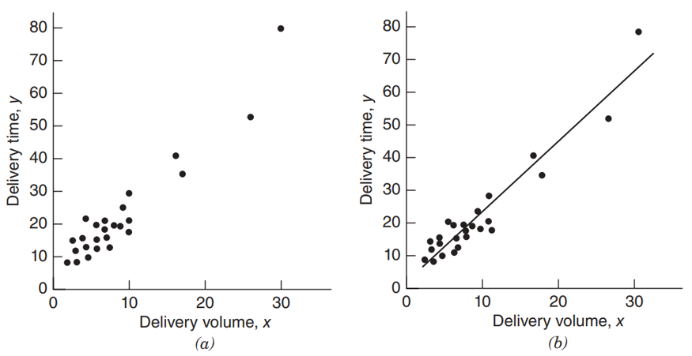
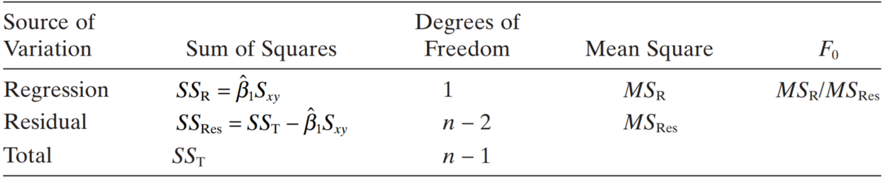
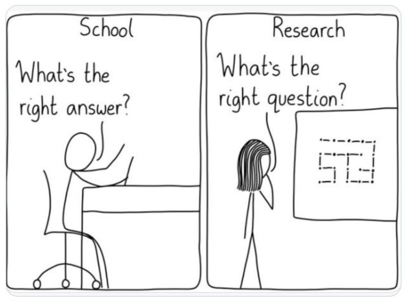
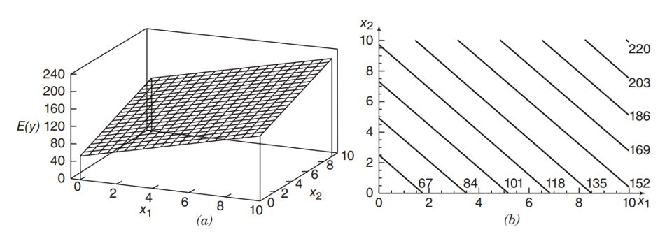

```{r}

library(tidyverse)
library(plotly)
library(broom)
library(kableExtra)
library(openxlsx)
library(emmeans)
library(performance)

```

## Agenda {.bloques}

* Preguntas generadoras
* Introducción
* Fuentes de datos
* Pasos en una regresión
* ANOVA
* Multicolinealidad
* Interpretación


## Preguntas generadoras {.bloques}

* ¿Qué es una regresión?
* ¿Por qué son importantes los supuestos de aplicación de regresión? 
* ¿Qué relación guardan los estadísticos de regresión con lo aprendido en intervalos de confianza? 
* ¿Cómo se relacionan ANOVA y regresión?
* ¿Qué es multicolinealidad? 

# Regresión Lineal Simple (RLS) {.bloques}

## Introducción {.bloques}

* >[All models are wrong, but some are useful - *George E. P. Box*]{.hi}

* El [análisis de regresión]{.ul} es una técnica estadística para investigar y modelar la relación entre variables. 
* Las aplicaciones de las regresiones son numerosas y se presentan prácticamente en todos los campos.

## Regresión {.bloques}

* En su forma más simple se representa por: 
* $$y= \beta_0+\beta_1 x + \varepsilon$$
  * lo cual corresponde a un modelo de regresión lineal simple.
* Por convencionalismo, a $x_i$ se le conoce como variable [independiente]{.hi}, predictor o regresor.

* Por otro lado, $y$ es conocida como variable [dependiente]{.hi} o respuesta.

## Regresión {.bloques}

* Otra forma de escribir el modelo anterior es en función de la esperanza matemática.

* $$E(y|x) = E(\beta_0+\beta_1 x + \varepsilon) \\ \rightarrow \hat{y}=\beta_0+\beta_1 x$$

  * Note que desaparece el término aleatorio $\varepsilon$, la razón se explica más adelante.

* Donde $\beta_0$ es el intercepto y $\beta_1$ es la pendiente. 

## Regresión {.bloques}

* La diferencia entre los valores observados de $y$ y el resultado esperado de la regresión $\hat{y}$ se llama error o residuo ($e = y- \hat{y}$), el cual estima al error aleatorio $\varepsilon$. 

* El error $\varepsilon$ se supone que debe seguir una distribución normal con media cero ($\mu = 0$) y desviación estándar constante $\sigma$.
* $$\varepsilon \sim N(0, \sigma^2)$$

  * Note que la esperanza de una distribución normal es igual a $\mu$ y que en este caso $\mu=0$, por eso desaparece el término $\varepsilon$ en el slide anterior. 

* El [no cumplir con este requisito tiene sus consecuencias]{.hi}. Más adelante lo estudiaremos.

## Regresión {.bloques}

:::::: {.columns}

::: {.column width="40%"}

* El error ($e$) explica por qué [no todos los puntos]{.hi} caen sobre la línea recta en la imagen de la derecha. Lo cual corresponde a la dispersión observable. 

:::

::: {.column .img-fit width="80%"}



:::

::::::

## Regresión {.bloques}

* Cuando hay más de un regresor, el modelo se conoce como [regresión lineal múltiple]{.hi}.

* $$y = \beta_0+\beta_1 x_1 +\beta_2 x_2 + \cdots + \beta_k x_k + \varepsilon$$

* El objetivo de un análisis de regresión es determinar los parámetros desconocidos en el modelo de regresión.
  * ¿Cuáles son esos parámetros? Pues $\beta_i$.
  
# Regresión lineal simple (RLS) {.bloques}

## Estimación de $\beta_i$ {.bloques}

* El método que se emplea para estimar una regresión lineal (simple o múltiple) es el de mínimos cuadrados ordinarios ([MCO]{.hi}). Se parte del hecho de que los $\beta_i$ son desconocidos y se estiman a partir de una muestra.

  * MCO busca minimizar $\sum e_i^2$, en el siguiente slide hay una representación visual de esta ecuación. 

* >La calidad de los modelos depende de la calidad de los datos, ya sean de fuentes secundarias o primarias. Pueden existir sesgos de medición, omisión de variables o correlaciones espurias. 

## Estimadores MCO - Explicación visual {.bloques}

:::::: {.columns}

::: {.column}

```{=html}

<div id="ols-wrapper">

<div id="ols-demo"></div>

<div id="controls">

Intercepto β₀  
<input id="b0" type="range" min="-2" max="5" step="0.1" value="1">

&nbsp;&nbsp;&nbsp;

Pendiente β₁  
<input id="b1" type="range" min="-1" max="2" step="0.05" value="0.7">

<p id="sse"></p>

</div>

<div id="credit">

Inspirado por:  
<a href="https://setosa.io/ev/ordinary-least-squares-regression/" target="_blank">
setosa.io — Ordinary Least Squares Regression
</a>

</div>

</div>

<script src="https://d3js.org/d3.v7.min.js"></script>

<style>

#ols-wrapper{
width:1800px;
height:740px;
display:flex;
flex-direction:column;
justify-content:space-between;
}

#ols-demo{
flex:1;
}

.axis text{
font-size:26px;
}

.axis path,
.axis line{
stroke-width:2;
}

#controls{
font-size:28px;
}

#controls input{
width:400px;
}

#sse{
font-size:34px;
margin-top:10px;
}

#credit{
font-size:18px;
opacity:0.8;
}

</style>

<script>

const width = 1800
const height = 520
const margin = 90

const svg = d3.select("#ols-demo")
.append("svg")
.attr("width", width)
.attr("height", height)

const data = [
{ x:1, y:2 },
{ x:2, y:3 },
{ x:3, y:2.5 },
{ x:4, y:5 },
{ x:5, y:4.2 },
{ x:6, y:6 },
{ x:7, y:5.5 }
]

const x = d3.scaleLinear()
.domain([0,8])
.range([margin,width-margin])

const y = d3.scaleLinear()
.domain([0,7])
.range([height-margin,margin])

svg.append("g")
.attr("class","axis")
.attr("transform",`translate(0,${height-margin})`)
.call(d3.axisBottom(x))

svg.append("g")
.attr("class","axis")
.attr("transform",`translate(${margin},0)`)
.call(d3.axisLeft(y))

svg.selectAll("circle")
.data(data)
.enter()
.append("circle")
.attr("cx", d=>x(d.x))
.attr("cy", d=>y(d.y))
.attr("r",10)

const regressionLine = svg.append("line")
.attr("stroke","#C18A00")
.attr("stroke-width",5)

const residualGroup = svg.append("g")
const squareGroup = svg.append("g")

function update(beta0,beta1){

regressionLine
.attr("x1",x(0))
.attr("y1",y(beta0))
.attr("x2",x(8))
.attr("y2",y(beta0+beta1*8))

residualGroup.selectAll("*").remove()
squareGroup.selectAll("*").remove()

let sse = 0

data.forEach(d=>{

const yhat = beta0 + beta1*d.x
const e = d.y - yhat
const size = Math.abs(y(d.y)-y(yhat))

sse += e*e

residualGroup.append("line")
.attr("x1",x(d.x))
.attr("x2",x(d.x))
.attr("y1",y(d.y))
.attr("y2",y(yhat))
.attr("stroke","red")
.attr("stroke-width",2)
.attr("stroke-dasharray","6")

squareGroup.append("rect")
.attr("x",x(d.x))
.attr("y",Math.min(y(d.y),y(yhat)))
.attr("width",size)
.attr("height",size)
.attr("fill","rgba(200,0,0,0.3)")

})

d3.select("#sse").text("SSE = "+sse.toFixed(2))

}

function refresh(){
const b0 = +document.getElementById("b0").value
const b1 = +document.getElementById("b1").value
update(b0,b1)
}

document.getElementById("b0").oninput = refresh
document.getElementById("b1").oninput = refresh

refresh()

</script>

```


:::

::::::

## Estimadores MCO {.bloques}

:::::: {.columns}

::: {.column}

* Para una regresión lineal simple de la forma $\hat{y}=\beta_0+\beta_1 x$

$$\hat{\beta_1}=\frac{S_{xy}}{S_{xx}} \\ \hat{\beta_0}= \bar{y}-\hat{\beta_1} \bar{x}$$

:::

::: {.column}

* Donde: 

$$S_{xx} = \sum_{i=1}^{n}(x_i-\bar{x})^2 \\ S_{xy} = \sum_{i=1}^{n} (x_i-\bar{x}) \cdot (y_i-\bar{y})$$

:::

::::::

## Estimadores MCO - Forma matricial {.bloques}

:::::: {.columns}

::: {.column}

* El modelo de regresión lineal simple se puede escribir matricialmente de la siguiente forma 

$$y=X\beta + \varepsilon$$

* Y los estimadores MCO se pueden obtener de forma matricial empleando

$$\hat{\beta} = (X^TX)^{-1}X^Ty$$
:::

::::::

## Ejemplo 01 {.bloques}

* La resistencia al cizallamiento (*deformación mecánica producida por fuerzas paralelas, opuestas y de igual magnitud que actúan sobre un material, haciendo que sus capas internas se deslicen entre sí*) de la unión entre los dos tipos de propelentes es una característica importante de calidad en el ensamble de un motor. Se sospecha que la fuerza de cizallamiento está relacionada con la edad, en semanas, del lote de materia prima. 
* Para ello, se han recogido 20 observaciones sobre la resistencia al cizallamiento y la edad de la materia prima.
  * Puede acceder a los datos y la solución de este y otros ejemplos en este [Excel](https://stevenggoni.github.io/clases/data/II-1123_04_Datos y ejercicios resueltos.xlsx){target="_blank"}. 

## Ejemplo 01 {.bloques}

:::::: {.columns}

::: {.column style="font-size: 0.585em;"}

```{r}

ej01 <- openxlsx::read.xlsx("data/II-1123_04_Datos y ejercicios resueltos.xlsx", 
                            sheet = 1)

ej01[1:10, ] %>% 
  cbind(ej01[11:20, ]) %>% 
  knitr::kable(format = "html") %>%
  kableExtra::kable_styling()
  

```


:::

::: {.column width="60%"}

### Actividad en grupos

* Estime la recta de regresión con MCO, si conoce de álgebra de matrices, resuélvalo también de esa forma. 
* Respuesta: 

$$
\hat{y}=267.82-37.15 x
$$

* Obtenga, además, un gráfico de dispersión. 
  * En Excel, el gráfico de dispersión permite obtener la ecuación de regresión

:::

::::::

## Ejemplo 01 {.bloques}

:::::: {.columns}

::: {.column}

```{r}

# Ajustar el modelo
modelo <- lm(`Resistencia(y)` ~ `Edad(x)`, data = ej01)

# Extraer coeficientes
b0 <- round(coef(modelo)[1], 2)
b1 <- round(coef(modelo)[2], 2)

# Crear la ecuación como texto
eq <- paste0("y = ", b0, " + ", b1, "x")

# Graficar con anotación
g01 <- ej01 %>%
  ggplot2::ggplot(aes(x = `Edad(x)`, y = `Resistencia(y)`)) +
  geom_point(size = 5, color = "#263247") +
  geom_smooth(method = lm, se = FALSE, color = "#C18A00", linewidth = 2) +
  annotate("text", x = 18, y = 2600, label = eq, color = "black", size = 10) +
  theme_bw()

plotly::ggplotly(g01, height = 740, width = 1800) %>% 
  plotly::layout(paper_bgcolor = "#F1F5F5",
                 plot_bgcolor  = "#F1F5F5",
                 font = list(size = 30),
                 xaxis = list(
                   title = list( font = list(size = 30)),
                   tickfont = list(size = 25)),
                 yaxis = list(title = list(font = list(size = 30)),
                              tickfont = list(size = 25)),
                 legend = list(title = list(font = list(size = 25)),
                               font = list(size = 20),
                               bgcolor = "#F1F5F5"))


```

:::

::::::

## Ejemplo 01 {.bloques}

* Ahora, para el mismo conjunto de datos, obtenga una estimación de la respuesta, es decir $\hat{y}$.
* Con base en esta, estime el error (también conocido como [residuos]{.hi}) y obtenga la suma de todos los residuos. 
  * $$e = y-\hat{y}$$
* En teoría este valor debe ser cero o aproximadamente cero. De forma matricial, lo puede obtener de esta manera:
  * $$\hat{\varepsilon}=y-X\hat{\beta}$$

## Regresión {.bloques}

* Así como se han obtenido los valores de la esperanza $E(y|x)$, también se pueden obtener los valores de la varianza $V(y|x)$.

* En adición a la estimación de $\beta_i$, la estimación de $\sigma^2$ es necesaria para probar un contraste de hipótesis. 

## Regresión {.bloques}

* Se introduce el concepto de suma de cuadrados, por ejemplo, la suma de cuadrados del error ($SS_e$) es:

* $$SS_e = \sum_{i=1}^{n}(y_i-\hat{y}_i)^2 = \sum_{i=1}^{n}e_i^2$$

* La varianza es, entonces, $s^2= \frac{SS_e}{df_e}=MS_e$, donde $df$ son grados de libertad y $MS_e$ es el cuadrático medio del error. Tome en cuenta que los términos $SS$, $MS$ y $df$ son acrónimos en inglés. Sus equivalentes al español son $SC$, $CM$ y $gl$.

## Ejemplo 01 {.bloques}

:::::: {.columns}

::: {.column}

* Obtenga, para los datos del ejemplo 01, la $SS_e$.
  * $$166\, 254.86$$
* Obtenga además el valor de $s^2$
  * $$9\, 236.38$$

:::

::: {.column}

* Y el valor de $s$
  * $$96.11$$
* >Resuelva también con álgebra matricial.

:::

::::::

## Otras sumas de cuadrados {.bloques}

* La suma de cuadrados totales
* $$SS_T=\sum_{i=1}^{n} y_i^2 - n\bar{y}^2$$
  * Esto es matemáticamente equivalente a $SS_T=\sum_{i=1}^{n}(y_i-\bar{y})^2$

* [Ejemplo 01]{.hi}

* Obtenga la suma de cuadrados totales $SS_T$ para el ejemplo desarrollado. 
  * $SS_T= 1\, 693 \, 737.60$
  
## Pruebas de hipótesis e IC {.bloques}

* A menudo estamos interesados en probar hipótesis y construir intervalos de confianza acerca de los parámetros del modelo construido. Para ello vamos a recurrir al ya conocido `t-test` (Prueba t) y se aplica al intercepto y la pendiente. La hipótesis de prueba es
  * $$H_o: \beta_i=0\\ H_i: \beta_i \ne 0$$
* Siempre o casi siempre se hace de esta manera pues se busca determinar si el coeficiente $\beta_i$ tiene o no un efecto "verdadero" sobre la variable de respuesta $y$.
  * >Nota: tome en cuenta que pueden existir implicaciones prácticas que no estén siendo detectadas por pruebas estadísticas. 

## Pruebas de hipótesis e IC {.bloques}

* Cuando se rechaza la hipótesis nula se dice que el [coeficiente es significativo]{.hi}. Recuerde además, que, para la media:
* Intervalo de confianza: 
  * $$\theta \pm EE \cdot t_{\frac{\alpha}{2}}$$
* Prueba de hipótesis: 
  * $$t_0=\frac{\hat{\beta_i}- \mu}{EE}$$
  * donde $\mu$ es típicamente igual a cero ($\mu=0$).

  
## Error estándar ($EE$) {.bloques}

* ¿Cómo obtenemos el error estándar ($EE$)?
  * En inglés $SE$.

* El error estándar se obtiene como:
  * $$EE_{\beta_1}=\sqrt{\frac{MS_e}{S_{xx}}}$$
  
  * $$EE_{\beta_0} = \sqrt{MS_e \cdot \left(\frac{1}{n} + \frac{\bar{x}^2}{S_{xx}}\right)}$$

## Error estándar ($EE$) {.bloques}

* De forma [matricial]{.hi}

* $$EE = \sqrt{[s^2 (X^TX)^{-1}]_{jj}}$$

* Para facilitar la interpretación, se aclara que el $jj$ se refiere a la diagonal de la matriz resultante. El tamaño de la diagonal debe ser igual a la cantidad de coeficientes $\beta_i$.
 
## Ejemplo 01 {.bloques}

:::::: {.columns}

::: {.column width="30%"}

* Continue con el ejemplo 01, usando tanto las fórmulas regulares como las matriciales. 

$$EE_{\beta_1} = 2.88$$

$$EE_{\beta_0} = 44.18$$
Hasta el momento hemos construido gran parte de la tabla de la derecha. Obtenga el valor t ($t_0$) y el Valor P.

:::

::: {.column}

```{r}

data.frame(Término = c("\\(\\beta_0\\)", "\\(\\beta_1\\)", "Error"), 
           gl = c(1, 1, 18), 
           Coeficiente = c(2627.82, -37.15, NA), 
           EE = c(44.18, 2.89, NA), 
           `\\(t_0\\)` = c(59.47, -12.86, NA), 
           "Valor P" = c(0, 0, NA), 
           check.names = FALSE) %>% 
  knitr::kable(format = "html", escape = FALSE) %>%
  kableExtra::kable_styling()

```

* Con esta información, construya ahora el intervalo de confianza y concluya sobre la prueba y el estudio. Para el ejemplo utilice un 95 % de confianza. 

```{r}

data.frame(IC = c("\\(\\beta_0\\)", "\\(\\beta_1\\)"), 
           Inferior = c(2535, -43.22),
           Superior = c(2720.65, -31.08),
           check.names = FALSE) %>% 
  knitr::kable(format = "html", escape = FALSE) %>%
  kableExtra::kable_styling()

```


:::

::::::

## ANOVA {.bloques}

* Lo que acabamos de llevar a cabo es una prueba de hipótesis [sobre la esperanza matemática]{.hi} de los coeficientes de regresión, pero también se puede hacer sobre las [estimaciones de la varianza]{.hi}. 
* Esto se conoce como análisis de varianza (ANOVA) y para ello, se retoman los conceptos de suma de cuadrados.

## ANOVA {.bloques}

* $$SS_T =  SS_R + SS_e$$

* Donde: 

* $$SS_R = \hat{\beta}_1 \cdot S_{xy} \\ SS_T = \sum_{i=1}^{n} y_i^2 - n\bar{y}^2 \\ SS_e = \sum_{i=1}^{n}(y_i - \hat{y}_i)^2 = \sum_{i=1}^{n}e_i^2$$


## ANOVA {.bloques}

* Al dividir cada una de las sumas de cuadrados (**SS**) por sus grados de libertad se obtiene el cuadrático medio (**MS**), el cual es una [estimación de la varianza]{.hi}. 

* La prueba de hipótesis que se sigue para dos varianzas es la prueba F
* $$F_i = \frac{CM_i}{CM_e}$$

## ANOVA {.bloques}

:::::: {.columns}

::: {.column .img-fit width="100%"}


Ahora, construya la tabla ANOVA para el ejemplo 01.

```{r}

data.frame(Término = c("Regresión", "Residuos", "Total"),
           GL = c(1, 18, 19), 
           SS = c(1527482.74, 166254.86, 1693737.60),
           MS = c(1527482.74, 166254.86/18, 1693737.60/19),
           F = c(165.38, NA, NA), 
           "Valor P" = c(8e-11, NA, NA), 
           check.names = FALSE) %>% 
  knitr::kable(format = "html", escape = FALSE) %>%
  kableExtra::kable_styling()

```


:::

::::::

## ¿Qué tan bueno es el modelo? {.bloques}

* En regresión lineal múltiple se avanza más en este concepto: bondad de ajuste de una regresión. 
  * Como se interpreta y los cuidados que hay que tener.
* No obstante, aquí tenemos un indicador de bondad de ajuste, el $R^2$, el cual expresa la proporción de variabilidad que está siendo explicada por el modelo. 

* $$R^2= \frac{SS_R}{SS_T} = \frac{1\,527\,482.74}{1\,693\,737.60}=0.9018=90.18\%$$

## Entonces, ¿Qué es ANOVA? {.bloques}

* ANOVA es un [caso especial de la regresión]{.hi}, son *básicamente* lo mismo. 
  * ANOVA puede expresarse como un modelo de regresión con variables categóricas.
* En ANOVA los predictores suelen llamarse factores.
* En lugar de aplicarse una prueba t, se aplica una prueba F.
  * Ambas, t y F están íntimamente relacionadas con la distribución normal.
* ANOVA típicamente tiene más utilidad cuando el/los predictores son categorías.

## ¿Cuándo usar regresión o ANOVA? {.bloques}

:::::: {.columns}

::: {.column width="60%"}

* >Basado en el material de [PhD. Rosana Ferrero](https://www.linkedin.com/posts/rosanaferrero_stats-datascience-cienciadedatos-activity-7434612804478898177-DOsE?utm_source=social_share_send&utm_medium=member_desktop_web&rcm=ACoAAA83150Bf-LU4oknXo29sx1LY72N2sH0I_c){target="_blank"}

* Cada vez son más importantes las preguntas que se hacen que las respuestas que se obtienen, en este sentido, ¿qué está evaluando?.

* Si el interés reside en [comparar grupos]{.hi}, es más apropiado un ANOVA. Si por el contrario se desea estudiar la [asociación entre variables]{.hi} es mejor utilizar una regresión. 

:::

::: {.column .img-fit width="60%"}



:::

::::::

## ¿Cómo se relacionan? {.bloques}

* Cuando los predictores son categóricos, ANOVA y regresión son “matemáticamente idénticos” (en términos de las inferencias que se pueden obtener del estadístico de prueba).
* Cuando son continuos, ANOVA es una medida de la [significancia de la regresión]{.hi}. 
* Prácticamente cualquier software va a presentar regresión y ANOVA en un mismo reporte. 
  * Por ejemplo, Minitab presenta primero la regresión y por debajo un ANOVA.
* En el caso del Ejemplo 01, como el predictor es continuo podemos contrastar la hipótesis de que la regresión es significativa
  * Como el valor P es ~ 0, se puede decir que la regresión es significativa a prácticamente cualquier nivel de confianza.

## Utilidad {.bloques}

* Para sacar el máximo provecho de ANOVA como caso especial de regresión debemos avanzar hacia la regresión lineal múltiple. 
* Se necesita entender, además, el concepto de variable *dummy*.

## Variables categóricas (*dummy*) {.bloques}

* Es importante comprender que regresión y ANOVA solo “trabajan” con variables numéricas y [no con categorías]{.hi}. 
* Las variables *dummy* solucionan este problema, convirtiendo las 𝑛 categorías en $n-1$ variables cuantitativas binarias.
* Son $n-1$ porque de incluirse el regresor $x_n$ se generaría una combinación lineal, como las estudiadas en álgebra. Y eso haría a la regresión colineal.
  * El concepto de colinealidad se abordará luego. 

## Ejemplo 02 {.bloques}

* Suponga una situación en la que se requiere evaluar la resistencia de dos tipos distintos de telas.
* Las telas son A y B, para A los resultados son: 
  * A: 8, 9, 7, 10, 6, 8, 9
  * B: 5, 6, 5, 4, 6, 5, 7

* Realice una regresión y un ANOVA para estas variables

* Los datos y la solución se encuentran en el mismo [Excel](https://stevenggoni.github.io/clases/data/II-1123_04_Datos y ejercicios resueltos.xlsx){target="_blank"} anterior.

## Ejemplo 02 - Codificación {.bloques}

* El primer paso es convertir las variables categóricas a "continuas". Para ello hay que escoger una categoría de referencia que NO va a formar parte de la regresión. Por conveniencia muchos software seleccionan [la primera en orden alfabético]{.hi}. 
* Una vez hecho esto, resuelva siguiendo la misma secuencia de pasos del ejemplo 01.

## Ejemplo 02 {.bloques}

```{r}

ej02 <- openxlsx::read.xlsx("data/II-1123_04_Datos y ejercicios resueltos.xlsx", 
                            sheet = 4, 
                            check.names = FALSE)

```


:::::: {.columns}

::: {.column style="font-size: 0.63em;"}

### Datos

```{r}

ej02 %>% 
  knitr::kable(format = "html") %>%
  kableExtra::kable_styling()

```


:::

::: {.column style="font-size: 0.63em;"}

### Variables codificadas

```{r}

fastDummies::dummy_cols(ej02, select_columns = "Tela(x)") %>% 
  dplyr::select(c(-1)) %>% 
  dplyr::select(2:3,1) %>% 
  knitr::kable(format = "html") %>%
  kableExtra::kable_styling()

```


:::

::: {.column style="font-size: 0.63em;"}

### Eliminación de la colinealidad

```{r}

fastDummies::dummy_cols(ej02, select_columns = "Tela(x)") %>% 
  dplyr::select(c(-1)) %>% 
  dplyr::select(3,1) %>% 
  knitr::kable(format = "html") %>%
  kableExtra::kable_styling()

```

:::

::::::

## Ejemplo 02  {.bloques}

:::::: {.columns}

::: {.column}

### Regresión

```{r}

ej02 %>% 
  lm(`Resistencia(y)` ~ `Tela(x)`, data = .) %>% 
  broom::tidy() %>% 
  setNames(c("Término", "Estimador", "EE", "Valor T", "Valor P")) %>% 
  knitr::kable(format = "html") %>%
  kableExtra::kable_styling()

```

### ANOVA

```{r}

ej02 %>% 
  aov(`Resistencia(y)` ~ `Tela(x)`, data = .) %>% 
  broom::tidy() %>% 
  setNames(c("Término", "GL", "SS", "MS", "Valor F", "Valor P")) %>% 
  knitr::kable(format = "html") %>%
  kableExtra::kable_styling()


```


:::

::::::

## Interpretación {.bloques}

* En este caso $\beta_1$ representa a la tela B. Entonces se puede decir que cuando se use la tela B se espera una reducción en el [promedio]{.hi} de la resistencia de 2.71, pues el estimador es negativo. 
* En este sentido A, es una [categoría de referencia]{.hi} que toma el valor de cero (0).
  * Promedio de $A=8.1429−2.7143\cdot0=8.1429$
  * Promedio de $B=8.1429−2.7143\cdot1=5.4286$
* Observe el rombo en el siguiente gráfico, este corresponde a la media por cada tela, si está viendo esta presentación en su versión web, pose el cursor sobre el mismo y contraste los valores mostrados contra los obtenidos. 

## Interpretación {.bloques}

:::::: {.columns}

::: {.column}

```{r}

g02 <- ej02 %>%
  ggplot2::ggplot(aes(x = `Tela(x)`, y = `Resistencia(y)`, color = `Tela(x)`)) +
  geom_point(size = 3) +
  stat_summary(fun = mean, geom = "point", 
               size = 8, shape = 9, color = "#331114") +
  theme_bw()

plotly::ggplotly(g02, height = 740, width = 1800) %>% 
  plotly::layout(paper_bgcolor = "#F1F5F5",
                 plot_bgcolor  = "#F1F5F5",
                 font = list(size = 30),
                 xaxis = list(
                   title = list( font = list(size = 30)),
                   tickfont = list(size = 25)),
                 yaxis = list(title = list(font = list(size = 30)),
                              tickfont = list(size = 25)),
                 legend = list(title = list(font = list(size = 25)),
                               font = list(size = 20),
                               bgcolor = "#F1F5F5"))

```

:::

::::::

# Regresión lineal múltiple (RLM) {.bloques}

## Regresión lineal múltiple {.bloques}

:::::: {.columns}

::: {.column width="45%"}

Cuando un modelo de regresión involucra más de una variable predictora. Por ejemplo de la forma: 

$$y = \beta_0+\beta_1 x_1+\beta_2 x_2 + \cdots + \beta_k x_k + \varepsilon$$


:::

::: {.column .img-fit width="100%"}



:::

::::::

## Interacciones {.bloques}

* Es importante que tome en cuenta que los modelos de regresión lineal múltiple también pueden incluir interacciones, de la forma:
* $$y = \beta_0 + \beta_1 x_1 + \beta_2 x_2 + \beta_3 x_1 x_2 + \varepsilon$$

* Incluir interacciones puede ayudar a mejorar la precisión de los modelos, pero éstas deben de tener un sentido, enmarcado en un contexto. 

# Pasos de una RLM {.bloques}

## Pasos en la construcción de una RLM {.bloques}

::: {.iframe-card}
<iframe data-src="diagramas/pasos_regresion.html" title="Pasos de una RLM"></iframe>
:::

## Importante {.bloques}

* A partir de este punto el abordaje de las técnicas se realiza con apoyo de software estadístico.
* La lógica de las fórmulas es la misma, pero la complejidad de cálculo aumenta.

* Cada paso de la secuencia anterior será abordado mediante el Ejemplo 03, que se muestra en el siguiente slide.

## Ejemplo 03 {.bloques}

* Un ingeniero industrial está modelando el tiempo de entrega ($y$) en minutos de una bebida en diferentes locales de un centro comercial según el número de cajas a entregar ($x_1$) y la distancia en ft ($x_2$) que tiene que recorrer la persona. 

* La intención con este ejemplo, es crear una regresión lineal múltiple desde el inicio. 

* La base de datos se encuentra en este [Excel](https://stevenggoni.github.io/clases/data/II-1123_04_Datos y ejercicios resueltos.xlsx){target="_blank"}. 


## Datos + Teoría {.bloques}

::: {.iframe-card}
<iframe data-src="diagramas/datos_teoria.html" title="Pasos de una RLM"></iframe>
:::

## Datos + Teoría {.bloques}

* Resaltan dos aspectos importantes, la entrada del proceso es la combinación de datos + teoría. Y esto es un detalle VITAL en el proceso estadístico. 

* No en todas las ocasiones se le va a proveer un conjunto de datos para que haga la regresión, creer que siempre será así es muy inocente. En muchas ocasiones es usted en su rol como persona ingeniera quien tiene que decidir cuántos y cuáles datos recoger.
  * Por ello la relevancia del tema de muestreo. 
  
## ¿Por qué es importante? {.bloques}

* La estadística es una [herramienta]{.hi}, NO un objetivo
* El [contexto]{.hi} define el propósito de la estadística. Cada uno tiene sus propias necesidades, preguntas y limitaciones y [esto influye en cómo se aplican y analizan]{.ul} las técnicas estadísticas.
* Los resultados estadísticos deben interpretarse en función del contexto. Un mismo dato puede tener implicaciones [muy diferentes]{.hi} dependiendo de la situación. 
* Sin contexto, la estadística puede ser malinterpretada o incluso [manipulada]{.hi} para respaldar conclusiones erróneas.

## Especificación del modelo {.bloques}

::: {.iframe-card}
<iframe data-src="diagramas/especificacion.html" title="Pasos de una RLM"></iframe>
:::

## Especificación del modelo {.bloques}

* Con base en los datos y [la teoría]{.hi}, se especifica el modelo de regresión que se desea estimar. 

* Algunas herramientas computacionales le permiten "probar" múltiples modelos, esto, desde luego, es una forma válida de hacer las cosas, pero no se debe obviar que la teoría es la que dicta si un resultado tiene sentido o no. 

  * Además, para probar esto, debe haber recolectado los datos. ¿Recolectaría datos sin estar seguro? ¿Invertiría dinero en medir variables que no va a usar? 

* Por ejemplo, nos podríamos preguntar si es necesario (y lógico según la teoría) que dos variables interactúen. En este caso, podríamos querer un modelo de este tipo:
* $$y_{ij}= \beta_0 + \beta_1 x_1 + \beta_2 x_2 + \beta_3 x_1 x_2 + e_{ij}$$

## Especificación del modelo {.bloques}

* Nótese que el diagrama que se le provee es [iterativo]{.hi} o cíclico, es decir, no se tiene que *"casar"* con el primer modelo que especifique. 
* Dos o tres pasos hacia delante en el diagrama tiene la oportunidad de regresar a la especificación del modelo para mejorar su ajuste.  

## Ejemplo 03 -  Especificación {.bloques}

* Para el caso de tiempo de entrega, se especifica un modelo, con base en la [teoría aplicable]{.hi}, con esta forma: 

* $$y[min] = \beta_0 + \beta_1 x_1 + \beta_2 x_2 + e $$

* Donde el objetivo es minimizar la respuesta y $x_1$ y $x_2$ son el número de cajas y la distancia recorrida, respectivamente. Se aclara que el min en la ecuación es de minutos, no de minimizar. 

## Estimación de parámetros {.bloques}

::: {.iframe-card}
<iframe data-src="diagramas/estimacion.html" title="Pasos de una RLM"></iframe>
:::

## Estimación de parámetros {.bloques}

* Los parámetros ($\beta_i$) especificados en el modelo [son desconocidos]{.hi} y deben ser estimados con base en una [muestra]{.hi}.
  * De nuevo, recuerde las bases de muestreo.
* Esta estimación se realiza mediante MCO (Mínimos Cuadrados Ordinarios). El detalle de las fórmulas es trivial, ya que su estimación por software está más que extendida.
  * Además, ya fue abordado el caso en RLS. 
  
## Una anotación relevante {.bloques}

* Hoy por hoy el método predominante o más utilizado (desde los 70’s, formalizados por John Nelder y Robert Wedderburn) para la estimación de parámetros es el de máxima verosimilitud (ML – Maximum Likelihood).
* Los estimadores [ML y MCO son iguales siempre que se cumplan los supuestos]{.hi} de regresión (que más adelante serán estudiados), principalmente el de normalidad.
  * Maximizar la verosimilitud produce exactamente el mismo estimador que minimizar $\sum e_i^2$. Por ello, MCO sigue válido y ampliamente utilizado. 
* No obstante, en Modelos Lineales Generales (GLM), donde el error no es normal (binomial, Poisson, Exponencial, etc.) se utiliza ML para la estimación de los coeficientes de regresión. 

## Ejemplo 03 - Estimación {.bloques}

:::::: {.columns}

::: {.column}

* Los coeficientes estimados son: 

```{r}

ej03 <- openxlsx::read.xlsx("data/II-1123_04_Datos y ejercicios resueltos.xlsx", 
                            sheet = 6)

mod1 <- lm(y ~ x1 + x2,
           data = ej03)

mod1 %>% 
  broom::tidy() %>% 
  dplyr::mutate(across(where(is.numeric), ~ round(.x, 3))) %>% 
  setNames(c("Término", "Estimador", "EE", "Valor T", "Valor P")) %>% 
  knitr::kable(format = "html") %>%
  kableExtra::kable_styling()

```

* Cuya ecuación de regresión es: 

```{r}

equatiomatic::extract_eq(mod1, use_coefs = TRUE, coef_digits = 3)

```

:::

::::::

## Ejemplo 03 - Estimación {.bloques}

:::::: {.columns}

::: {.column}

* El resultado de ANOVA es: 

```{r}

mod1 %>% 
  aov() %>% 
  broom::tidy() %>% 
  dplyr::mutate(across(where(is.numeric), ~ round(.x, 3))) %>% 
  setNames(c("Término", "Estimador", "EE", "Valor T", "Valor P")) %>% 
  knitr::kable(format = "html") %>%
  kableExtra::kable_styling()

```

:::

::::::

## Verificación de la adecuación del modelo {.bloques}

::: {.iframe-card}
<iframe data-src="diagramas/adecuacion.html" title="Pasos de una RLM"></iframe>
:::

## Verificación de la adecuación del modelo {.bloques}

* Este apartado se refiere, entre otras cosas, a varios **supuestos** que se deberían cumplir: 
  * La relación entre $x$ y $y$ debería ser [lineal]{.hi}, al menos aproximadamente.
  * El error debe tener media 0 ($\mu = 0$).
  * El error debe tener varianza constante $\sigma^2$ ([Homocedasticidad]{.hi})
  * Los errores deben ser [independientes]{.hi} (no correlacionados)
  * Los errores deben estar [normalmente]{.hi} distribuidos.

## Supuestos {.bloques}

* ¿Qué es un error o un residuo?
  * En simple, es la diferencia entre el valor observado ($y$) y el valor estimado ($\hat{y}$).
  * En ocasiones puede ser conveniente presentar los [residuales estandarizados]{.hi}.
    * Estandarizado se refiere a que se le aplica la transformación $z$.
    * Como es una transformación lineal, los resultado que va a obtener son los mismos, salvo que posiblemente algunos softwares o algoritmos grafiquen histogramas ligeramente diferentes. 
  * Esto ayuda a detectar datos extraños (fuera de 3 desviaciones), basándose en la distribución normal.  
* Una forma de verificar los supuestos es mediante pruebas gráficas.
  * Y se recomienda empezar por esto. 

## Ejemplo 03 - Supuestos {.bloques}

:::::: {.columns}

```{r funcion_lm}

diag_lm_plots <- function(modelo, 
                          tipo_residuos = c("regular", "estandarizado")){

  tipo_residuos <- match.arg(tipo_residuos)

  if(tipo_residuos == "regular"){
    residuos_vec <- resid(modelo)
    nombre_res <- "Residuos"
  } else {
    residuos_vec <- as.numeric(scale(resid(modelo)))
    nombre_res <- "Residuos estandarizados"
  }

  residuos <- data.frame(residuos = residuos_vec,
                         y_hat_lineal = fitted(modelo))
  
  n <- nrow(residuos)

  # tests
  p_sw <- scales::pvalue(shapiro.test(residuos$residuos)$p.value)
  p_ks <- scales::pvalue(nortest::lillie.test(residuos$residuos)$p.value)
  p_ad <- scales::pvalue(nortest::ad.test(residuos$residuos)$p.value)

  xmin <- min(residuos$y_hat_lineal)
  xmax <- max(residuos$y_hat_lineal)
  
  q_sample <- quantile(residuos$residuos, c(.25, .75))
  q_theo   <- qnorm(c(.25, .75))
  
  slope <- diff(q_sample) / diff(q_theo)
  intercept <- q_sample[1] - slope * q_theo[1]
  
  etiqueta_tests <- paste("Valor P (SW) =", p_sw, "\n",
                          "Valor P (KS) =", p_ks, "\n",
                          "Valor P (AD) =", p_ad)
  
  # QQ plot
  p1 <- ggplot(residuos, aes(sample = residuos)) +
    stat_qq(color = "#263247") +
    geom_abline(slope = slope,
                intercept = intercept,
                color = "#C18A00",
                linetype = 2) +
    labs(x = nombre_res,
         y = "Cuantiles teóricos")+
    theme_bw()
  
  # Histograma
  p2 <- ggplot2::ggplot(residuos, ggplot2::aes(residuos)) +
    geom_histogram(bins = round(1+log2(n)),
                   color = "#C18A00",
                   fill = "#263247") +
    labs(x = nombre_res, 
         y = "Frecuencia") +
    theme_bw()
  
  # Residuos vs ajustados
  p3 <- ggplot2::ggplot(residuos,
                        ggplot2::aes(y_hat_lineal, residuos)) +
    ggplot2::geom_point(color = "#263247", size = 2.5) +
    geom_segment(x = xmin,
                 xend = xmax,
                 y = 0,
                 yend = 0,
                 linetype = 2,
                 color = "#C18A00") +
    ggplot2::labs(x = "Valores ajustados", 
                  y = nombre_res) +
    ggplot2::theme_bw()
  
  # Residuos vs orden
  p4 <- ggplot2::ggplot(residuos,
                        ggplot2::aes(seq_len(n), residuos)) +
    ggplot2::geom_point(color = "#263247", size = 2.5) +
    ggplot2::geom_line(color = "#263247") +
    ggplot2::geom_hline(yintercept = 0,
                        linetype = 2,
                        color = "#C18A00") +
    ggplot2::labs(x = "Observaciones", y = nombre_res) +
    ggplot2::theme_bw()
  
  # convertir a plotly
  p1_i <- plotly::ggplotly(p1) %>% 
    plotly::layout(annotations = list(list(x = 0.02,
                                           y = 0.98,
                                           xref = "paper",
                                           yref = "paper",
                                           xanchor = "left",
                                           yanchor = "top",
                                           text = etiqueta_tests,
                                           showarrow = FALSE,
                                           bgcolor = "#263247",
                                           font = list(color = "white", 
                                                       size = 12))))
  p2_i <- plotly::ggplotly(p2)
  p3_i <- plotly::ggplotly(p3)
  p4_i <- plotly::ggplotly(p4)
  
  p <- plotly::subplot(
    p1_i, p2_i,
    p3_i, p4_i,
    nrows = 2,
    margin = 0.06,
    shareX = FALSE,
    shareY = FALSE
  )
  
  p %>% plotly::layout(
    annotations = list(
      list(text = "QQ-Plot",
           x = 0.15, y = 1.05,
           xref = "paper", yref = "paper",
           showarrow = FALSE,
           font = list(size = 16)),
      
      list(text = "Histograma",
         x = 0.75, y = 1.05,
         xref = "paper", yref = "paper",
         showarrow = FALSE,
         font = list(size = 16)),

    list(text = "Residuos vs Ajustes",
         x = 0.15, y = 0.48,
         xref = "paper", yref = "paper",
         showarrow = FALSE,
         font = list(size = 16)),

    list(text = "Residuos vs Orden",
         x = 0.78, y = 0.48,
         xref = "paper", yref = "paper",
         showarrow = FALSE,
         font = list(size = 16))
  )
)
}

```

::: {.column width="50%"}

### Residuos regulares

```{r}

fig <- diag_lm_plots(mod1)

fig <- fig %>% 
  layout(paper_bgcolor = "#F1F5F5",
         plot_bgcolor  = "#F1F5F5",
         font = list(size = 30),
         xaxis  = list(title = list(font = list(size = 30)),
                       tickfont = list(size = 25)),
         yaxis  = list(title = list(font = list(size = 30)),
                       tickfont = list(size = 25)),
         xaxis2 = list(title = list(font = list(size = 30)),
                       tickfont = list(size = 25)),
         yaxis2 = list(title = list(font = list(size = 30)),
                       tickfont = list(size = 25)),
         xaxis3 = list(title = list(font = list(size = 30)),
                       tickfont = list(size = 25)),
         yaxis3 = list(title = list(font = list(size = 30)),
                       tickfont = list(size = 25)),
         xaxis4 = list(title = list(font = list(size = 30)),
                       tickfont = list(size = 25)),
         yaxis4 = list(title = list(font = list(size = 30)),
                       tickfont = list(size = 25)))

fig$height <- 650
fig$width  <- 850

fig

```

:::

::: {.column width="50%"}

### Residuos estandarizados

```{r}

fig <- diag_lm_plots(mod1, "estandarizado")

fig <- fig %>% 
  layout(paper_bgcolor = "#F1F5F5",
         plot_bgcolor  = "#F1F5F5",
         font = list(size = 30),
         xaxis  = list(title = list(font = list(size = 30)),
                       tickfont = list(size = 25)),
         yaxis  = list(title = list(font = list(size = 30)),
                       tickfont = list(size = 25)),
         xaxis2 = list(title = list(font = list(size = 30)),
                       tickfont = list(size = 25)),
         yaxis2 = list(title = list(font = list(size = 30)),
                       tickfont = list(size = 25)),
         xaxis3 = list(title = list(font = list(size = 30)),
                       tickfont = list(size = 25)),
         yaxis3 = list(title = list(font = list(size = 30)),
                       tickfont = list(size = 25)),
         xaxis4 = list(title = list(font = list(size = 30)),
                       tickfont = list(size = 25)),
         yaxis4 = list(title = list(font = list(size = 30)),
                       tickfont = list(size = 25)))

fig$height <- 650
fig$width  <- 850

fig

```

:::

::::::

## De forma gráfica {.bloques}

:::::: {.columns}

::: {.column}

### Normalidad

* Se puede observar en el QQ-plot y en el histograma

Los residuales deben seguir la recta del gráfico de probabilidad (o QQ-plot). El histograma debe tener la forma de una distribución normal.

:::

::: {.column}

### Homocedasticidad

* Se puede observar en el gráfico de residuos vs ajustes.

Los residuales graficados contra el valor ajustado no deben presentar patrones, como formas de trompeta, en cualquier dirección o ambas de forma simultánea. Sino que debe observarse un comportamiento aleatorio. 


:::

::: {.column}

### Independencia

* Se puede observar en el gráfico de residuos vs orden. 

Los residuales graficados contra el orden en que se tomaron no deben presentar patrones con forma de tendencia. Sino que debe observarse un comportamiento aleatorio. 


:::

::::::

## De forma analítica {.bloques}

:::::: {.columns}

::: {.column width="40%"}

### Normalidad

También existen las pruebas analíticas. Algunas de ellas son:

  * Anderson-Darling
  * Ryan-Joiner
  * Shapiro-Wilk
  * Cramer-Von Mises
  * Kolmogorov-Smirnov

Recuerde la clase de bondad de ajuste para distribuciones. 


:::

::: {.column width="30%"}

### Homocedasticidad

* Bartlett
* Levene
* Comparaciones múltiples
* Breusch-Pagan

:::

::: {.column width="30%"}

### Independencia

* Breusch-Godfrey
* Durbin-Watson

:::

::::::

## Importante {.bloques}

* Las pruebas analíticas [no son de aplicación indiscriminada]{.hi}. Existen condiciones bajo las cuales interesaría aplicar una u otra. Cuando se vaya a aplicar una de estas [se debe entender]{.hi} los motivos por los cuales fue seleccionada. 
* En ocasiones es más que suficiente con la forma gráfica. 

# ¿Por qué son importantes los supuestos? {.bloques}

## Primero ... {.bloques}

* Hay que comprender que es relativamente común no cumplir con los supuestos de aplicación de regresión y ANOVA. 
* La forma más sencilla de corregirlo, es entender lo que provoca el incumplimiento. 
* Antes de hacer algún cambio drástico, [puede]{.hi} ser suficiente con volver a especificar el modelo (agregar o quitar términos en la ecuación).
  * Recuerde el diagrama de pasos de regresión. Si el modelo no es adecuado, se busca especificar otro modelo. No debería ser su primera opción tratar de cambiar los datos. 

## Verificación de la adecuación del modelo {.bloques}

::: {.iframe-card}
<iframe data-src="diagramas/adecuacion.html" title="Pasos de una RLM"></iframe>
:::

## ¿Por qué se deben cumplir los supuestos?  {.bloques}

* En el caso de la [normalidad]{.hi}, no cumplir con este supuesto es un indicativo de que la esperanza matemática de los residuales no es ya, necesariamente cero ni con varianza $\sigma^2$. 
* Cuando este supuesto no se cumple es una señal de que el modelo ajustado “no es bueno” en ciertos intervalos, por ejemplo en las colas, donde suelen desviarse los valores de la línea teórica central. 
* A la postre, [el incumplimiento de la normalidad suele afectar la estimación del error estándar (SE)]{.hi}.
  * Recuerde que el SE o EE es vital en el cálculo del Valor P, si el EE se calcula mal, entonces el valor P también. 
  
## ¿Por qué se deben cumplir los supuestos?  {.bloques}

* Como medida remedial, primero se debe investigar la causa del incumplimiento y corregirlo de ser posible (desde la forma en que se recolectaron los datos, hasta la especificación del modelo). Es importante saber determinar si de los datos y la teoría se espera que NO HAYA un comportamiento normal, lo cual está bien que así sea.
* Puede recurrir (*con mucha cuidado y prácticamente como última opción*) a transformaciones no lineales como Box-Cox (tema de otro curso o de estudio individual si se requiriese).
* También existen los modelos lineales generales (la regresión que estudiamos es uno de estos modelos), aunque con mayor dificultad de cálculo, se prefieren sobre las transformaciones.

## ¿Por qué se deben cumplir los supuestos?  {.bloques}

* Interpretar con cautela: 
* > *Por lo general, si los demás supuestos se cumplen, el tamaño de muestra es adecuado y la recolección de datos es adecuada, los resultados no se ven afectados sustancialmente por desviaciones [ligeras]{.hi} a la normalidad.*

* Por eso no vale la pena, en regresión, penalizar en exceso el incumplimiento de la normalidad. 

## ¿Por qué se deben cumplir los supuestos?  {.bloques}

* En el caso de la [homocedasticidad]{.hi}, al incumplirla habría consecuencias en el método de estimación de MCO. Los estimadores de los coeficientes seguirían siendo insesgados, pero [la estimación de los errores estándar de estos parámetros no sería válida]{.hi}. 
  * Puede notarse al ver la fórmula matricial estudiada en RLS.
* Por esta razón los intervalos de confianza construidos y por tanto el valor P no se pueden interpretar normalmente. 
* Como medida remedial se pueden seguir los mismos consejos que con normalidad.

## ¿Por qué se deben cumplir los supuestos?  {.bloques}

* Si los residuales están relacionados entre si (autocorrelación), no se cumpliría con el supuesto de [independencia]{.hi}. En este caso los estimadores MCO siguen siendo insesgados pero los errores estándar son inconsistentes. 
* Incumplir con este supuesto es el "peor" de los escenarios, ya que es el más difícil de solucionar y en ocasiones es imposible. 
* Una medida remedial es recurrir a modelos de auto-regresión y análisis de series de tiempo. 
  * Pero solo es válida si el estudio es intrinsecamente dependiente, no subsana errores de diseño que provoquen este incumplimiento. 

## Recordemos {.bloques}
* Ahora bien, tratemos de entender a qué se refiere con que no se puede interpretar bien al valor P.
* En simple, cada coeficiente de la regresión está siendo sometido a una prueba t. 
* $$\theta \pm EE \cdot t_{\frac{\alpha}{2}}$$
* El valor P, depende del $EE$.
* Por eso, tanto en regresión como en ANOVA no se debe leer solo el valor P al final de la tabla. Sino que se analiza cada parte como un elemento que conforma un todo. 

## Ejemplo comparativo {.bloques}

:::::: {.columns}

::: {.column style="font-size: 0.95em;"}

* Sin entrar en detalles de que es un modelo Poisson, se aclara que este es el correcto.
  * Este un perfecto ejemplo de que es un modelo lineal general. 
* En el primer modelo, la regresión que estamos estudiando, no está cumpliendo los supuestos. 
* Note la diferencia entre los EE y en consecuencia en los valores P. [Los coeficientes se estiman razonablemente bien]{.hi}, pero los [errores estándar (EE) están mal estimados]{.hi} y por tanto, todo de ahí en adelante se estima mal también. Lo que lo puede llevar a conclusiones erróneas. 


:::

::: {.column style="font-size: 0.81em;"}

<table>
<thead>
<tr>
<th colspan="5" style="text-align:center; font-size:1.3em;">Regresión normal</th>
</tr>
<tr>
<th>Término</th>
<th>Coeficiente</th>
<th>EE</th>
<th>Valor T</th>
<th>Valor P</th>
</tr>
</thead>

<tbody>
<tr>
<td>β₀</td>
<td>7.455</td>
<td>0.543</td>
<td>13.721</td>
<td>0.0000026</td>
</tr>
<tr>
<td>β₁</td>
<td>4.909</td>
<td>0.729</td>
<td>6.735</td>
<td>0.0002687</td>
</tr>

<tr>
<th colspan="5" style="text-align:center; font-size:1.3em;">Regresión Poisson</th>
</tr>
<tr>
<th>Término</th>
<th>Coeficiente</th>
<th>EE</th>
<th>Valor T</th>
<th>Valor P</th>
</tr>

<tr>
<td>β₀</td>
<td>7.452</td>
<td>0.884</td>
<td>8.428</td>
<td>0.0000000</td>
</tr>
<tr>
<td>β₁</td>
<td>4.935</td>
<td>1.089</td>
<td>4.531</td>
<td>0.0000059</td>
</tr>

<tr>
<th colspan="5" style="text-align:center; font-size:1.3em;">Diferencia porcentual</th>
</tr>

<tr>
<td>β₀</td>
<td>0.039%</td>
<td>38.548%</td>
<td>62.801%</td>
<td></td>
</tr>
<tr>
<td>β₁</td>
<td>0.531%</td>
<td>33.079%</td>
<td>48.634%</td>
<td></td>
</tr>

</tbody>
</table>

:::

::::::

## Ejemplo 03 - Adecuación del modelo {.bloques}
:::::: {.columns}

::: {.column width="50%"}

### Gráficos

```{r}

fig <- diag_lm_plots(mod1)

fig <- fig %>% 
  layout(paper_bgcolor = "#F1F5F5",
         plot_bgcolor  = "#F1F5F5",
         font = list(size = 30),
         xaxis  = list(title = list(font = list(size = 30)),
                       tickfont = list(size = 25)),
         yaxis  = list(title = list(font = list(size = 30)),
                       tickfont = list(size = 25)),
         xaxis2 = list(title = list(font = list(size = 30)),
                       tickfont = list(size = 25)),
         yaxis2 = list(title = list(font = list(size = 30)),
                       tickfont = list(size = 25)),
         xaxis3 = list(title = list(font = list(size = 30)),
                       tickfont = list(size = 25)),
         yaxis3 = list(title = list(font = list(size = 30)),
                       tickfont = list(size = 25)),
         xaxis4 = list(title = list(font = list(size = 30)),
                       tickfont = list(size = 25)),
         yaxis4 = list(title = list(font = list(size = 30)),
                       tickfont = list(size = 25)))

fig$height <- 650
fig$width  <- 850

fig

```

:::

::: {.column width="50%"}

* Dado que hay algunas dudas sobre la normalidad, se procede a realizar pruebas analíticas. En este caso, en pos de la didáctica, se realizan 3 de ellas. ¿Cuál deberíamos analizar?
* Con un 90 % de confianza, se puede rechazar la $H_o$ de que los residuos siguen la distribución normal. Tanto por la forma de los gráficos, como por la prueba SW.

:::

::::::

## Ejemplo 03 - Re-especificación del modelo {.bloques}

* ¿Cómo lo soluciono? La forma más recomendada es la de re-especificar el modelo y re-estimar los parámetros. 

* Esto involucra incluir otras variables o agregar interacciones. En este caso es razonable pensar que puede haber una interacción entre $x_1$: cantidad de cajas y $x_2$: distancia recorrida.

* $$y= \beta_0 + \beta_1 x_1 + \beta_2 x_2 + \beta_3 x_1 x_2 + \varepsilon$$

## Ejemplo 03 - Re-estimación del modelo {.bloques}

:::::: {.columns}

::: {.column}

* Los coeficientes estimados son: 

```{r}

mod2 <- lm(y ~ x1*x2,
           data = ej03)

mod2 %>% 
  broom::tidy() %>% 
  dplyr::mutate(across(where(is.numeric), ~ round(.x, 3))) %>% 
  setNames(c("Término", "Estimador", "EE", "Valor T", "Valor P")) %>% 
  knitr::kable(format = "html") %>%
  kableExtra::kable_styling()

```

* Cuya ecuación de regresión es: 

```{r}

equatiomatic::extract_eq(mod2, use_coefs = TRUE, coef_digits = 3)

```

:::

::::::

## Ejemplo 03 - Adecuación del modelo {.bloques} 

:::::: {.columns}

::: {.column width="70%"}

### Gráficos

```{r}

fig <- diag_lm_plots(mod2)

fig <- fig %>% 
  layout(paper_bgcolor = "#F1F5F5",
         plot_bgcolor  = "#F1F5F5",
         font = list(size = 30),
         xaxis  = list(title = list(font = list(size = 30)),
                       tickfont = list(size = 25)),
         yaxis  = list(title = list(font = list(size = 30)),
                       tickfont = list(size = 25)),
         xaxis2 = list(title = list(font = list(size = 30)),
                       tickfont = list(size = 25)),
         yaxis2 = list(title = list(font = list(size = 30)),
                       tickfont = list(size = 25)),
         xaxis3 = list(title = list(font = list(size = 30)),
                       tickfont = list(size = 25)),
         yaxis3 = list(title = list(font = list(size = 30)),
                       tickfont = list(size = 25)),
         xaxis4 = list(title = list(font = list(size = 30)),
                       tickfont = list(size = 25)),
         yaxis4 = list(title = list(font = list(size = 30)),
                       tickfont = list(size = 25)))

fig$height <- 650
fig$width  <- 1250

fig

```

:::

::: {.column width="30%"}

* Ahora observe el comportamiento de los residuos en este nuevo modelo. 

* Discuta con la persona docente y estudiantes. 

:::

::::::

# ¿Qué más puedo hacer si no se cumplen los supuestos? {.bloques}

## Alternativas ante el incumplimiento de supuestos {.bloques}

* Lo que se aborda en esta sección tiene como fin el evitar que la persona estudiante piense que “se acaba el mundo” cuando esto sucede. 
* Las alternativas aquí mencionadas no serán todas, necesariamente, abordadas en el curso o incluso en la carrera. 
  * No obstante, es importante que sepa que puede hacer cuando esto le ocurra, para que pueda proceder con el estudio individual.

## Alternativas {.bloques}

* [Transformaciones]{.hi}

  * Útil para problemas de normalidad y homocedasticidad
  * Tiene sus amplias desventajas, sobre todo de interpretación.
  * Aunque existen transformaciones que combaten esas desventajas.

* Las más comunes son Box - Cox y Johnson. Con base en criterios de complejidad, se prefiere a la primera sobre la segunda. 

* Aunque son son la alternativa más popular, pero no se deben aplicar a la ligera. 
  * Antes de aplicar una transformación que cambie la interpretación de los datos, es mejor plantearse usar el modelo correcto.
  * Antes de aplicar una transformación, debe someterse a juicio si los datos son intrínsecamente no normales o si devienen de un problema de muestreo, precisión de la medición, entre otros. 

## Alternativas {.bloques}

* [ANOVA no paramétrico]{.hi}

  * Se conoce como Kruskal-Wallis.
  * Útil para problemas de normalidad y homocedasticidad
  * Muchas desventajas: 
    * Cantidad de factores (no existen ANOVA no paramétricos para más de dos factores).
    * El tamaño de los intervalos generados (muy anchos).
  * Este tópico será abordado con detalle en este curso. 

## Alternativas {.bloques}

* [Regresiones robustas]{.hi}

  * Útil para problemas de normalidad y homocedasticidad
  * Desventaja: 
    * Complejos de comprender y estimar
  * En este curso solo se mencionan como una alternativa:
    * Huber
    * Regresión con kernels
    * Loess
  * Recuerde que en este curso abordamos la prueba de Levene, la cual es "resistente" al incumplimiento de la normalidad. Estas siguen la misma idea. 
  
## Alternativas {.bloques}

* [Modelos autorregresivos]{.hi}

  * Útil para problemas con la independencia
  * Tienen mucha complejidad, una forma de solucionarlo es con modelos de series de tiempo con intervención. 
    * No se aborda en este curso
  * Generalmente solo se recurre a ellos cuando los datos son intrínsecamente dependientes en el tiempo, y NUNCA por errores en la recolección de datos. 
    * Si hubiese errores de este tipo, se invalidan los resultados.

## Alternativas {.bloques}

* [Modelos lineales generalizados]{.hi}

  * Útil para problemas de normalidad y homocedasticidad.
  * Aunque un poco más complejo que regresión y ANOVA clásico, es la opción más viable y la que se prefiere sobre las transformaciones u otros de naturaleza similar.
  * No se aborda en este curso, pero su mención es importante, incluye modelos binarios, de Poisson, exponenciales, entre otros. Por prácticamente cada distribución de probabilidad estudiada en estos cursos, se puede hacer un modelo lineal general. 
  * En otros cursos estudiará los modelos binarios como técnicas de clasificación de datos (Machine Learning).

## Alternativas {.bloques}

* [Estadística Bayesiana]{.hi}

  * Útil para problemas de normalidad y homocedasticidad y convergencia en modelos muy complejos
  * Es un enfoque bastante más complejo, pero cada vez más popular.
  * No se aborda en este curso y salvo algunas aplicaciones, no se aborda en la carrera. 

# Continuamos con la adecuación del modelo {.bloques}

## Indicadores de bondad de ajuste {.bloques}

* Como parte de la verificación de la adecuación del modelo se tienen índices de bondad de ajuste que se pueden clasificar en absolutos, relativos y comparativos. 
* En ese curso se van a estudiar algunos de ellos. 

## Coeficiente determinación $R^2$ {.bloques}

* Es una medida con la que se puede saber qué tanto está acertando o fallando el modelo. Este mide qué tan grandes son los residuos.
* Este es un estadístico que debe analizarse con cuidado, pues [siempre crece a medida que se añaden términos en el modelo]{.hi}, aun cuando estos no tengan un aporte real o significativo sobre la variable.

* $$R^2= 1 -\frac{SS_e}{SS_T}$$

## Coeficiente determinación $R^2$ {.bloques}

* El valor de $R^2$ es engañoso, pues como se dijo anteriormente, siempre crece, sin importar si el predictor que se incluye es valioso o no.

* Para eso casos existe una versión ajustada

* $$R^2_{adj}= 1 -\frac{MS_e}{MS_T}$$

* El $R^2_{adj}$ penaliza la inclusión de predictores o variables que no aportan al modelo. Este valor es siempre menor que $R^2$.

## Coeficiente determinación $R^2$ {.bloques}

* Por ello se recomienda que su interpretación se realice de forma conjunta, tanto $R^2$ como $R^2_{adj}$. Una diferencia grande ($\sim >3\%$) entre estos dos valores implicaría que en el modelo hay (o mejor dicho puede haber) términos no significativos y que por ende puede ser prudente eliminarlos para obtener un modelo limpio. 

* Básicamente, se busca aplicar el principio de parsimonia. Por tanto se aconseja siempre presentar modelos “limpios”. 

## ¿Cómo se interpreta? {.bloques}

:::::: {.columns}

::: {.column}

* Clásicamente, se indica que los valores de $R^2$ deben ser típicamente altos (>80 %). Si nos falta contexto, esto no es ninguna mentira, pero ahí está la cuestión…
* Los datos son de “carne y hueso” y sufren de las vicisitudes del mundo real. 

{fig-align="center" width="900"}

:::

::::::

## ¿Cómo se interpreta? {.bloques}

* [Caso No. 1]{.hi}

* Hacemos un experimento físico, que debería responder a una cierta fórmula ($PV=nRT$), en condiciones de aislamiento total y absoluto. En los experimentos obtenemos un dato real (experimental) y lo comparamos el que da la fórmula. 
  * ¿Qué $R^2$ debería esperar?
* Hemos controlado que no le afecte nada, así que tendría que ser un ajuste casi perfecto. [Un valor <0.9 sería casi catastrófico]{.hi}. Pues estaríamos siendo incapaces de medir un fenómeno físico.  

## ¿Cómo se interpreta? {.bloques}

* [Caso No. 2]{.hi}

* Usamos los datos del censo, queremos analizar en qué medida los años de estudio pueden predecir un salario. Obviamente no hemos podido aislar el resto de variables que influyen sobre el sueldo (género, edad, carreras, etc).
  * ¿Qué $R^2$ debería esperar?
* No se puede explicar toda la renta de una persona con solo los estudios, así que un $R^2 = 0.3$ ya sería impactante. 
  * Con una sola variable (entre miles)  se consigue explicar un 30 % de variabilidad. 

## Como conclusión {.bloques}

* El valor de $R^2$ no es algo que haya que interpretar siempre igual para todos los conjuntos de datos. No podemos aislarlo del contexto ni de las expectativas.
* Podríamos hablar de más cosas:
  * Si $R^2>0$, ya existe una asociación, que podrá ser débil, pero existente.
  * El $R^2$ se ve influido por el tipo de relación asumida: lineal, cuadrática, exponencial, etc... En este curso las relaciones son lineales. 
* Pero el contexto es lo más importante. Si los datos pueden estar influidos por muchos factores, un $R^2$ [no tan alto puede decirnos mucho]{.hi}.

## Coeficiente determinación $R^2$ {.bloques}

* Es un indicador que puede fungir de forma relativa y comparativa. Por ejemplo: 
* [Relativo]{.hi}
  * Por ejemplo, un estudio dice que en fenómenos físicos se espera un valor mayor a 98 %. Por lo que mi modelo debe obtener un valor de $R^2$ similar para que sea válido. 
* [Comparativo]{.hi}
  * El modelo con 3 variables explica un 85 % de la variabilidad, pero al agregar una variable 4, aumenta a 90 %.
  
## Índices de información {.bloques}

* Son índices [comparativos]{.hi} que buscan que el modelo sea lo más sencillo posible, por ello, tienen incorporado una penalización por complejidad. 
* Existen varios, pero todos se interpretan igual
  * [Entre más bajo sean en comparación con otro modelo, mejor]{.hi}. 

## Índices de información {.bloques}

* Es importante anotar que la comparación solo puede hacerse en modelos anidados. Por ejemplo, en el **Ejemplo 03** tenemos dos especificaciones de modelo. 
  * El que tiene interacción y el que no. 
* El segundo está anidado en el primero. Por tanto, se pueden comparar con estos índices para decidir cuál de los dos es mejor. 
  * Son útiles en el sentido iterativo con el que se está abordando esta sesión. 
* La idea en simple: qué tan bien el modelo explica los datos, comparado con los otros, pero castigando los modelos demasiado complejos. 

## Índices de información {.bloques}

* Los índices de información más populares son: 
  * [AIC]{.hi}: Criterio de información de Akaike
  * [AICc]{.hi}: Criterio de información de Akaike corregido
  * [BIC]{.hi}: Criterio de información Bayesiano
* Estos están presentes en varios softwares estadísticos. Ambos son similares, pero BIC tiene un factor de penalización más fuerte cuando se incluyen muchas variables. Y el AICc es especialmente útil con muestras pequeñas. 
* El detalle de las fórmulas se obvia voluntariamente, pues necesitan una comprensión detallada de la logverosimilitud. Por lo que se enfatiza en su interpretación. 

## Globales del modelo {.bloques}

* El estadístico F que se obtiene de ANOVA para toda la regresión, contrasta la hipótesis de si el modelo complejo explica significativamente más que un modelo sin predictores. 
* En simple, si hay ganancia en hacer la regresión. 

## Errores de predicción {.bloques}

* Estos se enfocan en cuánto se equivocan las predicciones del modelo. 
* En algunos software como Minitab existe el PRESS (*Prediction Sum of Squares*). Un valor de PRESS menor indica un mejor modelo predictivo. 
* También se puede encontrar el valor de $S$, que es $S = \sqrt{CM_e}$, es una medida de la desviación estándar de la regresión. 

## Resumen de indicadores de bondad de ajuste {.bloques}

* En la práctica se suelen combinar varios de estos criterios. Por ejemplo: 
  * Analizar el $R^2$ para explicar la varianza, el *PRESS* para evaluar la capacidad de predicción y el AIC/BIC para comparar y decidir entre dos modelos competentes y rivales. 

## Ejemplo 03 - Adecuación del modelo {.bloques}

:::::: {.columns}

::: {.column width="30%"}

* Obtenga los indicadores de bondad de ajuste de los dos modelos estimados (con interacción y sin interacción). Compárelos y decida sobre uno de ellos. 

* En general, se prefiere el modelo con interacción, ¿verdad?
  * Explique y detalle el por qué


:::

::: {.column width="70%"}

```{r}

mod2 %>% 
  broom::glance() %>% 
  dplyr::select(c(1:5), 8:9) %>% 
  rbind(mod1 %>% 
          broom::glance() %>% 
          dplyr::select(c(1:5), 8:9)) %>% 
  setNames(c("\\(R^2\\)", "\\(R^2_{adj}\\)", "s", "Valor F (Regresión)",
             "Valor P (Regresión)", "AIC", "BIC")) %>% 
  t() %>% 
  as.data.frame() %>% 
  tibble::rownames_to_column() %>% 
  dplyr::mutate(across(2:3, ~ round(.x, 3))) %>% 
  setNames(c("Índice", "Con interacción", "Sin interacción")) %>% 
  knitr::kable(format = "html", escape = FALSE) %>%
  kableExtra::kable_styling()
  

```


:::

::::::

## Validación del modelo {.bloques}

::: {.iframe-card}
<iframe data-src="diagramas/validacion.html" title="Pasos de una RLM"></iframe>
:::

## Validación del modelo {.bloques}

* Se hace una distinción entre la adecuación del modelo y la validez del modelo. 
* Aunque este último paso con frecuencia es extenso e implica algunas técnicas que superan el alcance del curso. 
* Está dirigida a determinar [si el modelo va a funcionar en la forma en la que fue concebido]{.hi} en las condiciones o ambiente de operación. 

## Validación del modelo {.bloques}

* La validez del modelo se puede determinar de varias formas: 
  * [Contrastando los resultados obtenidos contra la experiencia previa, la teoría aplicable, entre otros]{.hi}. Por ejemplo, que la regresión indique que la gravedad es negativa no tendría lógica.
  * [Recolectando nuevos datos]{.hi} y contrastando estos valores contra los valores predichos por la ecuación del modelo. 
  * [Partición de datos]{.hi}, es decir, partir los datos recolectados en dos partes. Se emplea una para hacer la estimación y la otra parte para validar que el modelo funcione.

## Ejemplo 03 - Validación del modelo {.bloques}

* Con la información disponible, valide el modelo seleccionado del Ejemplo 03.

* Discuta en grupos. ¿Considera que se debe reespecificar el modelo? 

* Si no, el modelo está listo para ser usado. 

# Multicolinealidad {.bloques}

## Introducción {.bloques}

* Vale la pena aclarar que el análisis de multicolinealidad se puede realizar como parte de la revisión de la [adecuación]{.hi} del modelo.

* El uso e interpretación de los modelos de regresión múltiple dependen a menudo (explícita o implícitamente)  en la estimación de los coeficientes individuales. 
* Se supone que los regresores ($x$) deben ser independientes entre sí y dependientes con la variable de respuesta ($y$). Es por eso que los regresores deben escogerse cuidadosamente. 
* De cumplirse la primera premisa, estos serían ortogonales. 
* Cuando los regresores son ortogonales, los análisis e inferencias pueden realizarse fácilmente.

## Multicolinealidad {.bloques}

* No obstante, en ocasiones, los regresores pueden estar cerca de ser linealmente dependientes y esto provocaría que las conclusiones a las que se llega sean erróneas. 
* Esto es lo que se conoce como multicolinealidad. Esta provoca que las estimaciones sean inestables. 
* Cuando dos predictores están casi alineados, el modelo tiene problemas para decidir cuál de ellos merece el crédito, y la incertidumbre del coeficiente explota (se infla).
* A menudo la multicolinealidad se analiza con el FIV: Factor de Inflación de la Varianza. 

## FIV {.bloques}

* Es un diagnóstico de la multicolinealidad. No obstante el primer diagnóstico debe ser la teoría aplicable al construir el modelo. La fórmula para una variable $x_j$ es: 

* $$FIV_j = \frac{1}{1-R^2_j}$$
* Donde $R^2_j$ es el coeficiente de determinación obtenido al hacer una regresión donde $x_j$ se explica usando todas las demás variables explicativas. En simple, $x_j$ pasa de ser un regresor a la variable de respuesta. 
* Valores de $FIV > 10$ implica problemas serios con la multicolinealidad. Valores de $FIV > 5$ indican un posible problema y debe analizarse con cautela. 

## FIV {.bloques}

* Tome en cuenta que con frecuencia, al incluir interacciones los FIV explotan, es una consecuencia natural y estructural del modelo. Es importante entender que la interacción no es una dirección o variable nueva, sino una especie de  "curvatura".
  * En resumen, en presencia de interacciones el FIV se vuelve menos informativo. 
* También tome en cuenta que un modelo con interacción y sin interacción se interpretan de formas distintas. 

## What if...? {.bloques}

* [¿Qué pasa si la colinealidad está presente?]{.hi}
* El paso natural es eliminar la variable problemática (re-especificar el modelo), pero a veces no es posible o deseable, en ese caso se puede recurrir a al menos dos opciones: 
  * Regresión Ridge
  * Análisis de componentes principales

## Ejemplo 03 - Multicolinealidad {.bloques}

:::::: {.columns}

::: {.column width="40%"}

* Realice el análisis de multicolinealidad para los dos modelos planteados en el Ejemplo 03. Recuerde que el FIV es más relevante para el modelo [sin]{.hi} interacción que para el modelo con interacción. 

* Interprete los resultados.

:::

::: {.column width="60%"}

```{r}

data.frame(Variable = c("\\(x_1\\)", "\\(x_2\\)", "\\(x_1 x_2\\)"),
           Sin = round(c(car::vif(mod1), NA),3), 
           Con = round(c(car::vif(mod2)),3)) %>% 
  tibble::remove_rownames() %>% 
  knitr::kable(format = "html", escape = FALSE) %>%
  kableExtra::kable_styling()


```


:::

::::::

## Ejemplo 03 - Multicolinealidad {.bloques}

:::::: {.columns}

::: {.column}

### Sin interacción

```{r vifmod1}

vif_mod1 <- performance::check_collinearity(mod1)


df <- as.data.frame(vif_mod1) %>% 
  dplyr::mutate(color = case_when(VIF < 5 ~ "FIV < 5",
                                  VIF >= 5 ~ "FIV >= 5", 
                                  VIF >= 10 ~ "FIV >= 10"))

max_VIF <- round(ifelse(max(df$VIF_CI_high) < 12, 12, max(df$VIF_CI_high)))

g1 <- ggplot(df, aes(x = VIF, y = Term, color =  color)) +
  geom_point(aes(color = color), size = 4) +
  geom_errorbar(aes(xmin = VIF_CI_low, xmax = VIF_CI_high), linewidth = 1) +
  scale_color_manual(values = c("FIV < 5" = "#2E8B57", 
                                "FIV >= 5" = "#4A708B", 
                                "FIV >= 10" = "#8B3626")) +
  scale_x_continuous(limits = c(0, max_VIF), breaks = seq(0, max_VIF, 2)) +
  labs(color = "", 
       y = "Término") +
  coord_flip() +
  theme_minimal()

g1 %>% 
  plotly::ggplotly(., height = 600, width = 850) %>% 
  plotly::layout(paper_bgcolor = "#F1F5F5",
                 plot_bgcolor  = "#F1F5F5",
                 font = list(size = 25),
                 xaxis = list(
                   title = list(font = list(size = 25)),
                   tickfont = list(size = 20)),
                 yaxis = list(title = list(font = list(size = 25)),
                              tickfont = list(size = 20)),
                 legend = list(title = list(font = list(size = 25)),
                               font = list(size = 20),
                               bgcolor = "#F1F5F5"))

```


:::

::: {.column}

### Con interacción

```{r vifmod2}

vif_mod2 <- performance::check_collinearity(mod2)

df <- as.data.frame(vif_mod2) %>% 
  dplyr::mutate(color = case_when(VIF < 5 ~ "FIV < 5",
                                  VIF >= 10 ~ "FIV >= 10", 
                                  VIF >= 5 ~ "FIV >= 5"))

max_VIF <- round(ifelse(max(df$VIF_CI_high) < 12, 12, max(df$VIF_CI_high))) + 1

g2 <- ggplot(df, aes(x = VIF, y = Term, color =  color)) +
  geom_point(aes(color = color), size = 4) +
  geom_errorbar(aes(xmin = VIF_CI_low, xmax = VIF_CI_high), linewidth = 1) +
  scale_color_manual(values = c("FIV < 5" = "#2E8B57", 
                                "FIV >= 5" = "#4A708B", 
                                "FIV >= 10" = "#8B3626")) +
  scale_x_continuous(limits = c(0, max_VIF), breaks = seq(0, max_VIF, 2)) +
  labs(color = "", 
       y = "Término") +
  coord_flip() +
  theme_minimal()

g2 %>% 
  plotly::ggplotly(., height = 600, width = 850) %>% 
  plotly::layout(paper_bgcolor = "#F1F5F5",
                 plot_bgcolor  = "#F1F5F5",
                 font = list(size = 25),
                 xaxis = list(
                   title = list(font = list(size = 25)),
                   tickfont = list(size = 20)),
                 yaxis = list(title = list(font = list(size = 25)),
                              tickfont = list(size = 20)),
                 legend = list(title = list(font = list(size = 25)),
                               font = list(size = 20),
                               bgcolor = "#F1F5F5"))
  

```

:::

::::::

## Uso del modelo - Interpretación {.bloques}

::: {.iframe-card}
<iframe data-src="diagramas/uso_modelo.html" title="Pasos de una RLM"></iframe>
:::

## Interpretación de resultados {.bloques}

* Esta sección se refiere a cómo se interpretan correctamente los resultados obtenidos una vez [todo el proceso para obtener una regresión ha sido realizado]{.hi}. 
* Solo se realiza cuando el modelo está limpio, todos los supuestos se cumplen, el modelo se ha validado, etc. 
* Por tanto, esta sección NO se refiere a que solo se interpretan estos resultados

## Interpretación de resultados {.bloques}

:::::: {.columns}

::: {.column style="font-size: 0.8em;"}

### Sin interacción

$y=2.34 + 1.62 \cdot x_1 + 0.0144 \cdot x_2 + e$

* La interpretación que se da a cada coeficiente de correlación parcial ($\beta_i$) a excepción del intercepto ($\beta_0$) es la siguiente: 
  * El tiempo de entrega se aumenta en 1.62 minutos por cada caja ($x_1$) adicional, [manteniendo los demás regresores constantes]{.ul}. 
  * El tiempo de entrega se aumenta en 0.0144 minutos por cada ft ($x_2$) adicional que se deba recorrer, [manteniendo los demás regresores constantes]{.ul}. 


:::

::: {.column style="font-size: 0.78em;"}

### Con interacción

$y=7.14 + 1.014 \cdot x_1 + 0.0058 \cdot x_2 + 0.000742 \cdot x_1 x_2 + e$

* El tiempo de entrega aumenta en $1.014 + 0.000742 x_2$ minutos por cada caja adicional ($x_1$), manteniendo constante la distancia recorrida. 
  * Es decir, a mayor distancia, mayor es el tiempo adicional de entregar una caja extra. 
* El tiempo de entrega aumenta en $0.0058+0.000742 x_1$ minutos por cada ft adicional, manteniendo constante el número de cajas. 
  * Cuanto más cajas se lleven, más costoso en tiempo es recorrer distancia adicional.

:::

::::::

## Interpretación de resultados {.bloques}

:::::: {.columns}

::: {.column style="font-size: 0.8em;"}

### Sin interacción

$y=2.34 + 1.62 \cdot x_1 + 0.0144 \cdot x_2 + e$

* La interpretación de $\beta_0$ se debe realizar con cuidado (y en ocasiones ni siquiera es necesario realizarla), pues sus resultados pueden no ser coherentes. 

* Si fuese estrictamente necesario obtener un $\beta_0$ interpretable, habría que hacer una operación particular de centrado de variables. 

* La interpretación es la siguiente: 
  * Cuando se transporten cero cajas y se recorra una distancia de cero metros, el tiempo de entrega estimado es de 2.34 minutos. 


:::

::: {.column style="font-size: 0.78em;"}

### Con interacción

$y=7.14 + 1.014 \cdot x_1 + 0.0058 \cdot x_2 + 0.000742 \cdot x_1 x_2 + e$

* La interpretación es la siguiente: 
  * Cuando se transporten cero cajas y se recorra una distancia de cero metros, el tiempo de entrega estimado es de 7.14 minutos. 


:::

::::::

# ANOVA {.bloques}

## ANOVA de dos factores {.bloques}

* Como se ha detallado previamente, ANOVA y regresión son básicamente lo mismo, ANOVA es un caso especial de regresión que tiene mayor utilidad cuando se trabaja con variables categóricas. 
* Sigue los mismos supuestos que regresión, tiene los mismos indicadores de bondad de ajuste. 

## ANOVA de dos factores {.bloques}

:::::: {.columns}

::: {.column}

Tiene la siguiente forma funcional:

$$
y_{ijk} = \mu + \alpha_i + \beta_j + (\alpha\beta)_{ij} + \varepsilon_{ijk}
$$

donde:

- $y_{ijk}$: cada una de las observaciones.
- $\mu$: la media conjunta.
- $\alpha_i$: efecto del $i$-ésimo nivel del factor $A$.
- $\beta_j$: efecto del $j$-ésimo nivel del factor $B$.
- $(\alpha\beta)_{ij}$: efecto de la interacción entre el $i$-ésimo nivel del factor $A$ y el $j$-ésimo nivel del factor $B$.
- $\varepsilon_{ijk}$: desviaciones, con respecto a la media conjunta, de los valores $y_{ijk}$.


:::

::::::

## Grados de libertad {.bloques}

* Los grados de libertad en ANOVA, para los predictores, se asignan de la siguiente forma: $k-1$.
* Siendo $k$ la cantidad de niveles en la categoría. Por ejemplo, si pruebo tres grosores de lámina, los grados de libertad serán 2.
* Los grados de libertad totales son siempre $n-1$, siendo $n$ la cantidad de observaciones. Los grados de libertad del error son lo que sobra de la asignación para los predictores.

## Prueba de hipótesis {.bloques}

:::::: {.columns}

::: {.column}

* En ANOVA se realiza el siguiente contraste de hipótesis:

$$H_o: \text{Todas las medias por grupo son iguales} \\ H_i: \text{Al menos una de las medias por grupo es diferente a las demás}$$

* La respuesta a la pregunta: ¿Cuál de las medias es diferente? se responde más adelante. Claramente esta pregunta solo tiene sentido si la variable tiene más de dos categorías, por ejemplo: Color (rojo, azul y amarillo).

:::

::::::

## Ejemplo 04 - ANOVA {.bloques}

* Una empresa de materiales de construcción quiere estudiar la influencia que tienen el grosor y el tipo de templado sobre la resistencia máxima de unas láminas de acero. 
* Para ello miden el estrés hasta la rotura (variable cuantitativa dependiente) para dos tipos de templado (lento y rápido) y tres grosores de lámina (8 mm, 16 mm y 24 mm).
* Use un 90 % de confianza estadística. 

* Como en los otros ejemplos, los datos se encuentran en Excel. 

## Ejemplo 04 - ANOVA {.bloques}

:::::: {.columns}

::: {.column}

* Obtenga la tabla ANOVA para la situación descrita. Incluya desde un inicio la interacción. Analice los resultados obtenidos. 

  * ¿Es el efecto de interacción significativo? 

* Obtenga también indicadores de bondad de ajuste. 

* >Como parte de su estudio individual, verifique los supuestos del modelo y determine las acciones a seguir. 


:::

::: {.column style="font-size: 0.8em;"}

### ANOVA

```{r}

ej04 <- openxlsx::read.xlsx("data/II-1123_04_Datos y ejercicios resueltos.xlsx", 
                            sheet = 7) %>% 
  purrr::modify_at(2, as.factor)

mod4 <- aov(Resistencia ~ Templado*Grosor , data = ej04)

mod4 %>% 
  broom::tidy() %>% 
  dplyr::mutate(across(where(is.numeric), ~round(.x, 2))) %>% 
  setNames(c("Término", "GL", "SS", "MS", "Valor F", "Valor P")) %>% 
  knitr::kable(format = "html") %>%
  kableExtra::kable_styling()

```

### Indicadores de bondad de ajuste

```{r}

mod4 %>% 
  lm() %>% 
  broom::glance() %>% 
  dplyr::select(c(1:5)) %>% 
  setNames(c("\\(R^2\\)", "\\(R^2_{adj}\\)", "s", "Valor F (Regresión)",
             "Valor P (Regresión)")) %>% 
  dplyr::mutate(across(1:5, ~ round(.x, 3))) %>% 
  knitr::kable(format = "html", escape = FALSE) %>%
  kableExtra::kable_styling()

```


:::

:::::: 

## Ejemplo 04 - ANOVA {.bloques}

* Con base en los resultados obtenidos, hay evidencia para decir que la resistencia es distinta en función de los niveles de grosor y de templado. 
* Ahora, el interés de la organización es seleccionar la configuración que de la mayor resistencia. ¿Cómo obtengo esos valores? ¿Cómo doy una respuesta?

* Para ello vamos a usar una técnica llamada [comparaciones múltiples]{.hi}. Muchos softwares estadísticos ofrecen una batería de herramientas para tomar esta decisión, entre ellas: 
  * Tukey
  * Fisher
  * Bonferroni
  * Sidak

## Ejemplo 04 - Tukey {.bloques}

:::::: {.columns}

::: {.column width="40%"}

* Es una prueba bastante conservadora que calcula el intervalo de confianza [simultáneo]{.hi} al nivel de confianza especificado. Controla bien el error tipo I.
* Es muy útil cuando el tamaño de los grupos está balanceado. 

* [En el ejemplo]{.hi}
  * Esto indica que todos los grosores difieren significativamente entre sí. Dado esto, se escoge el de menor media, en este caso el grosor 8 tiene una media de 14.151.
  * Interprete para el Templado. 


:::

::: {.column style="font-size: 0.90em;"}

### Grosor

```{r}

emm1 <-emmeans::emmeans(mod4,  ~ Grosor) 

pairs(emm1, adjust = "tukey") %>% 
  as.data.frame() %>% 
  setNames(c("Contraste", "Estimado", "EE", "GL", 
             "t", "P")) %>% 
  dplyr::mutate(across(c(2:6), ~round(.x, 2))) %>% 
  knitr::kable(format = "html", escape = FALSE) %>%
  kableExtra::kable_styling()

```

### Templado

```{r}

emm2 <-emmeans::emmeans(mod4,  ~ Templado) 

pairs(emm2, adjust = "tukey") %>% 
  as.data.frame() %>% 
  setNames(c("Contraste", "Estimado", "EE", "GL", 
             "t", "P")) %>% 
  dplyr::mutate(across(c(2:6), ~round(.x, 2))) %>% 
  knitr::kable(format = "html", escape = FALSE) %>%
  kableExtra::kable_styling()

```

:::

::::::

## Ejemplo 04 - Fisher {.bloques}

:::::: {.columns}

::: {.column width="40%"}

* Aumenta el riesgo de error tipo I, pues calcula todos los intervalos de confianza de forma individual, manteniendo el $\alpha$ para cada intervalo
* Básicamente aplica varios t-test entre pares, pero no corrige por las comparaciones múltiples (Como si lo hace Tukey)


* [En el ejemplo]{.hi}
  * Se llegan a las mismas conclusiones que con Tukey, pero observe como cambian las estimaciones de los valores P. 

:::

::: {.column style="font-size: 0.90em;"}

### Grosor

```{r}

pairs(emm1, adjust = "none") %>% 
  as.data.frame() %>% 
  setNames(c("Contraste", "Estimado", "EE", "GL", 
             "t", "P")) %>% 
  dplyr::mutate(across(c(2:6), ~round(.x, 2))) %>% 
  knitr::kable(format = "html", escape = FALSE) %>%
  kableExtra::kable_styling()

```

### Templado

```{r}

pairs(emm2, adjust = "none") %>% 
  as.data.frame() %>% 
  setNames(c("Contraste", "Estimado", "EE", "GL", 
             "t", "P")) %>% 
  dplyr::mutate(across(c(2:6), ~round(.x, 2))) %>% 
  knitr::kable(format = "html", escape = FALSE) %>%
  kableExtra::kable_styling()

```

:::

::::::

## Ejemplo 04 - Bonferroni {.bloques}

:::::: {.columns}

::: {.column width="40%"}

* Calcula, como Tukey, intervalos de confianza simultáneos. 
* Es simple de aplicar, pero produce resultados más conservadoras.
* Reduce la probabilidad de falsos positivos, a costa de perder potencia. 


* [En el ejemplo]{.hi}
  * Se llegan a las mismas conclusiones que con Tukey y Fisher, pero observe como cambian las estimaciones de los valores P. 
  * Analice el comportamiento que se aprecia al aplicar las pruebas. 

:::

::: {.column style="font-size: 0.90em;"}

### Grosor

```{r}

pairs(emm1, adjust = "bonferroni") %>% 
  as.data.frame() %>% 
  setNames(c("Contraste", "Estimado", "EE", "GL", 
             "t", "P")) %>% 
  dplyr::mutate(across(c(2:6), ~round(.x, 2))) %>% 
  knitr::kable(format = "html", escape = FALSE) %>%
  kableExtra::kable_styling()

```

### Templado

```{r}

pairs(emm2, adjust = "bonferroni") %>% 
  as.data.frame() %>% 
  setNames(c("Contraste", "Estimado", "EE", "GL", 
             "t", "P")) %>% 
  dplyr::mutate(across(c(2:6), ~round(.x, 2))) %>% 
  knitr::kable(format = "html", escape = FALSE) %>%
  kableExtra::kable_styling()

```

:::

::::::

## Ejemplo 04 - Sidak {.bloques}

:::::: {.columns}

::: {.column width="40%"}

* Es, grosso modo, una variante más refinada de Bonferroni, lo que la hace ligeramente menos conservadora. 


* [En el ejemplo]{.hi}
  * Puede observar como los resultados son sumamente similares a los de Bonferroni.

:::

::: {.column style="font-size: 0.90em;"}

### Grosor

```{r}

pairs(emm1, adjust = "sidak") %>% 
  as.data.frame() %>% 
  setNames(c("Contraste", "Estimado", "EE", "GL", 
             "t", "P")) %>% 
  dplyr::mutate(across(c(2:6), ~round(.x, 2))) %>% 
  knitr::kable(format = "html", escape = FALSE) %>%
  kableExtra::kable_styling()

```

### Templado

```{r}

pairs(emm2, adjust = "sidak") %>% 
  as.data.frame() %>% 
  setNames(c("Contraste", "Estimado", "EE", "GL", 
             "t", "P")) %>% 
  dplyr::mutate(across(c(2:6), ~round(.x, 2))) %>% 
  knitr::kable(format = "html", escape = FALSE) %>%
  kableExtra::kable_styling()

```

:::

::::::

## Ejemplo 04 - Regresión {.bloques}

* Resuelva este ejercicio como una regresión lineal múltiple, no como un ANOVA y discuta con compañeros y docente sobre si la respuesta obtenida es equiparable a los resultados que se obtienen de ANOVA y comparaciones múltiples.  

# ANOVA no paramétrico {.bloques}

## Kruskal - Wallis {.bloques}

* Tiene la siguiente prueba de hipótesis sobre la mediana de más de dos grupos independientes que se aplica cuando no se cumplen los supuestos de normalidad o de varianza homogénea. 

* La idea básica que se sigue es que evalúa si las medianas de los grupos son iguales. 

* $$H_o: \widetilde{X}_A =\widetilde{X}_B =  \widetilde{X}_C \\ H_i: \text{Al menos una es diferente}$$

## Ejemplo 05 - Kruskal - Wallis {.bloques}

:::::: {.columns}

::: {.column}

* Se quiere evaluar el resultado de tres dietas en el peso de pollos en un granja. 
* Los datos se entregan en el Excel respectivo. 
* Determine si alguno de los pesos es diferente. 

* [Solución]{.hi}

  * Con los resultados obtenidos, a un 95 % de confianza, tengo evidencia suficiente para rechazar la hipótesis nula de que las dietas son iguales. 

:::

::: {.column}

```{r}

ej05 <- openxlsx::read.xlsx("data/II-1123_04_Datos y ejercicios resueltos.xlsx", 
                            sheet = 8)

kw <- broom::tidy(kruskal.test(Peso ~ Dieta, data = ej05))

kw %>%
  mutate(across(where(is.numeric), ~round(.x, 4))) %>%
  rename("Estadístico Chi-cuadrado" = statistic,
         "Grados de Libertad" = parameter,
         "Valor P" = p.value,
         "Método" = method) %>%
  kable(format = "html", caption = "Resultado de la Prueba de Kruskal-Wallis") %>%
  kable_styling(bootstrap_options = c("striped", "hover", "condensed"), 
                full_width = F, 
                position = "center") %>%
  row_spec(0, bold = T, color = "white", background = "#263247")

```


:::

::::::

## Ejercicio integrador {.bloques}

* Se realizó un estudio por parte de personas estudiantes de la carrera de Bach. en Ciencias del Movimiento Humano (CIMOHU), cuyo objetivo era examinar el efecto que tiene la posición de salida (+ y -) y el tipo de calentamiento (A, B y C) en el recorrido de 100 metros planos. Se trabajó con una población de 17 a 24 años, todos estudiantes masculinos de la sede Rodrigo Facio de la Universidad de Costa Rica. 

* Como variable de respuesta se mide el tiempo en segundos (s) que cada persona tarda en recorrer los 100 metros. Se asume que todas las mediciones son correctas y que los instrumentos de medición utilizados son adecuados. 

## Ejercicio integrador {.bloques}

* En resumen, se puede decir que la fuente de datos es correcta y que los datos se recolectaron de forma adecuada. La hipótesis que se sigue, basada en la teoría de las CIMOHU indica que si debiera existir diferencia entre el tiempo de recorrido de los 100 m planos dado los regresores estudiados. 

* Se le hace entrega de los datos, así como del ejercicio parcialmente resuelto ([enlace](https://stevenggoni.github.io/clases/data/II-1123_04_Ejercicio integrador resuelto.pdf){target="_blank"}). 
* La idea es que la persona estudiante lo realice sin ver la solución y que de ser necesario se guíe con la resolución aportada, pero que a su vez complete los elementos faltantes. 

## Bibliografía {.bloques}

:::: columns
::: {.column width="100%" style="font-size: 0.9em;"}
-   Montgomery, D.; Peck, E.; Vining, G. (2012). Introduction to Linear Regression Analysis (5th Ed). Wiley. 
    -   *Capítulo 1, 2, 3, 4, 9 y 11*
:::
::::

## Estadística multivariada: Regresión y ANOVA <br> II-1123 Estadística para Ingeniería Industrial II {.center}

### Gracias por su atención <br> Steven García Goñi<br>[steven.garciagoni\@ucr.ac.cr](mailto:steven.garciagoni@ucr.ac.cr) {.subtitle}

### Dudas o correcciones requeridas pueden solicitarse al correo
