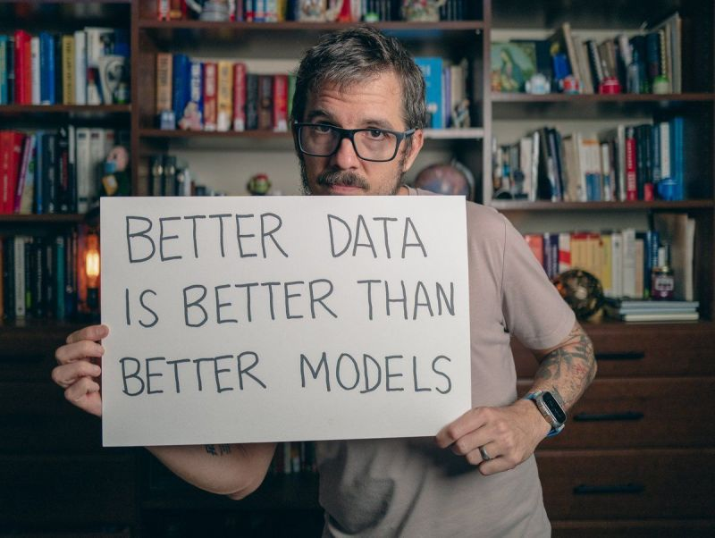
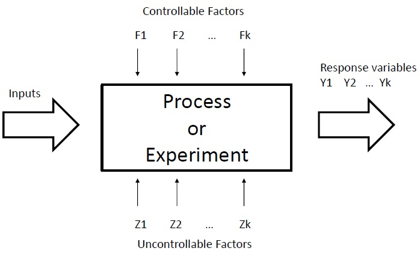
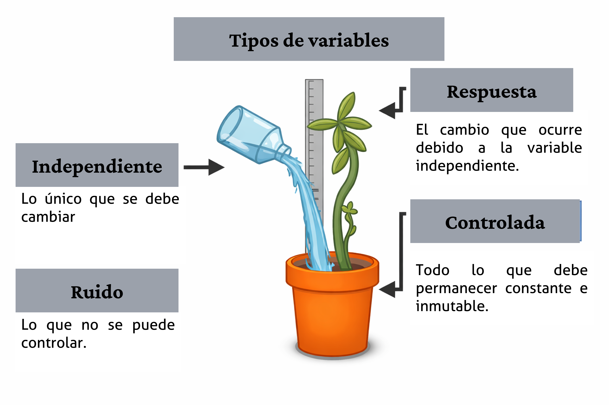
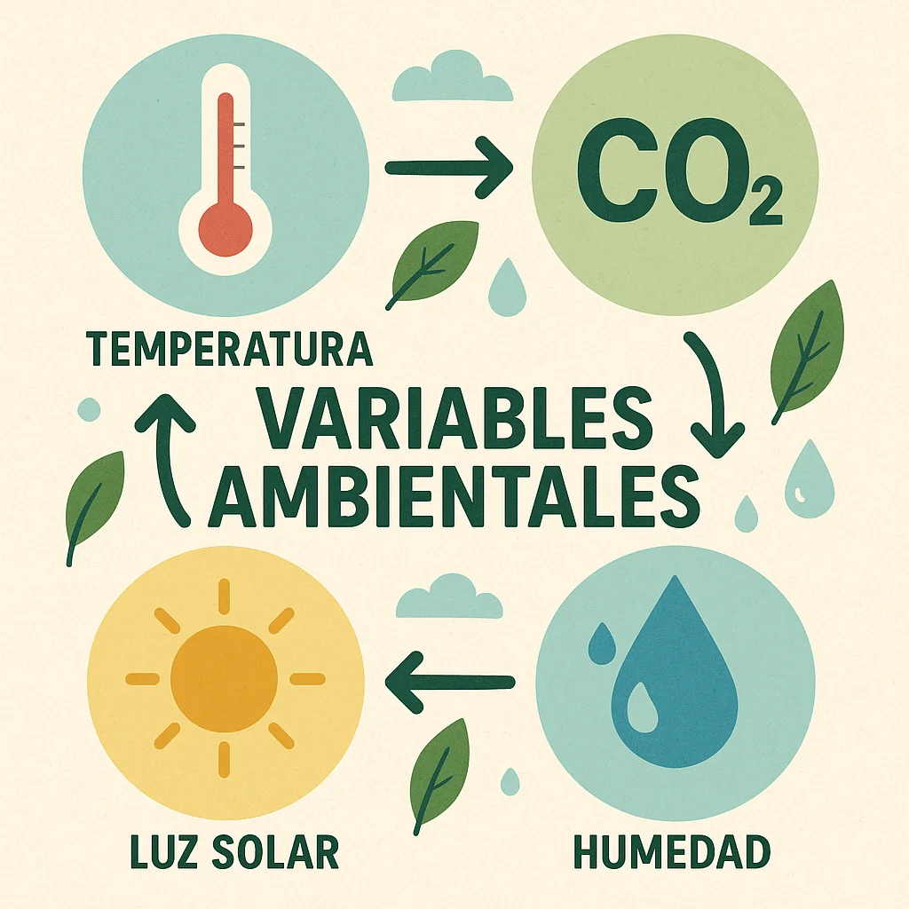
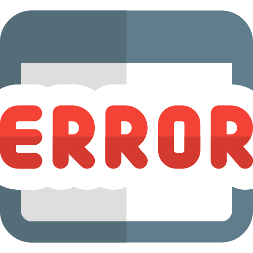
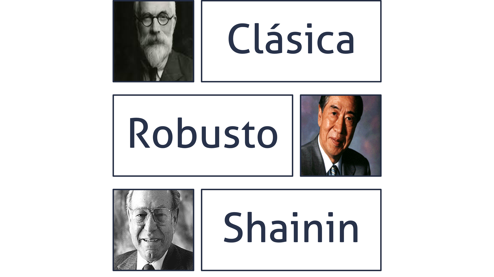
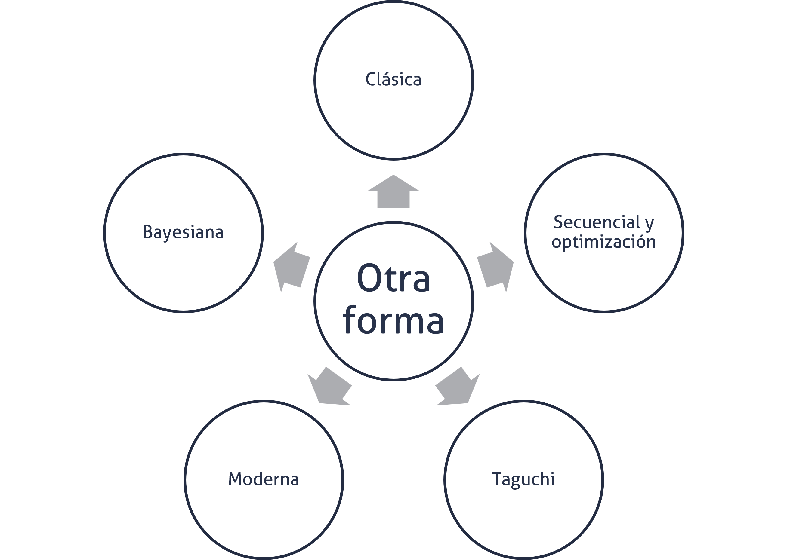

```{r}

library(tidyverse)

```

## Agenda {.bloques}

* Para qué, por qué y cuándo usar el DoE
* Terminología básica
* Escuelas del DdE
* El proceso general

## Introducción {.bloques}

* La idea con este tema es divertirnos, pero desde luego esto va a requerir trabajo. Con este tema se procura un enfoque más orientado hacia el entendimiento real de los conceptos y fundamentos del diseño de experimentos y no tanto en relación con el análisis del mismo. 

* La parte de análisis se aborda de la misma forma que en regresión y ANOVA. 

## Repaso {.bloques}

* [Estadística]{.hi}: Ciencia de recolectar, analizar y extraer conclusiones de los datos para la toma de decisiones. En este sentido los datos son usualmente recogidos a través de encuestas por muestreo, estudios observacionales o [experimentos]{.hi}.

* [Observacional]{.hi}: En un estudio observacional, las correlaciones pueden encontrarse y estimarse entre dos o más variables, pero NO se puede probar que las relaciones detectadas sean de causa efecto. 

## Diseño de experimentos {.bloques}

* Un experimento se define como una prueba o serie de pruebas en las que se realizan cambios deliberados en las variables de entrada de un proceso para observar e identificar las razones de los cambios en la respuesta de salida. 

* Es una herramienta fundamental y se considera como [parte del proceso científico]{.hi} y uno de los medios para conocer el funcionamiento de sistemas y procesos. 

## Diseño de experimentos {.bloques}

* Esto naturalmente implica, la [solución de problemas, mejoras u optimización de procesos o bien el diseño de nuevos productos y procesos]{.hi}, teniendo como fin generar conocimiento y aprendizaje de la manera más eficiente posible.

* Técnicamente el diseño estadístico de experimentos se refiere al proceso para planear el experimento de tal forma que se recaben datos adecuados que puedan analizarse con métodos estadísticos que llevarán a conclusiones válidas y objetivas.

* El DdE se usa porque es efectivo, secuencial, evolutivo y robusto. Se considera como el [“Gold Standard”]{.hi} para establecer la relación causa-efecto. 


## Recolección de datos {.bloques}

:::::: {.columns}

::: {.column}

* En todo problema experimental existen dos aspectos:
  * El diseño del experimento y por ende la recolección de los datos
  * El análisis estadístico de los datos.

* Ambos están íntimamente relacionados, porque el método de análisis depende directamente del diseño empleado.

* La recolección de los datos es tan o más importante que el propio análisis. De ahí la importancia de tener sistemas de medición adecuados.

::: 

::: {.column .img-fit}



:::

::::::


## Estrategias de experimentación {.bloques}

* [Enfoque de "mejor conjetura"]{.hi}: Es basado en el conocimiento técnico, por lo general es ineficiente si la conjetura inicial es incorrecta. 

* [Un factor a la vez (OFAT)]{.hi}: Consiste en variar un solo factor manteniendo los demás constantes. Es ineficiente y además no detecta interacciones entre factores. 

* [Experimento factorial]{.hi}: Es la estrategia correcta, donde los factores se varían en conjunto. Permite evaluar los efectos individuales y las interacciones de manera eficiente. 

## Aplicaciones típicas {.bloques}

* El diseño experimental es vital para la innovación y la mejora de procesos, permitiendo.

  * [Caracterización de procesos]{.hi}: Identificar qué factores influyen más en la respuesta.
  
  * [Optimización]{.hi}: Determinar los niveles de los factores que maximizan o minimizan un resultado.
  
  * [Diseño y formulación de productos]{.hi}: Ayuda a crear productos robustos, fáciles de fabricar y confiables
  
## Terminología {.bloques}

:::::: {.columns}

::: {.column}

* [Experimento]{.hi}

  * Cambio en las condiciones de operación de un sistema o proceso que se hace con el objetivo de medir el efecto del cambio sobre una o varias propiedades del producto o resultado, permitiendo aumentar el conocimiento acerca del sistema.
  
* [Unidad experimental]{.hi}
  
  * Es la entidad que recibe el tratamiento experimental y sobre la que se desean hacer inferencias a partir del experimento.  Para cada estudio experimental esta debe definirse de manera cuidadosa.

:::

::: {.column .img-fit}



:::

::::::

## Terminología {.bloques}

:::::: {.columns}

::: {.column .img-fit}



:::

::: {.column}

* [Variable de respuesta]{.hi}

  * Son las variables a través de las cuales se conoce el efecto de variar cada factor, en sus respectivos niveles, en el experimento. Estas por lo general son características de calidad de un producto, o variables que miden el desempeño de un proceso.

* [Variables controladas]{.hi}
  
  * Son variables que se pueden fijar en un nivel dado. Para cada una de estas existe la manera o el mecanismo para cambiar o manipular el nivel de operación; esta característica es la que hace posible experimentar con ellas.

:::

::::::

## Terminología {.bloques}

:::::: {.columns}

::: {.column}

* [Variables no controlables]{.hi}

  * A diferencia de las variables controladas, son variables que no se pueden controlar durante el experimento. Un ejemplo clásico son las variables ambientales.
  
* [Factores]{.hi}

  * Son las variables de interés que se investigan durante el experimento para determinar cómo afectan la variable de respuesta. Forman parte del conjunto de las variables controlables.
  
:::

::: {.column .img-fit width="50%"}



:::

::::::

## Terminología {.bloques}

:::::: {.columns}

::: {.column}

* [Niveles]{.hi}

  * Las diversas condiciones que se asignan a cada factor estudiado en un diseño experimental. Por ejemplo, Factor: velocidad, niveles: alto (2 m/s) y bajo (1 m/s).

* [Tratamiento]{.hi}

  * Es cada combinación de niveles de todos los factores estudiados. También se conoce como punto de diseño. 

* [Medición]{.hi}:

  * Son los valores de la variable dependiente, obtenidos de las unidades experimentales luego de la aplicación del tratamiento.

:::

::: {.column style="display: flex; align-items: center; justify-content: center;"}

```{r}

datos <- data.frame(Velocidad = c(1, 1, -1, -1),
                    Temperatura = c(1, -1, 1, -1),
                    Tratamiento = c("1 -> (1, 1)", "2", "3", "4"),
                    Respuesta = c("...", "...", "...", "..."))

datos %>% 
  knitr::kable(format = "html", escape = FALSE) %>%
  kableExtra::kable_styling(font_size = 35)

```


:::

::::::

## Terminología {.bloques}

:::::: {.columns}

::: {.column width="60%"}

* [Error aleatorio]{.hi}

  * Variabilidad que no se puede explicar por los factores estudiados y que es el resultado del pequeño efecto de los factores no estudiados y del error experimental.

* [Error experimental]{.hi}

  * Es una parte del error aleatorio y refleja los errores de la persona experimentadora en la planeación y ejecución del experimento.
  
:::

::: {.column .img-fit}



:::

::::::

## Ejemplo {.bloques}

* Una empresa fabrica ventiladores industriales y desea reducir el nivel de ruido generado durante la operación.

* Se sospecha que dos factores influyen en el ruido:

  * Tipo de aspas (A)
    * Nivel bajo: diseño estándar
    * Nivel alto: diseño mejorado
  * Velocidad de operación (B)
    * Nivel bajo: 800 rpm
    * Nivel alto: 1200 rpm

* La respuesta medida será el nivel de ruido en decibeles (dB).

## Ejemplo {.bloques}

* ¿Cuál es la unidad experimental?

  * Cada ventilador sobre el que se aplica una combinación específica de factores.
  
* Si se prueba nuevamente el tratamiento 1 sobre otro ventilador independiente, eso constituye una réplica.

* Suponga que algunas pruebas se realizan en la mañana y otras en la tarde, cada uno de estos turnos sería un bloque. El turno de trabajo no es un factor de interés, pero podría afectar el ruido medido.

# Escuelas del DdE {.bloques}

## Corrientes o enfoques metodológicos {.bloques}

:::::: {.columns}

::: {.column width="50%"}

* En este curso nos enfocamos en la experimentación clásica. En específico se estudia el experimento reductor de ruido. 

* En [II-1125]{.hi} se estudiarán otros experimentos clásicos: 
  * Diseño factorial completo
  * Diseño factorial completo, bloqueado y confundido
  * Diseño factorial fraccionado
  * Metodología de superficies de respuesta

:::

::: {.column .img-fit}



:::

::::::

## Otras corrientes o enfoques metodológicos {.bloques}

:::::: {.columns}

::: {.column .img-fit width="20%"}



:::

::::::

## Historia breve del DdE {.bloques}

* Hay al menos cuatro eras en el desarrollo moderno del DdE. 

  * La [era de la agricultura]{.hi} liderada por Sir Ronald Fisher, quien fue responsable por la estadística y el análisis de datos.
  * Segunda era o [era industrial]{.hi}, la cual se caracterizó por el desarrollo de las RSM por Box & Wilson (1951).
  * [La tercera era del DdE]{.hi} llega en 1970-1980 con el ingeniero japonés Genichi Taguchi (1987), principalmente, cuyos conceptos sobre diseño robusto de parámetros tuvieron una gran influencia en la industria manufacturera.
  * La [cuarta era]{.hi} ha incluido un renovado interés general en el diseño estadístico por parte de investigadores y profesionales y el desarrollo de muchos enfoques nuevos y útiles para los problemas experimentales en el mundo.

## Principios básicos del DoE clásico {.bloques}

* En los DoE clásicos existen tres principios fundamentales: 

  * Aleatorización
  * Replicación
  * Bloqueo

* Lo que ayuda a evitar efectos de factores confusores. 
  * Los confusores fueron definidos en el tema de estadística bivariada, si es necesario, repase por su cuenta. 

* Tanto para Fisher (1971) como para Montgomery (2017), el [principio de aleatorización]{.hi} es la piedra angular sobre la que se sostiene el uso de métodos estadísticos en el diseño experimental. 


## Aleatorización {.bloques}

* Por [aleatorización]{.hi} se entiende que tanto el material experimental como el orden en que se realizan las corridas individuales del experimento se determinan al azar. 

* Uno de los requisitos de los métodos estadísticos es que las observaciones (o los errores) sean variables aleatorias con [distribuciones independientes]{.hi}. 

* La aplicación del principio de aleatorización generalmente hace válida esta suposición. 

## Replicación {.bloques}

* Se define como una repetición independiente de los tratamientos. La aplicación de este principio tiene dos propiedades importantes: 
  * Permite al experimentador obtener una estimación del error experimental. 

  * Si se usa la media muestral para estimar el efecto de un factor en el experimento, la realización de réplicas permite a la persona experimentadora obtener una mejor estimación de este efecto.

* Es necesario hacer la distinción entre replicación y [medidas repetidas]{.hi}, pues son conceptos distintos, las medidas repetidas en este contexto corresponderían a la toma de varias medidas sobre el mismo tratamiento.

## Bloqueo {.bloques}

* El bloqueo es el tercer principio, y es una técnica de diseño utilizada para mejorar la precisión con la que se hacen las comparaciones entre los factores de interés. 

* A menudo, el bloqueo se utiliza para reducir o eliminar la variabilidad transmitida por factores de ruido, es decir, factores que pueden influir en la respuesta experimental, pero en los que no se está directamente interesado. 


## Pasos de un DoE {.bloques}

::: {.iframe-card style="display: flex; justify-content: center; width: 100%;"}

<iframe data-src="diagramas/diagrama_doe.html" title="Pasos de un DoE"></iframe>

:::

## Pasos de un DoE {.bloques}

* Del paso 1 al 4 se considera como planeación y diseño. 

* El paso 2 y 3 pueden realizarse de forma simultánea o en orden inverso. 

* Un DoE se planea de tal forma que se recaben datos adecuados que puedan analizarse con métodos estadísticos que llevarán a conclusiones válidas y objetivas. 

## Buenas prácticas de experimentación {.bloques}

:::::: {.columns}

::: {.column width="60%"}

### [Planeación y diseño]{.hi}

* Para seleccionar los factores, niveles y rangos:
  * Defina todas las posibles causas (puede utilizar herramientas como brainstorming)
  * Clasifique todas esas posibles causas en factores (entradas), variables controladas y variables no controladas (ruido).
  * Si hay una variable de ruido que afecta el experimento, pero no se puede controlar, y si es posible medir, hágalo. 
  * Elija la cantidad y los niveles de prueba de cada factor (entrada)
  * Sea concordante con el problema y objetivo, cualquier variable de entrada que no aporte al modelo matemático, puede afectar el desempeño de los resultados


:::

::: {.column}

### [Planeación y diseño]{.hi}

* Para elegir la(s) variable(s) de respuesta:

  * Considere la forma en la que se va a medir la respuesta y la disponibilidad de recursos para realizar esa medición con precisión y exactitud. Si la forma de medición es inadecuada, solo efectos grandes podrían ser detectados. 
  * Priorice variables de respuestas numéricas continuas sobre las categóricas (i.e.: binarias). Estas últimas aportan menos información y requieren de tamaños de muestra mayores para estimaciones precisas, pues se basan en probabilidades (0-1). 


:::

::::::

## Buenas prácticas de experimentación {.bloques}

:::::: {.columns}

::: {.column width="50%"}

### [Planeación y diseño]{.hi}

* Seleccionar el DoE adecuado: 
  * Se recomienda que el DoE se realice con un enfoque de equipo multidisciplinario, no solo al seleccionar el DoE. 
  * Se selecciona en función del objetivo. Existen distintos tipos de diseños experimentales porque los objetivos de experimentación pueden ser muy diferentes.
  
:::

::: {.column width="50%"}

### [Planeación y diseño]{.hi}

* Planear y organizar el trabajo experimental:

  * Instrucciones específicas
  * Roles y responsabilidades
  * Detalles logísticos
  * Definición de corrida fallida
  * Acciones de contingencia ante imprevistos
  * Entre otros.

:::

::::::

## Buenas prácticas de experimentación {.bloques}

:::::: {.columns}

::: {.column width="50%"}

### [Ejecución del experimento]{.hi}

* Siga el plan trazado en su planeación: 
  * No es una práctica deseable hacer cambios impulsivos en función de lo observado durante la ejecución.
  * En un DoE se asume que todo alrededor está controlado, excepto por el tratamiento que se aplica. Por ello, es de vital importancia monitorear el proceso cuidadosamente para asegurarse que todo está ocurriendo conforme al plan. 
  * Los errores en esta etapa pueden destruir la validez del experimento.
  * Se sugiere realizar corridas de prueba antes de iniciar el experimento. Esta práctica también se conoce como prueba piloto.

:::

::: {.column width="50%"}

### [Análisis de resultados]{.hi}

* Seleccionar las técnicas estadísticas adecuadas
  * Si la planeación y la ejecución se llevaron a cabo de forma correcta, no requerirá de técnicas estadísticas complicadas. 
* Interpretar los resultados en concordancia con las técnicas
  * Todo experimento tiene limitaciones; evite extrapolar resultados sin evidencia apropiada. 
 

:::

::::::

## Buenas prácticas de experimentación {.bloques}

:::::: {.columns}

::: {.column width="50%"}

### [Análisis de resultados]{.hi}

* Relacionar los resultados obtenidos contra los esperados o teorizados en planeación.
  * ¿El resultado obtenido fue el esperado? Si no, ¿por qué no lo fue?

* Evaluar el posible impacto en la calidad del modelo, producido por las variables no controladas
  * Las variables no controladas pueden afectar el desempeño de los resultados. Si se lograron medir, puede incluirlas en el análisis como covariables (pseudoexperimento).


:::

::: {.column width="50%"}

### [Comprobación y conclusiones]{.hi}

* Verificar, si es factible, con corridas de prueba la solución encontrada
* El proceso de experimentación es secuencial e iterativo, evalúe si otro DoE es requerido, ya sea en otra región de experimentación u operabilidad o con otro tipo de DoE. 

:::

::::::

## Tipos de DoE {.bloques}

* Cada DoE tiene una capacidad resolutiva que lo hace adecuado a un objetivo experimental particular. Algunos ejemplos son:

  * Exploratorios: Cuando un sistema o proceso es nuevo y se desea conocer cuáles factores tienen mayor influencia en las respuestas de interés.

  * Amplificadores de señal: Cuando el proceso está caracterizado y los factores importantes identificados y se quiere encontrar una respuesta razonable. 
  * Confirmatorios: Cuando se quiere verificar que el proceso o sistema funciona o se comporta de la manera esperada según la experiencia
  * Optimización: Se usa para encontrar los niveles de los factores que resultan en valores deseables de la respuesta.


## ¿Qué influye en la decisión de un DoE? {.bloques}

* El objetivo
* La cantidad de factores
* El número de niveles
* Los efectos que interesan
* Los recursos (Costo, tiempo, precisión, etc.)

## Recomendaciones {.bloques}

* El [conocimiento no estadístico]{.hi} del problema es invaluable, y tanto el diseño como el análisis deben mantenerse lo más simples posible.

* Se debe distinguir entre la significancia estadística y la [importancia práctica]{.hi}

* La experimentación suele ser un proceso iterativo y secuencial, se sugiere no invertir más del 25% de los recursos en el primer experimento.

## Experimentos comparativos simples {.bloques}

* Aquel que se realiza para comparar dos condiciones o tratamientos diferentes. Su objetivo principal suele ser determinar si existe una diferencia significativa entre las medias de los resultados obtenidos bajo estas dos condiciones.

* Las características clave de este tipo de experimentos son:

  * [Comparación de dos niveles]{.hi}: Se enfoca exclusivamente en dos niveles de un solo factor (por ejemplo, una formulación de producto modificada frente a una original).
  
  * [Uso de inferencia estadística]{.hi}: Para que la comparación sea objetiva, se utilizan técnicas como las pruebas de hipótesis y los intervalos de confianza.
  
  * [Modelado de datos]{.hi}: Los resultados se suelen describir mediante un modelo estadístico simple: $y_{ij} = \mu_i + \varepsilon_{ij}$, donde la respuesta es la suma de la media del tratamiento y un componente de error aleatorio.

## Experimentos comparativos simples {.bloques}

* Pueden ejecutarse bajo dos esquemas principales:

  * [Diseño completamente aleatorizado]{.hi}: Donde las muestras se asignan al azar y se consideran independientes.
  * [Diseño de comparación pareada]{.hi}: Donde se realizan comparaciones dentro de pares de unidades experimentales similares para reducir el ruido y aumentar la precisión


## El Análisis de Varianza (ANOVA) {.bloques}

* El concepto central es la partición de la variabilidad total de los datos en componentes específicos: 
  * La variabilidad entre los promedios de los tratamientos y 
  * La variabilidad dentro de los tratamientos (error aleatorio)

* Utilice los conocimientos adquiridos en el tema de Regresión y ANOVA, incluyendo la comprobación de supuestos y los métodos Post-ANOVA como los de comparaciones múltiples.  

## Efectos {.bloques}

:::::: {.columns}

::: {.column}

### Fijos

*  Se aplica cuando el experimentador elige específicamente los niveles del factor objeto de estudio. Proporciona métodos para estimar la media global y los efectos de cada tratamiento utilizando el promedio general y los promedios por nivel.

:::

::: {.column}

### Aleatorios

* Introduce situaciones donde los niveles del factor se seleccionan al azar de una población más amplia. En este caso, el interés se desplaza de comparar medias individuales a estimar y probar los componentes de varianza

:::

::::::

## Determinación del tamaño de muestra {.bloques}

* En DoE el tamaño de muestra, mejor conocido como cantidad de réplicas, se suele estimar con el enfoque de potencia estadística. 

## Bibliografía {.bloques}

:::: columns
::: {.column width="100%" style="font-size: 1.2em;"}
-   Montgomery, D.C. (2020) Design and Analysis of Experiments. 10th Edition, Wiley
    -   *Capítulo 1, 2 y 3*
:::
::::

## Fundamentos del diseño de experimentos (DoE) <br> II-1123 Estadística para Ingeniería Industrial II {.center}

### Gracias por su atención <br> Steven García Goñi<br>[steven.garciagoni\@ucr.ac.cr](mailto:steven.garciagoni@ucr.ac.cr) {.subtitle}

### Dudas o correcciones requeridas pueden solicitarse al correo