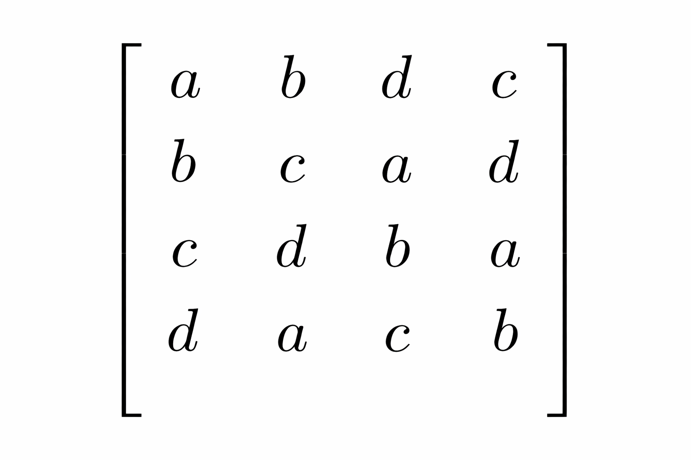
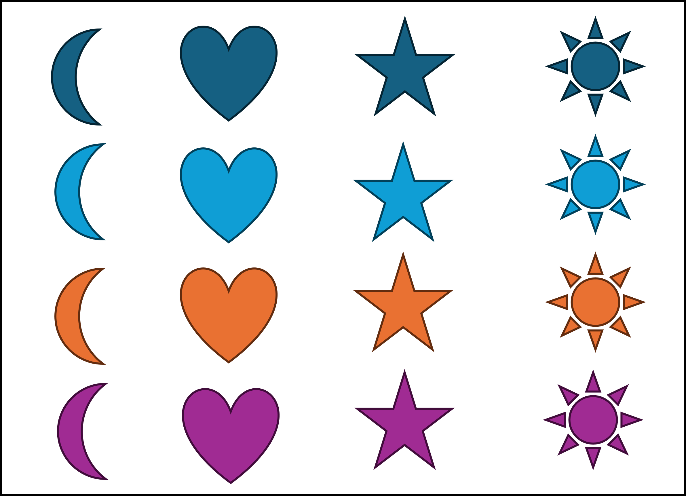

## Agradecimiento {.bloques}

* Este material está basado, además de la bibliografía pertinente señalada al final del documento, en parte del material didáctico que la profesora [Patricia Ramírez Barrantes]{.hi} ha diseñado para el curso II-0602 Diseño de Experimentos, de la estructura curricular anterior.  

## Agenda {.bloques}

* Consideraciones generales

* Diseño Completamente al Azar (DCA)

* Diseño de Bloques Completamente al Azar (DBCA)

* Diseño cuadrado latino

* Diseño cuadrado grecolatino

# Consideraciones generales {.bloques}

## Diseño de un experimento {.bloques}

* Es la [secuencia completa de pasos]{.hi} para asegurar que los [datos apropiados]{.hi} se obtendrán de modo que permitan un análisis objetivo que conduzca a deducciones con respecto al problema establecido, mediante la comparación válida de cambios inducidos en las variables de proceso, en diferentes niveles para identificar diferencias significativas entre ellos. 

## Diseño de un experimento {.bloques}

:::::: {.columns}

::: {.column}

* En diseño experimental se espera que lo único que cambie sea el [tratamiento]{.hi} que se esté aplicando. Todo lo que no se controle formará parte del error experimental, lo que reduce la precisión del modelo. 

* La variabilidad es el diablo. Todo lo que el modelo no explique se va al error. Si el error es muy grande, los modelos no servirían. 
  * ¿Cuánto es "muy grande"? Como ya lo sabe, depende del contexto en el que se aplique. 

:::

::: {.column .img-fit width="30%"}


:::

::::::

## Experimentos reductores de ruido {.bloques}

* Son diseños experimentales que se enfocan en reducir la variabilidad del error (combatir contra el diablo), mediante el control de factores perturbadores (*nuisance factors*). 

* Se basa fundamentalmente en la técnica de bloqueo, la cual se utiliza para reducir o eliminar la variabilidad de los factores perturbadores. Estas son variables que pueden influir en la respuesta del experimento, pero en las que el investigador no tiene un interés directo. 

## Experimentos reductores de ruido {.bloques}

* En un experimento convencional, una persona bloquea un factor como el lote de materia prima, para que su variabilidad no infle el error experimental y permita ver con más claridad el efecto del factor de interés.
  * Entiéndase, reducir el ruido.

* No obstante, estos experimentos también se pueden usar para [probar la robustez]{.hi}, es decir, para [comprobar si el proceso sigue funcionando bien]{.hi} a pesar de ellos. Esto es lo que se denomina como [diseño robusto]{.hi}.

* Es útil pues permite asegurar que el proceso será insensible a factores ambientales o variables difíciles de controlar una vez que se implemente a escala real.

## Ejemplo {.bloques}

* Una persona ingeniera sabe que en un entorno realista de producción no se podrá controlar perfectamente la temperatura o la pureza de la materia prima. Por ello, en lugar de ignorar esos factores, los agrupa deliberadamente en  bloques que representan diferentes combinaciones de estas condiciones difíciles. 

* Un proceso es robusto si se descubre que las diferencias entre temperaturas, operadores, purezas, etc, afectan mínimamente.


## Requisitos de aplicación en reductores de ruido {.bloques}

* Las variables de bloqueo, también conocidas como bloques, tienen que estar [MUY relacionadas]{.hi} con la variable dependiente o de respuesta. 

  * Esto se debe a que el incluir bloques es una intervención que se paga con grados de libertad. No sería razonable pagar "la factura", sin tener una justificación para ello. 
  
* Las variables de bloqueo [NO pueden]{.hi} interactuar entre sí, ni con la variable independiente.

  * Esa interacción es imposible de valorarla en un experimento reductor de ruido. Estos modelos no son capaces de separar esta afectación. 
  
* Ambos supuestos o requisitos de aplicación se deben probar bajo un fuerte enfoque teórico o experiencia comprobada, como otros diseños experimentales previos que confirmen su cumplimiento. 

## DCA {.bloques}

* Es el modelo más básico. Además es la generalización de la prueba T para muestras independientes.
  * Es un viejo conocido: [ANOVA]{.hi}.
  
* [Diseño completo]{.hi}: cuando todos los tratamientos están incluidos. 

* [Diseño balanceado]{.hi}: cuando todos los tratamientos tienen la misma cantidad de eventos muestrales. 

* Si el modelo está desbalanceado se pierde la simetría y se deben usar otro tipo de suma de cuadrados (Tipo III). Además, implica indefectiblemente una pérdida de precisión. 

## DCA {.bloques}

* La variable de respuesta solamente depende de un predictor, que no está influenciado por ninguna condición externa. 

* $$y_{ijk} = \mu + \alpha_i + \varepsilon_{ijk}$$

* El modelo es aditivo: se presupone que cada dato u observación ($y_{ijk}$) es una combinación aditiva de la media total del experimento ($\mu$), el efecto de un determinado tratamiento ($\alpha_i$), y el error ($\varepsilon_{ijk}$). 

## DBCA {.bloques}

* Es un modelo bloqueado en una vía. Solo hay una intervención: el bloqueo. 

* Por ejemplo, se prueba una máquina con diferentes velocidades (tratamiento), con diferentes seres humanos (bloque). De esta manera la variabilidad que deviene de los seres humanos (por sus habilidades, por ejemplo) queda sistemáticamente controlada, sin ser enviada al error y siendo independiente de la variabilidad del tratamiento. 
  
* Es decir, el bloqueo agrega un efecto adicional ficticio, cuyo objetivo es [separar del error experimental]{.hi}, alguna fuente de variabilidad conocida. 

* Con el bloqueo se consigue una mayor homogeneiddad entre los sujetos o unidades experimentales intra-bloque y una reducción del tamaño experimental del error. Al igual que la aleatorización, tiene como fin asegurar la validez de la inferencia, aumentanto la precisión. 
  * No olvide que el bloqueo se paga con grados de libertad. 
  
## Ejemplo {.bloques}

* Un investigador pretende estudiar la efectividad de tres métodos distintos en la enseñanza de las matemáticas: método tradicional ($A_1$), método de programación ($A_2$), y método audio-visual ($A_3$), para un determinado nivel escolar.  

* Forma tres grupos al azar de sujetos, uno para cada método, y se les pide que resuelvan un total de 10 problemas de cálculo matemático. La resolución de esos problemas es una medida de ejecución que evalúa la efectividad de los métodos de enseñanza.

* ¿Qué problema ve usted en esta formulación? Discuta con compañeros y la persona docente. 

* ¿Cómo lo solucionaría? 

## Ejemplo {.bloques}

* Las personas pueden ser diferentes y por ello agregan variabilidad al error, la técnica de bloqueo solucionaria esta situación. 

* Se formaron 10 bloques con base a los valores de la variable Cociente Intelectual (CI) Cada bloque representa un determinado cociente intelectual, lo cual requiere la selección previa de los sujetos. Para cada valor de CI se eligieron 3 sujetos o unidades del bloque (recuerde: *son 3 métodos de enseñanza*) De esta forma, la variación de los sujetos intra-bloque es menor que la de todos los sujetos de la muestra.

* Las unidades de los bloques se asignan al azar a los tratamientos de modo que, dentro del bloque, cada sujeto recibe un tratamiento distinto. Según este procedimiento, sólo se dispone de un sujeto por casilla o combinación de bloque por tratamiento. Así, cada bloque constituye una réplica entera del experimento ($n=1$).

## Ejemplo {.bloques}

* Los bloques se pueden correr de forma aleatoria o de forma simultánea. 

* Recuerde que el bloqueo restringe parcialmente la aleatorización, ya que la aleatorización ocurre dentro de cada bloque y no sobre el conjunto completo de unidades experimentales, por lo tanto una ventaja de haber bloqueado es la capacidad de ejecutar los bloques de forma simultánea. 

  * Un bloque es una porción de material experimental que se espera que sea más homogóneo que el total. 
  
* En el siguiente slide puede ver como se resolvió creando los bloques por persona. El primer bloque es una persona con $CI = 94$, nótese que para que el experimento esté balanceado tiene que haber la misma cantidad de personas por bloque, en este caso particular hay una persona por cada uno de estos. 

## Ilustración de la técnica de bloques {.bloques}

:::::: {.columns}

::: {.column}

| Bloques | I <br> CI 94 | II <br> CI 96 | III <br> CI 98 | IV <br> CI 100 | ... | X <br> CI 112 |
| :--- | :---: | :---: | :---: | :---: | :---: | :---: |
| **Tratamientos** | A1 <br> A2 <br> A3 | A1 <br> A2 <br> A3 | A1 <br> A2 <br> A3 | A1 <br> A2 <br> A3 | ... | A1 <br> A2 <br> A3 |

$$
H_o: \mu_1 = \mu_2 = \mu_3 \\
H_i: \text{por lo menos una es diferente}
$$

* En caso de rechazar la hipótesis nula, recuerde las pruebas de comparaciones múltiples para encontrar cuál o cuáles son diferentes.

:::

::::::

## La prueba estadística {.bloques}

* Recuerde que hay una diferencia importante entre el diseño de experimentos y el análisis del experimento. 
  * Esta parte del curso se enfoca en las consideraciones de diseño, las de análisis ya fueron abordadas en su mayoría, desde regresión y ANOVA.
  
* La prueba estadística que se utiliza por antonomasia es el ANOVA. Esto no significa que sea la única. En este caso el modelo aditivo sería (note la ausencia de interacción): 

* $y_{ijk} = \mu + \alpha_i + \beta_j + \varepsilon_{ijk}$

* Se debe elegir el nivel de significancia, que no siempre debe ser $\alpha = 0.05$, sino que se debe escoger en función del contexto. No hay recetas en ingeniería. 

## ANOVA {.bloques}

:::::: {.columns}

::: {.column}

* Se divide la SS total en los siguientes componentes aditivos: SS de tratamientos ($SS_T$), SS de bloques ($SS_B$) y SS del error ($SS_E$). Esta tabla es aplicable a una réplica. 

| Fuente de variación | Suma de Cuadrados ($SS$) | Grados de libertad ($df$) | Cuadrado Medio ($MS$) | Estadístico $F_0$ |
| :--- | :---: | :---: | :---: | :---: |
| **Bloque** | $SS_B$ | $a - 1$ | $MS_B = \frac{SS_B}{a - 1}$ | $F_A = \frac{MS_B}{MS_E}$ |
| **Tratamiento** | $SS_T$ | $b - 1$ | $MS_T = \frac{SS_T}{b - 1}$ | $F_B = \frac{MS_T}{MS_E}$ |
| **Error** | $SS_E$ | $(a - 1)(b - 1)$ | $MS_E = \frac{SS_E}{(a - 1)(b - 1)}$ | — |
| **Total** | $SS_{Total}$ | $N - 1$ | — | — |

:::

::::::

## ANOVA {.bloques}

* Si la SS del bloque es grande es una buena noticia, usted ha pagado los grados de libertad necesarios y ese porcentaje de la suma de cuadrados no se fue al error. 

* Ahora, si el bloque explica muy poca variabilidad, el beneficio obtenido puede no compensar la pérdida de grados de libertad

* De aquí la relevancia de lo establecido en consideraciones generales: el bloque debe estar muy relacionado con la variable dependiente, sino, no vale la pena ni tomarlo en cuenta. 

## Algunas recomendaciones {.bloques}

* La eficacia de este diseño depende del efectgo de los bloques. Si este es pequeño, es más eficaz del DCA ya el denominador en la comparación de tratamientos tiene menos grados de libertad.

  * No hay total coincidencia de criterio entre autores. Pero si los bloques no influyen, se pasa facilmente al modelo de un solo factor sumando en la tabla ANOVA la final del factor bloque con la de la variabilidad residual. 

* Sin embargo, si los bloques influyen es mucho mejor y más eficaz este modelo, ya que disminuye la variabilidad no explicada. Ciertamente, el bloqueo es una infracción al principio de aleatoriedad, en la práctica se conoce que: 

## Algunas recomendaciones {.bloques}

* Bloquear sin necesario conduce a prueba de hipótesis menos potentes y a intervalos de confianza más amplios que aquellos que se obtendrían mediante un DCA. 

* Como ya se aclaró, se espera que no haya interacciones entre bloques y tratamientos, pero en ocasiones esto podría no ocurrir. En estos casos se observarán curvaturas en la gráfica de residuales. 

* En caso de exitir interacciones, el diseño apropiado sería un factorial (tema de otro curso), no un reductor de ruido (el tema que tratamos).

* Frecuentemente, los bloques se consideran factores aleatorios para que las conclusiones sean válidas para toda la población de la cual se extrajeron los bloques.

## DBCA replicado ($n>1$) {.bloques}

* En el caso de que se tengan réplicas (por ejemplo, tres personas por bloques), alcanzaría la información para estimar el efecto de interacción (modelo no aditivo).

* $y_{ijk} = \mu + \alpha_i + \beta_j + (\alpha \beta)_{ij} + \varepsilon_{ijk}$

* No obstante, no queremos que la interacción resulte significativa, por lo que ya hemos enunciado. 

* Se divide la SS total en los siguientes componentes aditivos: SS de tratamientos ($SS_T$), SS de bloques ($SS_B$), SS de la interacción ($SS_{TxB}$) y SS del error ($SS_E$). 

## ANOVA {.bloques}

:::::: {.columns}

::: {.column}

| Fuente de Variación | Suma de Cuadrados ($SS$) | Grados de Libertad ($df$) | Cuadrado Medio ($MS$) | Estadístico $F_0$ |
| :--- | :---: | :---: | :---: | :---: |
| **Bloque** | $SS_B$ | $a - 1$ | $MS_B = \frac{SS_B}{a - 1}$ | $F_0 = \frac{MS_A}{MS_E}$ |
| **Tratamiento** | $SS_T$ | $b - 1$ | $MS_T = \frac{SS_T}{b - 1}$ | $F_0 = \frac{MS_T}{MS_E}$ |
| **Interacción** | $SS_{BT}$ | $(a - 1)(b - 1)$ | $MS_{BT} = \frac{SS_{BT}}{(a - 1)(b - 1)}$ | $F_0 = \frac{MS_{BT}}{MS_E}$ |
| **Error (Residual)** | $SS_E$ | $a \cdot b \cdot (n - 1)$ | $MS_E = \frac{SS_E}{ab(n - 1)}$ | — |
| **Total** | $SS_{Total}$ | $N - 1$ | — | — |

:::

::::::

# Diseño cuadrado latino {.bloques}

## Cuadrados latinos {.bloques}

:::::: {.columns}

::: {.column width="95%"}

* Son diseños para dos vías, entiéndase que hay un tratamiento y dos factores de bloqueo (bloques), e indefectiblemente deben tratarse como cuadrados, donde las filas y las columnas representan dos restricciones o bloques. 

* Es una estructura de $p \times p$ donde cada tratamiento, que es denotado por letras latinas (de ahí su nombre), aparece exactamente una vez en cada fila y en cada columna (tal cual como jugar [Sudoku](https://sudoku.com/es){target="_blank"}). Requiere que el número de niveles de los factores de bloqueo y del tratamiento sea el mismo. 

* Cada una de las $p^2$ deldas contiene una letra latina que corresponde a uno de los $p$ niveles del tratamiento. Tanto las filas como las columnas son ortogonales a los tratamientos. 

:::

::: {.column .img-fit}



:::

::::::

## Cuadrados latinos {.bloques}

* Los cuadrados se diseñan en orden natural, pero no se ejecutan en el mismo orden, sino que [deben aleatorizarse]{.hi}. 

* El orden natural es como el que se muestra a continuación: 

* $$\begin{bmatrix}
1 & 2 & 3 \\
2 & 3 & 1 \\
3 & 1 & 2
\end{bmatrix}$$

* Los requisitos de aplicación ya mencionados, se mantienen, pero además se recalca que el diseño debe ser cuadrado, por lo que el número de niveles en cada variable (factor o bloque) debe ser el mismo. 

## Ejemplo {.bloques}

:::::: {.columns}

::: {.column width = "30%"}

* ¿Cómo ordenaría las figuras de la imagen a la derecha para que se haga de la forma más homogénea? 

* Si escoge por forma y por color, entonces utilizó dos factores de bloqueo.

:::

::: {.column .img-fit}


:::


::::::

## Ejemplo {.bloques}

:::::: {.columns}

::: {.column .img-fit}



:::

::::::

## Cuadrados latinos {.bloques}

:::::: {.columns}

::: {.column width="60%"}

* En un experimento redcutor de ruido se espera que se cuente con 12 grados de libertad en el error, como mínimo. Por lo que CL muy "pequeños", es decir, de menos de tres niveles ($k \le 3$) suelen ser ineficientes, pues requieren de muchas réplicas para cumplir con este requisito. Por tanto es usual que se agreguen más niveles. 

* Un error común es correr los tratamientos en el orden de construcción del diseño experimental. Como ya se ha mencionado en suficientes oportunidades la ejecución debe realizarse en orden aleatorio. 

:::

::: {.column}

```{=html}

<div style="font-size: 80%; width: 80%; margin: 0 auto;">

<table style="border-collapse: collapse; width: 100%; text-align: center;">
  <thead>
    <tr style="border-bottom: 2px solid #333;">
      <th rowspan="2" style="font-weight: bold; vertical-align: middle;">Periodos</th>
      <th colspan="5" style="font-weight: bold;">Unidades experimentales</th>
    </tr>
    <tr style="border-bottom: 2px solid #333;">
      <th style="font-weight: bold;">1</th>
      <th style="font-weight: bold;">2</th>
      <th style="font-weight: bold;">3</th>
      <th style="font-weight: bold;">4</th>
      <th style="font-weight: bold;">5</th>
    </tr>
  </thead>
  <tbody>
    <tr>
      <td style="font-weight: bold;">I</td>
      <td>A</td>
      <td>B</td>
      <td>C</td>
      <td>D</td>
      <td>E</td>
    </tr>
    <tr>
      <td style="font-weight: bold;">II</td>
      <td>B</td>
      <td>C</td>
      <td>D</td>
      <td>E</td>
      <td>A</td>
    </tr>
    <tr>
      <td style="font-weight: bold;">III</td>
      <td>C</td>
      <td>D</td>
      <td>E</td>
      <td>A</td>
      <td>B</td>
    </tr>
    <tr>
      <td style="font-weight: bold;">IV</td>
      <td>D</td>
      <td>E</td>
      <td>A</td>
      <td>B</td>
      <td>C</td>
    </tr>
    <tr>
      <td style="font-weight: bold;">V</td>
      <td>E</td>
      <td>A</td>
      <td>B</td>
      <td>C</td>
      <td>D</td>
    </tr>
  </tbody>
</table>

</div>

```


:::

::::::

## El modelo {.bloques}

* Se sigue usando ANOVA. 

* Es un caso general del DBCA, en el que se agrega un factor de bloque más ($\gamma_{k}$). 

* $$y_{ijk}= \mu + \alpha_i + \beta_j + \gamma_k + \varepsilon_{ijk}$$

* En el caso de que [haya réplicas]{.hi}, se suele agregar un sumando asociado al efecto de la replicación ($\xi_r$): 

* $y_{ijk}= \mu + \alpha_i + \beta_j + \gamma_k + \xi_{r}  +  \varepsilon_{ijk}$

## Ejemplo aplicado {.bloques}

* Es común en la industria en general ensamblar productos a partir de diversas piezas. En estos casos, el procedimiento que se siga es determinante para disminuir los tiempos de producción.

* Los procedimientos están influenciados por el orden en que debe hacerse el ensamble, por la fragilidad de los componentes, la maniobrabilidad de los elementos, etc.

* Supuesto que ha sido resuelto previamente las mejores condiciones de iluminación y la disposición de los elementos en la mesa de trabajo, de aplicación general a cualquier operador.

## Ejemplo aplicado {.bloques}

* Sean tres métodos de ensamble a valorar para determinar el que minimice el tiempo de ensamble de una figura Lego en forma de árbol.

  * Iniciar el armado de la figura de abajo hacia arriba.
  * Ensamblar la pieza por extractos para luego unir los diferentes extractos entre sí.
  * Ensamblar la pieza de arriba hacia abajo.

* Tres operarios con habilidades similares.

* Posición de inicio de las piezas en la mesa de trabajo: a) por color, b) por tamaño y c) por tamaño y color. En todo caso la misma disposición de las cajas sobre la mesa.

  * >Autores: José Fernando Brenes Herrera, Katherina Cordero Rodríguez, María Carolina Mora Sojo, Gonzalo Salazar Ramírez. Abril 2015.

## Ejemplo aplicado {.bloques}

:::::: {.columns}

::: {.column}

* ¿Cuáles variables son las de bloqueo y cual es la variable de interés para el estudio?

* Matriz de diseño
    * Es muy importante SIEMPRE hacer la matriz de diseño. Es útil para verificar que todas las combinaciones sean posbles. 

```{=html}

<div style="font-size: 75%; width: 100%; margin: 0 auto;">

<table style="border-collapse: collapse; width: 85%; margin: 0 auto; text-align: center; border: 1px solid #333;">
  <thead>
    <tr style="border-bottom: 1px solid #333;">
      <th colspan="2" style="border-right: 1px solid #333;"></th>
      <th colspan="3" style="font-weight: bold; padding: 8px;">Operarios</th>
    </tr>
    <tr style="border-bottom: 2px solid #333;">
      <th colspan="2" style="border-right: 1px solid #333;"></th>
      <th style="padding: 8px; width: 20%; font-weight: bold;">a</th>
      <th style="padding: 8px; width: 20%; font-weight: bold;">b</th>
      <th style="padding: 8px; width: 20%; font-weight: bold;">c</th>
    </tr>
  </thead>
  <tbody>
    <tr style="border-bottom: 1px solid #ccc;">
      <td rowspan="3" style="font-weight: bold; padding: 15px; width: 25%; vertical-align: middle; border-right: 2px solid #333;">
        Disposición en la mesa de trabajo
      </td>
      <td style="font-weight: bold; padding: 8px; width: 10%; border-right: 1px solid #ccc;">1</td>
      <td>B</td>
      <td>A</td>
      <td>C</td>
    </tr>
    <tr style="border-bottom: 1px solid #ccc;">
      <td style="font-weight: bold; padding: 8px; border-right: 1px solid #ccc;">2</td>
      <td>C</td>
      <td>B</td>
      <td>A</td>
    </tr>
    <tr>
      <td style="font-weight: bold; padding: 8px; border-right: 1px solid #ccc;">3</td>
      <td>A</td>
      <td>C</td>
      <td>B</td>
    </tr>
  </tbody>
</table>

<br>

</div>

```

  


:::

::: {.column}

* Montgomery (2014), establece que existe una desventaja en utilizar cuadrados latinos pequeños, como por ejemplo el $3 \times 3$, ya que proporciona un número pequeño de grados de libertad, en este caso 2 grados de libertad del error. 

* De aquí la importancia de hacer réplicas, puesto que estas incrementan los grados de libertad del error, lo cual permite poder determinar diferencias con mayor facilidad.

:::

::::::

## Ejemplo aplicado {.bloques}

:::::: {.columns}

::: {.column width="30%"}

* Las variables controladas:
  * ***Posición del operario para la realización del ensamble:*** sentado en una silla con respaldar junto a la mesa de trabajo.
  * ***Método de cronometraje:*** indicación de inicio y terminación.
  * ***Cantidad de piezas a tomar:*** de una en una.
  * ***Iluminación:*** directa, superior.

* El **tiempo de ensamble** es la variable de respuesta establecida.

:::

::: {.column}

```{=html}

<div style="font-size: 88%; width: 100%; margin: 0 auto;">

<table style="border-collapse: collapse; width: 90%; margin: 0 auto; text-align: right; border-bottom: 2px solid #333;">
  <thead>
    <tr style="border-bottom: 2px solid #333; font-weight: bold;">
      <th style="text-align: left; padding: 8px;">Fuente</th>
      <th style="padding: 8px;">DF</th>
      <th style="padding: 8px;">Seq SS</th>
      <th style="padding: 8px;">Adj SS</th>
      <th style="padding: 8px;">Adj MS</th>
      <th style="padding: 8px;">F</th>
      <th style="padding: 8px;">P</th>
    </tr>
  </thead>
  <tbody>
    <tr>
      <td style="text-align: left; padding: 6px;">Disposición</td>
      <td>2</td>
      <td>158,2</td>
      <td>158,2</td>
      <td>79,1</td>
      <td>2,02</td>
      <td>0,161</td>
    </tr>
    <tr>
      <td style="text-align: left; padding: 6px;">Operario</td>
      <td>2</td>
      <td>13215,9</td>
      <td>13215,9</td>
      <td>6608,0</td>
      <td>169,00</td>
      <td>0,000</td>
    </tr>
    <tr>
      <td style="text-align: left; padding: 6px;">Método</td>
      <td>2</td>
      <td>1931,4</td>
      <td>1931,4</td>
      <td>965,7</td>
      <td>24,70</td>
      <td>0,000</td>
    </tr>
    <tr>
      <td style="text-align: left; padding: 6px;">Réplica</td>
      <td>2</td>
      <td>602,4</td>
      <td>602,4</td>
      <td>301,2</td>
      <td>7,70</td>
      <td>0,004</td>
    </tr>
    <tr style="border-bottom: 1px solid #ccc;">
      <td style="text-align: left; padding: 6px;">Error</td>
      <td>18</td>
      <td>703,8</td>
      <td>703,8</td>
      <td>39,1</td>
      <td>—</td>
      <td>—</td>
    </tr>
    <tr style="font-weight: bold;">
      <td style="text-align: left; padding: 8px 6px;">Total</td>
      <td>26</td>
      <td>16611,7</td>
      <td>—</td>
      <td>—</td>
      <td>—</td>
      <td>—</td>
    </tr>
  </tbody>
</table>

</div>


```


* El valor de $R^2 = 95.76\%$ y el $R^2_{adj}=93.88\%$. Por lo general esto sería una buena noticia. [¿Por qué aquí no necesariamente lo es?]{.hi} Analice los resultados acá mostrados.

:::

::::::

# Diseño cuadrado grecolatino {.bloques}

## Cuadrado grecolatino {.bloques}

* Se utiliza para controlar sistemáticamente [tres]{.hi} fuentes de variabilidad extraña, es decir, para la formación de bloques en tres direcciones. 

* El diseño de cuadrado grecolatino es una extensión directa del cuadrado latino. Por lo que tiene los mismos requisitos de aplicación.

* Su construcción se basa en la superposición de cuadrados: Se obtiene al superponer un cuadrado latino de $p \times p$ (con letras latinas) sobre otro cuadrado latino de $p \times p$ cuyas letras son griegas.

## Cuadrado grecolatino {.bloques}

:::::: {.columns}

::: {.column width="45%"}

* Para que el diseño sea válido, los dos cuadrados deben ser ortogonales. Esto significa que, al superponerlos, cada letra griega debe aparecer exactamente una vez con cada letra latina.

* Es más eficiente que el CL, pues permite estudiar 4 factores (filas, columnas, letras latinas y letras griegas), utilizando $p^2$ corridas experimentales (las mismas que el CL).

* Las filas, columnas y las letras griegas vendrían a ser los factores de bloqueo. 

:::

::: {.column}

| Fila | Columna 1 | Columna 2 | Columna 3 | Columna 4 |
| :---: | :---: | :---: | :---: | :---: |
| **1** | $A\alpha$ | $B\beta$ | $C\gamma$ | $D\delta$ |
| **2** | $B\delta$ | $A\gamma$ | $D\beta$ | $C\alpha$ |
| **3** | $C\beta$ | $D\alpha$ | $A\delta$ | $B\gamma$ |
| **4** | $D\gamma$ | $C\delta$ | $B\alpha$ | $A\beta$ |

:::

::::::

## El modelo {.bloques}

* Es un caso general del CL, en el que se agrega un factor de bloque más ($\Psi_l$). 

* $y_{ijk}= \mu + \alpha_i + \beta_j + \gamma_k + \Psi_l + \varepsilon_{ijkl}$

* En el caso de que [haya réplicas]{.hi}, se suele agregar un sumando asociado al efecto de la replicación ($\xi_r$): 

* $y_{ijk}= \mu + \alpha_i + \beta_j + \gamma_k + \Psi_l + \xi_{r}  +  \varepsilon_{ijkl}$

* Para el ANOVA, solo se agrega la fila del nuevo bloque. 

## Consideraciones importantes {.bloques}

* Los cuadrados grecolatinos existen para todos los tamaños $p \ge3$, excepto para $p=6$.

* Al añadir el tercer factor de bloqueo, la variabilidad del error suele disminuir. Sin embargo, también se reducen los grados de libertad del error, lo que puede hacer que la prueba estadística sea menos sensible (menos potente) si el diseño es pequeño.

* Si se superponen tres o más cuadrados latinos ortogonales, el diseño se denomina hipercuadrado, permitiendo estudiar hasta $p+1$ factores en $p^2$ corridas.

## Resumen {.bloques}

:::::: {.columns}

::: {.column .img-fit}


:::

::::::

## Ejercicio integrador {.bloques}

* Este ejercicio está tomado íntegramente del material de la profesora Patricia Ramírez Barrantes. 

## Ejercicio integrador {.bloques}

* Una empresa metalmecánica produce componentes cilíndricos para la industria automotriz. El acabado superficial es crítico para la eficiencia y durabilidad del ensamble. Se desea comparar tres refrigerantes ecológicos para reducir el impacto ambiental sin comprometer la calidad.

* El objetivo experimental definido es: *Evaluar el efecto de tres tipos de refrigerante sobre la rugosidad superficial de piezas metálicas torneadas, para establecer si las diferencias son estadísticamente significativas*.

* Interesan tres tipos de refrigerante: aceite vegetal, sintético y una emulsión biodegradable. Se considera que el tipo de refrigerante puede variar entre máquinas, las cuales son operadas manualmente, por lo que se procura bloquear máquina y operador.

## Ejercicio integrador {.bloques}

* La rugosidad promedio (RA -desviación media aritmética del perfil con respecto a una línea media. Un valor bajo indica una superficie lisa) se mide con un sistema óptico láser sin contacto. Se utiliza luz para iluminar la superficie y capturar la luz reflejada, determinando la topografía.

* Se evalúa en un segmento preestablecido de la superficie, llamado longitud de muestreo, para diferenciarla de variaciones de forma a gran escala.

## Ejercicio integrador {.bloques}

:::::: {.columns}

::: {.column width="75%"}

El equipo de experimentación decide realizar dos réplicas, aleatorizadas. Los resultados obtenidos son los siguientes.

### Responda {.hi}

1.	Haga una esquematización del experimento.
2.	Haga la matriz de diseño
3.	Exponga sus consideraciones sobre la cantidad de réplicas del diseño. Incluya el efecto que se puede detectar con una potencia del 80 %.
4.	Valore de la calidad de los resultados obtenidos
5.	¿A qué conclusiones se puede llegar?


:::

::: {.column style="font-size: 55%;"}

| Operador | Máquina | Refrigerante | Rugosidad (um) |
| :---: | :---: | :--- | :---: |
| O1 | M1 | Aceite | 1,8 |
| O2 | M1 | Sintético | 2,0 |
| O3 | M1 | Biodegradable | 1,5 |
| O1 | M2 | Sintético | 2,1 |
| O2 | M2 | Biodegradable | 1,7 |
| O3 | M2 | Aceite | 1,7 |
| O1 | M3 | Biodegradable | 1,6 |
| O2 | M3 | Aceite | 1,9 |
| O3 | M3 | Sintético | 2,1 |
| O1 | M1 | Aceite | 1,7 |
| O2 | M1 | Sintético | 1,9 |
| O3 | M1 | Biodegradable | 1,4 |
| O1 | M2 | Sintético | 2,0 |
| O2 | M2 | Biodegradable | 1,6 |
| O3 | M2 | Aceite | 1,7 |
| O1 | M3 | Biodegradable | 1,7 |
| O2 | M3 | Aceite | 1,8 |
| O3 | M3 | Sintético | 2,1 |

:::

::::::

## Bibliografía {.bloques}

:::: columns
::: {.column width="100%" style="font-size: 1.2em;"}

* Montgomery, D. C. (2020). Design and analysis of experiments (10.ª ed.). Wiley.
  * Capítulo 3.

:::
::::

## Experimentos de un factor: Reductores de Ruido <br> II-1123 Estadística para Ingeniería Industrial II {.center}

### Gracias por su atención <br> Steven García Goñi<br>[steven.garciagoni\@ucr.ac.cr](mailto:steven.garciagoni@ucr.ac.cr) {.subtitle}

### Dudas o correcciones requeridas pueden solicitarse al correo