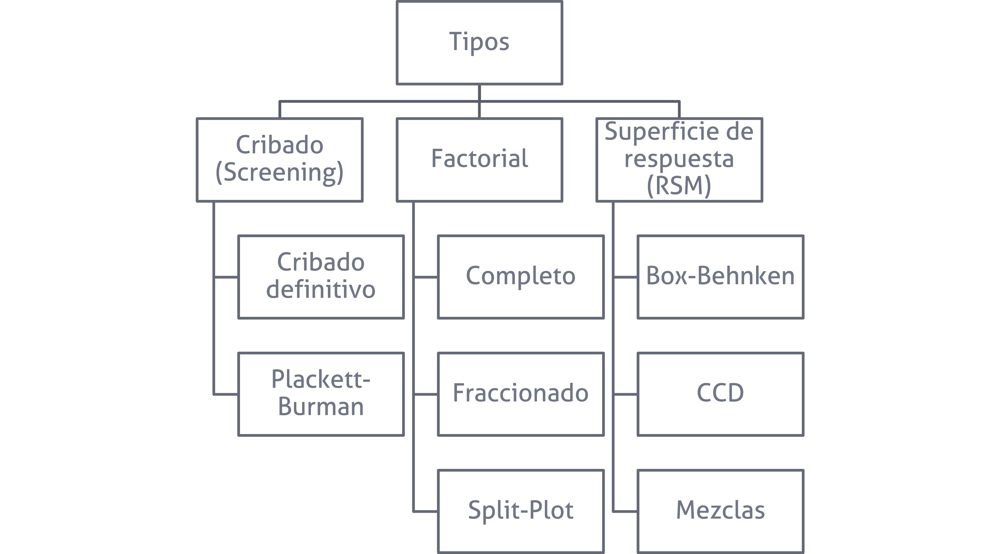
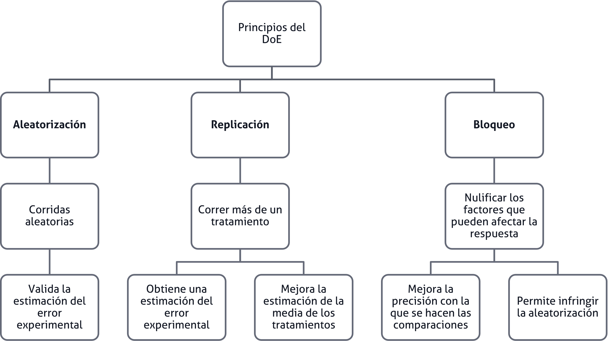
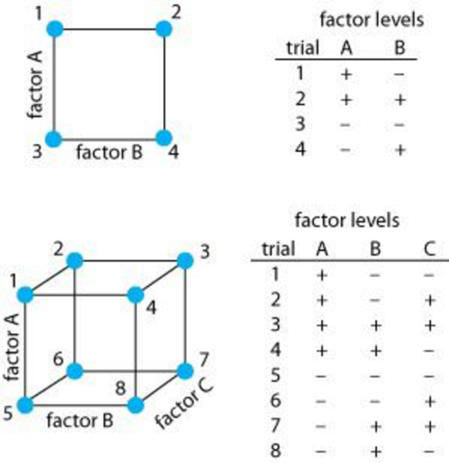
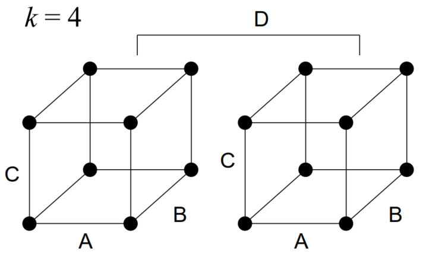
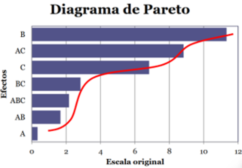
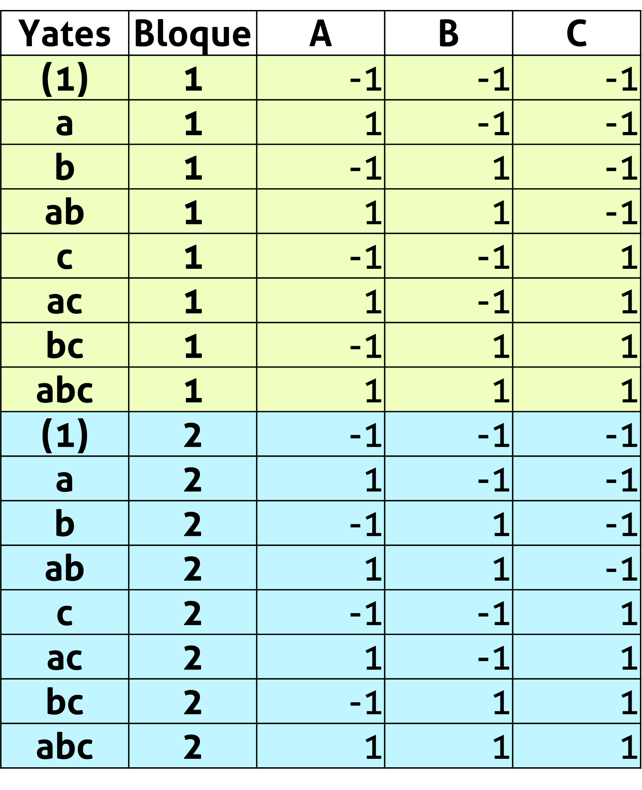

```{r}

library(tidyverse)
library(ggrepel)

```


## Agenda {.bloques}

* Algunos conceptos

* Definiciones y ventajas

* Diseño factorial $2^k$


## Algunos conceptos {.bloques}

* [Región de operabilidad]{.hi}: Es la región que está definida por el conjunto de condiciones donde el equipo o proceso puede ser operado.

* Es difícil de delimitar con certeza el tamaño de la región de operabilidad, ya que hay estudiar el efecto en presencia de otros factores. Por ejemplo, las revoluciones por minuto de la máquina se pueden operar a su capacidad máxima siempre que la fuerza y la temperatura se mantengan bajos. 

## Algunos conceptos {.bloques}

* [Región de experimentación]{.hi}: Es el espacio que está delimitado por los rangos de experimentación utilizados con cada factor.

* La región de experimentación es *[por lo general]{.ul}* menor a la región de operabilidad.

## Tipos de DdE {.bloques}

:::::: {.columns}

::: {.column}

* Es sumamente importante comprender que cada tipo de diseño de experimento tiene una capacidad resolutiva que lo hace apropiado a un objetivo experimental particular. 

* Por ello lo primero que debe establecerse es el objetivo del experimento. 

[No se empieza una casa por el tejado]{.hi}

:::

::: {.column .img-fit}


:::

::::::

## Tipos de DdE {.bloques}

:::::: {.columns}

::: {.column .img-fit}



:::

::::::

# Contextos, objetivos y su tipo de DdE {.bloques}

## Cribados/Exploración {.bloques}

* Cuando un sistema o proceso es nuevo y se desea conocer cuáles factores tienen mayor influencia en las respuestas de interés.

* A menudo hay muchos factores, lo que implica que se desconoce mucho del sistema o proceso y es imperativo cribar los factores para encontrar solo aquellos verdaderamente importantes. 

* No se usa para modelar respuestas. 
  
* Diseños: 

  * Factoriales altamente fraccionados 
  * Cribado definitivo
  * Plackett-Burman
  * Algunas aplicaciones de Taguchi

## Modelado y mejora (optimización) {.bloques}

* Cuando el proceso está caracterizado y los factores importantes identificados.

* Se usa para encontrar los niveles de los factores que resultan en valores deseables de la respuesta. 

* Diseños de mejora: 

  * Factoriales completos

* Diseños de optimización: 

  * Superficies de respuesta

## Confirmación {.bloques}

* Cuando se quiere verificar que el proceso o sistema funciona o se comporta en la manera esperada según la experiencia. 

* Se utiliza para comparar, un factor a la vez (OFAT), generalmente en presencia de muchos factores de ruido que se encuentran bloqueados. 
* Por eso también se conocen como reductores de ruido.

## Confirmación {.bloques}

* Por ejemplo, si tres materiales en apariencia iguales, pero con diferente costo, tienen el mismo rendimiento, al ser probados por tres operarios en tres máquinas.

* Diseños: 
  * OFAT
  * DBCA
  * Cuadrado latino
  * Cuadrado grecolatino

## Por lo general... {.bloques}

* Los cursos de DdE se enseñan al revés, lo que [no implica que se enseñen mal]{.hi}. 

* Se hace de esta manera con un sentido didáctico, pero en la práctica se aplican de forma inversa a como se enseñan: 

  * Cribados
  * Fraccionados
  * Amplificadores de señal
  * Optimización
  * Confirmación

# Experimentos factoriales {.bloques}

## Repaso sobre los principios del DdE {.bloques}

:::::: {.columns}

::: {.column .img-fit}



:::

::::::

## Diseño factorial {.bloques}

* Los diseños factoriales se usan ampliamente en experimentos que incluyen varios factores cuando es necesario estudiar el [efecto conjunto]{.hi} de los factores sobre una respuesta. 

* Hay varios casos especiales del diseño factorial general que son importantes debido a su uso generalizado en el trabajo de investigación y constituyen las bases de otros diseños de gran valor práctico. 

## Diseño factorial {.bloques}

* El más importante de estos casos especiales es el de $k$ factores, cada uno con dos niveles. 

* Estos niveles pueden ser cuantitativos, como dos valores de temperatura, presión o tiempo, o bien cualitativos, como dos máquinas, dos operadores, los niveles *Alto* y *Bajo* de un factor, o quizá la presencia o ausencia de un factor. 

* Un réplica completa de este diseño requiere $2\cdot2\cdot2\cdots2 = 2^k$ observaciones y se le llama diseño factorial $2^k$.

## Diseño factorial {.bloques}

* Es aquel en el que interesa estudiar el efecto de dos o más factores de forma simultánea, sobre una o más variables de respuesta, cuando se tiene el [mismo interés]{.hi} en todos los factores.

* Este tipo de diseño resulta más eficiente que estudiar cada factor de forma independiente (conocidos como OFAT). 

  * Eficiente: proporciona el menor número de corridas con las que pueden estudiarse $k$ factores.

* Se supone, además qué: 

  * Los factores son fijos
  * Los diseños son completamente aleatorizados
  
## Diseño factorial {.bloques}

* Una de sus grandes ventajas es que trabaja con variables codificadas (por ejemplo: −1 y +1).

* Esto permite trabajar con factores cuantitativos, cualitativos o mixtos (ambos a la vez). 

* Son necesarios cuando las interacciones pueden estar presentes, de tal forma que se evitan conclusiones engañosas. 

* Este diseño es de particular utilidad en las etapas iniciales del trabajo experimental, cuando probablemente se estén investigando muchos factores. 

## Diseño factorial {.bloques}

* En un factorial se corren aleatoriamente todas las posibles combinaciones. 

* Para que sea efectivo, es necesario elegir al menos dos niveles de prueba para cada factor. 

* Cuando el factorial es completo, es un diseño “amplificador de señal”. 

## Diseño factorial {.bloques}

* Por tanto, estos experimentos se deben realizar en etapas específicas para que resulten efectivos y eficientes. 

* Por ejemplo, si hay un desconocimiento amplio del objeto de estudio, este experimento NO es adecuado.

* Pues requiere que los factores que se introduzcan al diseño, tengan algún sentido, para que se amplifique dicha señal. 

## Diseño factorial {.bloques}

* Cuidado, no lo confunda. 

* Se sabe que los factores afectan, pero no se sabe cuanto afectan y por ende no se puede decidir sobre si es importante o no.

* A esto se refiere con que amplifica una señal existente. 

## Diseño factorial {.bloques}

* ¿Qué abordamos en este curso respecto al factorial? 
  * Factoriales completos
  * Factoriales completos bloqueados
  * Factoriales completos bloqueados y confundidos
  * Factoriales fraccionados

* Todos se abordan desde el enfoque de los dos niveles.
* Luego veremos el por qué de esta decisión. 

## Diseño factorial {.bloques}

* Desde luego, también presenta algunas [desventajas]{.hi}.
* Se necesitan más corridas que con un experimento OFAT
* Se obtienen resultados de combinaciones que podrían no ser útiles.
* La interpretación de las interacciones suele ser más complicada. 

## Nomenclatura {.bloques}

* Los diseños factoriales de dos niveles se representan de esta manera: 

* $$2^k$$

* Donde $k$ representa la cantidad de factores y 2 la cantidad de niveles. 

* Los diseños factoriales son sobre todo efectivos y eficientes en dos niveles.
  * Tómese el tiempo para discutir con la persona docente esta afirmación. 

## Nomenclatura {.bloques}

* Por ejemplo un experimento $2^5$ tiene dos niveles y 5 factores.

  * La solución de la ecuación anterior da como resultado la cantidad de tratamientos, en el ejemplo anterior se contaría con 32 tratamientos. 
  
* Cada experimento $2^k$ es capaz de estimar hasta $2^{k}-1$ efectos. Es decir, siguiendo el ejemplo anterior, se podrían estimar hasta 31 efectos. 

* Puesto que hay dos niveles para cada factor, se supone que la respuesta es aproximadamente lineal en el rango elegido para los niveles de los factores. 

## Experimento factorial $2^k$ {.bloques}

* Si usted está interesado en usar más dos niveles en uno o más factores, puede que le convenga plantearse un experimento más eficiente.

* Por ejemplo, en un experimento $3^3$ con todos los factores continuos, se estudiarían 27 tratamientos  y lo más que se conseguiría es un modelo [capaz de detectar curvaturas]{.hi}, pero [no describirlas]{.hi}. 

* Un diseño más eficiente y eficaz serían un DCC, que con 20 corridas detecte y describe (modela) la curvatura. 
  * Este experimento es para de las RSM. 

## Diseño factorial $2^k$ {.bloques}

* Es decir... 

* Los diseños factoriales son más eficientes en experimentos con 2 niveles. 

* Evite utilizar 3 o más niveles, ya que resultan ineficientes ante otras alternativas: 

  * Superficies de respuesta
  * Experimentos con puntos centrales. 

* Solo se recomiendan 3 o más niveles cuando estos existan de forma “natural”, por ejemplo: tres velocidades en una secadora. 

## Recomendaciones {.bloques}

* No se recomienda extrapolar los resultados fuera de la región de experimentación.

* Por ejemplo, si usted probó el Factor A en 20 rpm y en 50 rpm, y en el resultado encuentra una pendiente positiva. 
  * No debe decir que en 60 rpm habrá mejores resultados basado en la pendiente del efecto del Factor A.

## Diseño factorial completo $2^k$ {.bloques}

* Se prueba todas las combinaciones de condiciones de los factores.

* Son fáciles de seguir por su patrón repetitivo. 

* Producen información de los efectos factoriales 4 o más veces la de un factor a la vez (OFAT).

* Pueden identificar y ayudar a comprender las interacciones entre factores. 

* Son fáciles de analizar.

* Pueden cuantificar las relaciones entre las $X$ y la $Y$.

## Diseño factorial completo $2^2$ {.bloques}

* El primer diseño de la serie $2^k$ es el que solo tiene dos factores, por ejemplo: *A* y *B*; cada uno se corre a dos niveles. 

* Los niveles de los factores pueden denominarse arbitrariamente *bajo* y *alto*. 

* A este diseño se le llama **diseño factorial $2^2$**.

## Ejemplo $2^2$ {.bloques}

* Considere la investigación del efecto de la concentración del reactivo y de la cantidad del catalizador sobre la conversión (rendimiento) de un proceso químico. 

* Sea la concentración del reactivo el factor A, y 15 y 25 por ciento los dos niveles de interés.

* El catalizador es el factor B, con el nivel alto denotando el uso de 2 libras de catalizador y el nivel bajo con 1 libra. Se hacen tres réplicas del experimento y los datos son los siguientes:

## Ejemplo $2^2$ {.bloques}

:::::: {.columns}

::: {.column style="font-size: 0.9em;"}

```{r}

datos <- data.frame(A = c("-", "+", "-", "+"),
                    B = c("-", "-", "+", "+"),
                    Tratamiento = c("A bajo, B bajo", "A alto, B bajo", 
                                    "A bajo, B alto", "A alto, B alto"),
                    R1 = c(28, 36, 18, 31),
                    R2 = c(25, 32, 19, 30),
                    R3 = c(27, 32, 23, 29),
                    Total = c(80, 100, 60, 90))

datos %>%
  knitr::kable(col.names = c("A", "B", "Tratamiento", 
                             "1", "2", "3", "Total"),
               align = c("c", "c", "l", "c", "c", "c", "c")) %>%
  kableExtra::kable_styling(bootstrap_options = c("striped", 
                                                  "hover", 
                                                  "condensed"), 
                            full_width = FALSE) %>%
  kableExtra::add_header_above(c("Factor" = 2, " " = 1, "Réplica" = 3, " " = 1))

```

* Las combinaciones de los tratamientos se muestran gráficamente a continuación

:::

::::::

## Ejemplo $2^2$ {.bloques}

:::::: {.columns}

::: {.column width="50%"}

Los valores mostrados en el cubo son el promedio de cada uno de los tratamientos: 

* (1): todos los factores en bajo
* a: solo A en alto.
* b: solo B en alto.
* ab: tanto A como B en alto.

:::

::: {.column}


```{r}

datos_factoriales <- data.frame(A = c(-1, 1, -1, 1),
                                B = c(-1, -1, 1, 1),
                                Total = c(26.67, 33.33, 20.00, 30.00)) |> 
  dplyr::mutate(y_pos = if_else(B == 1, 1.3, -1.35))

etiquetas_puntos <- c(paste0("(1) = ", datos_factoriales$Total[1], "\n(28 + 25 + 27)/3"),
                      paste0("a = ", datos_factoriales$Total[2], "\n(36 + 32 + 32)/3"),
                      paste0("b = ", datos_factoriales$Total[3], "\n(18 + 19 + 23)/3"),
                      paste0("ab = ", datos_factoriales$Total[4], "\n(31 + 30 + 29)/3"))

datos_factoriales$Label <- etiquetas_puntos

puntos_cuadrado <- data.frame(x = c(-1, 1, 1, -1, -1),
                              y = c(-1, -1, 1, 1, -1)) 

g1 <- ggplot() +
  geom_path(data = puntos_cuadrado, aes(x = x, y = y), 
            size = 1, color = "black") +
  geom_point(data = datos_factoriales, aes(x = A, y = B), 
             size = 3, color = "black") +
  geom_text(data = datos_factoriales,
            aes(x = A, y = y_pos, label = Label),
            size = 7) +
  annotate("segment", x = -1, xend = -1, y = -1, yend = -1.1, color = "black") +
  annotate("segment", x = 1, xend = 1, y = -1, yend = -1.1, color = "black") +
  annotate("text", x = -1.1, y = -1.1, label = "-", size = 9, fontface = "bold") +
  annotate("text", x = 1.1, y = -1.1, label = "+", size = 9, fontface = "bold") +
  annotate("segment", x = -1, xend = -1.1, y = -1, yend = -1, color = "black") +
  annotate("segment", x = -1, xend = -1.1, y = 1, yend = 1, color = "black") +
  annotate("text", x = -1.1, y = 1.1, label = "-", size = 9, fontface = "bold") +
  annotate("text", x = 1.1, y = 1.1, label = "+", size = 9, fontface = "bold") +
  theme_classic() + 
  theme(axis.line = element_blank(),
        axis.text = element_blank(),
        axis.title = element_blank(),
        axis.ticks = element_blank()) +
  
  coord_fixed(ratio = 1, clip = "off")

g1 |> 
  plotly::ggplotly(height = 670, width = 850) |>
  plotly::layout(paper_bgcolor = "#F1F5F5",
                 plot_bgcolor  = "#F1F5F5",
                 font = list(size = 30),
                 xaxis = list(
                   title = list(font = list(size = 30)),
                   tickfont = list(size = 25)),
                 yaxis = list(title = list(font = list(size = 30)),
                 tickfont = list(size = 25)),
                 legend = list(title = list(font = list(size = 30)),
                               font = list(size = 25),
                               bgcolor = "#F1F5F5"))

```

:::

::::::

## Diseño factorial completo $2^2$ {.bloques}

* En un diseño factorial con dos niveles, el efecto promedio de un factor puede definirse como el cambio en la respuesta producido por un cambio en el nivel de ese factor promediado por los niveles del otro factor. 

* El efecto de un factor es el cambio en la respuesta media cuando el factor cambia del nivel bajo al alto.  También se conoce como efecto principal.

* El efecto de interacción es cuando hay diferencia en los valores entre los niveles de un factor que no es el mismo en todos los niveles de los otros factores

## Ejemplo $2^2$ {.bloques}

:::::: {.columns}

::: {.column}


```{r}

g1 |> 
  plotly::ggplotly(height = 670, width = 850) |>
  plotly::layout(paper_bgcolor = "#F1F5F5",
                 plot_bgcolor  = "#F1F5F5",
                 font = list(size = 30),
                 xaxis = list(
                   title = list(font = list(size = 30)),
                   tickfont = list(size = 25)),
                 yaxis = list(title = list(font = list(size = 30)),
                 tickfont = list(size = 25)),
                 legend = list(title = list(font = list(size = 30)),
                               font = list(size = 25),
                               bgcolor = "#F1F5F5"))

```

:::

::: {.column}

* El efecto principal de 

$A = \frac{33.33+30}{2} - \frac{26.67+20}{2} = 8.33$

$B = \frac{20+30}{2} - \frac{26.67+33.33}{2} = -5$

* El efecto de la interacción 

$AB = \frac{30+26.67}{2} - \frac{20+33.33}{2} = 1.67$

:::

::::::


## Diseño factorial completo $2^2$ {.bloques}

:::::: {.columns}

::: {.column width="25%"}

* Esto también lo podemos resolver a través de la matriz de Yates, siguiendo la siguiente lógica:

$$\hat{y}_{+1}-\hat{y}_{-1}$$

* Con base en esto se derivan las fórmulas del slide anterior. 

:::

::: {.column style="font-size: 0.95em;"}

```{r}

datos_factoriales <- tibble(Yates    = c("(1)", "a", "b", "ab"),
                            A        = c(-1,  1, -1,  1),
                            B        = c(-1, -1,  1,  1),
                            AB       = A * B,
                            Replica1 = c(28, 36, 18, 31),
                            Replica2 = c(25, 32, 19, 30),
                            Replica3 = c(27, 32, 23, 29)) |> 
  dplyr::mutate(Promedio = round(rowMeans(across(starts_with("Replica"))),2))

datos_factoriales |> 
  knitr::kable(col.names = c("Yates", "A", "B", "AB",
                             "Réplica 1", "Réplica 2", "Réplica 3", 
                             "Promedio"), 
               format = "html") |> 
  kableExtra::kable_styling()

```


:::

::::::

## Diseño factorial completo $2^2$ {.bloques}

* En muchos experimentos que incluyen diseños $2^k$, se examinará la magnitud y dirección de los efectos de los factores a fin de determinar las variabels que son de posible importancia. 

* En la mayoría de los casos puede usarse el análisis de varianza (ANOVA) para confirmar esta interpretación. 

## Diseño factorial completo $2^3$ {.bloques}

:::::: {.columns}

::: {.column}

* El espacio de condiciones experimentales puede representarse mediante un cubo ($k=3$).

* Incluye todas las combinaciones posibles ($2^3 = 8$). 



:::

::::::

## Ejemplo $2^3$ {.bloques}

* Se requiere estudiar el efecto de la rapidez de corte (A), la configuración (B) y el ángulo de corte (C) sobre la duración de una herramienta. 

* Se eligen dos niveles para cada factor y se realizan tres réplicas en cada condición experimental. 

* Los resultados se muestran a continuación.

## Ejemplo $2^3$ {.bloques}

:::::: {.columns}

::: {.column}

Se requiere estimar los efectos de cada factor, además de cuáles son significativos sobre la
respuesta y recomendar condiciones de operación.

:::

::: {.column}

```{r}

datos_2k <- tibble(Punto  = c("(1)", "a", "b", "ab", "c", "ac", "bc", "abc"),
                   A      = c(-1,  1, -1,  1, -1,  1, -1,  1),
                   B      = c(-1, -1,  1,  1, -1, -1,  1,  1),
                   C      = c(-1, -1, -1, -1,  1,  1,  1,  1),
                   I      = c(22, 32, 35, 55, 44, 40, 60, 39),
                   II     = c(31, 43, 34, 47, 45, 37, 50, 41),
                   III    = c(25, 29, 50, 46, 38, 36, 54, 47)) |> 
  dplyr::mutate(Promedio = round(rowMeans(across(c(I, II, III))),2))

datos_2k |> 
  knitr::kable(format = "html") |> 
  kableExtra::kable_styling()


```


:::

::::::

## Ejemplo $2^3$ {.bloques}

:::::: {.columns}

::: {.column}

Utilice un $\alpha = 0.05$ y concluya.

```{r}

datos_2k[,c(2:7)] |> 
  tidyr::pivot_longer(c(I, II, III), 
                     names_to = "Replica",
                     values_to = "y") |> 
  aov(y ~ A*B*C, data = _) |> 
  broom::tidy() |> 
  dplyr::mutate(across(where(is.numeric), ~ round(., 2))) |> 
  setNames(c("Término", "GL", "SC", "CM", "F", "P")) |> 
  knitr::kable(format = "html") |> 
  kableExtra::kable_styling()

```

:::

::::::

## Ejemplo $2^3$ {.bloques}

* Es claro que el factor B debe estar en nivel alto.

* Para determinar qué hacer con $A$ y $C$, nótese que de los tres efectos ($A$, $C$ y $AC$) el que tiene el menor valor absoluto es $A$. Eso quiere decir que debemos colocar $C$ y $AC$ en condiciones óptimas y sacrificar (si es necesario) la contribución de $A$. Esto se logra colocando $C$ en alto y $A$ en bajo (vea los signos de los efectos).

* Siempre, en todos los casos, es necesario verificar los supuestos del modelo. Esto, se espera, sea un tema que ya esté dominado. 

## Otro ejemplo {.bloques}

:::::: {.columns}

::: {.column}

Se está diseñando un experimento para evaluar el efecto de tres factores y sus interacciones sobre una variable de respuesta particular. 

Esto se conoce como matriz de arreglo factorial

```{r}

arreglo <- tibble(Factor = c("A: Temperatura (°C)", 
                             "B: Presión (psi)", 
                             "C: Tiempo (s)"),
                  Nivel_Alto_1  = c(300, 100, 2),
                  Nivel_Bajo_m1 = c(250, 80, 1)) 

arreglo |> 
  knitr::kable(format = "html", 
               col.names = c("Factor", "Nivel Alto (+)", "Nivel Bajo (-)")) |> 
  kableExtra::kable_styling()

```


:::

::::::

## Otro ejemplo {.bloques}

* Con base en esa matriz de arreglo factorial, vamos crear la matriz de diseño (en Excel), con su respectivo orden estándar (también conocido como orden de Yates).

* Es [esta matriz de diseño (descargar)](https://stevenggoni.github.io/clases/data/II-1125_01_Matriz_diseno.xlsx){target="_blank"} la que posteriormente se va a aleatorizar para la ejecución del experimento. 

* Estas dos matrices son importantes para evaluar la viabilidad de todas las corridas. 

## Ejercicio 01 {.bloques}

* Un grupo de estudiantes sumamente inexpertos, decide realizar un experimento factorial para evaluar la cobertura de la pintura (respuesta) ante tres factores con dos niveles (alto y bajo): 

  * Tipo de pintura (Agua y Aceite)
  * Tipo de diluyente (Agua y Aguarrás)
  * Superficie por pintar (Lisa y porosa)
  
* Realice la matriz de arreglo factorial y la matriz de diseño. 

* ¿Qué puede concluir?

## Diseño factorial $2^k$ {.bloques}

:::::: {.columns}

::: {.column .img.fit}

* El espacio de condiciones puede representarse por partes de cubos para $k>3$.



* Si se dispone de solo una réplica del experimento entonces la suma de cuadrados del error es nula y no es posible utilizar una tabla de análisis de varianza para determinar cuales efectos son significativos.


:::

::::::


## Experimentos de una sola réplica {.bloques}

* Bajo algunas condiciones especiales pueden no existir los recursos suficientes para ejecutar más de una réplica. 

* En esta situación, puede aplicar de forma simultanea el principio de jerarquía y el de dispersión de efectos. 

* De tal forma que, obtendrá los suficientes grados de libertad para estimar el modelo. 


## Por ejemplo... {.bloques}

* Suponga que en un laboratorio se desean estudiar 5 factores en dos niveles (2^5), la persona analista sabe que lo correcto es utilizar un experimento factorial, que se compone de 32 tratamientos. 

* Con base en los principios de experimentación clásica, sabemos que replicar este experimento es lo prudente, pero que no resultaría práctico, porque implicarían 64 corridas y no hay suficientes recursos en el laboratorio. 

* Por esta razón, se decide realizar una sola réplica. 

* Notará, que al analizar este experimento, no tendrá grados de libertad para obtener una estimación del valor F y valor P. 


## Sobre los grados de libertad {.bloques}

* En un experimento factorial completo, los grados de libertad totales siempre son el resultado de esta ecuación: 

* $GL = r\cdot 2^k - 1$

* Donde $r$ es la cantidad de replicas y $k$ es la cantidad de factores. 

* En un experimento $2^4$ de una replica la ecuación daría como resultado: 

* $GL = 1\cdot 2^4 - 1 = 15$

## Sobre los grados de libertad {.bloques}

* Esos 15 GL se usaron para calcular o estimar los efectos de $A, B, C, AB, AC,\dots, ABCD$.

* Los GL del error se asignan con lo que sobra de la asignación anterior, por ello en estos experimentos (de una réplica) el error se queda sin nada (0 GL).

* ¿Cuántos GL debo tener en el error para un experimento factorial completo? Idealmente 8.

  * Esta es una regla práctica.

  * Los GL son importantes en el error, porque se utilizan para calcular el valor F y el valor P y están íntimamente relacionados con la potencia estadística. 


## Temas para discusión {.bloques}

* Trate de responder estas preguntas: 
  * ¿Cuántas réplicas necesito en un factorial completo $2^2$ para obtener una estimación adecuada en una regresión/ANOVA?
  * Este experimento, ¿es eficiente? 

## Otros principios experimentales {.bloques}

* Dispersión de efectos
	* El modelo estará dominado por los efectos principales y los efectos de interacción de orden inferior.

* Jerarquía
	* Indica que, si un modelo contiene un efecto de orden superior como AB, también debe contener a los de orden inferior como A y B.

* Parsimonia
	* La explicación más simple suele ser la más probable.
	* En este contexto, implica que, respetando los principios anteriores, haga el modelo más simple eliminando aquellos efectos no significativos.

## Otras consideraciones {.bloques}

:::::: {.columns}

::: {.column}

* La oleada en los diagramas de Pareto

* El principio de oleada dice que, si se conectan los efectos ordenados por magnitud, los efectos “reales” tienden a aparecer como una primera oleada que se despega del resto, mientras que los efectos menores forman una segunda/tercera/etc oleada alrededor de cero.



:::

::::::

## Diseños factoriales completos $2^k$ bloqueados {.bloques} 

* A menudo, el bloqueo se utiliza para reducir o eliminar la variabilidad transmitida por factores de ruido, es decir, [factores que pueden influir en la respuesta experimental, pero en los que no se está directamente interesado]{.hi}.

* Una característica esencial del bloqueo: 
  * Por definición, cualquier factor de bloqueo debe estar altamente relacionado con la variable de respuesta pero NO debe interactuar con otros factores de bloqueo u otros factores. 

## Diseños factoriales completos $2^k$ bloqueados {.bloques} 

* En resumen 
  * El bloqueo es un efecto ficticio, que no es de interés, que se introduce para mejorar la capacidad resolutiva del modelo.

* El bloqueo tiene un costo: grados de libertad.
* Los grados de libertad se relacionan directamente con la potencia estadística, menos GL $\rightarrow$ Menos potencia estadística.

## Diseños factoriales completos $2^k$ bloqueados {.bloques} 

* Si el factor de bloqueo resultase de interés o bien, si interactúa con otros factores, entonces no se llamaría bloque y por otro lado, [conduciría a otro tipo de DdE]{.hi}.

* Finalmente, pero no menos importante, los factoriales son ortogonales y para garantizar que eso siga siendo así, cada bloque debe estar conformado por exactamente una réplica.

  * Excepciones a esta regla serán abordadas en clases posteriores. 


## Ejemplo de un factorial completo $2^3$ bloqueado {.bloques}

:::::: {.columns}

::: {.column width="30%"}

* Ejemplo de un $2^3$ con dos bloques (uno por réplica)


:::

::: {.column .img-fit}



:::

::::::

## ¿Qué pasa con la aleatorización? {.bloques}

* El bloqueo es una infracción al principio de aleatoriedad; no obstante, esto no es una excusa para no aplicarlo. 
* Se debe: 
  * Aleatorizar los bloques 
  * Aleatorizar las corridas intra bloques

* Aún con sus desventajas, el bloqueo viene con muchas ventajas. 

* Pues al infringir el principio de aleatoriedad, nos permite ejecutar los bloques de forma simultánea. 


## Cómo crear un factorial completo en R {.bloques}

* En caso de que no quiera usar Minitab, por costo, licenciamiento u otras razones, se le provee de un tutorial en R para el diseño y análisis de experimentos factoriales. 

* Lo puede encontrar en este [enlace](https://stevenggoni.github.io/tutoriales_R/factorial_R.html){target="_blank"}. 

## Bibliografía {.bloques}

:::: columns
::: {.column width="100%" style="font-size: 1.3em;"}

* Montgomery, D. C. (2020). Design and analysis of experiments (10.ª ed.). Wiley.
  * Capítulo 5 y 6.

:::
::::

## Diseño factorial completo $2^k$ <br> II-1125 Estadística para Ingeniería Industrial III {.center}

### Gracias por su atención <br> Steven García Goñi<br>[steven.garciagoni\@ucr.ac.cr](mailto:steven.garciagoni@ucr.ac.cr) {.subtitle}

### Dudas o correcciones requeridas pueden solicitarse al correo