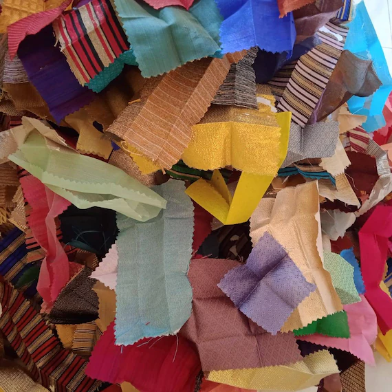
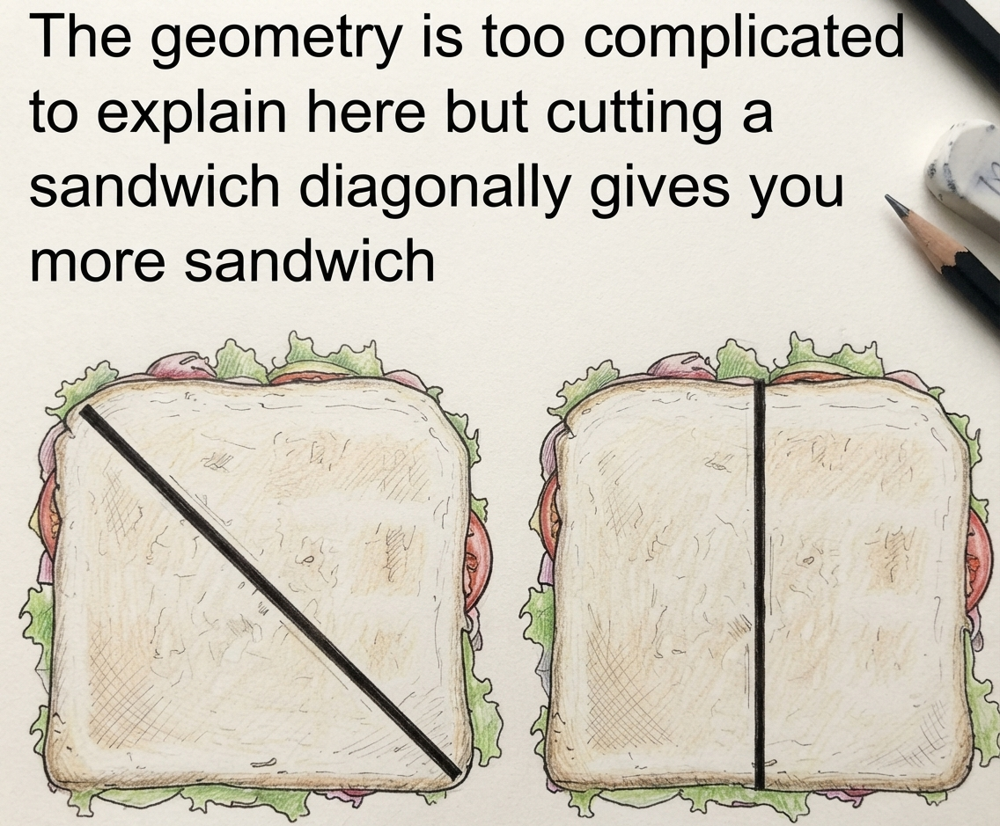
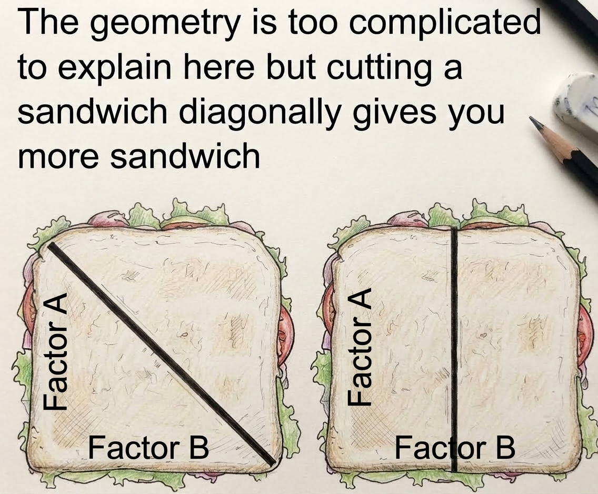
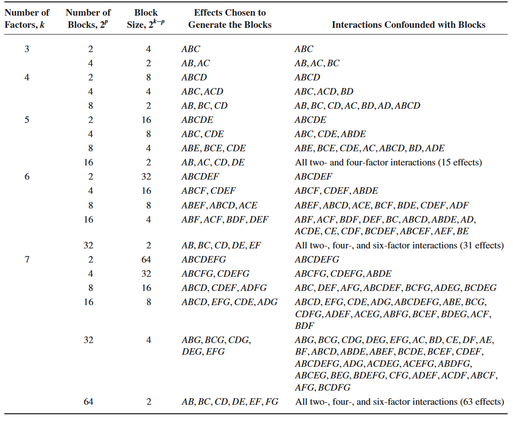
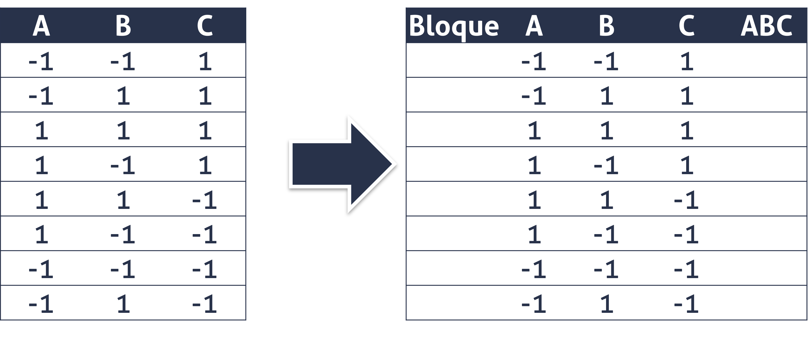
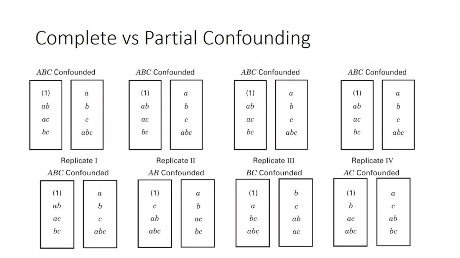

```{r}

library(tidyverse)

```


## Agenda {.bloques}

* Repaso

* Utilidad del bloqueo y confusión

* Nomenclatura y generadores

* Confusión y estructuras de confusión 

## Objetivos de aprendizaje {.bloques}

* La idea es:

  * Identificar las posibilidades del bloqueo y confusión, con argumentos prácticos, mediante la exploración de escenarios cercanos. 
  
  * Comprender el efecto del bloqueo y la confusión en un diseño experimental, con el propósito de que se reconozca la utilidad y consecuencias. 
  
  * Establecer una forma de actuación en el diseño de bloques y el análisis de resultados, para asegurar el correcto tratamiento de datos y el impacto en las conclusiones.
  
* Al final se espera que: 

  * Comprenda la utilidad y consecuencias del bloqueo y confusión en experimentos factoriales completos.


## Recordatorio - Bloqueo {.bloques}

* A menudo, el bloqueo se utiliza para reducir o eliminar la variabilidad transmitida por factores de ruido, es decir, [factores que pueden influir en la respuesta experimental, pero en los que no se está directamente interesado]{.hi}.

* Por definición, se asume que un factor de bloqueo no interactúa con los factores de tratamiento ni con otros bloques.

## Recordatorio - Bloqueo {.bloques}

* En el diseño experimental es indispensable mantener las condiciones homogéneas, cuando esto no se pueda lograr, se utiliza la técnica de bloqueo. No aplicar la técnica cuando era necesario, infla el error y esto reduce la precisión con la que se hacen las estimaciones.

* El bloqueo es una intervención, que introduce efectos adicionales. El uso adecuado del bloqueo es una solución "elegante" que posibilita la ejecución de algunos experimentos. 

* Puede tener una o más variables de bloqueo, no pueden interactuar entre sí, porque no es posible medir el efecto de esta interacción, y "engrosa" el error de manera inadecuada, pues no es una valoración aleatoria, sino causal.
  
## Recordatorio - Bloqueo {.bloques}

* En resumen, el bloqueo es un efecto adicional, [que no es de interés]{.hi}, que se introduce para mejorar la capacidad resolutiva del modelo. 
  
* El bloqueo tiene un costo: grados de libertad (GL).
  
* Los grados de libertad se relacionan directamente con la potencia estadística, menos GL, menos potencia. Por ello, el bloqueo tampoco se debe aplicar indiscriminadamente: las variables de bloqueo tienen que estar muy relacionadas con la variable dependiente. Si la variable de bloqueo no está relacionada con la de respuesta, usted está sobredimensionando innecesariamente el modelo.
  
## Recordatorio - Bloqueo {.bloques}

* Cuando abordamos el tema de Diseños factoriales completos $2^k$ bloqueados, establecimos una regla: 

* Los factoriales son ortogonales y para garantizar que eso siga siendo así, cada bloque debe estar conformado por exactamente una réplica.

  * Excepciones a esta regla serán abordadas en clases posteriores.

* [Hemos llegado a esas clases posteriores]{.hi}. La excepción está dada por la técnica de confusión, que garantiza la ortogonalidad con bloques más pequeños que una réplica. 

## Recordatorio - Bloqueo {.bloques}

* Un requisito para aplicar la técnica de bloque, es que no se dé interacción entre los bloques y los tratamientos. 

* *Por ejemplo*, suponga que usted va a hacer un experimento sobre el diseño de un puesto de trabajo manual, en el que va a bloquear a las operarias: Ana y María, porque no es de interés medir el efecto del operador en la variable de respuesta. 

## Recordatorio - Bloqueo {.bloques}

* Usted se asegura de que las dos personas tengan habilidades similares, que estén calificadas para el trabajo, que presenten condiciones de fatiga similares, etc., etc., pero resulta que [una de ellas es diestra y la otra es zurda]{.hi}, y esa condición puede implicar que cuando las piezas están a un lado u otro del cuerpo de la operadora, el tiempo de ejecución se vea afectado. 

  * Este es un buen ejemplo, de una inadecuada aplicación de la técnica. 

# Bloqueo y confusión {.bloques}

## ¿Cuándo y por qué?  {.bloques}

:::::: {.columns}

::: {.column width="65%"}

* Cuando [es necesario bloquear]{.hi}, pero [no alcanzan los recursos]{.hi} para hacer un bloque por réplica. 

* Es decir, cuando es imposible efectuar todas las corridas bajo condiciones homogéneas.

* Suponga un ejemplo sencillo, en un experimento $2^4$ se usa tela como material experimental, se usa la tela que sobra del proceso de maquila (retazos) para abaratar los costos.

:::

::: {.column .img-fit}



:::

::::::

## ¿Cuándo y por qué?  {.bloques}

* La tela que sobra se agrupa por tipo, proveedor y color, entre otros, y cada grupo alcanza para al menos 10 corridas experimentales. Bajo estas características indefectiblemente hay que bloquear. 

* Pero con 16 tratamientos, no me alcanza la tela para cubrir ni una réplica, es decir, solo podría hacer bloques incompletos. 
  * ¿Puedo hacer algo? ¿Cómo hago el experimento?
  * La alternativa directa es: hacer bloques incompletos que mantengan la ortogonalidad del diseño, es decir: emplear la técnica de la confusión.

## Entonces {.bloques}

:::::: {.columns}

::: {.column}

* [Repasando]{.hi}: El bloqueo se utiliza como agente posibilitador de la ejecución del experimento, cuando no se pueden realizar todas las corridas en condiciones homogéneas. 

* La práctica usual es hacer [bloques por réplica]{.hi}, como aprendió en la clase de Factoriales Completos; pero no en todas las ocasiones esto es posible, pues no alcanzan los recursos para hacerlo, como aprendió en el ejemplo de la tela. 

* Es en esta situación en la que se utiliza la [confusión]{.hi}. 

:::

::: {.column .img-fit}


:::

::::::

## Todo tiene un costo {.bloques}

:::::: {.columns}

::: {.column .img-fit}


:::

::::::

## ¿Qué se sacrifica? {.bloques}

* Bloqueo y confusión [es todo un arte]{.hi}; pues requiere de la pericia de la persona investigadora para saber cuál efecto sacrificar. No es una receta de cocina, sino que se escoge con cautela en función del contexto.

* Por lo general, para tomar esa decisión, se recomienda recurrir a los principios de jerarquía y de dispersión de efectos. 

* En simple: 
  
  * El modelo está dominado por efectos de orden inferior, es decir que las interacciones de orden superior son las que *menos* interesan. 

  * Por ejemplo, en un experimento $2^3$ el efecto que menos interesa es el asociado con $ABC$. Un detalle: el efecto de interacción mayor de un experimento suele llamarse la palabra. En un $2^4$ la palabra es $ABCD$.


## En resumen {.bloques}

:::::: {.columns}

::: {.column}

* Del principio de jerarquía y de dispersión de efectos concluimos que conviene confundir los efectos de orden superior. 

* Pues se presume que estos no son importantes.

* En la imagen de la derecha se muestra la confusión de un experimento $2^{3}$ en $2^1$ bloques, siendo el generador $ABC$.

:::

::: {.column .img-fit}


:::

::::::

## Nomenclatura {.bloques}

* El experimento se escribe como: 

* $2^{k}$ en $2^p$ bloques

* donde: 

  * $2$: cantidad de niveles
  * $k$: cantidad de factores
  * $p$: cantidad de generadores
  
## Generadores {.bloques}

* Son las piezas de información que son necesarias para generar los bloques. 

* El número de bloques solo puede ser potencia de $2$.

  * Cantidad de bloques: $2^p$.

  * Cantidad de tratamientos por bloque: $2^{(k-p)}$.

  * Cantidad de tratamientos totales: $2^k$.

## Diferencias entre bloqueo y bloqueo y confusión {.bloques}

:::::: {.columns}

::: {.column}

* En bloqueo y confusión el bloque siempre es [menor]{.hi} al tamaño de una réplica (o sea, a la cantidad de tratamientos). 

* Este detalle es relevante, pues toda confusión es un bloqueo, pero no todo bloqueo es una confusión.


:::

::: {.column .img-fit}


:::

::::::

## ¿Qué es confusión?  {.bloques}

* En simple, que no se puede distinguir el efecto del bloque del efecto confundido. 

* Es decir, estos se van a encontrar aliados (más adelante estudiaremos la estructura de ALIAS). 

## ¿Qué es confusión?  {.bloques}

* Por ejemplo, en un experimento $2^{3}$ en $2^{1}$ bloques se obtendrían: 

  * 8 tratamientos
  * 2 bloques
  * 4 corridas por bloque
  
* ¿Qué se confunde?

  * Bloque + ABC
  
* Cualquier efecto confundido se pierde (no se estima), por eso que se dice que [se paga con información, además de con grados de libertad]{.hi}. 


## Una analogía {.bloques}

:::::: {.columns}

::: {.column}

* Suponga que usted tiene un herman@ con el que tiene que compartir un sandwich; pues "no alcanzan" los recursos para que cada uno se coma uno entero. 

* La partición debe hacerse de forma justa, ¿correcto? 

* Por lo general, en el acervo popular, se dice que el corte en diagonal, es mejor que el vertical; en el caso del bloqueo y confusión, si debe ser así, en diagonal (aunque usted esté de acuerdo o no), para conservar la ortogonalidad del diseño.

:::

::: {.column .img-fit}



:::

::::::

## Una analogía {.bloques}

* A modo de analogía, tome en cuenta que al cortar el sandwich, usted está perdiendo parte del mismo, pues se generan boronas o migajas, y la salsa y otros componentes del sandwich se quedan pegados al cuchillo. 

* En bloqueo y confusión, ocurre lo mismo, el "corte" que se realiza sobre la geometría del diseño, hace que pierda información.

* Ahora, si se realiza el corte en la diagonal, [se pierde la información que da esa diagonal]{.hi}. Como aprendió en la clase de Factoriales Completos, las diagonales se usan para estimar las [interacciones]{.hi}. 

* En el caso de esta analogía, siendo un experimento $2^2$, se perdería la interacción $AB$.  


## Una analogía {.bloques}

:::::: {.columns}

::: {.column}

* De realizarse el corte sobre la [horizontal]{.hi} o la [vertical]{.hi}, se estaría perdiendo la información de un efecto principal $A$ o $B$. 

  * Recuerde, de nuevo, que en la clase de Factoriales completos aprendió que las "caras" de la geometría del diseño se usa para estimar los efectos principales. En la imagen de la derecha, de realizarse el corte de manera vertical, perdería el efecto del Factor A.
  
* Por jerarquía y dispersión de efectos, sabe que es mejor "perder" una interacción que un efecto principal. 

:::

::: {.column .img-fit}



:::

::::::

## Generadores recomendados {.bloques}

:::::: {.columns}

::: {.column width="35%"}

Estos son los generadores recomendados, pero no son impuestos, ya que usted puede seleccionar otros generadores por conveniencia. 

Esa conveniencia se determina en función de la experiencia en: 1) El diseño de experimentos, 2) el proceso que se está estudiando. 

:::

::: {.column .img-fit}



:::

::::::


## Ejercicio {.bloques}

* Suponga una réplica de un experimento factorial completo $2^{3}$ en $2^1$ bloques. En la tabla anterior puede observar los generadores sugeridos.  En este caso será $ABC$. Primero, generamos el experimento de interés y luego agregamos una columna adicional con el generador utilizado.

* Realice este ejercicio en conjunto con la persona docente. 

## Ejercicio {.bloques}

:::::: {.columns}

::: {.column .img-fit}



:::

::::::

## Ejercicio {.bloques}

:::::: {.columns}

::: {.column width="40%"}

* Repita el ejercicio anterior, de forma autónoma, pero en esta ocasión utilice dos generadores. 

  * Es decir, con $2^{3}$ en $2^2$ bloques.

* Sirvase usar el espacio de la derecha, si gusta, para este fin. Agregue las columnas necesarias.

:::

::: {.column}

```{r}

A <- B <- C <- c(-1, 1)

datos <- tidyr::expand_grid(A, B, C)

datos |> 
  knitr::kable(format = "html") |> 
  kableExtra::kable_styling()

```


:::

::::::

# Tipos de confusión {.bloques}

## Confusión parcial {.bloques}

* Es la medida paliativa para la desventaja más grande de la confusión: [la pérdida de información]{.hi}. Ocurre cuando en todas las réplicas [se confunden efectos diferentes]{.hi}, de tal forma que la información que se pierde o confunde en una réplica, aparece en la réplica siguiente. 

  * Por ejemplo, se puede lograr realizando una réplica con un $2^{5}$ en $2^1$ bloques y otra con un $2^{5}$ en $2^2$ bloques, de tal forma que los generadores son diferentes. No es una opción usual.
  
  * No obstante, también puede realizar una con un $2^{5}$ en $2^1$ bloques con ABCDE como generador y la otra en un $2^{5}$ en $2^1$ bloques pero con ABCD como generador. Esta opción es la preferida.  
  
* De esta manera, la información perdida en una réplica se obtiene de otra réplica. Los efectos confundidos y "recuperados" se estiman con menor precisión (EE más altos).

## Confusión completa {.bloques}

* Cuando se confunde siempre el mismo efecto en cada réplica, de tal manera que ese efecto no se recupera y queda “perdido” (o sea confundido) en todas las ocasiones.

## Confusión {.bloques}

* Siempre que sea posible, se recomienda el uso de confusión parcial. 

* Esto NO implica que la confusión completa sea un error.

* En muchas situaciones pueden ser deseables los experimentos de una sola réplica y estos, si se usan con bloqueo y confusión tendrán confusión completa.

## Confusión {.bloques}

:::::: {.columns}

::: {.column .img-fit}



:::


::::::

## Ejercicio {.bloques}

* Resuelva de forma sincrónica o asincrónica, a juicio de la persona docente. 

* Genere, en Excel, la matriz de diseño de un experimento factorial $2^{5}$ en $2^p$ bloques y posteriormente realice diseños con 2, 4 y 8 bloques. Utilice los generadores recomendados. 

## Cómo crear y analizar  este experimento en R {.bloques}

* En caso de que no quiera usar Minitab, por costo, licenciamiento u otras razones, se le provee de un tutorial en R para el diseño y análisis de experimentos factoriales completos, bloqueados y confundidos. 

* Lo puede encontrar en este [enlace](https://stevenggoni.github.io/tutoriales_R/bloqueo_confusion.html){target="_blank"}.

## Bibliografía {.bloques}

:::: columns
::: {.column width="100%" style="font-size: 1.35em;"}

* Montgomery, D. C. (2020). Design and analysis of experiments (10.ª ed.). Wiley.
  * Capítulo 7.

:::
::::

## Diseño factorial completo, bloqueado y confundido $2^{k}$ en $2^p$ bloques <br> II-1125 Estadística para Ingeniería Industrial III {.center}

### Gracias por su atención <br> Steven García Goñi<br>[steven.garciagoni\@ucr.ac.cr](mailto:steven.garciagoni@ucr.ac.cr) {.subtitle}

### Dudas o correcciones requeridas pueden solicitarse al correo