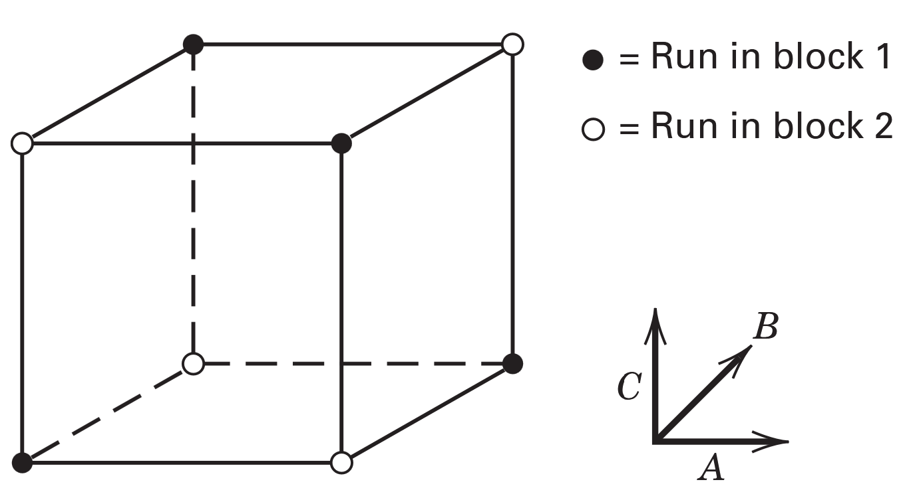
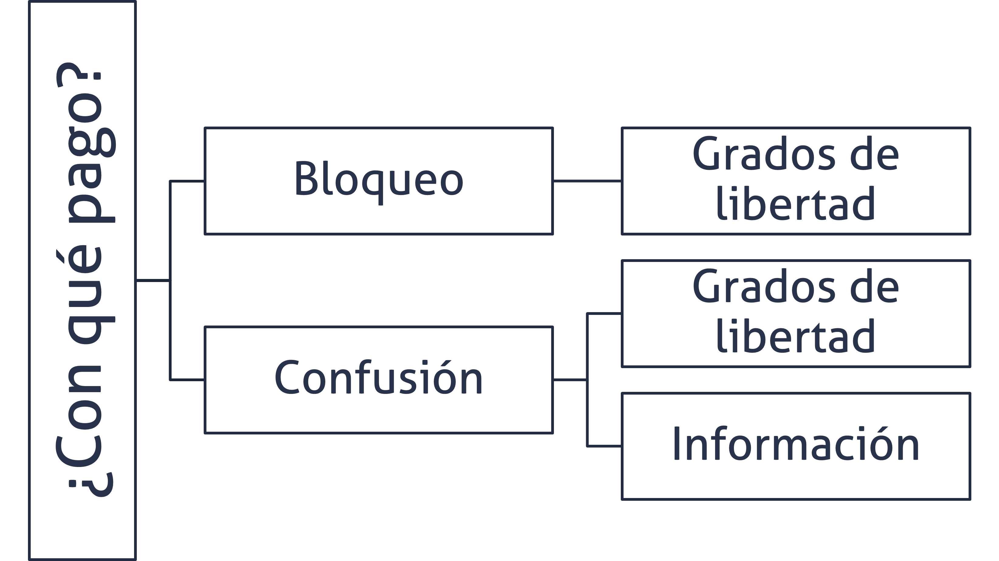
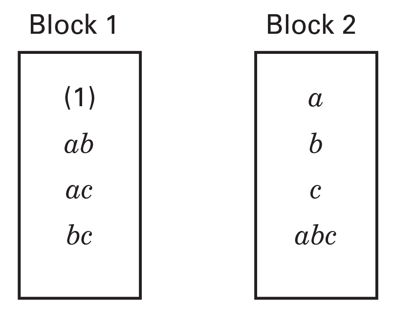
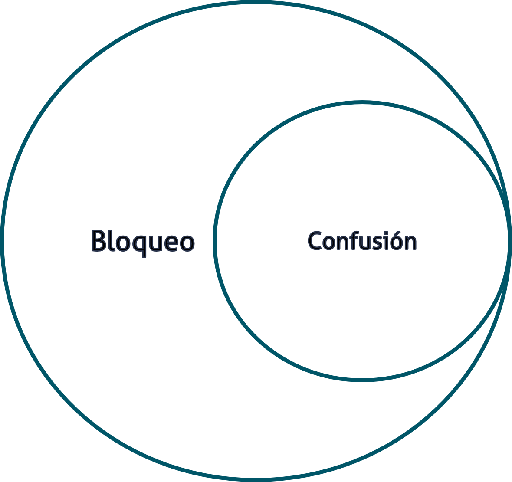

```{r}

library(tidyverse)

```


## Agenda {.bloques}

* Repaso

* Utilidad del bloqueo y confusión

* Nomenclatura y generadores

* Confusión y estructuras de confusión 

## Recordatorio - Bloqueo {.bloques}

* A menudo, el bloqueo se utiliza para reducir o eliminar la variabilidad transmitida por factores de ruido, es decir, [factores que pueden influir en la respuesta experimental, pero en los que no se está directamente interesado]{.hi}.

* Por definición, cualquier factor de bloqueo debe estar altamente relacionado con la variable de respuesta pero NO debe interactuar con otros factores de bloqueo u otros factores.
  
## Recordatorio - Bloqueo {.bloques}

* En resumen, el bloqueo es un efecto adcional ficticio, [que no es de interés]{.hi}, que se introduce para mejorar la capacidad resolutiva del modelo. 
  
* El bloqueo tiene un costo: grados de libertad.
  
* Los grados de libertad se relacionan directamente con la potencia estadística, menos GL, menos potencia. 
  
## Recordatorio - Bloqueo {.bloques}

* Cuando abordamos el tema de Diseños factoriales completos $2^k$ bloqueados, establecimos una regla: 

* Los factoriales son ortogonales y para garantizar que eso siga siendo así, cada bloque debe estar conformado por exactamente una réplica.

  * Excepciones a esta regla serán abordadas en clases posteriores.

* [Hemos llegado a esas clases posteriores]. La excepción está dada por la técnica de confusión, que garantiza la ortogonalidad con bloques más pequeños que una réplica. 

# Bloqueo y confusión {.bloques}

## ¿Cuándo y por qué?  {.bloques}

* Cuando [es necesario bloquear]{.hi}, pero [no alcanzan los recursos]{.hi} para hacer un bloque por réplica. 

* Suponga un ejemplo sencillo, en un experimento $2^4$ se usa tela como material experimental, se usa la tela que sobra del proceso de maquila para abaratar los costos.

## ¿Cuándo y por qué?  {.bloques}

* La tela que sobra, alcanza para al menos 10 corridas experimentales y se usa material que viene de diferentes proveedores de telas por lo que indefectiblemente hay que bloquear. 

* Pero con 16 tratamientos, no me alcanza la tela para cubrir ni una réplica. 
  * ¿Puedo hacer algo? ¿Cómo hago el experimento?

## Entonces {.bloques}

:::::: {.columns}

::: {.column}

* El bloqueo se utiliza como agente posibilitador de la ejecución del experimento, cuando no se pueden realizar todas las corridas en condiciones homogéneas. 

* La práctica usual es hacer bloques por réplica, como aprendió en la clase pasada; pero no en todas las ocasiones esto es posible, pues no alcanzan los recursos para hacerlo. 

* Es en esta situación en la que se utiliza la [confusión]{.hi}. 

:::

::: {.column .img-fit}



:::

::::::

## Todo tiene un costo {.bloques}

:::::: {.columns}

::: {.column .img-fit}



:::

::::::

## ¿Qué se sacrifica? {.bloques}

* Bloqueo y confusión es todo un arte; pues requiere de la pericia de la persona investigadora para saber cual efecto sacrificar. 

* Por lo general se recomienda recurrir a jerarquía y dispersión de efectos. 

* En simple: 
  
  * El modelo está dominado por efectos de orden inferior, es decir que las interacciones de orden superior son las que menos interesan. 

  * Por ejemplo, en un experimento $2^3$ el efecto que menos interesa es el asociado con $ABC$.
  
    * Nota: El efecto de interación mayor de un experimento suele llamarse la palabra. En un $2^4$ la palabra es $ABCD$


## En resumen {.bloques}

:::::: {.columns}

::: {.column}

* Del principio de jerarquía y de dispersión de efectos concluimos que conviene confundir los efectos de orden superior. 

* Pues se presume que estos no son importantes.

* En la imagen de la derecha se muestra la confusión de un experimento $2^3$.

:::

::: {.column .img-fit}



:::

::::::

## Nomenclatura {.bloques}

* El experimetno se escribe como: 

* $$2^{k-p}$$

* donde: 

  * $2$: cantidad de niveles
  * $k$: cantidad de factores
  * $p$: cantidad de generadores
  
## Generadores {.bloques}

* Son las piezas de información que son necesarias para generar los bloques. 

* El número de bloques solo puede ser potencia de $2$.

  * Cantidad de bloques: $2^p$.

  * Cantidad de tratamientos por bloque: $2^{(k-p)}$.

  * Cantidad de tratamientos totales: $2^k$.

## Diferencias entre bloqueo y bloqueo y confusión {.bloques}

:::::: {.columns}

::: {.column}

* En bloqueo y confusión el bloque siempre es MENOR al tamaño de una réplica (o sea, a la cantidad de tratamientos). 

* Este detalle es relevante, pues toda confusión es un bloqueo, pero no todo bloqueo es una confusión.


:::

::: {.column .img-fit}



:::

::::::

## ¿Qué es confusión?  {.bloques}

* En simple, que no se puede distinguir el efecto del bloque del efecto confundido. 

* Es decir, estos se van a encontrar aliados (más adelante estudiaremos la estructura de ALIAS). 

## ¿Qué es confusión?  {.bloques}

* Por ejemplo, en un experimento $2^{3-1}$ se obtendrían: 

  * 8 tratamientos
  * 2 bloques
  * 4 corridas por bloque
  
* ¿Qué se confunde?

  * Bloque + ABC
  
* Cualquier efecto confundido se pierde, por eso que se dice que se paga con información, además de con grados de libertad. 
