```{r}

library(tidyverse)
library(rsm)

```

## Agenda {.bloques}

* Conceptos

* Diseños de superficie de respuesta

  * Ascenso empinado
  * Diseño Central Compuesto (DCC)
  * Box - Behnken
  * Otras RSM - Mención

* Optimización simultánea

* Criterios de optimalidad - Mención

## Perspectiva histórica {.bloques}

* Hay, según diversos autores, cuatro grandes eras en el desarrollo moderno del DdE, una de las más importantes fue la segunda era: 

  * La era de la agricultura liderada por Ronald Fisher.
  * La era industrial, caracterizada por el desarrollo de la RSM.
  * La tercera era está asociada  con el ingeniero japonés Genichi Taguchi y el diseño robusto.
  * La cuarta era que incluye un interés general en el DdE y su incorporación como materia en la mayoría de ingenierías. 


## Perspectiva histórica {.bloques}

* La segunda era fue importante, pues [Box & Wilson (1951)]{.hi} reconocen y aprovechan el hecho de que muchos de los experimentos son diferentes a los definidos en la primera era: los agrícolas. 

* Las diferencias encontradas por estos autores son al menos dos principales: 

* [Inmediatez]{.hi}: La variable de respuesta generalmente se puede observar casi inmediatamente.

* [Secuencialidad]{.hi}: El experimentador puede aprender rápidamente información crucial de un grupo pequeño de corridas experimentales que se pueden utilizar para planificar el próximo experimento.

## Perspectiva histórica - La segunda era {.bloques}

* Entre 1950 y 1980 el DdE se convirtió en una herramienta de aplicación frecuente en las áreas de investigación y desarrollo. 

* Hasta 1970, su aplicación en la industria y manufactura no estaba generalizada, debido a la falta de recursos computacionales y la carencia de formación estadística por parte de las personas profesionales. 

* Es en esta era donde comienzan los trabajos sobre el diseño óptimo de experimentos, que se basa en la idea de seleccionar experimentos basados en criterios específicos de [optimalidad]{.hi}. 

  * Optimalidad se basa en seleccionar los diseños que produzcan estimación de parámetros con la mejor precisión posible. Una forma de entender "precisión" es en función del Error Estándar. 
    * >Nota: no confunda diseños para optimización con diseños óptimos.


## Perspectiva histórica - La segunda era {.bloques}

* Por su parte, la investigación estadística sobre los experimentos con mezclas tuvo sus inicios en la década de 1950 con Quenouille (1953, 1959). 

* Claringbold (1955) introdujo el diseño símplex con tres componentes y Scheffé (1958) introdujo el diseño símplex lattice (también llamado reticular). 

* >Nota: las RSM con mezclas no son parte de este curso.

# Superficies de respuesta (RSM) {.bloques}

## RSM {.bloques}

* La Metodología de Superficie de Respuesta (RSM) es un conjunto de técnicas matemáticas y estadísticas útiles para el modelado y análisis de problemas en los que una respuesta de interés está influenciada por diversas variables y el objetivo final es [optimizar dicha respuesta]{.hi}.

* En los experimentos factoriales estudiados anteriormente era posible optimizar la respuesta predicha por el modelo ajustado. Sin embargo, estos modelos suelen ser aproximaciones lineales válidas únicamente dentro de una [región experimental]{.hi} limitada, por lo que pueden no representar adecuadamente comportamientos curvos de la respuesta.

## Regiones {.bloques}

* Dos conceptos relevantes en la RSM son: 

* [La región de operabilidad]{.hi}: Es la región que está definida por el conjunto de condiciones **donde el equipo o proceso puede ser operado**, por ejemplo: las revoluciones por minuto a las que puede girar el motor de un torno CNC.
  * Es difícil de delimitar con certeza el tamaño de la región de operabilidad, ya que hay que estudiar el efecto en presencia de otros factores. 


* [La región de experimentación]{.hi}: Es el espacio que está **delimitado por los rangos de experimentación** utilizados con cada factor.
  * En las RSM la región de experimentación es por lo general menor a la región de operabilidad, excepto cuando la RSM es de mezclas.

## RSM {.bloques}

* Surgen o se utilizan porque en algunas ocasiones hay experimentos con los que no se obtienen los resultados buscados o las mejoras introducidas son insuficientes, por lo que es necesario experimentar de manera secuencial hasta alcanzar los resultados esperados.

* Por ejemplo, después de una primera etapa experimental puede ser imperativo desplazar la región experimental en una dirección adecuada al objetivo del DdE o bien, explorar con detalle (con otro modelo) la región experimental inicial.

## RSM {.bloques}

* Por lo general en los problemas de RSM no se conoce la forma de la relación entre la variable de respuesta ($y$) y las variables independientes ($x_i$); por tanto, el primer paso corresponde a encontrar una aproximación adecuada de la verdadera relación funcional entre variables dependientes e independientes.

* Como la función real que relaciona estas variables suele ser desconocida y compleja, se utilizan modelos empíricos aproximados, [generalmente polinomios de orden bajo]{.ul} en una región limitada de los datos.

## RSM {.bloques}

* **Modelo de primer orden**: Se utiliza cuando el sistema no presenta curvatura, representando la superficie como un plano

  * $$y = \beta_0 + \beta_1x_1 + \beta_2x_2 + \cdots + \beta_kx_k + \varepsilon$$

## RSM {.bloques}

* **Modelo de segundo orden**: Es el más utilizado debido a su flexibilidad, ya que permite aproximar una gran variedad de superficies reales, incluyendo máximos, mínimos y puntos de silla.

  * $$y = \beta_0 + \sum_{j=1}^k\beta_{j}x_j+\sum_{j=1}^k\beta_{jj} x_j^2 + \sum\sum_{i<j=2}^k \beta_{ij}x_ix_j + \varepsilon$$

* Ambos modelos se estiman con MCO (Mínimos Cuadrados Ordinarios).
  
## La naturaleza secuencial de las RSM {.bloques}

* El enfoque de la RSM es de naturaleza secuencial, permitiendo al experimentador aprender del proceso a medida que avanza la investigación

  * [Fase de cribado (screening):]{.hi} Su objetivo es reducir una lista larga de variables potenciales a solo unas pocas que sean realmente importantes para explicar la respuesta. También se conoce como fase 0.
    * En este curso estudiamos los factoriales fraccionados
  * [Fase de ascenso empinado:]{.hi} Se utiliza cuando el proceso está lejos del óptimo y se emplea un modelo de primer orden para moverse rápidamente hacia la región de mejor rendimiento. También se conoce como fase 1.
    * En este curso aprendió sobre experimentos factoriales completos, estos pueden tomarse como base para el ascenso empinado.
  * [Fase de optimización:]{.hi} Una vez que se alcanza la vecindad del óptimo, se emplea un modelo de segundo orden para localizar las condiciones óptimas con precisión, ya que en esta región suele aparecer curvatura en el sistema. A esta se le conoce como fase 2.
  
## La naturaleza secuencial de las RSM {.bloques}

:::::: {.columns}

::: {.column .img-fit}

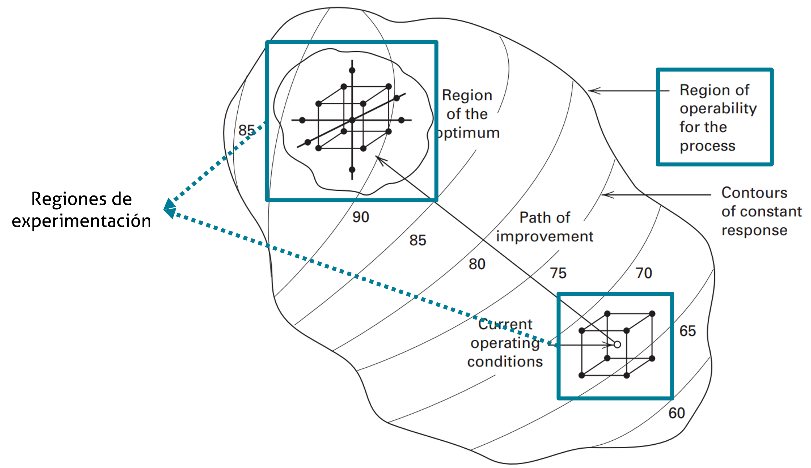

:::

::::::

## La naturaleza secuencial de las RSM {.bloques}

* Nótese, de la imagen del slide anterior, que la región de operabilidad es difusa, por eso es representada como una nube.

* Las condiciones actuales de operación está representada con un "viejo conocido", un experimento factorial completo $2^3$.

* La ruta de mejora (de ascenso) lleva las condiciones actuales a la región de experimentación del óptimo. El cual se representa con un Diseño Central Compuesto (DCC), que luego será estudiado. 

* Tanto el factorial completo $2^3$ como el DCC son regiones de experimentación. 

## Experimentación secuencial {.bloques}

:::::: {.columns}

::: {.column}

* La idea general que se sigue es que con base en un problema, la experimentación secuencial busca, utilizando varios experimentos, encontrar la mejor respuesta posible al problema que se plantea. 
  * Por varios experimentos se refiere tanto a la cantidad, como al tipo de experimento. 
  
* Por lo general la ruta que se sigue en la experimentación secuencial es: 
  * Explorar la región de operación
  * Crear modelos de primer orden
  * Evaluar la necesidad de modelos de segundo orden o superior
  * Reducir el ruido o hacerlo robusto
  
::: 

::: {.column .img-fit width="14%"}

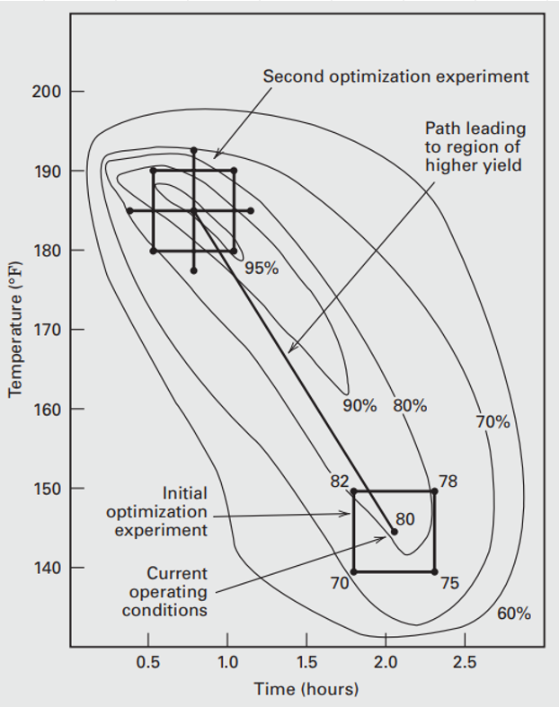

:::

::::::

## Experimentación secuencial {.bloques}

:::::: {.columns}

::: {.column .img-fit width="75%"}

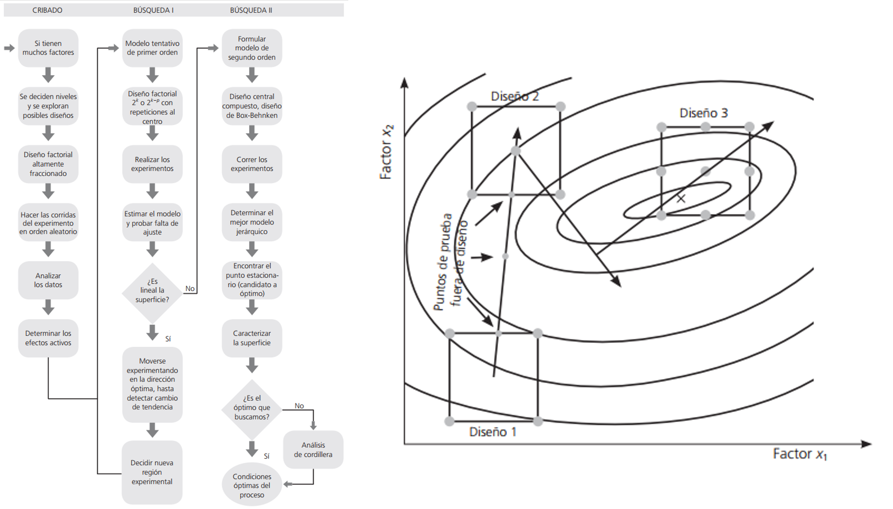

:::

::::::

## Objetivos y aplicaciones típicas {.bloques}

* [Mapeo de la superficie]{.hi}: Para predecir cambios en la respuesta ante ajustes en las variables.

* [Optimización]{.hi}: Determinar los niveles exactos que maximizan o minimizan la respuesta.

* [Cumplimiento de especificaciones]{.hi}: Selección de condiciones que satisfagan múltiples requisitos simultáneamente (como costo, rendimiento y calidad), a menudo superponiendo gráficos de contornos.

## Consejos y recomendaciones {.bloques}

* Hacer una RSM es un proceso secuencial, el objetivo es experimentar rápida y eficientemente a través de una ruta de mejora, hacia el óptimo. 

* Por lo general una RSM (por su naturaleza secuencial) es intensiva en recursos, por lo que se aconseja medir tantas variables de respuesta como sean factibles y lógicas.


# Tipos de RSM {.bloques}

## Tipos de RSM {.bloques}

* Los diseños típicos empleados para ajustar RSM, son: 
  * El método del ascenso/descenso empinado
  * El diseño central compuesto
  * El diseño de Box - Behnken
  * Experimentos con mezclas y sus variantes (no estudiados en esta presentación)
  
## El método del ascenso empinado {.bloques}

:::::: {.columns}

::: {.column .img-fit width="50%"}

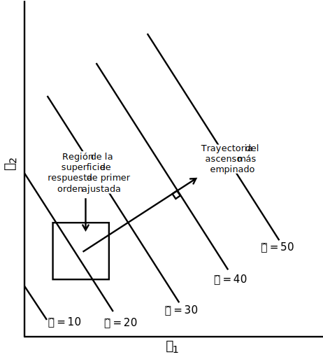

:::

::: {.column}

* Esta es una técnica de optimización basada en un gradiente de primer orden. El procedimiento consiste en: 

  * [Ajustar un modelo de primer orden]{.hi}: usando un diseño ortogonal como un factorial $2^k$ en una región localizada para obtener una ecuación del tipo: $\hat{y} =  \beta_0 + \sum\beta_i x_i$. En ocasiones se recomienda incluir puntos centrales en este diseño para detectar si hay una curvatura en la superficie. 

:::

::::::

## El método del ascenso empinado {.bloques}

* Esta es una técnica de optimización basada en un gradiente de primer orden. El procedimiento consiste en: 

  * [Determinar la trayectoria]{.hi}: Es el camino de ascenso máximo, se mueve en una dirección **perpendicular** a las líneas de respuesta constante (contornos). Se busca maximizar la respuesta ($\hat{y}$); para esto se debe elegir una variable base, que normalmente es aquella que tiene el coeficiente más grande (en valor absoluto) o de la que se tiene más conocimiento, y se define un paso (*step*) en unidades codificadas. El paso para cualquier otra variable se calcula como $\Delta x_j = \frac{b_j}{b_i/\Delta x_i}, \quad j = 1, 2, ..., k \quad i \ne j$.

## Ejemplo {.bloques}

* Suponga que se ha obtenido este modelo de primer orden a partir de un experimento factorial completo $2^2$. 

* $$\hat{y}=766.25 - 66.25x_1 + 43.75x_2$$

* Se selecciona el coeficiente de $x_1$ como referencia, entonces $\Delta x_1 = 1.0$, y por tanto $\Delta x_2 = \frac{43.75}{66.25} = 0.66$.

* Como la dirección de máximo ascenso es perpendicular a las curvas de nivel, se debe avanzar desde el punto central, $(0, 0)$ en este caso, en pasos de $-1$ para $x_1$ y $+0.66$ para $x_2$. De tal forma que para aumentar la respuesta se debe disminuir $x_1$ y aumentar $x_2$.

## Ejemplo {.bloques}

:::::: {.columns}

::: {.column}

* En el ejemplo desarrollado $x_1$ es *Gap*, en nivel bajo (1.20) y alto (1.60) y $x_2$ es *Power* con nivel bajo (275) y alto (325), los puntos centrales serían 1.40 y 300 respectivamente. El paso está definido en variables codificadas como $\Delta x_1 = 1.60-1.40 = 0.20$ y $\Delta x_2 = 325-300=25$.

  * En $\Delta x_1$ los pasos ocurren cada 0.20 y en $\Delta x_2$ ocurren cada $25 \cdot 0.66 = 16.5$.

* Por lo que el primer paso que se muestra en la imagen de la derecha ocurre en las coordenadas $(1.20, 316.5)$, el segundo en $(1.00, 333)$ y el tercero en $(0.80, 349.5)$.

:::

::: {.column .img-fit width="30%"}

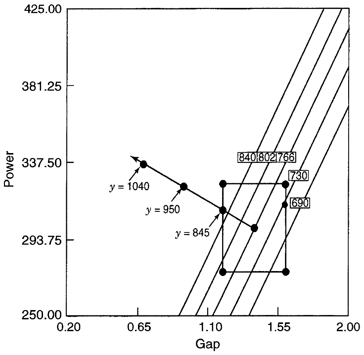

:::

::::::

## El método del ascenso empinado {.bloques}

:::::: {.columns}

::: {.column}

* Esta es una técnica de optimización basada en un gradiente de primer orden. El procedimiento consiste en: 

  * [Ejecución experimental a lo largo de la trayectoria]{.hi}: Una vez definida la línea, se realizan corridas experimentales siguiendo esos puntos. Se utiliza la siguiente regla de parada: Se continúa experimentando a lo largo de la trayectoria hasta que la respuesta deje de mejorar. Una regla práctica común es detenerse cuando se observan dos disminuciones consecutivas en la respuesta.
  
:::

::: {.column .img-fit width="28%"}

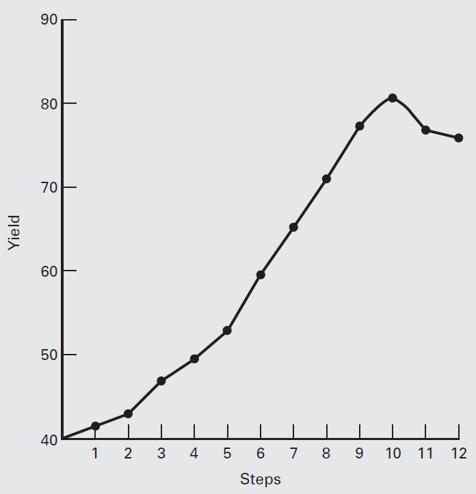

:::

::::::

## El método del ascenso empinado {.bloques}

* Esta es una técnica de optimización basada en un gradiente de primer orden. El procedimiento consiste en: 

  * [Reevaluación]{.hi}: Cuando se alcanza el punto máximo en la trayectoria, ese punto se convierte en el centro de un nuevo experimento, siguiendo esta estrategia:
  
  * Se ajusta un nuevo modelo de primer orden ("corrección a mitad de camino").
  * Si la curvatura (detectada por los puntos centrales) o los efectos de interacción se vuelven dominantes, es señal de que se está cerca del óptimo. En ese momento, se abandona el ascenso máximo y se procede a la [optimización de segundo orden]{.hi}.

* Este enfoque secuencial asegura que los recursos se utilicen de manera eficiente.

## Ventajas el ascenso empinado {.bloques}

* Entre sus ventajas se tiene que es muy económico, es decir, en el caso de que el proceso sea muy caro, se puede usar este método.

* Tiene un supuesto que puede ser muy “peligroso”: que un primer orden es suficiente como aproximación. 

* En la práctica se usa como exploratorio para encontrar la mejor región para experimentar con un modelo de segundo orden. 

## El método del ascenso empinado {.bloques}

:::::: {.columns}

::: {.column .img-fit width="80%"}

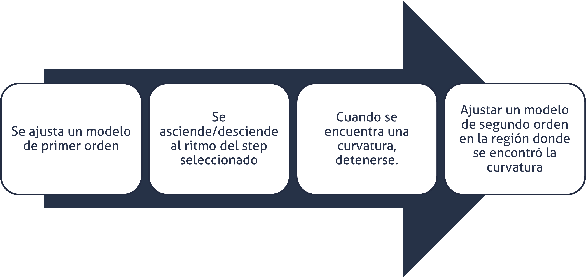

:::

::::::

## El método del ascenso empinado {.bloques}

:::::: {.columns}

::: {.column}

* Aunque es posible plantear trayectorias utilizando modelos cuadráticos, usualmente no se recomienda.

* En caso de existir interacciones importantes, la trayectoria de ascenso puede dejar de ser una aproximación adecuada.


:::

::: {.column .img-fit}

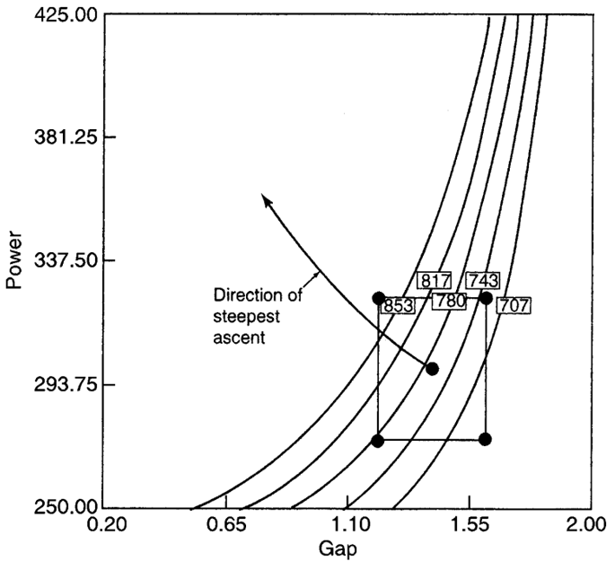

:::

::::::

## Ejemplo {.bloques}

* Tome en consideración este caso que cuenta con más de dos variables, en el que se busca minimizar la respuesta (descenso empinado): 

* $$\hat{y} = 80 - 5.28x_1 - 6.22x_2 - 1.21x_3 - 1.07x_4$$

* Donde los niveles bajo y alto son, respectivamente, para $x_1$: 1.0 y 2.0, para $x_2$: 100 y 150, para $x_3$: 500 y 1000 y para $x_4$: 75 y 120.

## Ejemplo {.bloques}

* Por conveniencia se escoge a $x_1$ como la variable de referencia, de tal forma qué(entre paréntesis el valor en unidades naturales): $\Delta x_1 = 1.0 (0.5)$, $\Delta x_2 = \frac{6.22}{5.28}=1.178 (29.45)$, $\Delta x_3 = \frac{1.21}{5.28}=0.23 (57.5)$ y $\Delta x_4 = \frac{1.07}{5.28}=0.203 (4.5)$.

* De esta manera el primer paso a partir de $(0, 0, 0, 0)$ es en unidades naturales $(2.0, 154.45, 807.5, 102.07)$, el segundo es $(2.5, 183.90, 865.0, 106.64)$.
  * Obtenga usted el paso 3 y 4.
  
# Modelos de segundo orden {.bloques}
  
## Modelos de segundo orden {.bloques}

* Son técnicas para analizar modelos cuadráticos una vez que la investigación se encuentra en la vecindad del óptimo. Esta es usada en lo que anteriormente fue mencionado como la Fase Dos del estudio de superficie de respuesta. 

* Básicamente, cuando un proceso está cerca del óptimo, la superficie suele presentar curvatura, por lo que un modelo de primer orden ya no es adecuado. El modelo de segundo orden es muy flexible y puede aproximar una gran variedad de superficies reales, incluyendo máximos, mínimos y puntos de silla. 

## Modelos de segundo orden {.bloques}

:::::: {.columns}

::: {.column}

* El diseño experimental para este modelo debe tener al [menos tres niveles]{.hi} para cada variable.

  * >Nota: recuerde que en experimentos factoriales NO se le recomendaba usar más de dos niveles, pues resultaban ineficientes. Son las RSM las que pueden resolver problemas que involucren más de dos niveles en variables continuas. 

* Además, debe tener al menos $1 + 2k + k(k+1)/2$ puntos distintos de diseño.

:::

::: {.column .img-fit width="65%"}

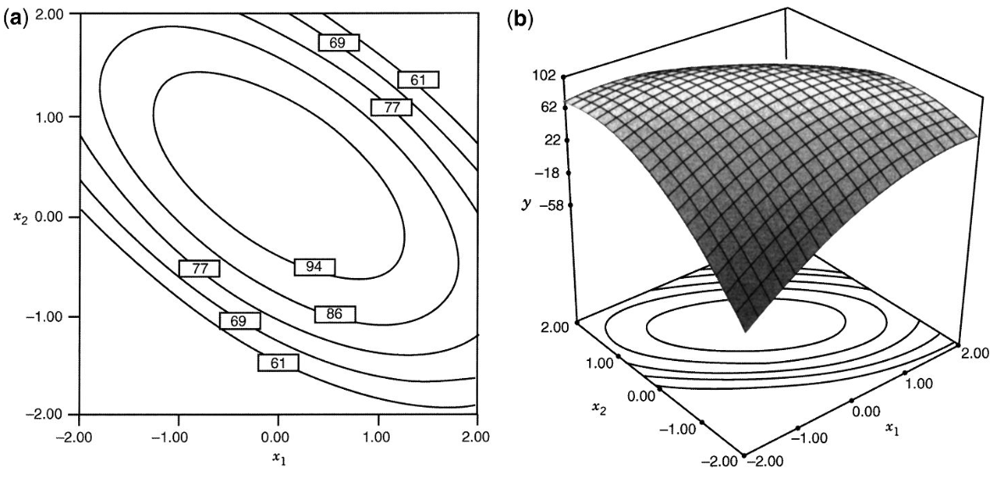

:::


::::::

## ¿Por qué no usar un factorial $3^k$ {.bloques}

* Los modelos cuadráticos requieren:

  * términos lineales,
  * interacciones,
  * términos cuadráticos.
  
* Un factorial completo $3^k$ crece exponencialmente a medida que se aumenta el número de factores. y se vuelve costoso, por eso se utilizan diseños especializados: DCC, Box-Behnken, etc.

## Ejemplo {.bloques}

:::::: {.columns}

::: {.column width = "60%"}

* Suponga el siguiente modelo de segundo orden: 

$$\hat{y} = 100 + 5x_1 + 10x_2 - 8x_1^2-12x_2^2-12x_1x_2$$
  
* El punto estacionario es la solución a: 

$$\frac{\partial \hat{y}}{\partial x_1} = \frac{\partial \hat{y}}{\partial x_2} = 0$$

:::

::: {.column}

* Cuyo resultado es:

  * $16x_1 + 12x_2 = 5 \\ 12x_1 + 24x_2 = 10$

* De tal forma que:

  * $x_1 = 0, \quad x_2 = \frac{5}{12}$

* Por tanto, el punto estacionario

  * $\hat{y} = 102.08$

:::

::::::

## Punto estacionario {.bloques}

* Recordatorio: Un [punto estacionario]{.hi} de una función se define como cualquier punto donde su tasa de cambio instantánea con respecto a la variable es cero, lo que indica que la pendiente de la función es horizontal en ese punto.

* Algebraicamente la localización de este punto se calcula mediante la ecuación matricial $x_s = -\frac{1}{2}\hat{B}^{-1}b$ (Esta expresión es la generalización multivariable de igualar la derivada a cero), donde $b$ es el vector de los coeficientes lineales y $\hat{B}$ es la matriz de coeficientes cuadráticos e interacciones.  

* Si todos los autovalores (*eigenvalues*) de la matriz $\hat{B}$ son negativos, es un máximo, si son positivos es un mínimo y si son mixtos es un punto silla.

## Ejemplo {.bloques}

:::::: {.columns}

::: {.column}

* Suponga que se ha ajustado un modelo de segundo orden: 

$$79.75 + 10.12x_1 + 4.22x_2 - 8.50x_1^2-5.25x_2^2 - 7.75x_1x_2$$

* Por tanto: 

$$
\mathbf{\hat{B}} = 
\begin{bmatrix}
-8.50 & -3.875 \\
-3.875 & -5.25
\end{bmatrix}, \quad
\mathbf{b} = 
\begin{bmatrix}
10.12 \\
4.22
\end{bmatrix}
$$

:::

::::::

## Ejemplo {.bloques}

:::::: {.columns}

::: {.column}

* Entonces el [punto estacionario]{.hi} es: 

$$
\begin{aligned}
\mathbf{x}_s &= -\tfrac{1}{2} \mathbf{B}^{-1} \mathbf{b} \\
&= -\tfrac{1}{2} 
\begin{bmatrix}
-0.1773 & 0.1309 \\
0.1309 & -0.2871
\end{bmatrix}
\begin{bmatrix}
10.12 \\
4.22
\end{bmatrix} \\
&= 
\begin{bmatrix}
0.6264 \\
-0.0604
\end{bmatrix}
\end{aligned}
$$

* Cuya respuesta es $\hat{y} = 82.81$. Los autovalores pueden calcularse con software o bien, buscando la solución a la siguiente ecuación: 

:::

::: {.column}

$$
|\mathbf{B} - \lambda \mathbf{I}| = 0
$$

$$
\left|
\begin{bmatrix}
-8.50 - \lambda & -3.875 \\
-3.875 & -5.25 - \lambda
\end{bmatrix}
\right| = 0
$$

$$
\lambda^2 + 13.75 \lambda + 29.61 = 0
$$

$$
\lambda_1 = -11.0769, \quad \lambda_2 = -2.6731
$$

Como ambos son negativos, el punto estacionario es un [máximo]{.hi}. 

:::

::::::

## Propiedades deseables de los diseños RSM {.bloques}

* [Buen ajuste]{.hi}: El diseño debe dar como resultado un buen ajuste del modelo a los datos observados.

* [Prueba de falta de ajuste]{.hi}: Debe proporcionar información suficiente para permitir una prueba de falta de ajuste (*lack of fit*).

* [Naturaleza secuencial]{.hi}: Debe permitir que los modelos de orden creciente (por ejemplo, pasar de primer a segundo orden) se construyan de manera secuencial.

## Propiedades deseables de los diseños RSM {.bloques}

* [Estimación del error puro]{.hi}: Debe proporcionar una estimación del error experimental "puro".

* [Robustez ante valores atípicos]{.hi}: El diseño debe ser insensible (robusto) a la presencia de valores atípicos (outliers) en los datos.

* [Robustez ante errores de control]{.hi}: Debe ser robusto ante errores en el control de los niveles de los factores del diseño.

## Propiedades deseables de los diseños RSM {.bloques}

* [Rentabilidad]{.hi}: El diseño debe ser rentable o eficiente en términos de costo, evitando un número excesivo de corridas experimentales.

* [Formación de bloques]{.hi}: Debe permitir que los experimentos se realicen en bloques para controlar variables extrañas.

* [Verificación de varianza]{.hi}: Debe proporcionar una forma de verificar el supuesto de que la varianza es homogénea (homocedasticidad).

* [Buena distribución de la varianza de predicción]{.hi}: Debe proporcionar una buena distribución de la varianza de predicción escalada ($Var[\hat{y}(x)]/\sigma^2$) en toda la región de interés.

## Propiedades deseables de los diseños RSM {.bloques}

* No todas estas propiedades, enunciadas previamente, son obligatorias en cada aplicación, pero deben considerarse seriamente, ya que a menudo existen compromisos entre ellas al seleccionar el diseño más adecuado.

## Propiedades deseables de los diseños RSM {.bloques}

* [Diseños de primer orden]{.hi}: La ortogonalidad es la clave, pues minimiza la varianza de los coeficientes del modelo.

* [Diseños de segundo orden]{.hi}: La rotabilidad es una propiedad deseada en los modelos de segundo orden. 

## Diseño Central Compuesto (DCC) {.bloques}

* Es la clase de diseño experimental más popular para ajustar modelos de segundo orden. Su éxito se debe a su eficiencia y a su naturaleza secuencial, lo que permite al investigador construir sobre experimentos previos. 

* Un DCC para $k$ factores se compone de tres tipos de corridas experimentales: 

  * [Puntos factoriales ($F$)]{.hi}: Provienen de un diseño factorial $2^k$ (o una fracción de resolución V). Estos puntos son fundamentales para estimar los efectos lineales y las interacciones entre factores. 
  
  * [Puntos axiales o de estrella ($2k$)]{.hi}: Consisten en dos puntos sobre el eje de cada variable a una distancia α del centro (por ejemplo, en las coordenadas ($\pm \alpha,0 \dots,0$)). Estos puntos son los que permiten estimar los términos cuadráticos puros (la curvatura).
  
  * [Puntos Centrales ($n_c$)]{.hi}: Son réplicas en el centro del diseño (coordenadas $0,0,\dots,0$). Proporcionan una estimación del error experimental "puro" y ayudan a estabilizar la varianza de la predicción en toda la región.

## Diseño Central Compuesto (DCC) {.bloques}

* El uso del DCC está motivado por la experimentación secuencial, en el tanto es un diseño factorial (completo o de resolución V) ampliado con puntos axiales y centrales. En resumen:

  * Se inicia con los puntos factoriales y centrales. Esto permite ajustar un modelo de primer orden y realizar una prueba de falta de ajuste para detectar si hay curvatura.
  * Si se detecta curvatura significativa, se añaden los puntos axiales. Esta transición se realiza de manera eficiente, ya que no se desperdicia ningún esfuerzo experimental previo para lograr un modelo de segundo orden completo


## Diseño Central Compuesto (DCC) {.bloques}

:::::: {.columns}

::: {.column .img-fit}

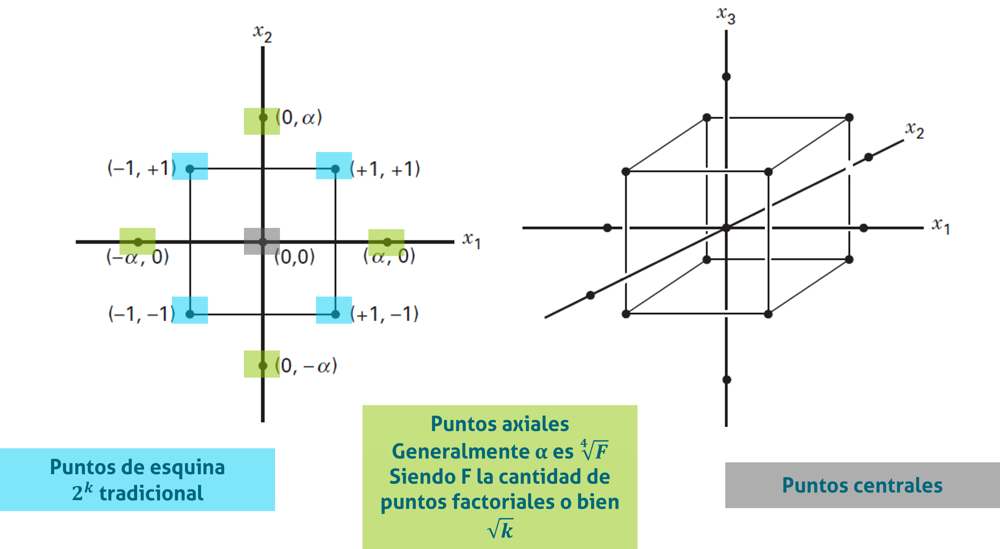

:::

::::::

## Rotabilidad {.bloques}

* Un diseño es rotatable si la varianza de la respuesta predicha (o varianza de predicción) es la misma en todos los puntos que están a la misma distancia del centro del diseño. 

  * En resumen, cuando $Var[\hat{y}(x)]/\sigma^2$ es constante en esferas. 

* En los CCD, esto se logra seleccionando adecuadamente la distancia axial ($\alpha = \sqrt[4]{F}$). Aunque la rotatabilidad es deseable, la estabilidad de la varianza en la región de interés es el objetivo práctico más importante.

* Un diseño es [rotable]{.hi} si la [varianza de la predicción]{.hi} de la respuesta depende únicamente de la distancia del punto al centro del diseño, y [no de la dirección]{.hi}. La rotabilidad asegura que la incertidumbre de la predicción sea [simétrica]{.hi} alrededor del centro.

## Rotabilidad {.hi}

:::::: {.columns}

::: {.columns .img-fit width="80%"}

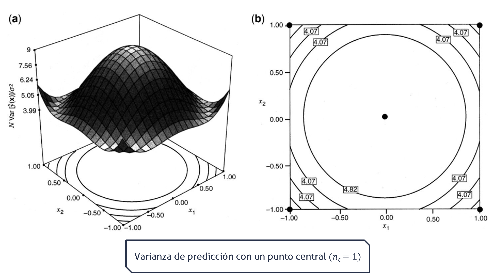

:::

::::::

## Rotabilidad {.hi}

:::::: {.columns}

::: {.columns .img-fit width="80%"}

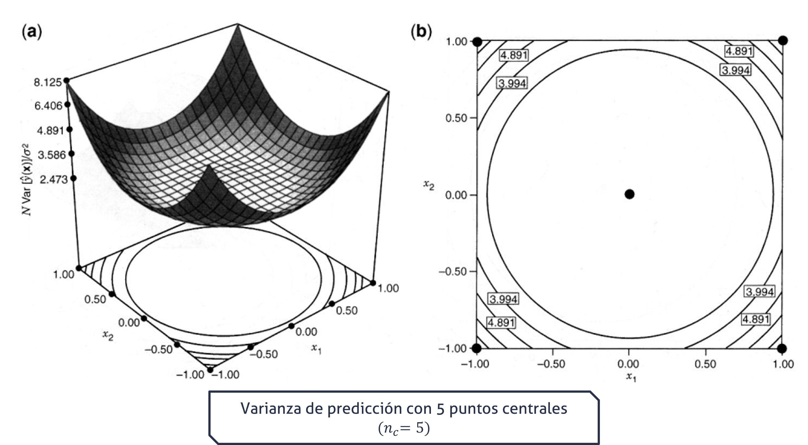

:::

::::::

## Rotabilidad {.bloques}

* Nótese como la varianza de predicción es menor en el punto central cuando este se replica independientemente de los demás puntos en el diseño.

* Puede utilizar la simulación del siguiente slide para comprobar como cambia la varianza de predicción al variar el $\alpha$ que estaría asociada a la rotabilidad (note que deja de apreciarse contornos circulares) y el $n_c$ que cambiaría la varianza de la predicción en el punto central del diseño. 
  * Recuerde que según la estrategia secuencial de experimentación se sospecha que el valor óptimo se encuentra centra del centro, por lo que debe estimarse con la mayor precisión. 
  
## Varianza de Predicción en el DCC - Simulación {.bloques}

::: {.iframe-card}
<iframe data-src="diagramas/dcc.html" title="Simulación DCC"></iframe>
:::

## Otras variantes del DCC {.bloques}

* [DCC esférico]{.hi}: Cuando la región de interés es una esfera, se suelen colocar todos los puntos factoriales y axiales sobre una misma superficie esférica de radio $\sqrt{k}$.

* [Cubo Centrado en las Caras (FCD)]{.hi}: Si el investigador no puede experimentar fuera de los niveles factoriales (región cuboidal), se fija $\alpha=1$. Esto sitúa los puntos axiales en el centro de las caras del cubo. En este caso, solo se necesitan uno o dos puntos centrales para estabilizar la varianza, a diferencia del caso esférico que requiere de tres a cinco.

## Diseño y análisis estadístico {.bloques}

:::::: {.columns}

::: {.column width="72%"}

* Los datos obtenidos a partir de un DCC se utilizan para ajustar un polinomio de segundo orden mediante el método de mínimos cuadrados (MCO).Este modelo permite localizar el punto estacionario (máximo, mínimo o punto de silla) y caracterizar la forma de la superficie de respuesta.

* Por ejemplo, para dos factores $A$ y $B$ se requieren $F = 2^2 = 4$ puntos de esquina que provienen de un factorial; $2k = 2\cdot2 = 4$ puntos axiales, que si es rotable $\alpha = \sqrt{2} = 1.414$ y $n_c = 6$ puntos centrales.

* Por lo general, por la naturaleza secuencial, los axiales y puntos centrales adicionales son considerados bloques. 

:::

::: {.column}

```{r}

rsm::ccd(basis = 2, randomize = FALSE, coding = list(x1 ~ A, 
                                                     x2 ~ B)) %>% 
  as.data.frame() %>% 
  setNames(c("Corrida", "Orden estándar", "A", "B", "Bloque")) %>% 
  knitr::kable(format = "html", 
               escape = FALSE) %>% 
  kableExtra::kable_styling(font_size = 24)

```


:::

::::::

## DCC - Secuencial {.bloques}

:::::: {.columns}

::: {.column .img-fit}

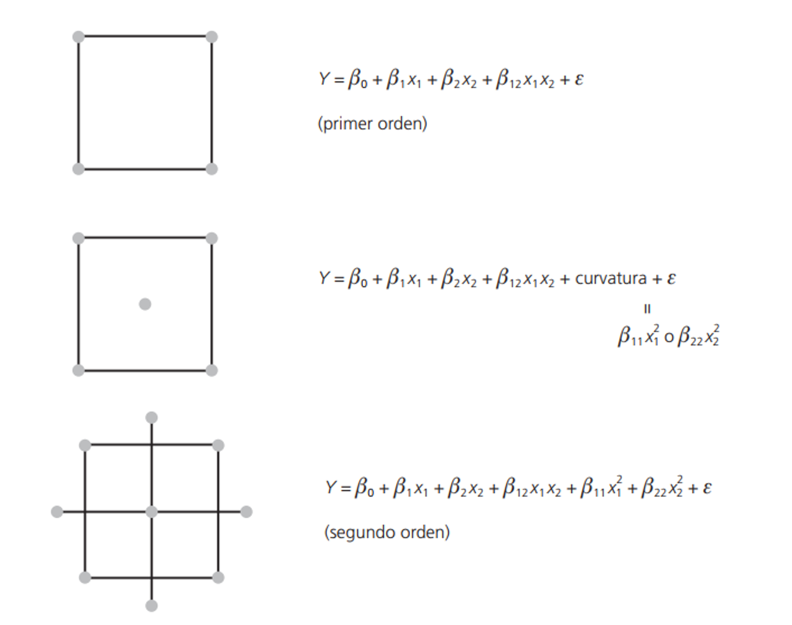

:::

::::::

## Diseño Box - Behnken (BBD) {.bloques}

* Es una familia de diseños eficientes de tres niveles utilizados para ajustar superficies de respuesta de segundo orden.

* Se basa en la construcción de diseños de bloques incompletos balanceados (BIBD). Su lógica operativa consiste en combinar factoriales 22 para pares de variables mientras las demás se mantienen fijas en su nivel central (0).

* A diferencia del Diseño Compuesto Central (DCC), el BBD no contiene puntos factoriales (vértices del cubo) ni puntos axiales. Todos sus puntos de diseño (excepto los centrales) son puntos medios de las aristas del espacio experimental.

* Es un diseño esférico. En el caso de $k=3$ factores, todos los puntos de las aristas están a una distancia de $\sqrt{2}$ del centro, lo que significa que no cubre las esquinas del cubo (que estarían a $\sqrt{3}$).

## Diseño Box - Behnken (BBD) {.bloques}

:::::: {.columns}

::: {.column}

Ejemplo de construcción: 

* Factorial $2^2$ con $A$ y $B$, siendo $C = 0$
* Factorial $2^2$ con $A$ y $C$, siendo $B = 0$
* Factorial $2^2$ con $B$ y $C$, siendo $A = 0$
* Puntos centrales $(0, 0, 0)$.


:::

::: {.column .img-fit width="20%"}

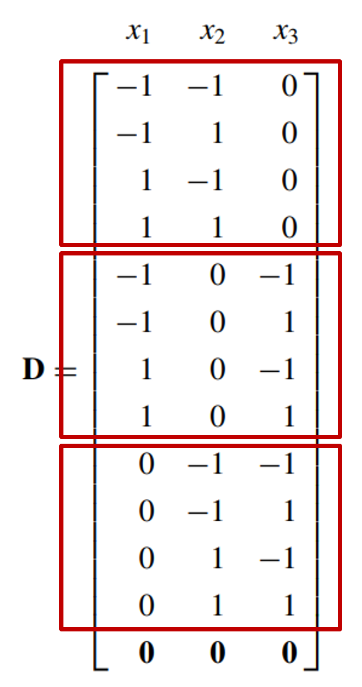

:::

::::::

## Diseño Box - Behnken (BBD) {.bloques}

* En resumen, se aplica cuando se tiene tres o más factores y suelen ser más eficientes en cuanto al número de corridas. 

* Los puntos de este diseño se ubican en el medio de las aristas del cubo y NO incluye los tratamientos de los vértices. 

* Esto puede ser ventajoso, si los vértices son caros, peligrosos, etc.… de ejecutar.
  * Por ejemplo, que en ciertas condiciones de operación extremas un equipo pueda dañarse.
  
## Diseño Box - Behnken (BBD) {.bloques}

:::::: {.columns}

::: {.column}

* El BBD es altamente valorado por su economía en el número de pruebas, especialmente cuando se compara con factoriales completos de tres niveles ($3^k$).

  * Para $k=3$: Requiere $12+n_c$ corridas (donde $n_c$ son los puntos centrales), comparado con las $14+n_c$ del DCC.
  * Para $k=4$: Requiere $24+n_c$ corridas, igualando al DCC.
  * Para $k=5$: Requiere $40+n_c$ corridas (el DCC con fracción de 1/2 requiere solo $26+n_c$).
  
:::

::: {.column .img-fit width="20%"}

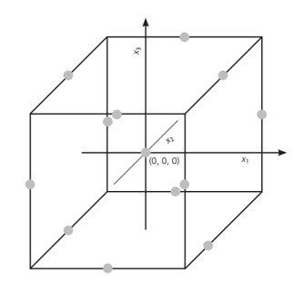

:::

::::::

## Diseño Box - Behnken (BBD) {.bloques}

* El diseño es exactamente rotatable para $k=4$ y $k=7$ factores. En otros casos, es "casi rotatable". Esto significa que la varianza de la respuesta predicha es constante (o casi constante) en esferas alrededor del centro.

* Proporciona suficiente información y grados de libertad para realizar pruebas de falta de ajuste (lack of fit).

## Diseño Box - Behnken (BBD) {.bloques}

* Se recomienda utilizar de 3 a 5 puntos centrales para evitar la singularidad de la matriz y estabilizar la varianza de la predicción.

* El BBD permite el bloqueo ortogonal (como el DCC), lo que significa que los efectos de los bloques no interfieren con la estimación de los coeficientes del modelo.

  * Para $k=4$, el diseño se puede dividir en 3 bloques de tamaño igual (8 puntos de diseño + puntos centrales iguales por bloque).
  * Para $k=5$, se puede dividir en 2 bloques ortogonales.
  
## Diseño Box - Behnken (BBD) {.bloques} 

* El uso del Diseño Box-Behnken es más apropiado cuando:

  * La región de interés es esférica.
  * No es de interés predecir en los extremos (esquinas del cubo), ya que el diseño no tiene puntos allí y la varianza de la predicción en esas zonas es muy alta.
  * Se desea evitar situaciones experimentales extremas que podrían ser peligrosas o imposibles de probar (por ejemplo, niveles altos simultáneos de presión y temperatura).
  
## Optimización simultánea {.bloques}

* En ocasiones, los experimentos se llevan a cabo y miden múltiples variables de respuesta de forma simultánea. 
* Un enfoque común utilizado y recomendado en la optimización simultánea de variables de respuesta en el DdE es el de utilizar la función de deseabilidad propuesta por Derringer & Suich (1980).


## Función de deseabilidad {.bloques}

:::::: {.columns}

::: {.column}

* Cuando se diseñan y desarrollan productos o procesos acaece un problema común, el cual es la selección del conjunto de condiciones o variables de entrada con las cuales el producto resultante posea una combinación deseable de propiedades de las variables de salida.

* Esta función consiste en primero traducir cada respuesta $y_i$ en una función de deseabilidad individual $d_i$ que varía sobre el rango $0≤d_i≤1$, donde si la respuesta $y_i$ está en su objetivo o meta, entonces $d_i=1$, caso contrario si está fuera, $d_i=0$. 


:::

::: {.column .img-fit width="30%"}

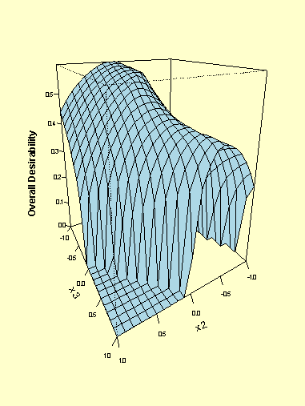

:::

::::::

## Función de deseabilidad {.bloques}

:::::: {.columns}

::: {.column}

* Las variables de diseño son escogidas para maximizar la deseabilidad compuesta o global $D=(d_1 \cdot d_2 \cdots d_m)^\frac{1}{m} = \left(\prod_{i=1}^{m} d_i\right)^{\frac{1}{m}}$

* Donde $m$ es la cantidad de respuestas. 

:::

::: {.column .img-fit width="80%"}

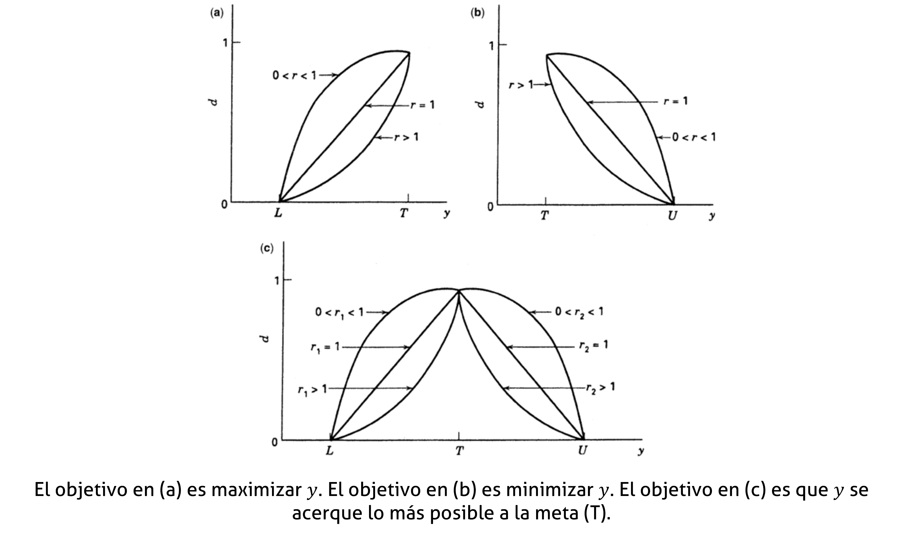

:::

::::::

## Otras RSM - Mención {.bloques}

* En ocasiones, la persona experimentadora no puede hacer todas las corridas experimentales en estos diseños. En esas situaciones se pueden usar experimentos saturados o casi – saturados. Es decir, diseños que contienen cerca de (pero no menos de) $p$ puntos de diseño donde: 

* $p = 1 + 2k + \frac{k(k+1)}{2}$

* De tal forma que obtiene $1$ intercepto, $k$ términos de primer orden, $k$ de segundo orden y $\frac{k(k+1)}{2}$ términos de interacción.

* Estos diseños NO deben usarse salvo que existan costos prohibitivos que impidan el uso de un diseño estándar. Lo aquí tratado es una mención, no se abordarán estos temas. 

## Otras RSM - Mención {.bloques}

* [Diseños de Hoke]{.hi}: Consiste de puntos factoriales, axiales y de frontera que crean arreglos eficientes de segundo orden para $k=3, 4, 5 \text{ y } 6$.

* [Diseños de Koshal]{.hi}: Estos diseños están saturados para el modelado de cualquier superficie de respuesta del orden $d$ ($d=1, 2, \dots$)

* [Diseños híbridos]{.hi}: Son diseños eficientes, creados por Roquemore (1976), que son de saturados o casi saturados de segundo orden. 

* [DCC reducido]{.hi}: En lugar de estar basado en un factorial completo o de resolución V lo hace con fraccionados de resolución $III$ especiales. 

## Criterios de optimalidad - Mención {.bloques}

* ¿Qué ocurre cuando un CCD o un BBD no pueden ejecutarse debido a restricciones físicas o económicas?

* El término optimalidad ya fue introducido en esta clase. 
  * Recuerde que se hizo la diferencia entre un diseño optimal y un diseño para optimización. 
  
* Existen varios criterios de optimalidad de diseño que se pueden utilizar para elegir un conjunto de puntos de diseño. Algunos de los criterios de optimalidad de diseños son el ADGV.

## Criterios de optimalidad - Mención {.bloques}
* [A – optimalidad]{.hi}: es cuando la traza de $(X'X)^{-1}$ es minimizada. En cuyo caso la varianza promedio de los elementos de $b$ (el estimador de $\beta$) es minimizada. 

* [D – optimalidad]{.hi}: es cuando el determinante $det|X'X|$ es maximizado o bien cuando $det|X'X|^{-1}$es minimizado; con ello se minimiza la varianza general de los elementos de $b$.

* [G – optimalidad]{.hi}: busca minimizar la varianza máxima de predicción, $max \{d=x'(X'X)^{-1}x \}$, sobre un conjunto especificado de puntos de diseño. 

* [V – optimalidad]{.hi}: busca minimizar el valor promedio de $d$ sobre un conjunto especificado de puntos de diseño. Es decir, lo que se quiere minimizar es el apalancamiento promedio.
  
## Bibliografía {.bloques}

:::: columns
::: {.column width="100%" style="font-size: 1.2em;"}

* Myers, R. H., Montgomery, D. C., y Anderson-Cook, C. M. (2011). Response surface methodology: Process and product optimization using designed experiments (3.ª ed.). Wiley.
  * Capítulo 1, 2, 5, 6, 7 y 8.

* Montgomery, D. C. (2020). Design and analysis of experiments (10.ª ed.). Wiley.
  * Capítulo 11.

:::
::::

## Metodología de superficie de respuesta (RSM) y optimización <br> II-1125 Estadística para Ingeniería Industrial III {.center}

### Gracias por su atención <br> Steven García Goñi<br>[steven.garciagoni\@ucr.ac.cr](mailto:steven.garciagoni@ucr.ac.cr) {.subtitle}

### Dudas o correcciones requeridas pueden solicitarse al correo


